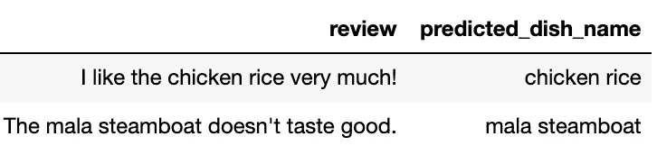

# 使用自定义语料库上的预训练来微调 Albert

> 原文：<https://towardsdatascience.com/fine-tune-albert-with-pre-training-on-custom-corpus-f56ea3cfdc82?source=collection_archive---------10----------------------->


Photo by Esperanza Zhang on Unsplash

## 使用特定领域文本的自定义语料库对 Albert 进行预训练，并针对应用任务进一步微调预训练模型

# 介绍

这篇[帖子](https://github.com/LydiaXiaohongLi/Albert_Finetune_with_Pretrain_on_Custom_Corpus)展示了在自定义语料库上预训练最先进的 Albert[1] NLP 模型，并在特定的下游任务上进一步微调预训练的 Albert 模型的简单步骤。自定义语料库可以是特定领域或外语等，我们没有现有的预训练阿尔伯特模型。下游任务是应用驱动的，它可以是文档分类问题(例如，情感分析)，或者标记问题(例如，NER)等。这篇文章展示了一个自定义实体识别下游任务。本文中的示例用例是提取餐馆评论中的菜名，例如，在评论“我非常喜欢马拉汽船！”中，将“马拉汽船”标记为菜名

然而，艾伯特模型的细节和它是如何工作的并没有在这篇文章中讨论。这篇文章假设你对变形金刚([)和阿尔伯特模型有粗略的了解，并且能够从 git repos 克隆和运行脚本。](http://jalammar.github.io/illustrated-transformer/)

我的包含插图笔记本的 Github repo 可以在这里找到:[https://Github . com/LydiaXiaohongLi/Albert _ fine tune _ with _ pre train _ on _ Custom _ Corpus](https://github.com/LydiaXiaohongLi/Albert_Finetune_with_Pretrain_on_Custom_Corpus)。我在同一个 repo 中包含了一个 [colab 笔记本](https://github.com/LydiaXiaohongLi/Albert_Finetune_with_Pretrain_on_Custom_Corpus/blob/master/Albert_Finetune_with_Pretrain_on_Custom_Corpus_ToyModel.ipynb)，它演示了玩具数据集的 E2E 步骤，包括构建 vocab、预训练 Albert 和微调 Albert，由于简单的数据和训练所需的较少步骤，它适合 colab 的 CPU。

## 玩具数据集

本帖中使用的玩具数据集包括:

1.  [餐厅评论语料库](https://github.com/LydiaXiaohongLi/Albert_Finetune_with_Pretrain_on_Custom_Corpus/blob/master/data_toy/restaurant_review_nopunct.txt):在这个玩具例子中由两个评论句子组成，用于预训练艾伯特模型。在实际应用中，一般我们可以用 100M+的句子进行训练。


Restaurant Review Corpus

2.从餐馆评论中提取菜名以微调 Albert 进行菜名识别。[训练集](https://github.com/LydiaXiaohongLi/Albert_Finetune_with_Pretrain_on_Custom_Corpus/blob/master/data_toy/restaurant_review_train)由两个相同的复习句子组成，提取菜名。


Dish Name Extraction — Train Set

[评估集](https://github.com/LydiaXiaohongLi/Albert_Finetune_with_Pretrain_on_Custom_Corpus/blob/master/data_toy/dish_name_val.csv)由两个相似的评论句子组成，但是两个评论中的菜肴交换了，并且文本上下文略有不同，包含未收录的单词(不在餐馆评论语料库中的单词)，以验证 Albert 模型的效率。


Evaluation Set

# 系统模型化

## 构建 Vocab

第一步是为餐馆评论语料库建立词汇。

Google 并没有开源 WordPiece unsupervised tokenizer，但是，我们可以在开源的 SentencePiece 或 t2t text encoder 子词生成器上进行修改，以生成与 Bert/Albert 模型兼容的词汇。

修改 t2t 文本编码器子字生成器的开源实现可以在 https://github.com/kwonmha/bert-vocab-builder【2】找到

1.  克隆 repo(创建一个环境并相应地安装需求)
2.  准备语料库文件，在本例中是餐馆评论语料库
3.  运行下面的命令来创建 Albert 兼容的词汇文件

```
python subword_builder.py --corpus_filepattern “{corpus_for_vocab}” --output_filename {name_of_vocab} --min_count {minimum_subtoken_counts}
```

## 预先训练艾伯特

下一步是用自定义语料库对 Albert 进行预训练。官方阿尔伯特回购可以在[https://github.com/google-research/ALBERT](https://github.com/google-research/ALBERT)找到

***克隆回购***

创建一个环境并相应地安装需求。

***创建艾伯特预培训文件***

使用在构建 Vocab 步骤中使用/创建的自定义语料库和词汇文件运行以下命令。该步骤首先基于输入的词汇文件对语料库进行标记和编码。然后，它为 Albert 创建训练输入文件，以在掩蔽语言模型和句子顺序预测任务上进行训练。

```
python create_pretraining_data.py --input_file “{corpus}” --output_file {output_file} --vocab_file {vocab_file} --max_seq_length=64
```

***预训练艾伯特模型***

*   准备 [Albert 配置文件](https://github.com/LydiaXiaohongLi/Albert_Finetune_with_Pretrain_on_Custom_Corpus/blob/master/models_toy/albert_config.json)，Albert 配置文件中的 vocab_size 应该与构建 vocab 步骤中创建的 [vocab 文件](https://github.com/LydiaXiaohongLi/Albert_Finetune_with_Pretrain_on_Custom_Corpus/blob/master/models_toy/vocab.txt)中的词汇总数相同。另一个示例 Albert 配置文件可以在 https://tfhub.dev/google/albert_base/2 的[找到，这是用于构建 Albert base v2 模型的配置文件。](https://tfhub.dev/google/albert_base/2)
*   运行以下命令开始预训练。所有的模型参数将被存储在 output_dir 中。(下面的玩具模型仅运行 300 步的预训练，批量大小为 2)

```
python run_pretraining.py --input_file={albert_pretrain_file} --output_dir={models_dir} --albert_config_file={albert_config_file} -- train_batch_size=2 --num_warmup_steps=100 --num_train_steps=300 --max_seq_length=64
```

预训练中的 max_seq_length 应与创建预训练数据步骤相同，以便 tensorflow TFRecord 正确解析数据。

如果您的数据很大，并且存储在 GCS 桶中，您可以相应地添加 TPU 相关参数，如下所示。

```
python run_pretraining.py — input_file=”gs://{bucket_name}/{folder_names}/{albert_pretrain_file_name}” — output_dir=”gs://{bucket_name}/{folder_names}” — albert_config_file=”gs://{bucket_name}/{folder_names}/albert_config_file” — use_tpu=True — tpu_name={tpu_name} — tpu_zone={tpu_zones} — num_tpu_cores=8
```

对于实际应用，我们应该有更大的训练批量、训练步数和预热步数。因此，最初的 Albert 论文使用 4096 批量和 125k 训练步数，预热步数为 3125。在这里，我们可以使用谷歌的免费 300 美元启动一个 TPU(v2–8)进行训练，如果只使用一个 v2–8 TPU，你应该用更小的批量(例如 512)和更多的训练步骤进行训练，否则可能会遇到 OOM 问题。

或者，在样本 E2E [colab 笔记本](https://github.com/LydiaXiaohongLi/Albert_Finetune_with_Pretrain_on_Custom_Corpus/blob/master/Albert_Finetune_with_Pretrain_on_Custom_Corpus_ToyModel.ipynb)中，我用 pytorch 重写了训练前的步骤。

## 微调艾伯特

最后一步是微调预训练的 Albert 来执行菜名识别任务。参考[笔记本](https://github.com/LydiaXiaohongLi/Albert_Finetune_with_Pretrain_on_Custom_Corpus/blob/master/albert_finetuning_toy.ipynb)了解该步骤。这篇文章中的代码片段并没有连接到完整的笔记本，它们只是为了说明的目的。如果不清楚，请阅读完整的笔记本。

使用 huggingface 的变形金刚实现的 pytorch 版本的微调步骤，可以在同一个 repo 中找到，参考这个[笔记本](https://github.com/LydiaXiaohongLi/Albert_Finetune_with_Pretrain_on_Custom_Corpus/blob/master/albert_finetuning_toy_pytorch_multiGPU.ipynb)。

***流程输入***

为了获得统一长度的输入序列，我们设置了 50 个标记的最大长度，如果超过，则截断该序列，否则填充该序列。为此，我们可以使用 Keras 的 pad_sequences。

Albert models 采用 input _ ids[batch _ size * max _ seq _ len]—标记化和编码的文本序列(在这种情况下，input _ mask[batch _ size * max _ seq _ len]—如果标记是根据原始序列编码的，则给出 1；如果填充，则仅根据原始序列的标记计算损失；segment _ ids[batch _ size * max _ seq _ len]—零张量数组(在这种情况下不使用，labels[batch _ size * max _ seq _ len]—如果标记是菜肴名称 0 的一部分，则给出 1；否则。我们将以这种格式处理输入。

```
df_data[‘text_tokens’] = df_data.text.apply(tokenizer.tokenize)
 df_data[‘text_labels’] = df_data.apply(lambda row: label_sent(row[‘name’].lower().split()
 , row[‘text_tokens’]), axis=1)
 df_data_sampled = df_data[[np.sum(label)>0 for label in df_data.text_labels]]
 input_ids = pad_sequences([tokenizer.convert_tokens_to_ids(txt) for txt in df_data_sampled[‘text_tokens’]],
 maxlen=MAX_LEN, dtype=”long”, truncating=”post”, padding=”post”)
 labels = pad_sequences(df_data_sampled[‘text_labels’],
 maxlen=MAX_LEN, padding=”post”,
 dtype=”long”, truncating=”post”)
 # create the mask to ignore the padded elements in the sequences.
 input_mask = [[int(i>0) for i in ii] for ii in input_ids]
```

批量输入张量。

```
d = tf.data.Dataset.from_tensor_slices(
 ({“input_ids”: tf.constant( input_ids, shape=[num_examples, seq_length], dtype=tf.int32),
 “input_mask”: tf.constant( input_mask, shape=[num_examples, seq_length], dtype=tf.int32),
 “segment_ids”: tf.zeros(shape=[num_examples, seq_length], dtype=tf.int32),}
 ,tf.constant(labels, shape=[num_examples, seq_length], dtype=tf.int32),))
d = d.batch(batch_size=batch_size, drop_remainder=drop_remainder)
```

***创建阿尔伯特微调模型***

在预训练的艾伯特模型之后增加一层，以预测输入序列中的每个标记是否是菜名的一部分。

```
def create_model(albert_config, mode, input_ids, input_mask, segment_ids,labels, num_labels):
 “””Creates a classification model.”””
 is_training = mode == tf.estimator.ModeKeys.TRAIN
 model = modeling.AlbertModel(
 config=albert_config,
 is_training=is_training,
 input_ids=input_ids,
 input_mask=input_mask,
 token_type_ids=segment_ids)
 output_layer = model.get_sequence_output()
 hidden_size = output_layer.shape[-1].value
 output_weight = tf.get_variable(
 “output_weights”, [num_labels, hidden_size],
 initializer=tf.truncated_normal_initializer(stddev=0.02))
 output_bias = tf.get_variable(
 “output_bias”, [num_labels], initializer=tf.zeros_initializer())
```

在这种情况下使用对数丢失。

```
logits = tf.matmul(output_layer, output_weight, transpose_b=True)
logits = tf.nn.bias_add(logits, output_bias)
logits = tf.reshape(logits, [-1, MAX_LEN, num_labels])log_probs = tf.nn.log_softmax(logits, axis=-1)
one_hot_labels = tf.one_hot(labels, depth=num_labels, dtype=tf.float32)
per_example_loss = -tf.reduce_sum(one_hot_labels * log_probs, axis=-1)
loss = tf.reduce_sum(per_example_loss)
```

带有权重衰减的 Adam 优化器在这种情况下用于学习

***列车微调模式***

```
train_op = optimization.create_optimizer(
 total_loss, learning_rate, num_train_steps, num_warmup_steps,
 use_tpu, optimizer)output_spec = tf.contrib.tpu.TPUEstimatorSpec(
 mode=mode,
 loss=total_loss,
 train_op=train_op,
 scaffold_fn=scaffold_fn)train_input_fn = input_fn_builder(
 file = “data_toy/dish_name_train.csv”,
 tokenizer = tokenizer,
 seq_length=MAX_LEN,
 drop_remainder=True)estimator.train(input_fn=train_input_fn, max_steps=num_train_steps)
```

在这一步中，如果你没有用 TPU 估算器训练，它将自动检测没有 TPU 可用，并降级到 CPU。

***评估微调模型***

报告损失和准确性以供评估

```
def metric_fn(per_example_loss, label_ids, logits):
 predictions = tf.argmax(logits, axis=-1, output_type=tf.int32)
 accuracy = tf.metrics.mean(tf.math.equal(label_ids,predictions))
 loss = tf.metrics.mean(values=per_example_loss)
 #
 return {
 “eval_accuracy”:accuracy,
 “eval_loss”: loss,
 }
```

通过 100 个时期的训练(在笔记本中，批量大小被设置为 1，并且训练步长被设置为 200，这对于 100 个时期的训练是有效的)，该模型能够在评估集中提取正确的菜肴名称，即使上下文文本与甚至超出词汇表的单词略有不同



Prediction on Evaluation Set

# 结论

简而言之，Albert 是 NLP 的一大突破，由于开源，我们可以非常直接地在最先进的模型上构建定制的应用程序。

# 参考

[1] [钟真 L](https://arxiv.org/search/cs?searchtype=author&query=Lan%2C+Z) 。，[明达 C](https://arxiv.org/search/cs?searchtype=author&query=Chen%2C+M) 。、[塞巴斯蒂安](https://arxiv.org/search/cs?searchtype=author&query=Goodman%2C+S) G、[凯文 G](https://arxiv.org/search/cs?searchtype=author&query=Gimpel%2C+K) 。，[皮尤什年代](https://arxiv.org/search/cs?searchtype=author&query=Sharma%2C+P)。，[拉杜 S](https://arxiv.org/search/cs?searchtype=author&query=Soricut%2C+R) 。，[用于语言表示的自我监督学习的 Lite BERT](https://arxiv.org/abs/1909.11942)(2019)，谷歌研究

[2]托马斯·w、弗拉达利·d、维克多·s、朱利安·c、克莱门特·d、安东尼·m、皮尔里奇·c、蒂姆·R、雷米·l、摩根·f、杰米·b，《拥抱脸的变形金刚:最先进的自然语言处理》(2019 年)

[3] M. H. Kwon， [Bert-Vocab-Builder](https://github.com/kwonmha/bert-vocab-builder) ，Github Repo

[4]塞伯坦 AI，[羔羊优化器](https://github.com/cybertronai/pytorch-lamb)，Github Repo