# 第一场民主党初选辩论:初步情绪分析

> 原文：<https://towardsdatascience.com/first-democratic-primary-debate-preliminary-sentiment-analysis-b4750fe2b88a?source=collection_archive---------20----------------------->

在佛罗里达州迈阿密举行的 2020 年初选的第一场辩论中，美国民主党的 20 名候选人在两个晚上相互指责，试图让别人听到自己的声音，有时会忘记回答问题。无论你是已经关注了一段时间，还是刚刚开始关注，都很难区分候选人，也很难感受到每个人在如此拥挤的领域中的表现。

以下图表是从第一场辩论前 7 小时到第二场辩论后 7 小时推特对每位候选人的反应快照。计数值是根据每条推文中信息的测量情绪而被标记为负面、中性或正面的推文。由于数据量少，一些候选人被排除在外。

# 对 15 名候选人的看法

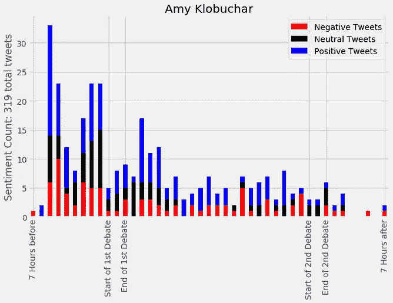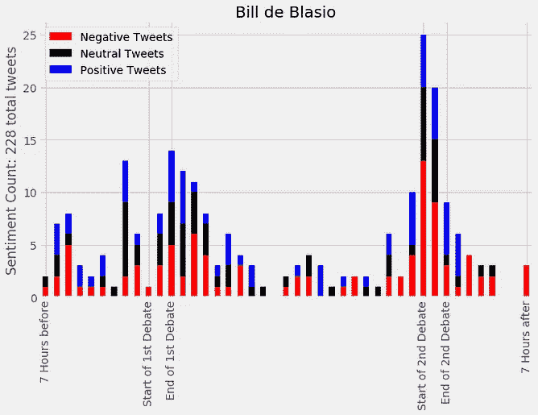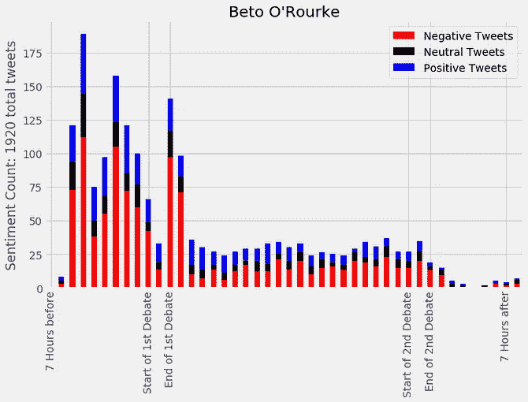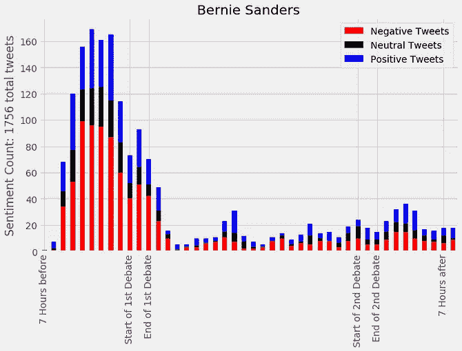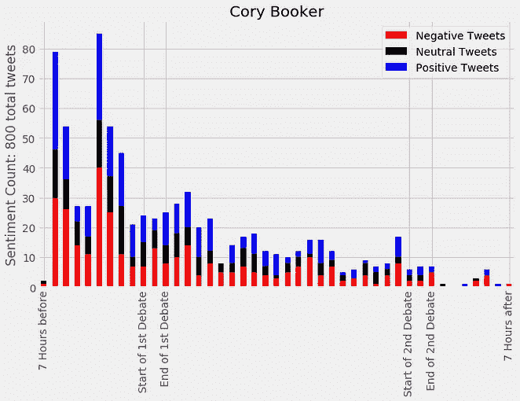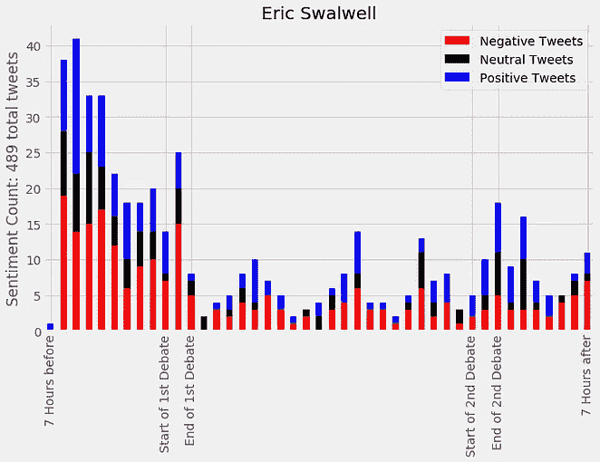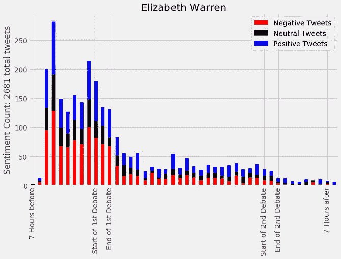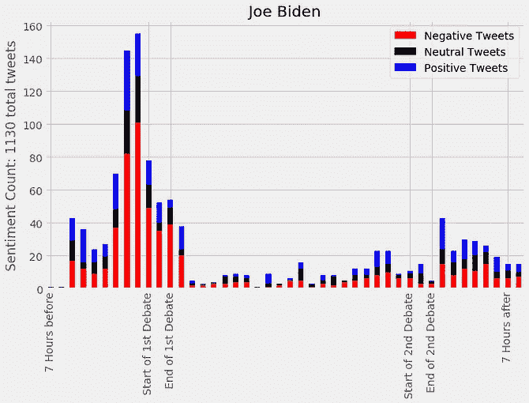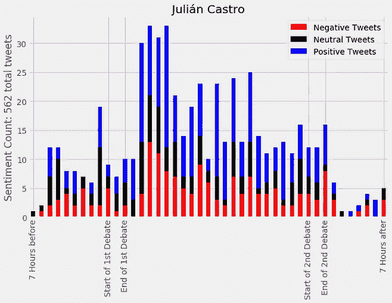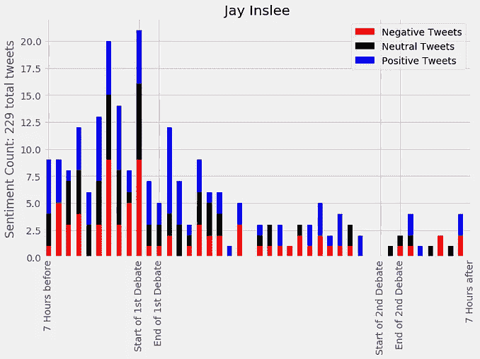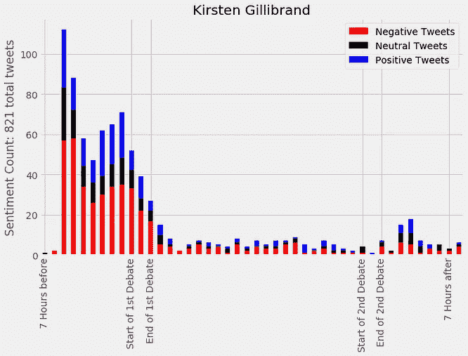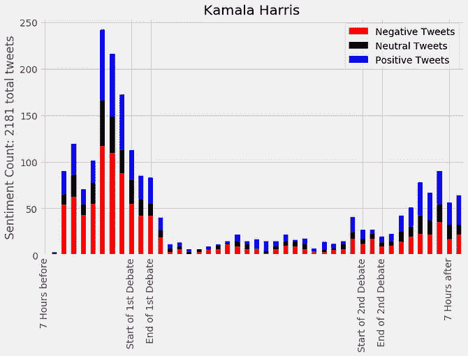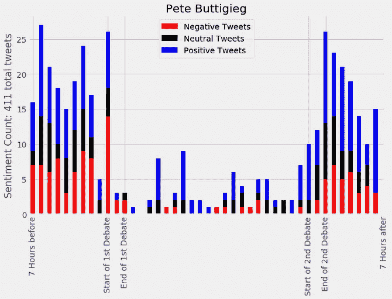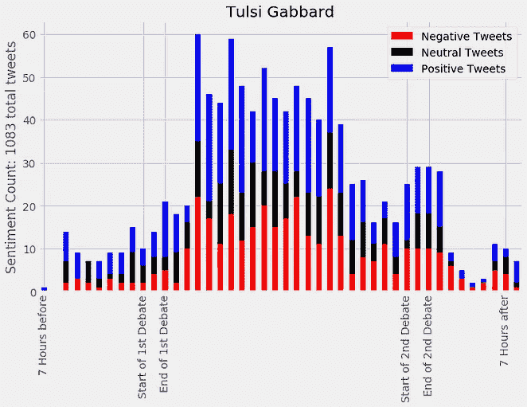

Count of reaction sentiment for each candidate

# 第一夜集锦

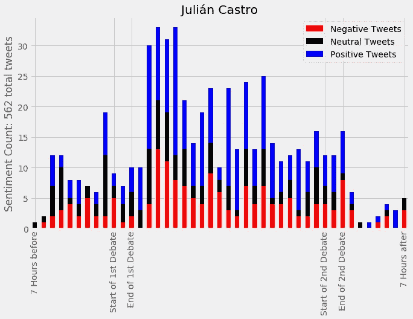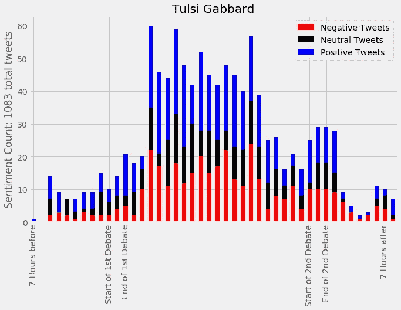

Indicators of good reception

朱利安·卡斯特罗(Julian Castro)和图尔西·加巴德(Tulsi Gabbard)在首场演出中的表现似乎受到了好评。用户参与度明显上升，这是相当积极的。在第二场辩论后，这种兴趣可以被视为随着对话的进行而逐渐消退，但看看他们的竞选活动如何利用最初的关注热潮将是有趣的。

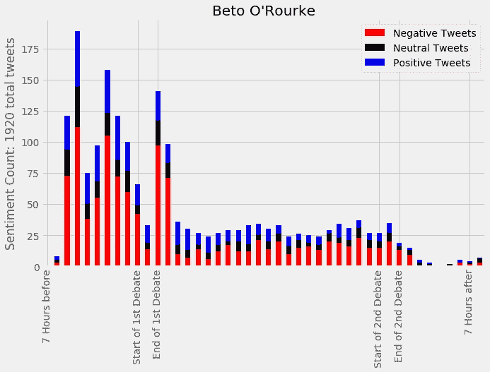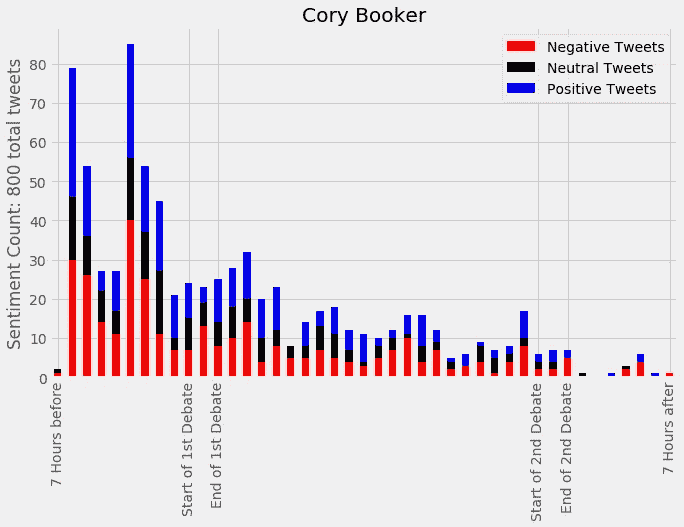

Indicators of waning attention

在第一场辩论开始时，贝托和布克似乎受到了高度关注，尽管被认为基本上是负面的。第二天，对这两个人的提及逐渐减少，第二天晚上就完全消失了。对于大多数候选人来说，这种下降从第一天晚上开始就是典型的。

# 第二晚亮点

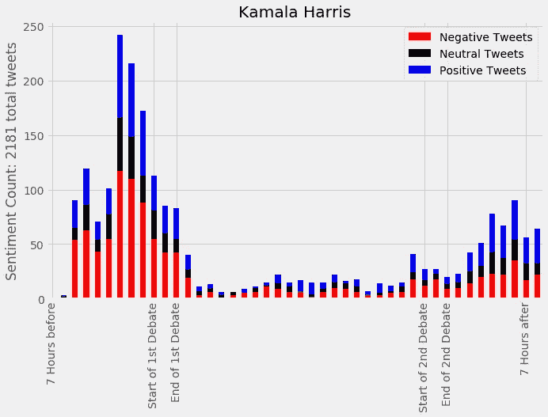

Strong momentum going in and coming out

卡玛拉·哈里斯被认为是初选的领先者之一，这可以从她在辩论前的势头中看出。在第二个晚上的强劲表现之后，她似乎保持了一些这种膨胀，情绪的平衡从负面进入到正面出来。

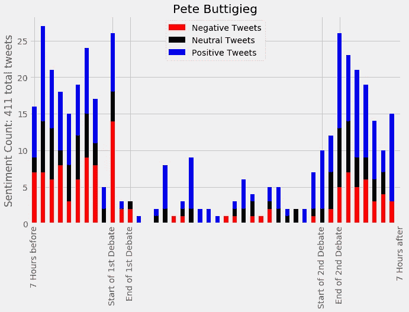

Sustained momentum before and after

尽管在较小规模的推文中，皮特市长设法在辩论前后保持用户的一致参与，就数量而言，很少有候选人能够做到。此外，情绪的分布从相当平衡的进入(积极和消极反应的数量相似)变为基本积极的离开。

这些只是从上面的信息中提取的一些信息。请在下面分享自己的想法和评论！欢迎对分析的批评(但请保持中立或更高的情绪！).

# 关于分析的注释

使用 [Tweepy](https://www.youtube.com/watch?v=wlnx-7cm4Gg) 对与每位候选人的 Twitter 账户相关的推文样本进行流式传输。每条推文的情绪(即情绪反应)是使用 [VADER](https://medium.com/analytics-vidhya/simplifying-social-media-sentiment-analysis-using-vader-in-python-f9e6ec6fc52f) 计算出来的。

查看这些图表时，应考虑几个限定条件。只有直接提到候选人的推文被计算在分析中，这可能会倾向于更极端的反应。此外，第二场辩论后的推文量似乎低得令人怀疑，这让我相信大多数讨论都从与候选人的直接互动转向围绕辩论主题本身的讨论。这种音量的下降也可能是我的数据被捕获和存储的一个缺陷，因为推文的速度对我苦苦挣扎的 MacBook Air 来说往往太快了。在未来，我将着眼于围绕#DemDebate 这样的标签进行更广泛的讨论，并使用实体识别将它们与候选人联系起来。

# 参考

项目资源库
[https://github.com/danjizquierdo/1stPrimaryDebateNight2020](https://github.com/danjizquierdo/1stPrimaryDebateNight2020)

使用维达
[进行情绪分析 https://medium . com/analytics-vid hya/simplified-social-media-opinion-Analysis-using-Vader-in-python-f9e 6 EC 6 fc 52 f](https://medium.com/analytics-vidhya/simplifying-social-media-sentiment-analysis-using-vader-in-python-f9e6ec6fc52f)作者 [Parul Pandey](https://medium.com/@parulnith)

流媒体推文教程
[https://www.youtube.com/watch?v=wlnx-7cm4Gg](https://www.youtube.com/watch?v=wlnx-7cm4Gg)由 [Lucid 编程](https://www.youtube.com/channel/UCFxcvyt2Ucq5IL0_1Njzqlg)