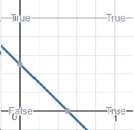

# 第一个为初学者讲解的神经网络(带代码)

> 原文：<https://towardsdatascience.com/first-neural-network-for-beginners-explained-with-code-4cfd37e06eaf?source=collection_archive---------0----------------------->

## 理解并创造一个感知机


Photo by [Clément H](https://unsplash.com/@clemhlrdt?utm_source=medium&utm_medium=referral) on [Unsplash](https://unsplash.com?utm_source=medium&utm_medium=referral)

所以你想创建你的第一个人工神经网络，或者只是发现这个主题，但不知道从哪里开始？按照这个快速指南来理解所有的步骤！

## 什么是神经网络？

基于自然，神经网络是我们对大脑的通常表示:神经元与其他神经元相互连接，形成一个网络。一个简单的信息在变成一个实际的东西之前会在它们当中传递，就像“移动手来拿起这支铅笔”。

完整的神经网络的操作非常简单:输入变量作为输入(例如，如果神经网络应该告诉图像上的内容，则输入图像)，经过一些计算后，返回输出(按照第一个示例，给出猫的图像应该返回单词“cat”)。

现在，你应该知道人工神经网络通常放在列上，所以列 *n* 的一个神经元只能连接到来自列 *n-1* 和 *n+1 的神经元。*使用不同架构的网络类型很少，但我们现在将关注最简单的。

所以，我们可以这样描述一个人工神经网络:


Figure 1 — Representation of a neural network

神经网络通常可以从左向右阅读。这里，第一层是输入的层。有两个内部层(称为隐藏层)做一些数学，最后一层包含所有可能的输出。不要为每一列底部的“+1”而烦恼。这就是所谓的“偏见”，我们稍后会谈到这一点。

> 顺便说一下，术语“深度学习”来自包含几个隐藏层的神经网络，也称为“深度神经网络”。图 1 可以被认为是一个。

## 神经元做什么？

每个神经元完成的操作非常简单:


Figure 2 — Operations done by a neuron

首先，它将它所连接的前一列中的每个神经元的值相加。在图 2 中，有 3 个输入(x1，x2，x3)到达神经元，因此前一列的 3 个神经元连接到我们的神经元。

该值在相加之前乘以另一个称为“权重”的变量(w1，w2，w3)，该变量决定两个神经元之间的连接。神经元的每个连接都有自己的权重，这些是在学习过程中唯一会被修改的值。

此外，可以将偏差值加到计算的总值上。它不是来自特定神经元的值，而是在学习阶段之前选择的，但对网络是有用的。

在所有这些求和之后，神经元最终对获得的值应用一个称为“激活函数”的函数。


Figure 3 — Sigmoid function

所谓的激活函数通常用于将之前计算的总值变为 0 和 1 之间的数(例如通过图 3 所示的 sigmoid 函数来实现)。其他函数存在并可能改变我们函数的极限，但保持限制值的相同目标。

这就是一个神经元所做的一切！将连接神经元的所有值乘以各自的权重，相加，并应用激活函数。然后，该神经元准备好将其新值发送给其他神经元。

在一列中的每个神经元完成之后，神经网络传递到下一列。最后，最后获得的值应该是可用于确定期望输出的值。

既然我们了解了神经元的功能，我们就有可能创造任何我们想要的网络。然而，要使神经网络学习，还需要执行其他操作。

## 神经网络是如何学习的？

是的，创造变量并让它们相互作用是很棒的，但这不足以让整个神经网络自我学习。我们需要准备大量数据提供给我们的网络。这些数据包括神经网络的输入和输出。

让我们来看看学习过程是如何进行的:

首先要记住，给神经网络一个输入，它就返回一个输出。在第一次尝试中，它自己无法获得正确的输出(除非运气好),这就是为什么在学习阶段，每个输入都带有标签，解释神经网络应该猜测什么输出。如果选择是正确的，则保留实际参数，并给出下一个输入。但是，如果获得的输出与标签不匹配，权重就会改变。这些是在学习阶段唯一可以改变的变量。这个过程可以想象成多个按钮，每次输入没有猜对时，这些按钮就变成不同的可能性。

为了确定修改哪个权重更好，需要进行一个称为“反向传播”的特殊过程。我们不会在这一点上停留太久，因为我们将构建的神经网络不使用这一确切的过程，但它包括回到神经网络并检查每个连接，以检查输出如何根据权重的变化而表现。

最后，要控制神经网络的学习方式，还需要知道最后一个参数:“学习速率”。名称说明了一切，这个新值决定了神经网络学习的速度，或者更具体地说，它将如何一点一点地或以更大的步长修改权重。1 通常是该参数的一个好值。

## 感知器

好了，我们知道了基础知识，让我们检查一下我们将要创建的神经网络。这里解释的一个被称为感知器，是有史以来第一个神经网络。它由输入列中的 2 个神经元和输出列中的 1 个神经元组成。这种配置允许创建一个简单的分类器来区分 2 个组。为了更好地理解可能性和局限性，让我们来看一个快速的例子(除了理解之外没有太大的兴趣) :

假设您希望您的神经网络能够根据“包含或”规则返回输出。提醒:



*   如果 A 为真，B 为真，那么 A 或 B 为真。
*   如果 A 为真，B 为假，那么 A 或 B 为真。
*   如果 A 为假，B 为真，那么 A 或 B 为真。
*   如果 A 为假，B 为假，那么 A 或 B 为假。

如果你用 1 代替“真”的 s，用 0 代替“假”的 s，并把这 4 种可能性作为平面图上的坐标点，那么你会发现最后两组“假”和“真”可能被一条直线分开。这是感知器可以做到的。

另一方面，如果我们检查“异或”的情况(在这种情况下，“真”或“真”(点(1，1))为假)，那么我们可以看到一条简单的线不能分开两个组，感知器不能处理这个问题。

因此，感知器确实不是一个非常有效的神经网络，但它很容易创建，并且仍然可以用作分类器。

## 创造我们自己简单的神经网络

让我们用 Python(下面例子中的 3.x)从头开始创建一个神经网络。

```
**import** numpy, random, os
lr = 1 #learning rate
bias = 1 #value of bias
weights = [random.random(),random.random(),random.random()] #weights generated in a list (3 weights in total for 2 neurons and the bias)
```

程序的开始只是定义了库和参数值，并创建了一个包含将要修改的权重值的列表(这些值是随机生成的)。

```
**def** Perceptron(input1, input2, output) :
   outputP = input1*weights[0]+input2*weights[1]+bias*weights[2]
   **if** outputP > 0 : #activation function (here Heaviside)
      outputP = 1
   **else** :
      outputP = 0
   error = output – outputP
   weights[0] += error * input1 * lr
   weights[1] += error * input2 * lr
   weights[2] += error * bias * lr
```

这里我们创建一个定义输出神经元工作的函数。它需要 3 个参数(神经元的 2 个值和预期输出)。“outputP”是对应于感知器给出的输出的变量。然后我们计算误差，用于修改每个连接到输出神经元的权重。

```
**for** i in range(50) :
   Perceptron(1,1,1) #True or true
   Perceptron(1,0,1) #True or false
   Perceptron(0,1,1) #False or true
   Perceptron(0,0,0) #False or false
```

我们创建了一个循环，让神经网络将每种情况重复几次。这部分是学习阶段。迭代的次数是根据我们想要的精度来选择的。但是，请注意，过多的迭代可能会导致网络过度拟合，从而导致网络过于关注已处理的示例，因此在学习阶段没有看到的情况下，它无法获得正确的输出。

然而，我们这里的情况有点特殊，因为只有 4 种可能性，我们在神经网络的学习阶段将所有可能性都给了它。一个感知器应该给出一个正确的输出，而不需要看到它正在处理的案例。

```
x = int(input())
y = int(input())
outputP = x*weights[0] + y*weights[1] + bias*weights[2]
**if** outputP > 0 : #activation function
   outputP = 1
**else** :
   outputP = 0
**print**(x, "or", y, "is : ", outputP)
```

最后，我们可以要求用户输入自己的值来检查感知器是否在工作。这是测试阶段。

在这种情况下，使用激活函数 Heaviside 是很有趣的，因为它将所有值精确地恢复为 0 或 1，因为我们正在寻找一个假或真的结果。我们可以尝试使用 sigmoid 函数，获得一个介于 0 和 1 之间的十进制数，通常非常接近其中一个极限。

```
outputP = 1/(1+numpy.exp(-outputP)) #sigmoid function
```

我们还可以将神经网络刚刚计算出的权重保存在一个文件中，以便稍后使用，而无需进行另一个学习阶段。对于更大项目来说，这个阶段可能会持续几天或几周。

就是这样！你已经完成了自己完整的神经网络。你创造了它，让它学习，检查它的能力。你的感知器现在可以被修改来用在另一个问题上。只要改变迭代过程中给定的点，如果你的情况更复杂，调整循环次数，让你的感知器做分类。

您是否希望列出最近的森林中的两种类型的树，并能够确定新树是 A 型还是 B 型？选择两个可以分离两种类型的特征(例如高度和宽度)，并为感知器创建一些点以放置在平面上。让它推导出一个方法来分开 2 组，并输入任何新树的点，以了解它是哪种类型。

你以后可以扩展你的知识，看到更大更深的神经网络，这是非常强大的！

还有多个方面我们没有治疗，或者仅仅够你得到基本的，所以不要犹豫进一步。我很想写一些更复杂的神经网络，所以请继续关注！

> 感谢阅读！
> 
> 我希望这个小指南有用，如果你有任何问题和/或建议，请在评论中告诉我。