# 激光诱导击穿光谱中的一阶多元校正

> 原文：<https://towardsdatascience.com/first-order-multivariate-calibration-in-laser-induced-breakdown-spectroscopy-ca5616dd5b38?source=collection_archive---------22----------------------->

## 激光诱导击穿光谱(LIBS)是最简单和最强大的**光谱化学技术**。本文介绍了 LIBS 光谱定量分析中常用的线性回归方法。

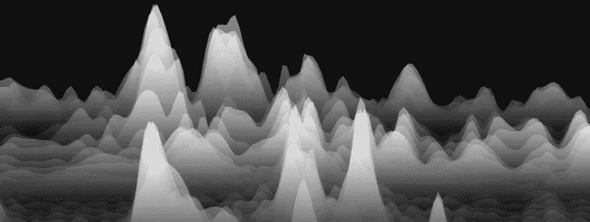

# 激光诱导击穿光谱

L 激光诱导击穿光谱(LIBS)是目前分析化学中最简单也是最强大的技术之一。其多功能性允许对复杂样品进行详细的定性和定量分析，无论是固体、液体还是气体形式。此外，被分析的样品可以是任何尺寸或形状，包括粉末、浆体和气溶胶。LIBS 仪器可以做得坚固耐用，便于携带，可以在任何环境下使用，包括危险的环境。只需要对样品进行光学访问，并且可以在几十米的距离进行测量。数据采集速度快，LIBS 仪器的操作可以很容易地自动化。

在现有的不同分析技术中，LIBS 可以归类为多元素光谱化学技术，它由激光-物质相互作用的物理学控制(这种相互作用对 LIBS 测量有巨大的影响，因为它控制所有中间物理过程，如电子和离子加热、热扩散、粒子烧蚀和动力学以及等离子体形成和膨胀)。

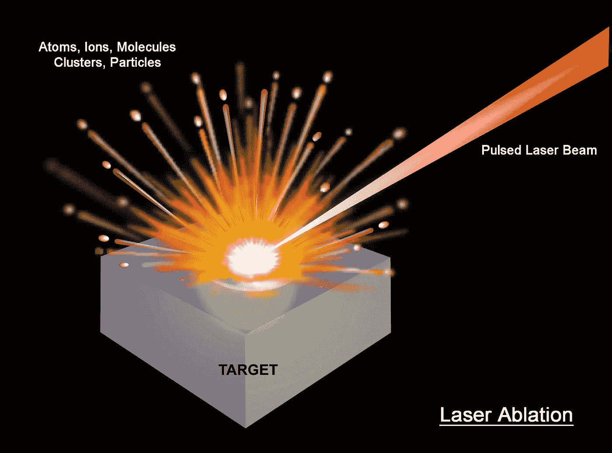

A short-pulsed high-power laser beam is focused onto a sample surface, producing dense hot plasma plume for spectroscopic analysis. Image credit: Applied Spectra, Inc.

在实践中，LIBS 是通过将强激光束(通常来自脉冲纳秒 Nd:YAG 激光器)聚焦到样品表面上以产生烧蚀材料的热离子化气体(所谓的等离子体羽流)来进行的。来自受激物质复合的等离子体光发射出样品中存在的元素的原子发射谱线特征，然后被收集并引入光谱仪，在光谱仪中被分散成离散的波长。一旦等离子体温度和电子密度充分下降，并且观察原子谱线的条件是最佳的，就进行 LIBS 光谱的采集(使用门控 CCD 照相机)。

下图显示了从土壤样品中获得的典型 LIBS 光谱，显示了各种化学元素的强发射线。

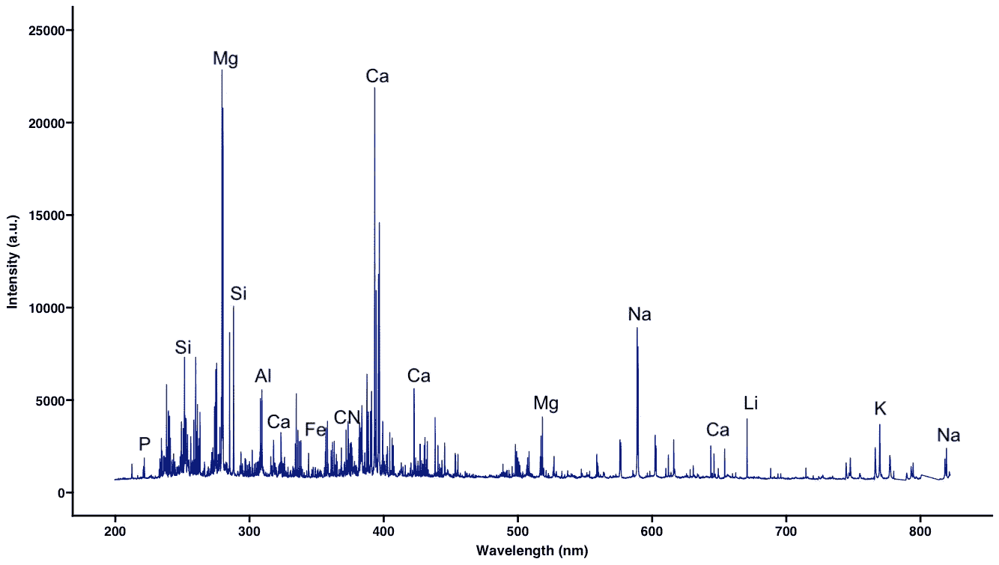

Typical LIBS spectrum (in 210–850 nm range) of a soil sample.

由于其独特的特点，人们对 LIBS 的兴趣迅速蔓延。每年发表的研究论文数量很好地说明了这种兴趣。工业应用的数量也是如此，近年来增长迅速，例如在环境分析、冶金工业、考古学、生物学、安全和空间探索方面。例如，自 2012 年 8 月 19 日以来，作为美国宇航局火星科学实验室好奇号任务的一部分，由美国能源部[洛斯阿拉莫斯国家实验室](https://en.wikipedia.org/wiki/Los_Alamos_National_Laboratory)和法国 [CESR](https://en.wikipedia.org/wiki/Centre_d%27Etude_Spatiale_des_Rayonnements) 实验室开发的用于探索火星盖尔陨石坑的 [ChemCam](https://msl-scicorner.jpl.nasa.gov/Instruments/ChemCam/) LIBS 仪器已经提供了数千次对火星岩石和土壤元素组成的宝贵分析。超级摄像机[是 ChemCam 的改进版本，计划于 2020 年夏天通过火星车任务发射，并于 2021 年冬天在 Jezero 陨石坑内着陆。](https://mars.nasa.gov/mars2020/mission/instruments/supercam/for-scientists/)

SuperCam instrument. Image credit: NASA.

# 一阶多元校准

在过去的几十年里，在 LIBS 使用化学计量学方法，尤其是一阶多元校准曲线，已经显著提高了其分析性能，因为多元统计方法已经允许利用 LIBS 光谱中通常存在的冗余信息。在化学计量学中，在从未知样品预测分析物浓度之前，校准模型通过多元回归方法建立，并被训练以学习光谱-浓度关系。但首先让我们定义术语“一阶校准”。

## 光谱数据的结构**数据**

在数学中，张量是代数对象，可以用一个标量(秩为 0 的 0 阶张量)、一个向量(秩为 1 的 1 阶张量)和一个矩阵(秩等于其矩阵秩的 2 阶张量)来表示。在化学计量学中，张量的阶指的是张量所跨越的模式或空间的数量。张量的秩(尽管没有完全理解，特别是对于高阶张量)可以定义为其线性组合再现该张量的秩为 1 的张量的最小数量。这与矩阵的秩不同，矩阵的秩在线性代数中被定义为线性独立元素(行或列的向量)的最大数量。换句话说，或者用化学计量学的术语来说，

> 双向矩阵的秩是复制矩阵所需的双线性(PCA)分量的最小数目。而三路数组的秩是再现该数组所需的三线性(PARAFAC)分量的最小数目。拉斯莫斯兄弟

当来自多个样品的测量响应是标量(零阶张量)时，它们可以排列在一个向量中，从而给出一个单向数据结构(例如多个溶液的 pH 测量)。另一方面，如果响应是一阶张量，则它们产生双向数据结构(例如，LIBS 光谱数据，其提供一组不同波长的发射强度)。最后，使用两种仪器(例如 LIBS 与拉曼光谱仪协同工作)或一组二阶响应(例如瞬态系统的 LIBS 测量)涉及处理三维数据阵列，即三向结构。概括地说，来自每个分析样本的一组 *i* 阶数据创建了一个( *i* +1)向结构。

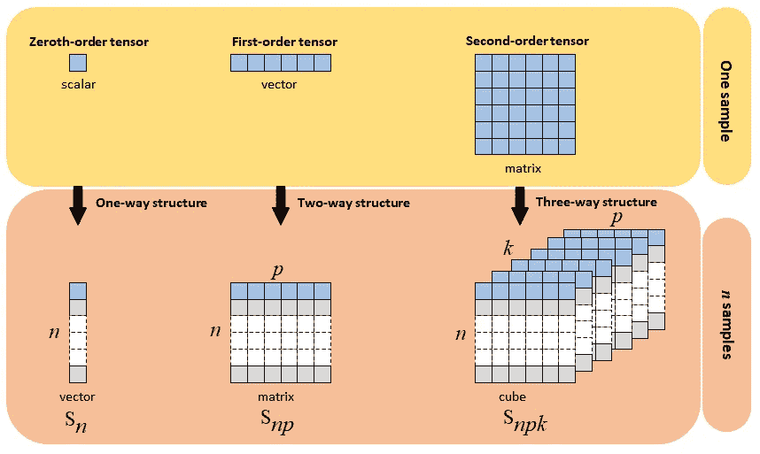

Examples of data structure.

## 单变量校准模型

我们将校准曲线定义为一个模型，该模型由一组经认证的参考材料或标准物质(即，其性质由经认证的实验室或机构准确定义和认证的样品)或参考样品(即，之前通过成熟方法分析的样品)开发而成，其中分析物含量和 LIBS 光谱是已知的(下图说明了典型的线性和二次校准曲线)。注意，建立在来自一组校准样品的单值响应(例如发射线的信号)上的经典校准曲线是零阶校准模型的一个例子。

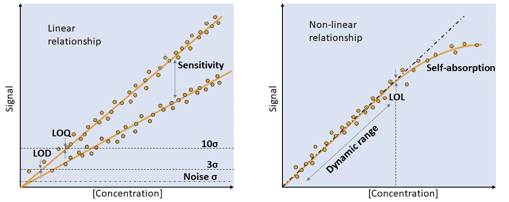

Linear (left panel) and non-linear (right panel) calibration curves. Note that LOD, LOQ, and LOL refer to the limit of detection, of quantification, and of linearity. These parameters are respectively defined as (1) the lowest analyte concentration likely to be reliably distinguished from a blank sample and at which detection is feasible, (2) the lowest concentration at which the analyte can not only be reliably detected but at which some predefined goals for bias and imprecision are met and, (3) the upper limit of the dynamic range for which the relationship is linear. The slope of the regression line defines the sensitivity of the calibration model.

校准曲线通常与相应的置信限和预测限一起提供，如下图所示。

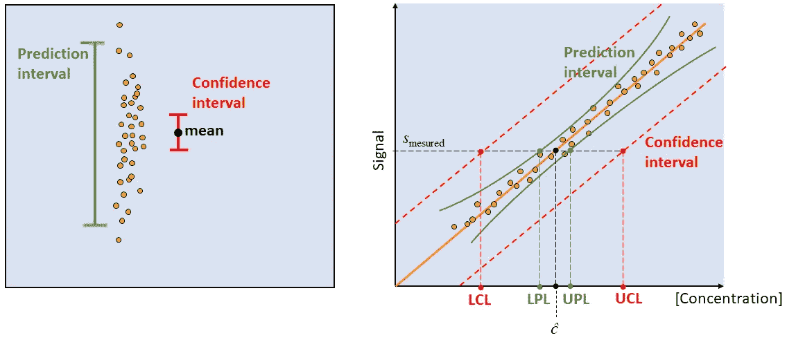

Confidence and prediction intervals for the classical least-squares straight-line fit. LCL and UCL are the lower and upper confidence limits. Likewise, LPL and UPL are the lower and upper prediction limits. ĉ is the predicted concentration from the measured signal of an unknown sample.

置信限(LCL 和 UCL)给出了估计平均值的一个区间(即通过重复测量计算得出)，该区间覆盖了概率为 1-α的总体平均值(α = 0.05，置信水平为 95%)。然而，预测极限(LPL 和 UPL)给出了概率为 1α的新样品( *ĉ* )浓度的预测不确定性。

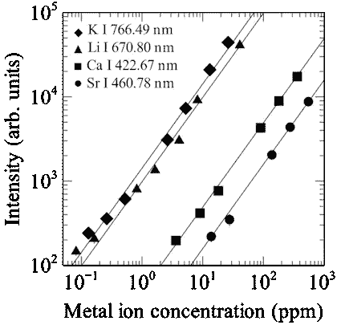

Example of univariate calibration curves for the detection of Ca, Sr, K, and Li in aqueous solutions. Source: Goueguel et al., Matrix effect of sodium compounds on the determination of metal ions in aqueous solutions by underwater laser-induced breakdown spectroscopy, Applied Optics, 54, 6071, 2015.

重要的是要注意，单变量校准模型的灵敏度(即回归线的斜率)将取决于发射线的光谱特征。通常根据三个主要标准选择该谱线:(1)最强，(2)不可能自吸收，以及(3)没有光谱干扰。另一方面，在多变量校准模型中，灵敏度将根据是选择考虑整个光谱还是选择一些谱线而受到影响。此外，使用曲线下的面积(峰面积)而不是峰强度通常更合适。估算峰面积的直接方法是用高斯或洛伦兹曲线拟合峰，或使用数值积分技术，如牛顿-科特斯公式(如梯形法则)或高斯积分。

## 多元校准模型

因此，在熟悉了单变量校准曲线的基础知识后，现在有趣的是注意到多变量校准可以根据光谱-浓度关系分为直接校准或反向校准。在直接多元校准模型中，假设 LIBS 信号与分析物浓度成比例。该模型似乎是经典单变量模型的推广，可以通过经典最小二乘(CLS)回归进行估计。而在逆多元校准中，假设浓度与 LIBS 信号成比例。在这种方法中，通过反最小二乘法(ILS)从一组校准样本中估计回归系数。

在下文中，我们将看到 ILS 回归(即**多元线性回归(MLR)** )具有有限的适用性，尤其是在处理高度相关的预测因子(LIBS 光谱)或样本少于包含复杂矩阵效应的变量时。幸运的是，已经提出了许多替代的回归方法来处理这种情况。

## **直接多元校准**

**光谱** = *f* ( **成分**)

信号=灵敏度×浓度+误差

## **逆多元校准**

**构图** = *f* ( **光谱**)

浓度=信号×**×回归系数+误差**

使用反向校准优于直接校准的原因在于，当我们只知道校准样品中目标分析物的浓度，而对其他成分的浓度一无所知时，可以应用字母。因此，逆多元校准不仅能够预测分析物的浓度，还能够预测样品的物理性质(例如，我们发表了一篇[研究文章](https://pubs.rsc.org/en/content/articlelanding/2019/ja/c9ja00090a#!divAbstract)，其中我们能够仅根据 LIBS 光谱预测土壤颗粒大小的分数)。这个基本概念是应用于 LIBS 定量分析的化学计量学方法的基础。因此，在下面的讨论中，我们将只对反校准方程感兴趣，它可以写成:

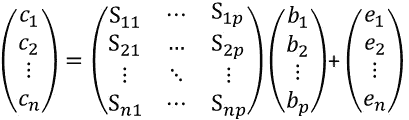

其中 ***c*** 是分析物浓度(或样品物理特性)的 *n* ×1 向量， **S** 是包含在 *p* 不同波长测量的*n*×p 校准样品的 LIBS 信号的*n*×p 矩阵，**b**是*p*因此，未知回归系数的普通最小二乘(OLS)估计值可使残差的误差平方和最小化，由下式给出:**

这导致了

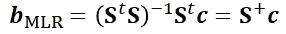

随着

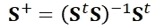

**S** +是 **S** 的[摩尔-彭罗斯伪逆](https://en.wikipedia.org/wiki/Moore%E2%80%93Penrose_inverse)。上标“t”的意思是“转置”。预测浓度 ***ĉ*** 由下式给出:

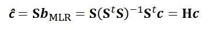

其中 **H** 为帽子矩阵 **S** ᵗ **S** 为协方差矩阵(维数 *p* × *p* )，为方阵。对上述方程的一个几何解释是:将***【c】***正交投影到 **S-** 空间，以 **H** 为正交投影矩阵，得到 ***ĉ*** 。

值得一提的是，逆校准方程代表一个由 *n* 个方程(i *)组成的系统。* e *。*校准样本的数量)与 *p* 未知数(i *)之比。* e *。*待估计的回归系数个数，与光谱波长个数重合)。在 LIBS，不同波长的紫外光、可见光和近红外光的数量一般都在数万的数量级上(使用任何一种中分辨率的宽带阶梯光栅光谱仪)，这样 *p >* > *n* (也就是俗称的[维度诅咒](https://link.springer.com/referenceworkentry/10.1007%2F978-0-387-39940-9_133#howtocite) ) *。*

> 我们在这里面临的第一个问题是 MLR 应用于 LIBS 数据，因为求解方程需要比波长更多的校准样本。

制备大量校准样品通常不被认为是可行的选择，因为除了耗时之外还需要额外的成本。此外，即使我们能够添加更多的校准样本来求解该方程，协方差矩阵也必须是可逆的(即，非奇异矩阵)。另一方面，如果至少一个预测变量(1)与另一个变量成比例，(2)是其他变量的线性组合，(3)是常数，以及(4)变量多于观测值，则协方差矩阵是奇异的。

> 我们现在面临第二个问题，因为高维 LIBS 数据中的多重共线性使得协方差矩阵奇异*。*

方阵 **S** ᵗ **S** 不是满秩 *p* 的事实对几种机器学习方法的选择和适用性有着深远的影响。事实上，正是由于这个原因，化学计量学从业者更喜欢不需要协方差矩阵的逆矩阵的机器学习方法。这就是为什么，分解和收缩回归方法被提出来处理这样的病态问题。众所周知的线性方法有:

1.  **主成分回归** (PCR)
2.  **偏最小二乘回归** (PLSR)
3.  **岭回归** (RR)
4.  **连续回归** (CR)
5.  **主协变量回归** (PCovR)

在下文中，我将简要介绍这些回归方法，尤其是 PCR、PLSR 和 RR。

## 主成分回归

PCR 已经被提议作为一种技术，其将预测因子的数量减少到不相关成分(潜在变量)的较小集合，并且对这些成分执行最小二乘回归。在 PCR 中，从预测数据的**主成分分析(PCA)** 中获得成分作为主成分(PCs)，即校准光谱 **S** 。通过这样做，当预测因子高度共线时，PCR 提供了一种替代方法。 **S** 被分解(或分解)为(对象)得分 **T** ( *n* × *r* )和(可变)载荷**P**(*P*×*r*)的乘积。 **T** 总结被分析样本之间的关系(相似或不同)，而 **P** 总结变量(或波长)之间的关系(正相关或负相关)。 **T** 和 **P** 中的列数等于 **S** 的秩 *r* ，通常小于 *n* 或*P*

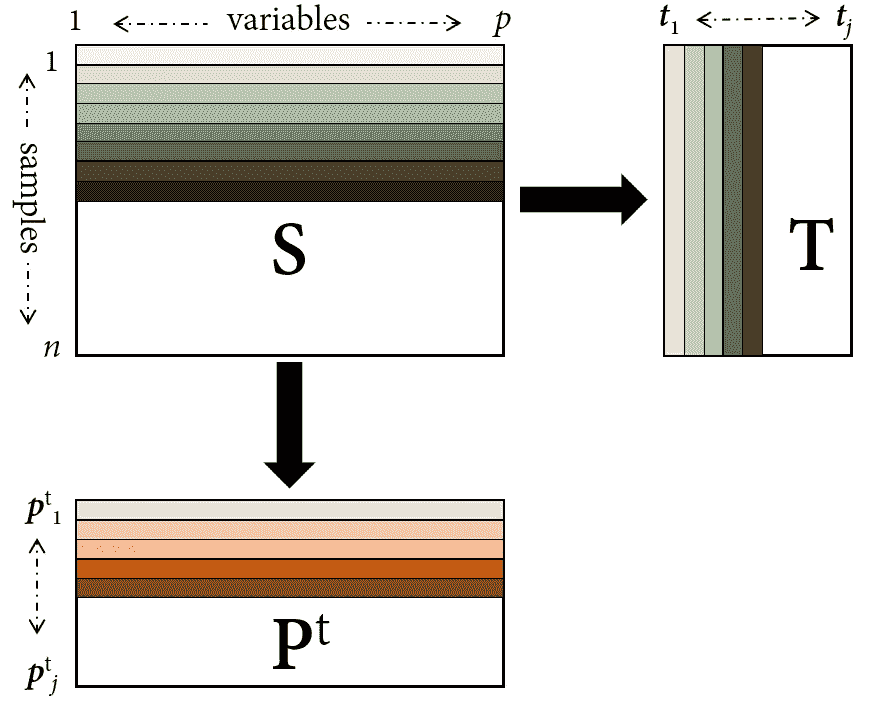

Illustration of the PCA decomposition of matrix S.

在下面的中，我们假设 **T** 和 **P** 只包含第一个 *j* 列，指的是保留的 PCs 数量，通常通过交叉验证来选择。通常， **S** 是通过减去它的平均值而以平均值为中心的。

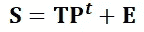

逆校准公式可以改写为:

PC 分数 **T** 用作浓度的回归量，由 **T** = **SP** 决定。因此，通过应用逆校准方程，分析物浓度 ***c*** 与分数 **T** 相关，而不是原始数据矩阵 **S.** 大小为 *j* ×1 的回归系数向量由下式给出:

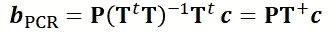

预测浓度 ***ĉ*** 由下式给出

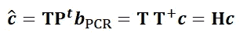

其中 **T** +是 **T** 的 Moore-Penrose 伪逆。这解决了多重共线性问题，因为 **T** ᵗ **T** 的反演是微不足道的，因为这是一个对角矩阵，因为 **T** 的列是正交的。回想一下，对角矩阵的逆矩阵简单地由一个对角矩阵给出，它的元素是原始元素的逆矩阵。

## 偏最小二乘回归

已经提出 PLSR 作为改进 PCR 的方法，通过在潜在变量的估计中引入关于分析物浓度的信息。换句话说，PLSR 采用依赖于 ***c*** 的潜在变量，而 PCR 采用独立于 ***c*** 的潜在变量。如同在 PCR 中一样，通过将分析物浓度***【c】***与样本分数 **T** 相关联来开发反向校准模型。该数学关系在形式上与 PCR 的数学关系相同。差异在于估算 PLSR 得分矩阵的方式。可以看出，回归系数向量由下式给出:

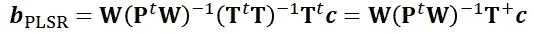

可以写成

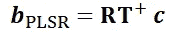

随着

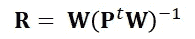

**R** (或通常称为 **W*** )是权重矩阵，而 **W** 是载荷权重。与 PCR 相反， **T** 由 **T** = **SR 决定。** PLSR 容易处理多重共线性，因为在 **P** ᵗ **W** 的反演中没有发现问题，因为 **P** 和 **W** 分别是正交和正交矩阵。在继续之前，我想在这里提一下**正交偏最小二乘(OPLS)** 回归，它是 PLSR 的修改版本，将是未来讨论的主题。

 [## 正交偏最小二乘综述

### 你听说过正交偏最小二乘法(OPLS)吗？

towardsdatascience.com](/an-overview-of-orthogonal-partial-least-squares-dc35da55bd94) 

## 里脊回归

虽然 PLSR 是化学计量学中最流行的回归方法，但其他基于[正则化最小二乘方法](https://en.wikipedia.org/wiki/Regularized_least_squares) 的现代机器学习方法，如岭回归，也经常用于多变量校准。在 RR 中，要最小化的目标函数可以写成:

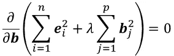

因此，

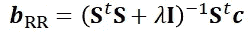

**I** 是单位矩阵，λ是通过交叉验证确定的正则化参数。关于 LIBS 数据，岭回归中最重要的方面是确定*b 所需的矩阵求逆总是可能的，即使当协方差矩阵是奇异的并且不能求逆时。因此，RR 通过惩罚高方差系数来处理多重共线性。*

## *连续回归*

*PLSR(**S**et**c之间的最大协方差)形成了 MLR(**S**et**c之间的最大相关)和 PCR(**S**中的最大方差)之间的折衷。这使得 Stone 和 Brooks 开发了一种方法，它是上述回归方法的延续，MLR、PLSR 和 PCR 是其特例。*****

## *主协变量回归*

*PCovR 是一种连续回归，它结合了 PCR 和降秩回归。*

# *更进一步:二阶多元分析*

*为了选择最合适的化学计量方法，必须考虑影响数据线性的任何物理性质或化学相互作用。正是由于这个原因，多路尤其是三路数据分析已经成为化学计量学中的一个重要课题(例如，基于低秩张量分解的众所周知的方法是 Tucker3、PARAFAC 和 *N* -PLS)。Tucker3 (T3)和并行因子分析(PARAFAC)也称为规范分解(CANDECOMP)或规范多点分解(CP)，是矩阵奇异值分解(SVD)和双线性 PCA 的高阶推广，而 *N* -PLS 推广了双线性 PLS。如前所述，三向数据阵列(即二阶张量)是由 *n* 行(模式 1)、 *p* 列(模式 2)和 *k* 水平切片(通常称为管)定义的。*

*三向分析的一个简单方法是将三向数据数组展开成*k*×(*n*×*p*)、*n*×(*k*×*p*)和*p*×(*n*×*k*)两向表，然后可以根据回归分析这些表然而，对这些展开数据中的每一个进行分析都不太可能产生可靠的结果来真正揭示复杂的化学相互作用，此外还会受到过量输入和计算成本的影响。*