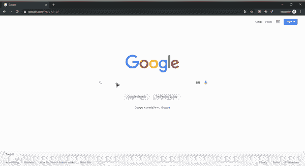
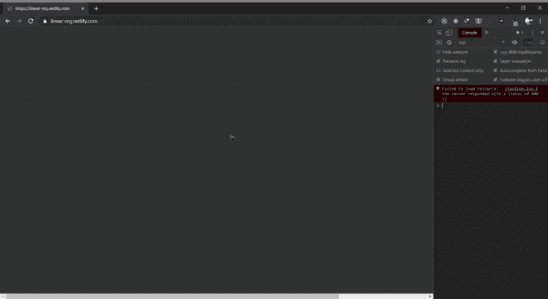

# 从动手项目开始机器学习

> 原文：<https://towardsdatascience.com/first-step-towards-data-science-abb06ea6cb8f?source=collection_archive---------11----------------------->

## 黑进去

## 你如何从一开始就着手动手做项目

> 探索精神是生命中最珍贵的礼物，它非常热衷于学习，没有任何评判的眼光 ― **眼虫**

# 谁能学？

如果你是一个机器学习爱好者，热衷于学习，那么开始你在数据科学和机器学习领域的旅程永远不会太迟。

由于数据的数量每天都呈指数级增长，并且有许多免费资源可用，这为我们研究数据并从中提取一些有意义的输出提供了一个很好的机会。

# 但是为什么入门这么难呢？

对于像我们这样的初学者来说，这是一项具有挑战性的任务。数据科学和机器学习是计算机爱好者中最热门的话题，因此互联网上有许多分散的资源，很容易使我们偏离道路。

> 在其核心，数据科学是一个研究领域，旨在使用科学的方法从数据中提取意义和见解
> 
> 另一方面，机器学习是指数据科学家使用的一组技术，允许计算机从数据中学习。

如果你只是谷歌搜索任何关于数据科学和机器学习的主题，你可能会被大量的资源淹没，并且很难抓住一个路线图并遵循它。

Overwhelming resources

# 动机

因此，在这篇文章中，我将分享我是如何通过做一些实践项目来开始自己的旅程的，并为每个人提供一些神圣的学习资源。

我将分享你如何用一些 ML 算法和数据弄脏你的手。

# 入门指南

首先，每个人都可以通过谷歌搜索或简单的 YouTube 搜索来轻松学习入门部分。

如果你像我一样，更喜欢**视觉+音频**教程来更好地理解，那么你可以从 [*谷歌的机器学习食谱*](https://youtu.be/cKxRvEZd3Mw) 开始。这是一个很好的资源，可以从一些例子开始。从那里你可以了解机器学习算法，并建立一些。

## 掌握概念

在这个过程中，你也可以查看其他资源，并很好地掌握**机器学习**的内容、方式和原因。这不是一蹴而就的事情，所以要学会有些耐心，优雅地感受数据科学的美好。

> 在与数据科学的每一次交流中，一个人得到的要比他寻求的多得多。
> 
> — **任何人**

由于网上有很多可用的资源，一个人应该学会找到适合自己水平的丰富和优质的资源。

例如:如果你想学习一些算法在运行中的样子，尝试一些使用库的小教程，并开发一些小东西。之后，你可以通过简单的谷歌搜索来了解这个算法:“数学背后的 *<算法>”。*

这需要时间，但一旦你找到适合你的好资源，你就可以轻松地学习。

## 基础知识之后的动手项目

有了一些基础知识之后，就可以学习其他各种算法了。对你来说，从一开始就知道一切并不重要。你可以:

1.  从一个开始，从不同的作者和资源中了解它。例如:尝试在谷歌搜索*“线性回归初学者指南”*，从你得到的第一个帖子开始。
2.  从中创造一些东西；一些能激励你并让你感到快乐的事情。保持动力非常重要，这就是为什么**阅读+在一些项目中运用这些知识**非常重要。它帮助你看到你所学的实际输出。

# 我是怎么开始的？

在做了一些基础之后，我实现了一个梯度下降:这是 [**这个**](https://linear-reg.netlify.com) 项目中的一个学习算法，它帮助我理解了一个机器学习模型是如何学习的。在这里，你可以在任何地方绘制两个或更多的点，它试图学习(减少误差)并最好地拟合这些点之间的直线。

Linear Regression using Gradient Descent

很有趣，不是吗😁？你可以在 YouTube 上找到一个关于这个和其他一些算法的很棒的视频，通过编码训练 [**这里**](https://www.youtube.com/playlist?list=PLRqwX-V7Uu6bCN8LKrcMa6zF4FPtXyXYj) 。

如果你是一个爱看书的人，试着用 sci-kit learn 和 Tensorflow 阅读 [**手动机器学习。**](https://books.google.com.np/books/about/Hands_On_Machine_Learning_with_Scikit_Le.html?id=khpYDgAAQBAJ&printsec=frontcover&source=kp_read_button&redir_esc=y)

# 最后的话

我真的希望你会喜欢这次旅行。总是从小事开始，不断成长。

一个人永远不应该停止学习这个领域的新东西。每天都有新的有趣的事情被研究，所以，继续学习，保持好奇！😄