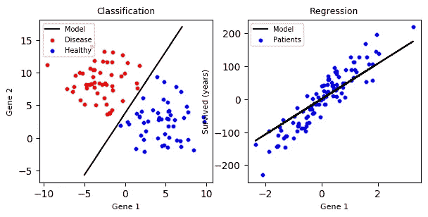
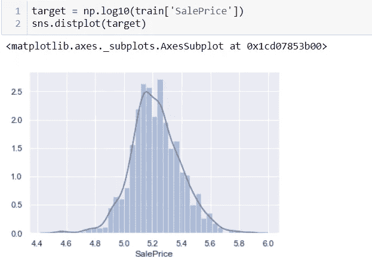
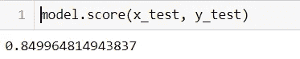

# 迈向数据科学的第一步

> 原文：<https://towardsdatascience.com/first-step-towards-data-science-journey-to-the-home-for-data-science-3a7aeb23b81a?source=collection_archive---------21----------------------->

## 数据科学之旅

## kaggle 竞赛入门

Source: [https://miro.medium.com/max/1053/1*gO6yZ3Z855MW26FuEiQjKw.png](https://miro.medium.com/max/1053/1*gO6yZ3Z855MW26FuEiQjKw.png)

> Kaggle 是数据科学家的 AirBnB 这是他们度过夜晚和周末的地方。这是一个众包平台，旨在吸引、培养、培训和挑战来自世界各地的数据科学家，以解决数据科学、机器学习和预测分析问题。— [齐山-乌尔-哈桑·乌斯马尼](https://www.kaggle.com/zusmani)

## 介绍

如果你想涉足数据科学，Kaggle 是最好的起点。如果你愿意，那么你可以阅读所有的*什么*和*为什么*在:[*https://www.kaggle.com/getting-started/44916*](https://www.kaggle.com/getting-started/44916)*。相信我，这是值得的。*

让 Kaggle 如此棒的一个主要原因是，你可以找到数据集，而没有任何数据收集的麻烦，并且可以在云中编写和运行代码。你也可以使用谷歌的[*Colab*](https://colab.research.google.com)Jupyter 笔记本和他们的 GPU & TPU 来编写和运行你的代码。他们是自由的。

您可以轻松注册 [*平台*](https://www.kaggle.com/) 和 [*入门比赛*](https://www.kaggle.com/competitions?sortBy=grouped&group=general&page=1&pageSize=20&turbolinks%5BrestorationIdentifier%5D=51a33612-8e6c-413b-ae30-c7d79493105b&category=gettingStarted) 。我将通过参加 [**房价:高级回归技术**](https://www.kaggle.com/c/house-prices-advanced-regression-techniques/) 竞赛向大家展示如何预测房价。会很棒的，我们开始吧。

# 入门指南

让我们转到笔记本部分，在 Kaggle 上创建一个新的笔记本:

Notebook on [Kaggle](http://kaggle.com/)

启动笔记本后，你会看到一个漂亮的笔记本平台，左边有一个可用的数据集列表。

[Kaggle’s](http://kaggle.com/) Notebook

现在在开始写一些代码之前，我们先要了解一下**机器学习流水线**

# ML 管道

虽然 Kaggle 通过提供数据集使我们变得容易，但处理和清洗数据并从中提取相关特征以及识别数据集中的**异常值仍然具有挑战性。这整个过程被称为 [**数据角力**](https://en.wikipedia.org/wiki/Data_wrangling) ，是特征工程的一部分。**

**让我们看看我们得到了什么类型的数据；我们将使用 [***Pandas:数据分析库***](https://pandas.pydata.org/)*来分析数据集。正如你在笔记本中看到的，Pandas 和 NumPy 库已经被导入。我们有两个数据集文件:train.csv 和 test.csv 另一个 sample_submission.csv 只是我们的提交应该是什么样子的示例。***

# ***代码部分***

***让我们看看训练和测试集的头部数据。***

******

***train and test set***

***如您所见，我们在训练集中有 81 列，在测试集中有 80 列；这是因为在测试集中没有给出**标签列(SalePrice)** 。我们必须通过基于训练集训练模型来预测给定功能的销售价格。我们还应该拥有该领域的专业知识，这样我们就更容易知道自己在做什么。例如:对于这个项目，我们预测房子的销售价格，最重要的领域特征是:房子状况，位置如何，房子有什么特征等等。***

***我们已经给出了一组特征和一个标签，我们预测的是给定特征的连续值，而不是分类值；所以这是一个明显的 [***回归问题***](https://math.stackexchange.com/questions/141381/what-is-the-difference-between-regression-and-classification)*而不是一个 [***分类问题***](https://math.stackexchange.com/questions/141381/what-is-the-difference-between-regression-and-classification) 。****

****

**Classification and Regression**

**现在我们要用训练集(train.csv)来玩一下，检查 SalePrice 数据的偏斜度。**

> **正态分布的数据更容易分析**

**为什么是正态分布数据？你可以在这里查看**。****

****

**The skewness of the SalePrice data**

**正如我们可以看到的，SalePrice 是右(正)倾斜的，我们使用 matplotlib 和 seaborn 来可视化数据。**

**现在是数据转换的时候了。我们可以使用*日志*将数据转换成正态分布的数据:**

****

**log transform of the data**

**我们使用了一个以*为基数 10* 的*对数*，现在数据呈正态分布。要了解我们为什么使用日志来转换数据，请观看此视频。**

**Logarithms — Real-Life Applications**

**之后，我们可以检查我们的概率图:**

****

**Probability Plot**

**看起来不错，我们可以前进了。**

****

**checking the correlation**

**现在我们必须检查高度相关的数据。首先，我们提取所有数字数据类型的特征，并检查这些特征与销售价格的相关性。**

****

**前五个特征与销售价格高度相关；意思是——这些值是线性相关的，对销售价格有很大影响。**

**正如我们所看到的，GarageArea 也与销售价格高度相关。让我们来看一下数据:**

****

**visualizing garage area data**

**x 轴上高于 1200 的几个点是我们数据的异常值。这几个数据会影响模型，所以我们必须消除它们。**

****

**removing outlier data points**

**简单地说，我们通过获取小于 1200 的数据来删除它们。😄只是一个简单的方法。**

****

**converting string data to numerical**

**在我们的数据集中，街道要素有两个唯一值:Pave 和 Grvl。这也是一个有用的特性，但它是字符串数据类型；所以我们正在创建一个函数 mapStreet，将这些数据转换为 Pave 的 0 和 Grvl 的 1。**

****

**Sale price with respect to Sale Condition**

**现在是时候看看相同条件下房子的销售价格了。从上图中我们可以看到，部分销售条件是以高销售价格出售的，因此，为了方便起见，我们将部分销售条件分组为 1，其他销售条件分组为 0。**

****

**现在，为了使我们的数据集更好，我们可以删除或使用另一种方法来消除所有的 NAN 或 null 值。现在，我们只是删除它，只保留训练集和测试集上的数值。**

****

**现在，我们对 SalePrice 进行 log 转换，并将 train.csv 数据集拆分为两部分: *y* 用于标签，而 *x* 用于特征，并再次使用[***scikitlelarns***](https://scikit-learn.org/)*train _ test _ split 方法将它们拆分为训练集和测试集。***

******

***终于！现在我们准备训练模型。***

******

***首先，我们从 Sci Kit learn 导入一个回归模型库，并给我们的训练集进行训练。您可以为该任务使用任何合适的模式。现在，我们使用线性回归。***

******

***我们可以通过在模型上调用一个 *fit()* 方法来训练我们的数据。它训练我们的模态，我们可以通过使用*来检查分数。得分()*法。***

****

**目前，我们有大约 84%的准确率。没那么糟糕，但是你可以通过调整一些数据和更好的特征工程来提高精确度。**

****

**现在是时候准备一个提交文件，在 Kaggle 上提交了。**

****

**preparing a submission file**

**我们使用相同的模型来预测 *test.csv* 文件中特性的标签，并将所有带有 ID 的输出保存在 *submission.csv* 文件中。现在，您可以看到您的提交文件并将其提交到 Kaggle 的提交部分，并在公共排行榜中看到自己。**

****

**kaggle leaderboard of Hose Price prediction**

## **最后的想法**

**Kaggle 竞赛是一个接触真实世界数据集的好地方。我希望你学到了一些东西。你可以继续探索 kaggle 上的其他数据集，并通过做令人兴奋的项目继续数据科学之旅。不断学习，保持好奇心。**