# 回归分析的 f 检验

> 原文：<https://towardsdatascience.com/fisher-test-for-regression-analysis-1e1687867259?source=collection_archive---------0----------------------->

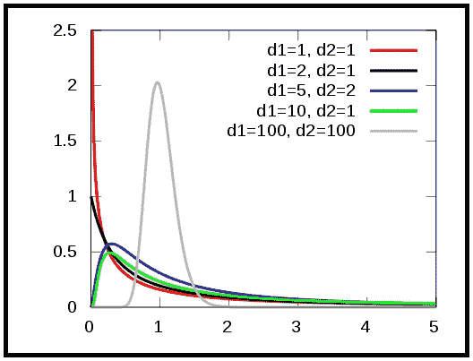

[The F-distribution](https://commons.wikimedia.org/wiki/File:F-distribution_pdf.svg) (Source: Wikimedia Commons under [CC BY-SA 4.0](https://creativecommons.org/licenses/by-sa/4.0/deed.en))

## 如何使用它，如何解释它的结果

当用于回归分析时，f 检验允许您比较两个竞争回归模型“解释”因变量方差的能力。

f 检验主要用于方差分析和回归分析。我们将研究它在*线性*回归中的应用。

## 为什么在回归分析中使用 f 检验

在线性回归中，f 检验可用于回答以下问题:

*   你能通过使你的线性回归模型变得更复杂来改进它吗，例如，通过增加更多的线性回归变量？
*   如果您已经有了一个复杂的回归模型，您是否会更好地用仅截距模型(这是您可以构建的最简单的线性回归模型)来交换您的复杂模型？

第二个问题是第一个问题的特例。在这两种情况下，这两个模型被称为是**嵌套**。更简单的模型被称为**限制模型。**这就好像我们在限制它使用更少的回归变量。复杂模型被称为**无限制模型。**它包含了受限模型的所有变量和至少一个以上的变量。

受限模型被称为嵌套在非受限模型中。

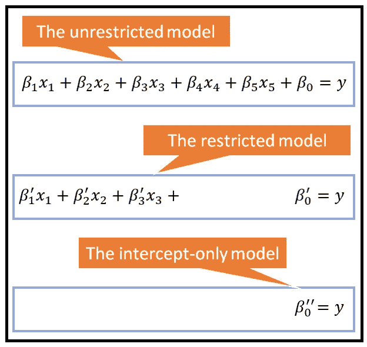

Linear regression models: unrestricted, restricted and intercept-only restricted (Image by [Author](https://sachin-date.medium.com/))

让我们通过一个真实世界的时间序列示例来探索 f 检验的使用。我们将首先构建一个仅拦截模型，即受限模型。

## 简单看一下仅拦截模型

以下时间序列显示了道琼斯工业平均指数在 3 个月内的每日收盘价。

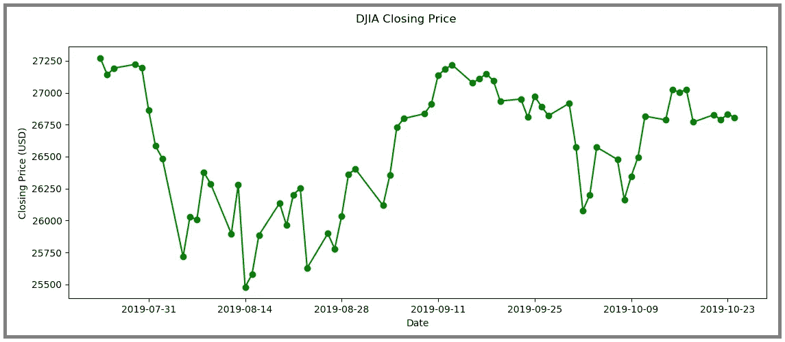

Dow Jones Industrial Average closing price over a 3-month period (Image by [Author](https://sachin-date.medium.com/))

假设我们希望为这个时间序列创建一个回归模型。但是我们不知道什么因素影响收盘价。我们也不想在数据集中假设任何通货膨胀、趋势或季节性。

在没有任何关于通货膨胀、趋势、季节性或存在解释变量的假设的情况下，我们能做的最好的事情是仅截距模型(有时被称为**均值模型**)。对于我们的时间序列示例，它采用以下形式:

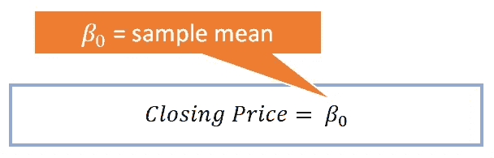

Intercept-only model for the DJIA data set (Image by [Author](https://sachin-date.medium.com/))

在仅截距模型中，所有预测都采用截距 Beta_0 的值。下图显示了实际时间序列背景下拟合的仅截距模型:

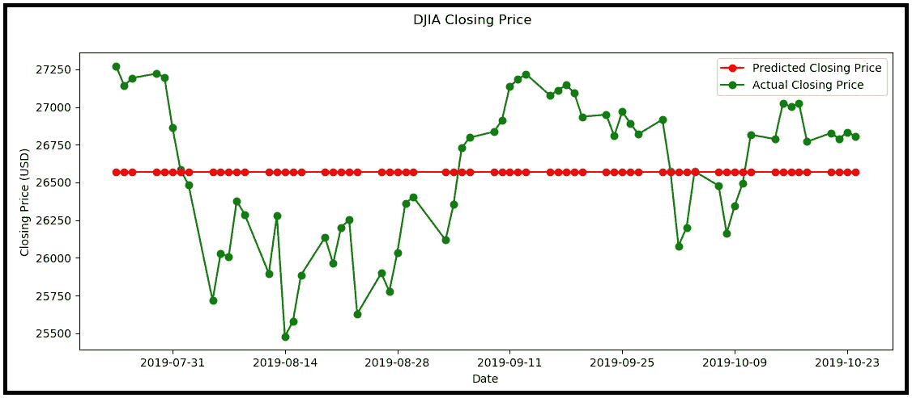

Actual and predicted Closing Price of DJIA using the mean model (Image by [Author](https://sachin-date.medium.com/))

下面是产生上述结果的 Python 代码:

导入所有必需的包:

```
**import** pandas **as** pd
**import** numpy **as** np
**import** matplotlib.pyplot **as** plt
```

将数据集读入熊猫数据框:

```
df = pd.read_csv(**'djia.csv'**, header=0, infer_datetime_format=**True**, parse_dates=[0], index_col=[0])
```

计算样本平均值，并将所有预测值设置为该平均值:

```
mean = round(df[**'Closing Price'**].mean(),2)y_pred = np.full(len(df[**'Closing Price'**]), mean)
```

绘制实际值和预测值:

```
fig = plt.figure()fig.suptitle(**'DJIA Closing Price'**)actual, = plt.plot(df.index, df[**'Closing Price'**], **'go-'**, label=**'Actual Closing Price'**)predicted, = plt.plot(df.index, y_pred, **'ro-'**, label=**'Predicted Closing Price'**)plt.xlabel(**'Date'**)plt.ylabel(**'Closing Price (USD)'**)plt.legend(handles=[predicted, actual])plt.show()
```

我们能比均值模型做得更好吗？也许我们可以。让我们试着为这个时间序列开发一个竞争性的、无限制的模型。

## 竞争模型

假设通过一些分析，我们已经推断出 DJIA 收盘价的今天的值可能是明天收盘价的一个很好的预测值。

为了测试这一理论，我们将开发一个由单个回归变量组成的线性回归模型。该变量将是时间序列的时间滞后值。以下 Python 代码说明了回归过程:

导入所需的包:

```
**import** pandas **as** pd
**import** numpy **as** np
**import** statsmodels.api **as** sm
```

将数据集读入熊猫数据框:

```
df = pd.read_csv(**'djia.csv'**, header=0, infer_datetime_format=**True**, parse_dates=[0], index_col=[0])
```

添加延时栏:

```
df['CP_LAGGED'] = df['Closing Price'].shift(1)
```

以下是修改后的数据框的前几行。第一行包含一个 NaN，因为该值后面没有任何东西:

```
 **Closing Price    CP_LAGGED
Date** 2019-07-24    27269.97070          NaN
2019-07-25    27140.98047  27269.97070
2019-07-26    27192.44922  27140.98047
2019-07-29    27221.34961  27192.44922
2019-07-30    27198.01953  27221.34961 
```

让我们去掉第一行，去掉 NaN:

```
df_lagged = df.drop(df.index[0])
```

接下来，让我们创建我们的训练和测试数据集:

```
split_index = round(len(df_lagged)*0.8)split_date = df_lagged.index[split_index]df_train = df_lagged.loc[df_lagged.index <= split_date].copy()df_test = df_lagged.loc[df_lagged.index > split_date].copy()X_train = df_train[**'CP_LAGGED'**].values*#Add a placeholder for the constant so that model computes an intercept value. The OLS regression equation will take the form: y = Beta_0 + Beta_1*x* X_train = sm.add_constant(X_train)y_train = df_train[**'Closing Price'**].valuesX_test = df_test[**'CP_LAGGED'**].values*#Add a placeholder for the constant* X_test = sm.add_constant(X_test)y_test = df_test[**'Closing Price'**].values
```

构建 OLS ( **O** 副 **L** 东 **S** 方)回归模型并将其拟合到时间序列数据集；

```
ols_model = sm.OLS(y_train,X_train)ols_results = ols_model.fit()
```

使用拟合的模型对训练和测试数据集进行预测:

```
y_pred_train = ols_results.predict(X_train)y_pred_test = ols_results.predict(X_test)
```

对照*测试数据集*绘制模型的性能:

```
fig = plt.figure()fig.suptitle('DJIA Closing Price')actual, = plt.plot(df_test.index, y_test, 'go-', label='Actual Closing Price')predicted, = plt.plot(df_test.index, y_pred_test, 'ro-', label='Predicted Closing Price')plt.xlabel('Date')plt.ylabel('Closing Price (USD)')plt.legend(handles=[predicted, actual])plt.show()
```

结果看起来像这样:

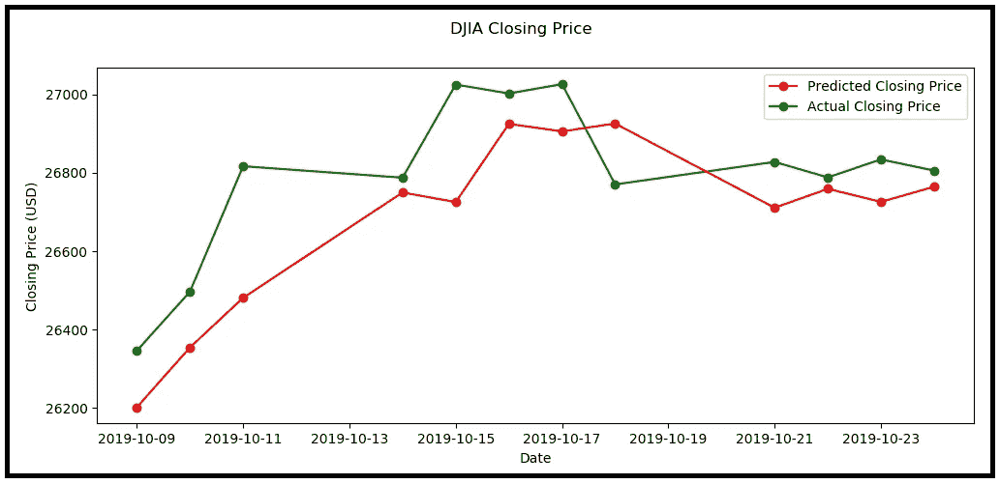

Predicted versus actual Closing Price of DJIA using the OLS regression model on the test data set (Image by [Author](https://sachin-date.medium.com/))

乍一看，这个模型的性能看起来比我们从均值模型中得到的要好得多。但是仔细观察发现，在每一个时间步，模型只是学会了预测实际上是先前观察到的值偏移了一定的量。

但是，这种滞后变量模型*可能*在解释收盘价的变化量时在统计上比仅截距模型表现得更好。我们将使用 f 检验来确定这是否属实。

## 测试方法

我们的测试方法如下:

我们从两个假设开始:

*   **h0:零假设:**滞后变量模型并不能比单纯截距模型更好地解释 DJIA 收盘价的变化。
*   **h1:替代假设:**滞后变量模型比仅截距模型更好地解释了 DJIA 收盘价的变化(以统计显著的方式)。

我们将对两个模型使用 f 检验:仅截距模型和滞后变量模型，以确定是否:

*   在一定的误差范围内，可以拒绝零假设(并接受替代假设),或者
*   应该接受零假设。

## 使用 f 检验的分步过程

为了实现上述目标，我们将遵循以下步骤:

1.  制定 f 检验的检验统计量，即 **F 检验统计量**。
2.  在假设零假设为真的情况下，确定 F 统计量所代表的随机变量*的 **P** 概率 **D** 密度 **F** 函数。*
3.  将这些值代入 F 统计的公式，并使用步骤 2 中找到的 **P** 概率 **D** 密度 **F** 函数计算相应的概率值。这是假设零假设为真时观察到 F 统计值*的概率。*
4.  如果步骤 3 中发现的概率小于误差阈值，例如 0.05，则拒绝零假设，并接受置信水平为(1.0 —误差阈值)的替代假设，例如 1–0.05 = 0.95(即 95%置信水平)。否则，接受误差概率等于阈值误差的零假设，例如 0.05%或 5%。

让我们深入这些步骤。

## 步骤 1:开发测试统计的直觉

回想一下，f 检验衡量的是一个复杂模型在解释因变量方差的能力上比同一模型的一个简单版本好多少。

考虑两个回归模型 1 和 2:

*   设模型 1 有 ***k_1*** 参数。模型 2 有 ***k_2*** 参数。
*   让***k _ 1***<***k _ 2***
*   因此，模型 1 是模型 2 的简化版本。即模型 1 是受限模型，而模型 2 是非受限模型。模型 1 可以嵌套在模型 2 中。
*   设 ***RSS_1*** 和 ***RSS_2*** 为模型 1 和模型 2 拟合到同一数据集后的残差平方和。
*   设 ***n*** 为数据样本数。

有了上述定义，回归的 f 检验的检验统计量可以表示为如下比率:

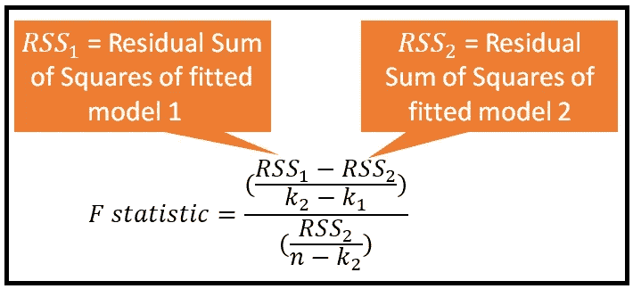

Formula for the F-statistic when applied to regression analysis (Image by [Author](https://sachin-date.medium.com/))

F 统计公式允许您计算因变量中有多少方差，简单模型与复杂模型相比*不能*解释，表示为复杂模型中未解释方差的分数。

在回归分析中，拟合模型的均方误差是无法解释的方差的极好度量。这解释了分子和分母中的 RSS 项。

使用相应的可用自由度来适当地缩放分子和分母。

F 统计量本身就是一个随机变量。

让我们确定 F-统计量服从哪一个 **P** 概率 **D** 强度 **F** 函数。

## 步骤 2:确定 F 统计的概率密度函数

请注意，测试统计的分子和分母都包含残差平方和。还记得在回归中，残差恰好是具有某种概率密度(或概率质量)函数的随机变量，即 PDF 或 PMF，取决于它是连续的还是离散的。在这种情况下，我们关心的是找到 F 统计的 PDF。

如果我们假设两个模型的残差 1)是独立的，2)是正态分布的，这恰好是二次回归的要求，那么可以看到 F 统计公式的分子和分母包含独立的正态分布随机变量的平方和。

可以证明 k 个独立的标准正态随机变量的平方和遵循卡方(k)分布的 PDF。

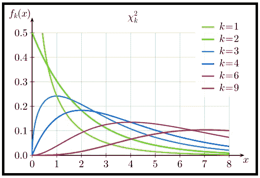

PDF of the Chi-Squared distribution (Source: [Wikimedia Commons](https://commons.wikimedia.org/wiki/File:Chi-square_pdf.svg) under [CC BY 3.0](https://creativecommons.org/licenses/by/3.0/deed.en))

因此，F 统计公式的分子和分母可以显示为各自服从两个卡方分布的缩放版本。

利用一点数学知识，还可以证明两个适当缩放的卡方分布随机变量的比率本身是一个随机变量，遵循 **F 分布**，其 PDF 如下所示。


[The F-distribution](https://commons.wikimedia.org/wiki/File:F-distribution_pdf.svg) (Source: Wikimedia Commons under [CC BY-SA 4.0](https://creativecommons.org/licenses/by-sa/4.0/deed.en))

换句话说:

如果随机变量 ***X*** 具有带参数*D1*和*D2*的 f 分布的 PDF，即:

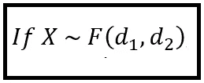

(Image by [Author](https://sachin-date.medium.com/))

然后， ***X*** 可以表示为两个适当缩放的随机变量 ***X_1*** 和 ***X_2*** 的比值，每个随机变量都具有卡方分布的 PDF。即:

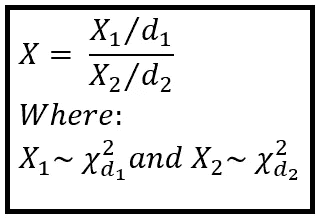

An F-distributed random variable X, expressed as the ratio of two scaled Chi-squared distributed random variables X_1 and *X_2* (Image by [Author](https://sachin-date.medium.com/))

现在回想一下，k1 和 k2 是之前 M1 和 M2 介绍的简单和复杂模型中的变量个数， *n* 是数据样本的个数。

将 D1 和 D2 替换如下:

d_1 = (k_2 — k_1 ),这是要比较的两个模型 M1 和 M2 的残差的自由度差，以及

D2 =(n—k2)是复模型 M2 残差的自由度，

通过这些替换，我们可以将 F 分布的公式改写如下:

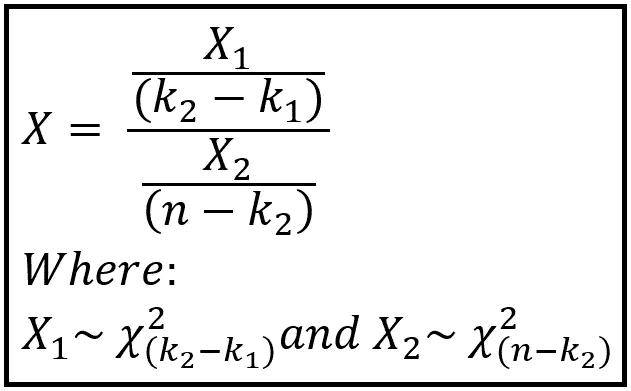

Alternate formula for the F-distribution’s PDF (Image by [Author](https://sachin-date.medium.com/))

让我们将上面的公式与 F 统计量的公式(复制如下)进行比较，其中我们知道分子和分母包含适当缩放的卡方分布的 pdf:

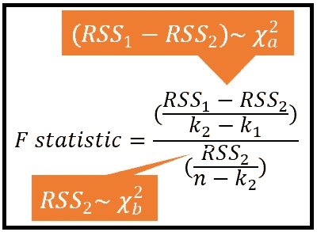

Formula for the F-test’s test statistic (Image by [Author](https://sachin-date.medium.com/))

比较这两个公式，很明显:

1.  分子中卡方分布的自由度' *a'* 为(k1 — k2)。
2.  分母中卡方分布的自由度' *b'* 为(n — k2)。
3.  f 检验的检验统计量具有与 f 分布相同的 PDF。

换句话说，F 统计量遵循 F 分布。

## 步骤 3:计算 F 统计值

如果您使用 *statsmodels 的* s OLS 估计器，这一步是一行操作。你需要做的就是打印 *OLSResults.summary()* 然后你会得到:

1.  F 统计量的值，
2.  对应的“p”值，即在 F 分布的 PDF 中遇到该值的概率。

*statsmodels* 库将完成这两种计算的繁重工作。

```
print(ols_results.summary())
```

这会打印以下内容:

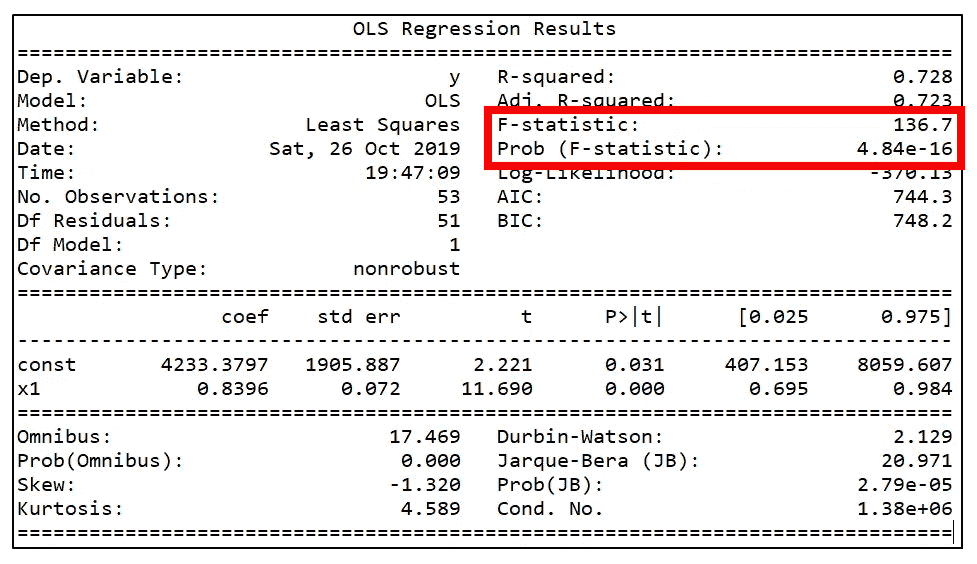

Output of OLSResults.summary() (Image by [Author](https://sachin-date.medium.com/))

## 步骤 4:确定是否可以接受零假设

因为 *OLSResults.summary()* 在假设零假设为真的情况下打印出 F 统计的出现概率，所以我们只需要将这个概率与我们的阈值 alpha 值进行比较。在我们的例子中，*返回的 p 值。summary()* 是 4.84E-16 这是一个极小的数。远小于甚至α= 0.01。因此，在一个有效的零假设的假设下，136.7 的 F-统计量偶然出现的概率远小于 1%。

因此，我们拒绝零假设，接受另一个假设 h1，即复杂模型，即滞后变量模型，尽管有明显的缺陷，但它能够比仅截距模型更好地解释因变量收盘价的方差。

下面是本文中显示的完整 Python 源代码:

包含 DJIA 收盘价的数据文件在这里。

## 结论

*   f 检验可用于回归分析，以确定在解释因变量的方差时，复杂模型是否优于同一模型的简单版本。
*   f 检验的检验统计量是一个随机变量，其概率函数是假设零假设为真时的 f 分布。
*   回归的 f 检验的检验程序在结构上与其他重要的参数检验(如 t 检验)相同。

*感谢阅读！我撰写关于数据科学的主题，重点是时间序列分析和预测。*

*如果你喜欢这篇文章，请关注我的*[***Sachin Date***](https://timeseriesreasoning.medium.com)*获取关于时间序列分析和预测主题的提示、操作方法和编程建议。*