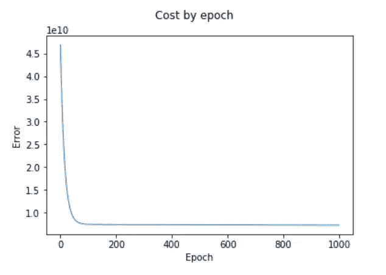
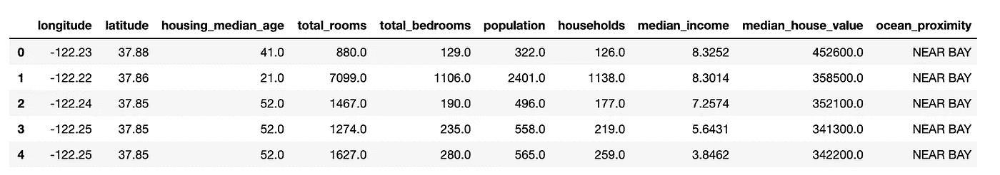
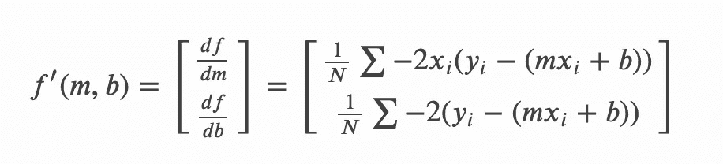
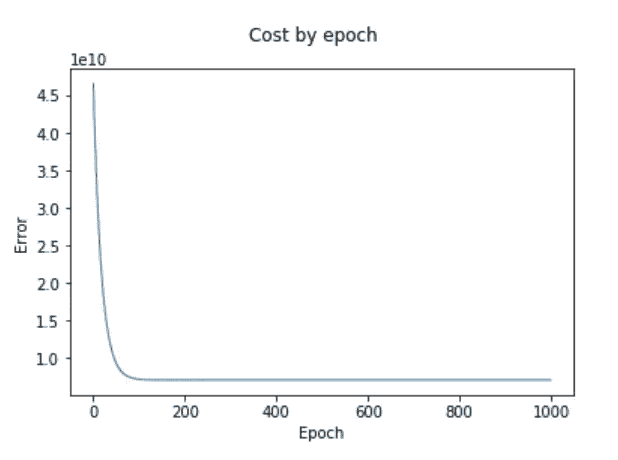

# 从头开始用梯度下降拟合线性回归模型

> 原文：<https://towardsdatascience.com/fit-a-linear-regression-model-with-gradient-descent-from-scratch-d9bb41bc821e?source=collection_archive---------12----------------------->

## 实施梯度下降以找到简单线性回归的最佳权重。



我们都知道 sklearn 可以为我们试衣模特。但是当我们调用`.fit()`时，我们知道它实际上在做什么吗？请继续阅读，寻找答案。

今天我们将编写一组实现梯度下降以拟合线性回归模型的函数。然后，我们将我们的模型的重量与一个合适的 sklearn 模型的重量进行比较。

# **所需背景**

**拟合** =找出模型的偏差和系数，使误差最小化。

**误差** =均方误差(MSE)。数据集内实际值和预测值之间的平方差的平均值。

**简单线性回归** =基于一条线的方程的模型，“y=mx+b”。它将单个特征作为输入，应用偏差和系数，并预测 y。

此外，系数和偏差有时也统称为“权重”。

# 准备数据集

从 [kaggle](https://www.kaggle.com/camnugent/california-housing-prices) 下载加州住房数据集，并将其加载到数据框架中。

```
import pandas as pd
df = pd.read_csv('california-housing-dataset.csv')
df.head()
```



对于这个数据集，我们通常尝试使用所有其他特征来预测`median_house_value`。

但是在我们的例子中，我们关心的是拟合一个简单的线性回归(它只接受一个单一的输入特征)，所以我们将选择`median_income`作为那个特征，忽略其他的。这不会创建可能的最佳模型，但会使梯度下降的实现更简单。

对数据集中的示例进行计数。

```
len(df)
#=> 20640
```

这是大量的数据。让我们把尺寸缩小 75%。

```
df = df.sample(frac=0.25)
len(df)
#=> 5160
```

那更容易管理。

收集我们的输入要素和标注。

```
X = df['median_income'].tolist()
y = df['median_house_value'].tolist()
```

# 用梯度下降拟合线性回归

根据[维基百科](https://en.wikipedia.org/wiki/Gradient_descent)，

> **梯度下降**是一种寻找函数局部极小值的一阶迭代优化算法。为了使用梯度下降找到函数的[局部最小值](https://en.wikipedia.org/wiki/Local_minimum)，在当前点采取与函数的[梯度](https://en.wikipedia.org/wiki/Gradient)(或近似梯度)的*负*成比例的步骤。

**我的翻译:**

梯度下降使用误差函数的梯度来预测系数`m`和偏差`b`应该在哪个方向更新，以减少给定数据集的误差。

单独计算每个权重的梯度`m`和`b`。梯度是通过对所有例子的重量偏导数取平均值来计算的。

梯度的方向和陡度决定了权重的更新方向和更新量。后者也受一个超参数，即学习率的影响。

该算法反复迭代训练集并更新权重，直到代价函数最小。

## 履行

你可以在互联网上找到 MSE 函数的偏导数(如下)，所以我们在这里不推导它。



[Source](https://ml-cheatsheet.readthedocs.io/en/latest/gradient_descent.html)

我们将用下面的代码实现上面的代码，同时遍历数据集。

```
m_gradient += -(2/N) * x * (y - y_hat)
b_gradient += -(2/N) * (y - y_hat)
```

让我们写一个函数，它接受当前的权重、特征、标签和学习率，并输出更新后的权重。

```
def bias_coef_update(m, b, X, Y, learning_rate):
    m_gradient = 0
    b_gradient = 0

    N = len(Y)

    # iterate over examples
    for idx in range(len(Y)):
        x = X[idx]
        y = Y[idx]

        # predict y with current bias and coefficient
        y_hat = (m * x) + b m_gradient += -(2/N) * x * (y - y_hat)
        b_gradient += -(2/N) * (y - y_hat)

    # use gradient with learning_rate to nudge bias and coefficient
    new_coef = m - (m_gradient * learning_rate)
    new_bias = b - (b_gradient * learning_rate)

    return new_coef, new_bias
```

该函数的后半部分将梯度乘以学习率，并使用结果来更新当前权重。学习率越高，模型拟合得越快，代价是找到精确的局部最小值(注意:它实际上永远不会达到真正的最小值)。

编写另一个函数，迭代应用上述函数一个设定的历元数。这是一种不太复杂的方法(为了简单起见),比在某个预定的梯度陡度返回拟合的权重要简单。

```
def run(epoch_count=1000):
    # store output to plot later
    epochs = []
    costs = []

    m = 0 
    b = 0 
    learning_rate = 0.01 for i in range(epoch_count):
        m, b = bias_coef_update(m, b, X, y, learning_rate)
        print(m,b)

        C = cost(b, m, x_y_pairs)

        epochs.append(i)
        costs.append(C)

    return epochs, costs, m, bepochs, costs, m, b = run()
```

让我们输出拟合模型的最终成本和权重。

```
print(m)
print(b)
print(costs[-1])# I've rounded these myself so they're nicer to look at
#=> 46,804
#=> 19,963
#=> 7,261,908,362
```

并绘制出它是如何随着时代而改进的。

```
import matplotlib.pyplot as pltplt.xlabel('Epoch')
plt.ylabel('Error')
plt.suptitle('Cost by epoch')plt.plot(epochs,costs, linewidth=1)
```



酷毙了。我们可以看到它的大部分进步都是在前 100 个纪元内取得的。

# 用 Sklearn 拟合线性回归

现在，我们将在装有 sklearn 的模型中检查相同的值。

重塑要素。

```
import numpy as np
X_array = np.array(X).reshape(5160,1)
```

符合模型。

```
from sklearn.linear_model import LinearRegression
model = LinearRegression()
model.fit(X_array,y)
```

检查重量和误差。

```
from sklearn.metrics import mean_squared_errorm = model.coef_[0]
b = model.intercept_mse = mean_squared_error(y_test, y_pred, sample_weight=None, multioutput='uniform_average')print(m)
print(b)
print(mse)# rounded
#=> 42,324
#=> 41,356
#=> 7,134,555,443
```

# 我们表现如何？

Sklearn 的调音以微弱优势超过我们，`7,134,555,443`对`7,261,908,362`，但我们非常接近。

我们的偏见也与 sklearn 发现的偏见大相径庭，`41,356` VS `19,963`。

不用深入研究每个时期后值是如何变化的(这很容易做到)，我想我们可以通过降低学习率和增加时期的数量来改进我们的模型。