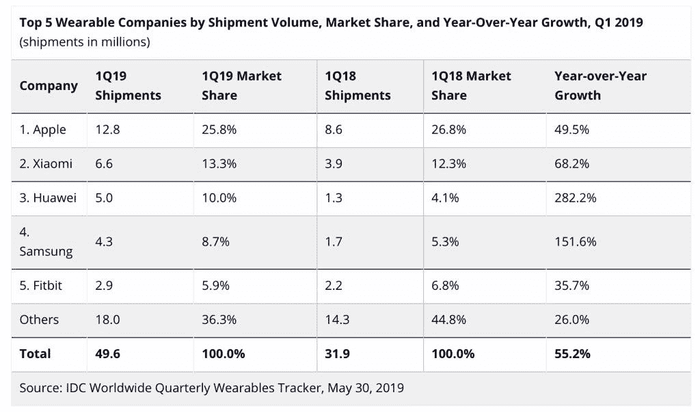
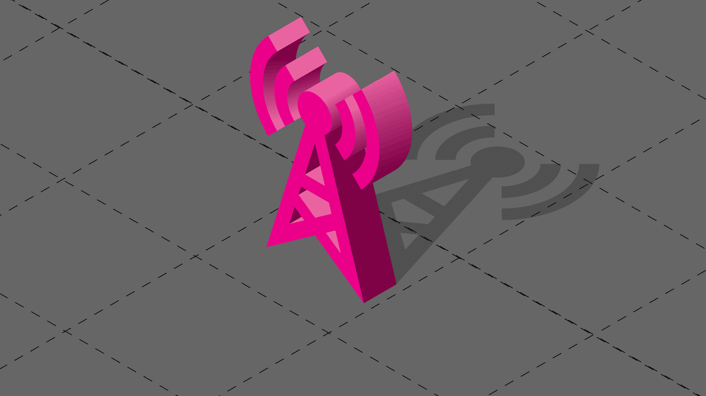

# Fitbit + Google AI + 5G =？

> 原文：<https://towardsdatascience.com/fitbit-google-ai-5g-e6764d39e44e?source=collection_archive---------28----------------------->

Brussels marathon runners — Photo by [@mzemlickis](https://unsplash.com/@mzemlickis)

## 谷歌以 21 亿美元收购 Fitbit

the Verge 发表的一篇文章 2019 年 11 月 1 日宣布谷歌收购 FitBit:

> [谷歌刚刚宣布以 21 亿美元](https://blog.google/products/hardware/agreement-with-fitbit?_ga=2.109995341.918473813.1572613323-1996097189.1566566630)收购可穿戴公司 Fitbit [。在宣布这一消息的博客文章中，谷歌设备和服务 SVP 公司的里克·奥斯特洛表示，收购 Fitbit 是“一个在 Wear OS 上进行更多投资以及将谷歌可穿戴设备引入市场的机会。”](https://investor.fitbit.com/press/press-releases/press-release-details/2019/Fitbit-to-Be-Acquired-by-Google/default.aspx)

这可能是一项复杂的投资，但我看到了一些关于为何进行此次收购的不同观点:

*   谷歌希望投资可穿戴设备，但未能独自开发出足够可行的解决方案。因此，它收购 FitBit 是为了提供这种服务。
*   谷歌收购 FitBit 是为了专有技术。
*   谷歌收购 FitBit 是为了它的数据——不是为了增加广告，而是为了协助其在健康技术方面的投资(这构成了 Alphabet 投资组合的很大一部分)。

可能有更多的原因，然而，在保护消费者健康数据方面，消费者似乎有很强的意识。11 月 1 日直接来自 FitBit 的声明如下:

> “消费者信任对 Fitbit 至关重要。强有力的隐私和安全指导方针从第一天起就是 Fitbit DNA 的一部分，这一点不会改变。Fitbit 将继续让用户控制他们的数据，并将对其收集的数据及其原因保持透明。该公司从不出售个人信息，Fitbit health and wellness 数据也不会用于谷歌广告。”

Rick Osterloh，谷歌设备与服务高级副总裁。表示他们将把 FitBit 在硬件方面的人才与软件和人工智能结合起来，打造更好的可穿戴设备。

与此同时，拥有谷歌的 Alphabet 正在扩大对 Verily 和 Calico 的投资。这是 Alphabet Inc .的季度报表中反复提到的两家公司。健康数据是一个热门话题。

> 尽管谷歌可能不会将 FitBit 数据用于广告，但它很可能会将这些聚合数据用于 Verily 和 Calico 的药物开发或健康洞察。是什么阻止了 Google/Alphabet 这样做？

我从 Alphabet 的[投资者关系页面](https://abc.xyz/investor/static/pdf/20191028_alphabet_10Q.pdf?cache=376def7)的 2019 年第三季度(Q3)页面中获取了一份描述。以下两节摘自 Q3。

## *印花布*

*Calico 是一家生命科学公司，其使命是利用先进技术来增加我们对控制寿命的生物学的了解。*

【2014 年 9 月，艾伯维公司(AbbVie)和 Calico 签署了一项研发合作协议，旨在帮助两家公司发现、开发和向市场推出针对年龄相关疾病患者的新疗法，包括神经退行性疾病和癌症。在 2018 年第二季度，艾伯维和 Calico 修订了合作协议，导致总承诺量增加。截至 2019 年 9 月 30 日，艾伯维已根据协议出资 7.5 亿美元资助合作，并承诺额外出资 5 亿美元，将于 2019 年第四季度支付。截至 2019 年 9 月 30 日，Calico 已出资 5 亿美元，并承诺追加 7.5 亿美元。

*Calico 利用其科学专业知识建立了世界级的研发机构，专注于药物发现和早期药物开发；艾伯维提供科学和临床开发支持及其商业专业知识，将新发现推向市场。两家公司平等分享本协议项下项目的成本和利润。艾伯维的出资在 Calico 的财务报表中被记录为负债，由于 Calico 产生了符合条件的研发费用，因此该负债被减少并反映为研发费用的减少。*

*截至 2019 年 9 月 30 日，我们已向 Calico 出资 4.8 亿美元，以换取 Calico 可兑换优先股单位，并承诺根据需要和特定条件额外出资 7.5 亿美元。*

## *的确*

*Verily 是一家生命科学公司，其使命是利用世界健康数据，让人们享受更健康的生活。2018 年 12 月，Verily 获得了 10 亿美元投资轮的 9 亿美元现金。剩余的 1 亿美元于 2019 年第一季度收到。截至 2019 年 9 月 30 日，Verily 已从向外部投资者出售股权证券中获得总计 18 亿美元的收入。这些交易作为权益交易入账，没有确认任何收益或损失。*

## 你对 21 亿美元有什么期待？

当你以难以想象的金额(对大多数人来说)收购一家公司时，预期投资回报并非不可思议。

另据[Quartz](https://qz.com/1675133/alphabet-q2-2019-earnings-show-non-google-revenue-lags/):**Alphabet**报道称，来自谷歌广告业务的**收入**为 326 亿美元，比去年同期增长了约 16%

尽管 Alphabet 收益丰厚，但这是一个相当大的赌注。自 2015 年首次公开募股以来，Fitbit 的股票下跌了[~ 80](https://www.forbes.com/sites/greatspeculations/2019/11/01/will-fitbit-be-better-off-with-google/#6151dfd040a2)。

在收购之前的几年里，FitBit 的销售额和收入似乎一直在下降。

谷歌正在购买进入可穿戴设备市场的方式，并可能大幅增加 FitBit 的扩张以及该平台的可能性。

Retrieved from [IDC](https://venturebeat.com/2019/05/30/idc-apple-still-led-wearables-market-in-q1-2019-but-huawei-grew-282/) on the 2nd of November

## FitBit + 5G

这个赌注会有回报吗？有关系吗？这为理解人类提供了更多的力量，这无疑是谷歌成功的一部分。

亚马逊 Alexa 可能会和你说话，但随着 5G 的发展，在你身上安装一个可以做到这一点的设备，同时持续传输结果可能会达到更高的程度。

今年早些时候，有人预测 5G 将提振 FitBit 的股价:

> “通过让可穿戴设备做更多的事情，让它们变得更加不可或缺，5G 将让可穿戴设备变得更加流行和有价值，提振这些公司的财务状况。"

5G 的到来还将使可穿戴设备能够更精确地监测个人的身体、情感和精神健康。

换句话说，谷歌的这项投资有望获得回报。

*这里是#500daysofAI，您正在阅读的是第 152 条。500 天来，我每天都写一篇关于人工智能或与之相关的新文章。*