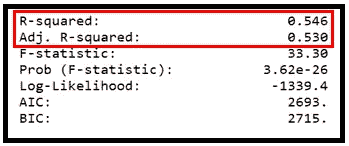

# 基于计数的数据拟合线性回归模型

> 原文：<https://towardsdatascience.com/fitting-linear-regression-models-on-counts-based-data-ba1f6c11b6e1?source=collection_archive---------6----------------------->


[pxhere.com](http://pxhere.com)

## Python 中的实践者指南和分步教程

## 本文的重点

我们将讨论三个主题:

*   拟合一个线性回归模型，特别是一个基于计数的数据的线性回归模型，是明智的吗？
*   如何在基于计数的真实数据集上配置和拟合 OLS 模型。
*   与主流回归模型相比，OLS 的表现如何，比如**泊松**和**负二项分布**？

## 什么是基于计数的数据？

基于计数的数据集包含一些事件的发生，如在英仙座流星雨事件中你发现流星的所有时间，或更实际的事情，如汽车在加油站停下的时间。

基于计数的数据集出现在各种领域，例如:

*   **人类行为和心理:**例如，一个时间序列的数据点(每小时捕获一次)，包含我每小时查看电子邮件的次数。
*   **制造和零售:**每小时的时间序列，包含该小时制造或销售的小部件数量。
*   **餐饮服务:**一个日期的时间序列，其中每个数据点包含[木瓜大王](https://www.papayaking.com/)当天提供的热狗数量。
*   **云基础设施:**你的电子商务网站宕机的所有时间。
*   科学:自 1988 年以来发现系外行星的所有日期。

关于 counts 数据集，我们马上就能看到三件事:

1.  数据是整数，即没有负数。
2.  它经常是偏斜的，因此不是正态分布的，而且
3.  它可以非常稀少。

这种数据集通常需要特殊的处理和专门的回归技术。


The Perseids radiating from the constellation Perseus ([US National Park Service](https://www.nps.gov/whsa/learn/news/nr08072019.htm))

## 关于 OLS 的快速复习

> **O**d**L**东 **S** 方( **OLS** )线性回归模型的工作原理是将一个 n 维线性函数拟合到 n 维数据上，使拟合值与实际值之间的平方和最小化。

由于数据的偏斜度和稀疏度，以及回归误差的异方差性，即误差的方差不是常数，而是相关计数变量的函数，基于 OLS 的线性回归模型在基于计数的数据上可能会失败。

此外，OLS 生成负预测和分数预测的倾向会导致数据计数的预测看起来很尴尬。

那么，为什么要为这些数据费心摆弄线性回归模型呢？我们很快就会看到，这样做有一些强有力的理由。

## 为计数数据建立使用 OLS 回归的案例

在之前的一组文章中，我展示了如何为基于计数的数据集训练以下两个常用的回归模型:

*   [**泊松回归模型**](/an-illustrated-guide-to-the-poisson-regression-model-50cccba15958)
*   [**负二项回归模型**](/negative-binomial-regression-f99031bb25b4)

在这些文章中，我们根据布鲁克林大桥上骑自行车的人的真实数据来训练和测试这些模型:


Source: [Bicycle Counts for East River Bridges](https://data.cityofnewyork.us/Transportation/Bicycle-Counts-for-East-River-Bridges/gua4-p9wg) (NYC OpenData) (Image by [Author](https://sachin-date.medium.com/))

尽管泊松和 NB 模型表现得“如广告所说”:


Negative Binomial regression model’s predictions (Image by [Author](https://sachin-date.medium.com/))

…我们还想知道以下内容:

*   是否有可能使用**O**r**L**东 **S** 方回归技术成功地对基于计数的数据进行建模？
*   如何判断对给定的基于计数的数据集使用 OLS 回归的适当性？如何在这样的数据集上测量 OLS 回归的性能？
*   **在拟合优度和预测能力方面，不起眼的 OLS 模型如何与更复杂的模型相媲美，如** [**泊松**](/an-illustrated-guide-to-the-poisson-regression-model-50cccba15958) **和** [**NB**](/negative-binomial-regression-f99031bb25b4) **？**

我们将在本文中回答这些问题。

总的来说，我们会看到两件事:

*   OLS 模型可以作为一个好的快速基线模型，同时为计数数据集建立更复杂的回归模型。
*   我们还将看到，对于此类数据集，OLS 模型中最具统计意义的回归参数也是泊松和 NB 模型中最具统计意义的回归参数。卡梅伦和特里维迪在他们被大量引用的著作《计数数据回归分析》中对这一发现背后的数学原理做了精彩的解释。

在整篇文章中，我们将使用纽约自行车数据集，以便我们可以对 OLS 与[泊松](/an-illustrated-guide-to-the-poisson-regression-model-50cccba15958)和 [NB](/negative-binomial-regression-f99031bb25b4) 车型进行比较。

## 文章的布局

1.  我们将对自行车统计数据集进行 **E** 探索 **D** ata **A** 分析( **EDA** )，以判断 OLS 的适用性，并查看是否需要进行任何数据转换。
2.  使用 *Python* 、 *Pandas* 和 *statsmodels* ，我们将在这个数据集上构建、训练和测试一个 OLS 模型。
3.  我们将比较 OLS 回归模型与泊松和 NB 模型的性能。

## 建议(但非必需)阅读

[泊松回归模型图解指南](/an-illustrated-guide-to-the-poisson-regression-model-50cccba15958)

[负二项式回归:逐步指南](/negative-binomial-regression-f99031bb25b4)

## 骑自行车者计数数据集的探索性数据分析

下表包含了骑自行车的人在纽约市各种桥梁上行驶的次数。从 2017 年 4 月 1 日到 2017 年 10 月 31 日每天测量计数。我们会集中在布鲁克林大桥上。


Source: [Bicycle Counts for East River Bridges](https://data.cityofnewyork.us/Transportation/Bicycle-Counts-for-East-River-Bridges/gua4-p9wg) (NYC OpenData) (Image by [Author](https://sachin-date.medium.com/))

`I have cut out the Brooklyn Bridge counts into a separate data set. This data set is available for download [**over here**](https://gist.github.com/sachinsdate/c17931a3f000492c1c42cf78bf4ce9fe).`

以下是该数据集的前几行:


(Image by [Author](https://sachin-date.medium.com/))

让我们将数据加载到一个 *pandas* 数据框中，并绘制 BB_COUNT 变量:

```
import pandas as pdfrom matplotlib import pyplot as pltdf = pd.read_csv('nyc_bb_bicyclist_counts.csv', header=0, infer_datetime_format=True, parse_dates=[0], index_col=[0])fig = plt.figure()fig.suptitle('Bicyclist counts on the Brooklyn bridge')plt.xlabel('Date')plt.ylabel('Count')actual, = plt.plot(df.index, df['BB_COUNT'], 'go-', label='Count of bicyclists')plt.legend(handles=[actual])plt.show()
```

时间序列图如下所示:


Time series plot of the number of bicyclists on the Brooklyn bridge (Image by [Author](https://sachin-date.medium.com/))

让我们也创建一个直方图，看看这个数据集是如何正态分布的:

```
plt.hist(df['BB_COUNT'], bins=20)plt.show()
```


Histogram of counts (Image by [Author](https://sachin-date.medium.com/))

不出所料，骑自行车的人的统计数据是有偏差的。让我们打印出一些描述性的统计数据:平均值、中位数、[偏斜度](https://en.wikipedia.org/wiki/Skewness)和[峰度](https://en.wikipedia.org/wiki/Kurtosis)。

对于偏度和峰度，我们将对 BB_COUNT 变量运行 [**Jarque-Bera 正态性测试**](/testing-for-normality-using-skewness-and-kurtosis-afd61be860) 。

> ***相关帖子:*** [*使用偏度和峰度测试正态性*](/testing-for-normality-using-skewness-and-kurtosis-afd61be860)

JB 检验不仅会给出偏度和峰度，还会检验偏离正态性是否具有统计显著性。

```
**from** statsmodels.stats.stattools **import** jarque_bera **as** jb**from** statsmodels.stats.stattools **import** omni_normtest **as** omb**from** statsmodels.compat **import** lzipprint('**Mean**='+str(round(df['BB_COUNT'].**mean**(), 2)))print('**Median**='+str(round(df['BB_COUNT'].**median**(), 2)))name = ['Jarque-Bera', 'Chi^2 two-tail probability', 'Skewness', 'Kurtosis']test_results = jb(df['**BB_COUNT**'])lzip(name, test_results)
```

这会产生以下输出:

```
Mean=2680.04Median=2857.0[('**Jarque-Bera**', 30.572383357990116), ('**Chi^2 two-tail probability**', 2.2976893142533207e-07), ('**Skewness**', -0.8746427375174667), ('**Kurtosis**', 3.6071892903122973)]
```

> 平均值和中间值没有很大的不同，这表明分布不是很不平衡。

正如所料，测试报告的偏斜度是负的，而且很小。相比之下，正态分布的偏斜度为零。测试报告的过度峰度(=峰度-3.0)也非常小。相比之下，正态分布的峰度为 3.0，而**过度**峰度为零。

另一方面，Jarque-Bera 测试的 t 统计值 30.57 将其置于卡方(2)的 PDF 的**正态性拒绝区**(见下图)。


Acceptance and rejection zones for the Null hypothesis in the Chi-squared(2) PDF for two-tailed α=0.05 (Image by [Author](https://sachin-date.medium.com/))

> 因此我们**拒绝**数据正态分布的零假设 h0，而**接受**数据不正态分布**。**

**在这一点上，我们可以接受少量的偏斜，并在其上拟合一个 OLS 模型，或者我们可以尝试修复偏斜。后者可以通过对因变量 BB_COUNT 进行对数变换或平方根变换来尝试。**

**我们将尝试这两种转换方法，看看是否会产生预期的结果。**

**我们将向数据框添加两个新列:一个 LOG(BB_COUNT)列和一个 SQRT(BB_COUNT):**

```
import numpy as np#Add a column to the Data Frame that contains log(BB_COUNT):
df['LOG_BB_COUNT'] = np.log(df['BB_COUNT'])#All another column containing sqrt(BB_COUNT)
df['SQRT_BB_COUNT'] = np.sqrt(df['BB_COUNT'])
```

**让我们对 LOG 和 SQRT 列再次运行 Jarque-Bera:**

```
name = ['**Jarque-Bera**', '**Chi^2 two-tail probability**', '**Skewness**', '**Kurtosis**']test_results = omb(df['LOG_BB_COUNT'])lzip(name, test_results)test_results = omb(df['SQRT_BB_COUNT'])lzip(name, test_results)
```

**这会打印出以下内容:**

```
[('**Jarque-Bera**', 888.0352308852536), ('**Chi^2 two-tail probability**', 1.4641977846577634e-193), ('**Skewness**', -2.5832340081063463), ('**Kurtosis**', 11.538169851408346)][('**Jarque-Bera**', 135.86010800784334), ('**Chi^2 two-tail probability**', 3.15030346376236e-30), ('**Skewness**', -1.5270456576564704), ('**Kurtosis**', 5.430879236979477)]
```

**让我们将这些发现与未转换的 BB_COUNT 的正态性度量进行比较:**

```
[('**Jarque-Bera**', 30.572383357990116), ('**Chi^2 two-tail probability**', 2.2976893142533207e-07), ('**Skewness**', -0.8746427375174667), ('**Kurtosis**', 3.6071892903122973)]
```

****

**(Image by [Author](https://sachin-date.medium.com/))**

**似乎不太顺利，是吧？！转换 BB_COUNT 不仅没有修复偏斜，实际上**使数据更加偏斜！**从这次转型事故中可以学到一些东西:**

> **人们应该抵制诱惑，不仔细检查数据转换对数据的影响，就盲目接受任何数据转换的结果。**

## **我们又回到起点了吗？**

**事实上，恰恰相反。我们从对数据进行 ed a 中获益良多。我们最大的收获是认识到我们不应该再花更多的时间去尝试修复数据集中存在的少量偏度和峰度。**

**此外，因变量的正态性不是进行 OLS 回归的先决条件。过度偏离因变量的正态性只会使 OLS 估计量有可能(但不一定)产生有偏拟合。**

**因此，让我们承担接受偏态的计算风险，并在原始的、未转换的骑自行车者计数数据上拟合 OLS 回归模型。**

## **我们的回归目标和回归策略**

> **我们的回归目标是预测任何一天有多少骑自行车的人穿过布鲁克林大桥。**

**我们的**回归策略**将是建立和训练一个 OLS 回归模型，其中:**

1.  ****回归变量**将是 ***X*** 矩阵中的变量(见下图)，加上一些额外的派生变量，我们将把它们添加到 ***X*** (我们将在几秒钟后看到如何做)。**
2.  **回归的因变量 ***y*** 将是骑自行车的人数(我们数据集中的 BB_COUNT 列)。**

****

**The slice of the bicyclist counts data set showing the regression variables matrix **X** and the vector of counts **y** (Image by [Author](https://sachin-date.medium.com/))**

**一旦模型经过训练，我们将在维持测试数据集上测试其性能，该数据集是模型在训练期间未显示的数据。**

## **使用 Python、Pandas 和 Statsmodels 将 OLS 回归模型拟合到 counts 数据集的分步指南**

**我们将从导入所有需要的包开始。**

```
**import** pandas as pd**from** patsy **import** dmatrices**import** numpy **as** np**import** statsmodels.api **as** sm**import** statsmodels.formula.api **as** smf**import** matplotlib.pyplot **as** plt
```

**让我们将数据集读入熊猫数据帧:**

```
df = pd.read_csv('nyc_bb_bicyclist_counts.csv', header=0, infer_datetime_format=True, parse_dates=[0], index_col=[0])
```

**我们将向 **X** 矩阵添加一些派生的回归变量。**

```
ds = df.index.to_series()df['MONTH'] = ds.dt.monthdf['DAY_OF_WEEK'] = ds.dt.dayofweekdf['DAY'] = ds.dt.day
```

**以下是熊猫数据框的前几行，左侧显示了回归变量和 BB_COUNT 因变量:**

****

**Pandas Data Frame (Image by [Author](https://sachin-date.medium.com/))**

**让我们创建训练和测试数据集。**

```
mask = np.random.rand(len(df)) < 0.8df_train = df[mask]df_test = df[~mask]print('Training data set length='+str(len(df_train)))print('Testing data set length='+str(len(df_test)))
```

**在 [patsy](https://patsy.readthedocs.io/en/latest/quickstart.html) 符号中设置回归表达式。我们告诉 patsy，BB_COUNT 是我们的因变量，它取决于回归变量:DAY、DAY_OF_WEEK、MONTH、HIGH_T、LOW_T 和 PRECIP:**

```
expr = 'BB_COUNT ~ DAY  + DAY_OF_WEEK + MONTH + HIGH_T + LOW_T + PRECIP'
```

**为训练和测试数据集设置 **X** 和 **y** 矩阵。patsy 让这变得非常简单:**

```
y_train, X_train = dmatrices(expr, df_train, return_type='dataframe')y_test, X_test = dmatrices(expr, df_test, return_type='dataframe')
```

**配置并适应 OLSR 模型。在 *statsmodels* 中，这是一行代码:**

```
olsr_results = smf.ols(expr, df_train).fit()
```

**打印回归输出:**

```
print(olsr_results.summary())
```

**它打印出以下内容:**

****

**Summary of the fitted OLSR model (Image by [Author](https://sachin-date.medium.com/))**

**我们稍后将检查回归输出的单个元素。同时，让我们根据测试数据生成模型的预测:**

```
olsr_predictions = olsr_results.get_prediction(X_test)
```

**让我们把它们打印出来:**

```
predictions_summary_frame = olsr_predictions.summary_frame()print(predictions_summary_frame)
```

**以下是最初的几个预测计数:**

****

**Predicted values (Image by [Author](https://sachin-date.medium.com/))**

**注意**预测计数不是整数**，这是将线性回归模型应用于基于计数的数据的典型缺点。在这种情况下，我们可以通过向上舍入或向下舍入预测来解决这个缺点。**

**让我们也画出预测值和实际值。**

```
predicted_counts=predictions_summary_frame['mean']actual_counts = y_test['BB_COUNT']fig = plt.figure()fig.suptitle('Predicted versus actual bicyclist counts on the Brooklyn bridge')predicted, = plt.plot(X_test.index, predicted_counts, 'go-', label='Predicted counts')actual, = plt.plot(X_test.index, actual_counts, 'ro-', label='Actual counts')plt.legend(handles=[predicted, actual])plt.show()
```

****

**The plot of actual versus predicted counts (Image by [Author](https://sachin-date.medium.com/))**

**注意**一个预测的骑自行车的人数是负的**。当应用于基于计数的数据时，这是线性回归模型的另一个经典缺点。在某些情况下，我们可以通过简单地将负值四舍五入为零来解决这个缺点。**

## **解读 OLSR 模型的结果**

**抛开产生分数计数和负数计数的倾向，让我们客观地评估一下我们的 OLS 回归模型在自行车计数数据集上的表现。**

****检验回归参数的显著性:****

****

***Parameter significance using the two-tailed t-test* (Image by [Author](https://sachin-date.medium.com/))**

****t 检验**显示**所有回归参数分别*和*统计显著**。在双尾 [t 检验](https://en.wikipedia.org/wiki/Student%27s_t-test)中，每个参数的 t 统计的绝对值在 95%显著性水平上大于指定的阈值 t 值。**

**接下来，让我们检查 F 统计量:**

****

**The F-test for regression analysis (Image by [Author](https://sachin-date.medium.com/))**

**F-stat 的 p 值 3.26E-26 远小于具有 6 个自由度的卡方分布的 0.025 误差阈值，表明**所有回归参数都*共同*显著**。**

> *****相关帖子:*** [*回归分析的 f 检验*](/fisher-test-for-regression-analysis-1e1687867259)**

****最重要的 R 平方值:****

****

**R-squared (Image by [Author](https://sachin-date.medium.com/))**

****Adjusted-R** 是对 **R** 的一个小修正，以说明在进行估算时损失了 7 个自由度，即 6 个回归变量+截距)。**

> ****0.530** 的调整后 R 告诉我们，OLSR 模型能够解释骑自行车者数量因变量中超过 50%的方差。**

**顺便说一句，如果我们对模型本身的选择是错误的，那么 R 的值就没有意义了！但到目前为止，我们还没有看到 OLS 出现这种情况的任何迹象。**

**让我们再检查一下 OLS 回归模型的两件事:**

1.  ****残差的正态性:**如果我们发现模型的残差不是正态分布的，我们就不能相信模型预测的 F 统计量或置信区间。**
2.  ****残差间的自相关:**时间序列中的自相关是指时间序列中的值与同一时间序列中的先前值相关。如果我们在模型的残差中发现显著的自相关，这表明我们遗漏了重要的回归变量，导致相关计数变量中的一些“信号”泄漏到残差中。这是一个严重指定的 OLSR 模型的迹象。**

**为了检查回归的残差是否是正态分布的，并且它们不是自相关的，我们需要查看 OLS 模型摘要的页脚部分。页脚部分显示了回归残差的正态性检验和自相关性检验的结果。**

****

**(Image by [Author](https://sachin-date.medium.com/))**

****残差的正态性:****

**Jarque-Bera 的残差正态性检验统计量为 11.917，将其置于卡方(2) PDF 的**正态性拒绝区域**。综合 K 平方检验的统计值 7.347 刚好跨越了正态性拒绝区的边界。见下图:**

****

**Acceptance and rejection zones for the Null hypothesis in the Chi-squared(2) PDF for two-tailed α=0.05 (Image by [Author](https://sachin-date.medium.com/))**

**JB 和正态性综合检验告诉我们的是 OLSR 残差不是正态分布的。同时，残差的极低偏斜度(0.147)以及综合统计量处于卡方(2) PDF 的正态/非正态边界意味着误差接近正态分布。残余误差的直方图直观地证实了这一判断:**

```
plt.hist(olsr_results.resid, bins=20)plt.show()
```

****

**Histogram of residual errors (Image by [Author](https://sachin-date.medium.com/))**

**请注意误差在零均值附近或多或少呈正态分布。**

**这是残差的 Q-Q 图，在很大程度上看起来也是线性的:**

```
fig = sm.qqplot(olsr_results.resid)plt.show()
```

****

**Q-Q plot of the residual errors of OLSR (Image by [Author](https://sachin-date.medium.com/))**

**总之，我们的结论是，OLS 回归模型的残差大体上正态分布在一个零均值附近。**

****残差的自相关:****

**Durbin-Watson 检验让我们了解了残差是否是自相关的。显著小于 2 的 DW 测试值表示显著的自相关。在这种情况下，DW 检验的值是 1.772，这意味着在回归的残差中没有强自相关的证据。**

****

**(Image by [Author](https://sachin-date.medium.com/))**

**我们还可以通过绘制残差的 ACF 图来验证自相关的缺失:**

```
**from** statsmodels.graphics.tsaplots **import** plot_acfplot_acf(olsr_results.resid, title='ACF of residual errors')plt.show()
```

****

**Auto-correlation plot of residual errors of the OLSR model (Image by [Author](https://sachin-date.medium.com/))**

**正如所料，ACF 图显示残差之间没有显著的自相关**

> **总而言之，OLS 模型似乎已经最佳地拟合了数据，没有系统性的信息泄漏到模型的误差中。**

**最后，让我们比较一下 OLSR 模型与泊松和 NB 回归模型的性能，这两个模型在我之前的两篇关于基于计数的数据的回归模型的文章中都有涉及。**

## ****OLSR 与泊松和负二项模型的比较****

**如果我们对所有三个模型的回归参数——OLS、泊松、负二项式——在相同的自行车计数数据集上进行并排比较，我们会看到*OLSR 发现的最重要的参数(从参数的 t 统计的绝对值来看)也是其他两个模型确定的最重要的参数*。**

**见下图。我根据 T 值注释了前三个重要参数:PRECIP、HIGH_T 和 LOW_T。它们在所有三个模型中都是相同的:**

****

**A comparison of parameter significance among OLS, Poisson and NB models (Image by [Author](https://sachin-date.medium.com/))**

****OLSR、泊松和 NB 模型的拟合优度比较:****

**让我们来看看 OLSR 模型与泊松和 NB 模型相比，对骑自行车者计数数据的拟合程度如何。**

**让我们再一次将 OLS 结果与泊松和 NB 回归结果放在一起。(你可能想参考我关于[泊松](/an-illustrated-guide-to-the-poisson-regression-model-50cccba15958)和 [NB 回归](/negative-binomial-regression-f99031bb25b4)模型的文章，了解如何使用 statsmodels 得到泊松和 NB 回归模型的结果)。**

****

**(Image by [Author](https://sachin-date.medium.com/))**

**使用最大对数似然作为拟合优度的卷尺**，**我们看到:**

*   ****NB 车型排名第一**最高最大 LL-1309.6，**
*   ****OLSR 车型以-1339.4 的最高 LL 值意外获得第二名**。**
*   ****泊松回归模型以-12616.0 的成绩远远排在第三位**。**

****

**Goodness-of-fit rankings as per Maximum Log-Likelihood (Image by [Author](https://sachin-date.medium.com/))**

**这就完成了我们对符合骑自行车者计数数据集的 OLSR 模型的分析，以及它与泊松和负二项式回归模型的性能比较。**

**以下是本文中使用的完整 Python 源代码:**

## **四个关键要点**

*   **尽管计数数据存在偏斜，且 OLSR 模型有产生负数和小数计数的倾向，*对于基于计数的数据集而言，OLSR 模型可能是一个可行的回归模型*。**
*   **仅仅因为 OLSR 模型在自行车计数数据集上表现良好，*OLSR 模型并不总是在所有计数数据集上都表现得很好*。OLS 回归在计数数据上的固有弱点必然会在更具“挑战性”的数据集上显现出来。**
*   **然而，*OLSR 模型可以作为基于计数的数据*的合理基线模型，它可以为我们*提供一种方法，快速测试哪些模型参数对基于计数的数据建模最具统计意义*。**
*   **OLSR 模型也给了我们一种客观地比较好(或坏)多少的方法。)是一种复杂的基于计数的模型，如泊松模型、负二项式模型、梯度推进决策树模型或基于计数数据集的递归神经网络模型，有时会产生令人惊讶的结果。**

***感谢阅读！我撰写关于数据科学的主题，重点是时间序列分析和预测。***

***如果你喜欢这篇文章，请关注我的*[***Sachin Date***](https://timeseriesreasoning.medium.com)*获取关于如何使用 Python 进行时间序列分析和预测的技巧、操作方法和编程建议。***