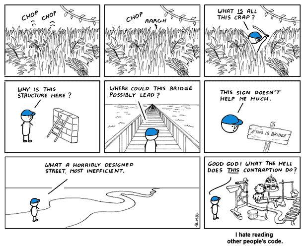

# 伟大 R 程序员的五种行为

> 原文：<https://towardsdatascience.com/five-behaviors-of-great-coders-65317395e16?source=collection_archive---------12----------------------->

## 有这么多的人加入数据科学的行列，你如何从其他人中辨别出一个伟大的 R 程序员呢？

在新的数据科学时代，每个人都在赶时髦。招聘人员收到的简历和履历表中包含了所有的术语:R、Python、Javascript 等等。在许多情况下，人们会在大学一周的课程或几次*数据营*课程的基础上，将一项技能写进简历。

确定某人在特定编程语言方面的技能的最好方法是给他们设置一个任务，然后看看他们做得如何。在这些事情上，你不能只相信口口相传，你真的不希望你的团队或组织中有人在你需要的关键技能上达不到要求。

设置实用的编码练习有两个好处。首先，您可以测试个人是否知道如何处理和解决手头的问题，并能在工作中独立行事。第二，您可以识别编码行为，这些行为表明编码人员技术高超。

这里有五种特别针对 R 程序员的行为，我相信其中许多行为适用于其他各种编程语言:

## 评论

不管是什么语言，伟大的编码者都经常做好注释。这表明了对再现性的关注，也可能表明他们从经验中知道评论的重要性。

在哪里以及多久评论一次是一个判断的问题，取决于任务的复杂性，但是伟大的程序员会在一个合理详细的层次上评论。例如:

```
# load libraries
library(dplyr)#' Function to search starwars names by first letter of name
#'
#' [@param](http://twitter.com/param) x Character value to search as first letter
#'
#' [@return](http://twitter.com/return) a vector of namesfirst_letter_char_search <- function(x) {
  starwars %>%
    dplyr::mutate(first_letter = substr(name, 1, 1)) %>%
    dplyr::filter(first_letter == x) %>%
    dplyr::select(name)
}
```

## 格式化

代码格式对于轻松阅读和理解工作非常重要。正确格式化的代码表明编码者花费了时间和精力来确保他或她的代码尽可能的可读，这又影响了可再现性和未来的合作。

良好的格式还表明编码者知道他们语言的格式约定，这通常表明他们在这方面有相当丰富的经验。您将在上面的代码块中看到一些典型的 R 格式约定(尽管根据您查看本文的设备不同，可能不会像我希望的那样呈现)。间距和缩进是强格式最基本的方面。

## 命名空间

这取决于所使用的语言，但是在像 R 这样的语言中，命名空间显示了对编码者工作环境的关注。明确地说，命名空间意味着在代码中同时调用*和*函数及其包，而不仅仅是函数。比如调用`lubridate::ymd()`而不仅仅是`ymd()`。同样，在上面的代码块中，您将看到适当的函数命名空间。

命名空间有两个优点。首先，它防止了来自不同包的两个函数同名的问题。如果你加载两个包，并且它们都有一个共同的函数名，R 将总是使用最近加载的包中的函数，除非你命名你的函数。其次，如果另一个用户正在查看您的代码片段，它可以帮助他们确定需要安装哪些包。

## 码效率

伟大的程序员会关心他们代码和过程的效率。这可以采取多种形式:

*   重复的代码可以被抽象，以便单个功能可以执行重复的工作。更多信息见我的文章[这里](/the-force-is-strong-in-you-if-you-abstract-your-r-code-134ea0869c4)。
*   具有高计算强度的代码可以被重构以减少不必要的重复或低效的操作。
*   处理数据库对象的代码可以尽可能地操纵服务器上的数据，以避免将大量数据带到本地机器上——参见我的另一篇文章[这里](/how-to-write-tidy-sql-queries-in-r-d6d6b2a3e17)。

这可能是识别优秀程序员的一个重要区别。有人提交给我的代码荒谬且毫无意义地低效——用几百行代码完成了几行代码就能完成的事情。同样，我也见过在抽象和效率方面如此优雅的代码，以至于你不得不坐下来欣赏这位大师的作品。

## 打扫

伟大的程序员会自我清理。他们不会将可能与下一个任务冲突或导致安全漏洞的东西留在环境中。我见过的最常见的问题是，人们在获取了他们需要的东西后，却忽略了断开与数据库的连接。我喜欢看到漂亮整洁的代码块，在那里编码员已经打了招呼，说了再见。有礼貌是很好的，即使是数据库。

如果你正在寻找或雇佣程序员，考虑如何设置实践练习来测试他们的技能，看看你是否能发现一些积极的行为。我真的很推荐。

最初我是一名纯粹的数学家，后来我成为了一名心理计量学家和数据科学家。我热衷于将所有这些学科的严谨性应用到复杂的人的问题上。我也是一个编码极客和日本 RPG 的超级粉丝。在[*LinkedIn*](https://www.linkedin.com/in/keith-mcnulty/)*或*[*Twitter*](https://twitter.com/dr_keithmcnulty)*上找我。*

