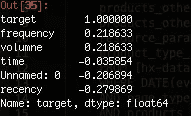

# 数据科学的五个命令行工具

> 原文：<https://towardsdatascience.com/five-command-line-tools-for-data-science-29f04e5b9c16?source=collection_archive---------3----------------------->

## 从终端上你可以做比你想象的更多的数据科学


Photo by [Toa Heftiba](https://unsplash.com/@heftiba?utm_source=unsplash&utm_medium=referral&utm_content=creditCopyText) on [Unsplash](https://unsplash.com/search/photos/five?utm_source=unsplash&utm_medium=referral&utm_content=creditCopyText)

*数据科学最令人沮丧的一个方面是工作时不断在不同工具之间切换。您可以在 Jupyter 笔记本中编辑一些代码，必须在命令行上安装一个新工具，并且可能在 IDE 中编辑一个函数，所有这些都是在处理相同的任务时进行的。有时候，在同一个软件中找到做更多事情的方法是很好的。*

在下面的帖子中，我将列出一些我发现的在命令行上进行数据科学研究的最佳工具。事实证明，通过简单的终端命令可以完成的任务比我最初想象的要多，我想在这里分享一些。

## [卷曲](https://curl.haxx.se/)

这是一个通过各种协议(包括 HTTP)从任何服务器获取数据的有用工具。

我将给出几个获取公开可用数据集的用例。 [UCI 机器学习资源库](https://archive.ics.uci.edu/ml/index.php)是获取机器学习项目数据集的绝佳资源。我将使用一个简单的 curl 命令下载一个来自台湾新竹市输血中心的数据集。如果我们简单地运行`curl [url]`，在我们的例子中是`curl [https://archive.ics.uci.edu/ml/machine-learning-databases/blood-transfusion/transfusion.data](https://archive.ics.uci.edu/ml/machine-learning-databases/blood-transfusion/transfusion.data)`，这将把数据打印到终端。

添加一些额外的参数将使用指定的文件名下载和保存数据。该文件现在可以在您当前的工作目录中找到。

```
curl -o data_dl.csv https://archive.ics.uci.edu/ml/machine-learning-databases/blood-transfusion/transfusion.data
```

为数据科学项目获取数据的另一种常见方法是通过 API。这个工具还支持与 API 交互的`GET`和`POST`请求。运行以下命令将从 [OpenWeatherMap](https://openweathermap.org/api) API 获得一条记录，并保存为一个名为`weather.json`的 JSON 文件。关于 cURL 的更全面的教程，请看这篇优秀的文章。

```
curl -o weather.json -X GET \'https://api.openweathermap.org/data/2.5/weather?lat=37.3565982&lon=-121.9689848&units=imperial&appid=fd4698c940c6d1da602a70ac34f0b147' \-H 'Postman-Token: dcf3c17f-ef3f-4711-85e1-c2d928e1ea1a' \-H 'cache-control: no-cache'
```

## [csvkit](https://csvkit.readthedocs.io/en/latest/tutorial/1_getting_started.html#about-this-tutorial)

csvkit 是一组用于处理 CSV 文件的命令行工具。它可以执行的任务可以分为三个部分:输入、处理和输出。让我们来看一个如何使用它的快速真实示例。

首先让我们使用 pip install 安装工具。

```
pip install csvkit
```

出于这个例子的目的，我将使用我通过上面的 curl 命令从 UCI 机器学习库中创建的同一个 CSV 文件。

首先，让我们使用`csvclean`来确保我们的 CSV 文件格式正确。该函数将自动修复常见的 CSV 错误并删除任何坏行。这个函数的一个有用的方面是，它自动输出一个新的干净的 CSV 文件版本，以便保留原始数据。新文件总是有下面的命名约定`[filename]_out.csv`。如果你希望原始文件被覆盖，你可以添加可选的`-n`参数。

```
csvclean data_dl.csv
```

在我的示例文件中，没有错误，但这是一种非常有用的方法，可以在处理 CSV 文件时进一步减少错误。

现在，假设我们想要快速检查文件。我们可以用`csvcut`和`csvgrep`来做到这一点。

首先让我们打印出列名。

```
csvcut -n data_dl_out.csv | cut -c6-Recency (months)Frequency (times)Monetary (c.c. blood)Time (months)whether he/she donated blood in March 2007
```

现在让我们确定目标列`whether he/she donated blood in March 2007`中有多少个类。

```
csvcut -c "whether he/she donated blood in March 2007" data_dl_out.csv | sed 1d | sort | uniq01
```

`csvgrep`函数允许您基于正则表达式匹配过滤 CSV 文件。

让我们使用这个函数只提取与类 1 匹配的行。

```
csvgrep -c "whether he/she donated blood in March 2007" -m 1 data_dl_out.csv
```

您还可以使用`csvkit`功能执行简单的数据分析。

简单地运行`csvstat data_dl_out.csv`将整个文件的描述性统计数据打印到命令行。您也可以使用可选命令只请求一个统计的结果。

```
csvstat --mean data_dl_out.csv1\. a: 373.52\. Recency (months): 9.5073\. Frequency (times): 5.5154\. Monetary (c.c. blood): 1,378.6765\. Time (months): 34.2826\. whether he/she donated blood in March 2007: None
```

## IPython

IPython 允许从 shell 访问增强的交互式 Python。本质上，这意味着您可以从命令行完成在 Jupyter 笔记本中可以完成的大部分事情。

如果您的终端中还没有它，您可以按照这些[步骤](https://ipython.org/ipython-doc/3/install/install.html)来安装它。

要启动 IPython，只需在命令行输入`ipython`。您现在处于交互式 shell 中。在这里，您可以导入 python 安装的库，我发现这个工具对于在命令行上进行快速数据分析非常有用。

让我们在已经使用的数据集上执行一些基本任务。首先，我将导入 pandas，读入文件并检查前几行数据。

```
import pandas as pddata = pd.read_csv('data_dl_out.csv')data.head()
```

文件列名相当长，所以接下来，我将使用 pandas 对它们进行重命名，然后将结果数据帧导出到一个新的 CSV 文件中，供以后使用。

```
data = data.rename(columns={'Recency (months)': 'recency',
             'Frequency (times)': 'frequency',
             'Monetary (c.c. blood)': 'volumne',
             'Time (months)': 'time',
             'whether he/she donated blood in March 2007': 'target'})data.to_csv('data_clean.csv')
```

作为最后一个练习，让我们使用 pandas `corr()`函数检查特征和目标变量之间的相关性。

```
corr_matrix = data.corr()
corr_matrix['target'].sort_values(ascending=False)
```



要退出 IPython，只需输入`exit`。

## [csvsql](https://csvkit.readthedocs.io/en/1.0.2/scripts/csvsql.html)

有时，您可能还想通过数据库上的 SQL 查询来获取数据集。工具 csvsql 也是 csvkit 工具的一部分，它支持直接在数据库上查询、写入和创建表。它还支持查询 CSV 文件的 SQL 语句。让我们对清理后的数据集运行一个示例查询。

```
csvsql --query  "select frequency, count(*) as rows from data_clean where target = 1 group by frequency order by 2 desc" data_clean.csv
```

## [SciKit-Learn 实验室](https://scikit-learn-laboratory.readthedocs.io/en/latest/)

是的，你可以在命令行执行机器学习！这方面有一些工具，但 SciKit-Learn 实验室可能是最容易使用的工具之一。让我们使用献血数据集建立一个模型。

SciKit-Learn 实验室依赖于将正确的文件放在命名一致的目录中。因此，首先我们将创建一个名为`train`的目录，并将数据文件复制、移动并重命名为`features.csv`。

```
mkdir train
cp data_clean.csv train/features.csv
```

接下来，我们需要创建一个名为`predict-donations.cfg`的配置文件，并将它放在我们的`data`目录中。

```
[General]
experiment_name = Blood_Donations
task = cross_validate[Input]
train_directory = train
featuresets = [["features.csv"]]
learners = ["RandomForestClassifier", "DecisionTreeClassifier", "SVC", "MultinomialNB"]
label_col = target[Tuning]
grid_search = false
objective = accuracy[Output]
log = output
results = output
predictions = output
```

然后我们简单地运行这个命令`run_experiment -l predict-donations.cfg`。

这将自动运行实验，并创建一个包含结果的输出文件夹。

我们可以运行一个 SQL 查询来总结`Blood_Donations_summary.tsv`文件中的结果。

```
cd output< Blood_Donations_summary.tsv csvsql --query "SELECT learner_name, accuracy FROM stdin "\
> "WHERE fold = 'average' ORDER BY accuracy DESC" | csvlook
```

还有许多其他命令行工具对数据科学有用，但我想在这里强调一下我在工作中发现有用的工具。要全面了解命令行中的数据科学，我发现《命令行中的数据科学》这本书非常有用，这本书可以在网上免费获得。