# 你必须能够回答的五个数据科学面试问题

> 原文：<https://towardsdatascience.com/five-data-science-interview-questions-that-you-must-be-able-to-answer-8f2ec53b409a?source=collection_archive---------3----------------------->

## 《亚马逊/网飞/谷歌数据科学家面试问题内部指南》

Photo by [Jon Tyson](https://unsplash.com/@jontyson?utm_source=medium&utm_medium=referral) on [Unsplash](https://unsplash.com?utm_source=medium&utm_medium=referral)

为了不在同一个地方失败两次，并让自己对他人有用，我的这篇文章献给那些想要追随自己成为/提高数据科学家的热情的人。数据科学是一个需要不断提高技能集的领域，同时每天都要开发机器学习算法中的基本概念。所以，事不宜迟，让我们直接进入一些问题和答案，你可能在下次面试中有用。

问 **问题 1** : **你能解释一下决策树的成本函数吗？**

**答案:**在我们回答这个问题之前，需要注意的是，决策树是一种多功能的机器学习算法，可以执行分类和回归任务。因此它们的成本函数也不同。

> 分类类型问题的成本函数:

基尼系数是我们理解成本函数之前的一个重要概念，我先解释一下。

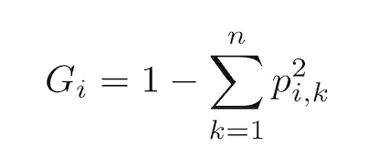

Equation I: Gini Impurity

其中" *p"* 是第 i *个*节点的训练实例中 k 类实例的比率。那是什么意思？下面我们从一个例子来理解。图 1 显示了深度为 2 的 Iris 决策树的简单可视化。顶层是根节点。将训练集分成一组决策的概念在算法中相当简单。这里，举例来说，虹膜数据集被分成两个子集的基础上，一个单一的特征称为“花瓣宽度”在根节点。如果花瓣宽度小于或等于 0.8，则该算法将转到左侧的深度 1。如果不是，它就去深度 1，对。其中它基于“花瓣宽度”的附加特征进一步划分实例。深度 1，右节点具有 100 个实例的样本，并将 0 个实例应用于鸢尾-Setosa，将 50 个实例应用于鸢尾-Versicolor，将剩余的 50 个实例应用于鸢尾-Virginica。

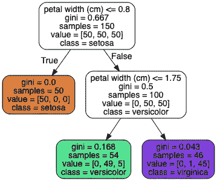

Figure I: Iris Decision Tree, [Source](http://shop.oreilly.com/product/0636920142874.do)

因此，该节点的基尼系数为 0.5:

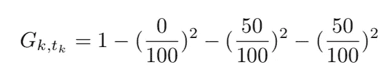

Figure II: Gini impurity calculation

类似地，在深度 1，左节点，基尼不纯度为零，因为所有训练实例都应用于相同的类。节点本质上是“纯”的。

既然明白了什么是基尼不纯，那就让我们进入答案的正题吧。决策树使用分类和回归树(CART)算法进行训练，这是基于一个简单的概念，即使用单个特征(k)和阈值(t)将数据集分成两个子集。在虹膜数据集中，特征是“花瓣宽度”,阈值是 0.8。它是如何选择 k 和 t 的？它搜索产生最纯子集的对(k，t)。因此，算法试图最小化的成本函数由下面的等式给出:

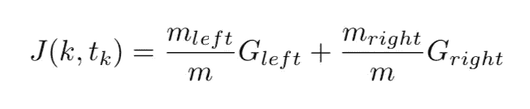

Equation II: Cost function of a classification type decision tree.

其中 G 左或右表示子集的基尼不纯度，而 m 表示子集的实例。

> 回归型问题的成本函数；

对于回归树，代价函数相当直观。我们使用残差平方和(RSS)。等式 III 显示了回归类型树的成本函数，其中“y”是地面真实值，“y-hat”是预测值。

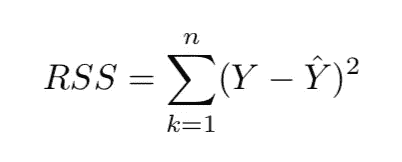

Equation III: Residual Sum of Squares (RSS)

问 **问题二:** **共线性如何影响你的模型？**

**答:**共线性是指两个或两个以上的预测变量彼此密切相关的情况。下面的图 2 显示了共线变量的例子。变量 2 严格遵循变量 1，皮尔逊相关系数为 1。所以很明显，当输入机器学习模型时，这些变量中的一个会表现得像噪音一样。

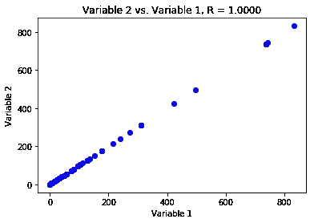

Figure 2: Example of collinear variables.

在回归型问题中，共线性的存在可能会成为问题，因为很难区分共线变量对响应的单独影响。或者换句话说，共线性降低了回归系数估计的准确性，并导致误差增加。这将最终导致统计量的下降，因此，在存在共线性的情况下，我们可能无法拒绝零假设。

检测共线性的简单方法是查看预测变量的相关矩阵。该矩阵中绝对值较大的元素表示一对高度相关的变量，因此数据存在共线性问题。不幸的是，并不是所有的共线性问题都可以通过检查相关矩阵来检测:即使没有一对变量具有特别高的相关性，三个或更多变量之间也可能存在共线性。这样的情况称为*多重共线性。*在这种情况下，评估多重共线性的更好方法是计算*方差膨胀因子* (VIF)，而不是检查相关矩阵。每个变量的 VIF 可以使用以下公式计算:

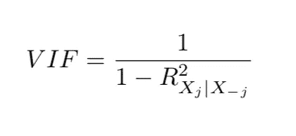

Equation IV: The Variance Inflation Factor (VIF)

其中 R 平方项是变量 *X，*对所有其他预测值的回归。如果 VIF 接近或大于 1，则存在共线性。当面临共线性问题时，有两种可能的解决方案。一是去掉多余的变量。这可以在不损害回归拟合的情况下完成。第二种解决方案是将共线变量组合成一个预测值。

问 **问题三:** **你会如何向一个外行人解释深度神经网络？**

**答案:**神经网络(NN)的想法最初源于人脑，它是为了识别模式而设计的。NN 是一组通过机器感知、标记和聚类原始输入数据来解释感官数据的算法。任何类型的真实世界数据，无论是图像、文本、声音还是时间序列数据，都必须转换到包含数字的向量空间中。

深度神经网络中的“深度”一词是指神经网络由多层组成。这些层由进行计算的节点组成。node 是人脑中的一个神经元，当它遇到足够的刺激时就会触发。节点将来自原始输入的数据与它们的系数或权重相结合，这些系数或权重基于权重来抑制或放大该输入。然后，输入和权重的乘积在图 3 所示的求和节点处被求和，然后被传递到激活函数，该激活函数确定该信号是否应该进一步通过网络以影响最终结果，以及应该进一步通过网络到什么程度。节点层是一排类似神经元的开关，当输入通过网络时，这些开关打开或关闭。

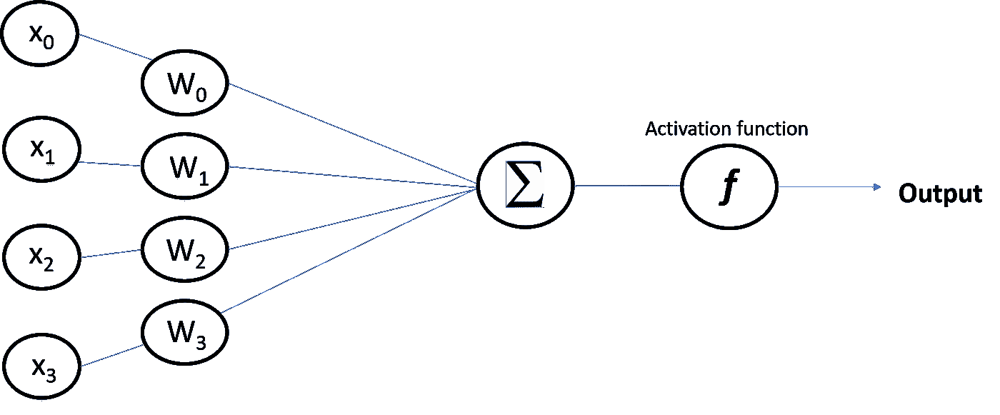

Figure 3: An example of node visualization in neural network.

深度神经网络不同于早期版本的神经网络，如感知器，因为它们是浅层的，仅由输入和输出层以及一个隐藏层组成。

Figure 4: Deep neural network consists of more than one hidden layer.

问 **问题四:** **你的数据科学带回家项目的 3 分钟推介是什么？**

**回答:**一个典型的数据科学面试流程从一个带回家的数据分析项目开始。我已经参加了其中的两次，时间跨度可能会根据带回家项目的复杂程度而有所不同。第一次，给我两天时间用机器学习和执行摘要解决一个问题。第二次给我两周时间解决问题。不用说，第二次是一个更困难的问题，我处理的是类不平衡数据集。因此，3 分钟的推销型面试问题可以让你展示你对手头问题的理解。请务必从你对问题的解读是什么开始；你解决问题的简单方法；你在你的方法中使用了什么类型的机器学习模型，为什么？通过吹嘘你的模型的准确性来结束这一切。

我相信这是面试中一个非常重要的问题，它能让你证明你是数据科学领域的领导者，并且可以用最新最棒的工具解决复杂的问题。

问:你所说的模型正则化是什么意思，你将如何在线性模型中实现正则化？

**答案:**正则化是一个用来约束你的机器学习模型的术语。限制或减少机器学习模型中的过拟合的一个好方法是具有更少的自由度。自由度越少，模型越难过度拟合数据。例如，正则化多项式模型的一个简单方法是减少多项式自由度的数量。然而，对于线性模型，正则化通常通过约束模型的权重来实现。因此，代替线性回归，岭回归、套索回归和弹性网模型有三种不同的方法来约束权重。为了完整起见，让我们先从线性回归的定义开始:

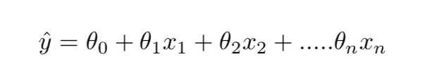

Equation V: Linear regression and model prediction

*   y-hat 是预测值。
*   *n* 是特征的数量。
*   x_i 是第 n 个特征值。
*   θ是模型参数，也称为特征权重。

线性回归模型的均方误差成本函数定义为:

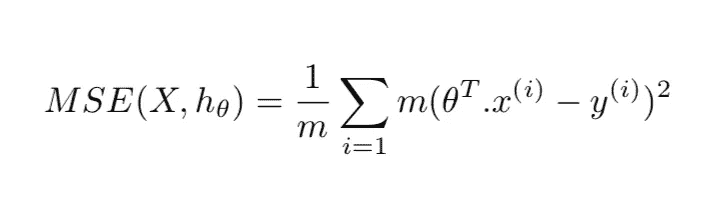

Equation VI: Linear regression cost function.

其中 theta 是 theta 的转置(行向量而不是列向量)。

**岭回归:**是线性回归的正则化版本，即在成本函数中增加了额外的正则化项。这迫使学习算法不仅要适应数据，还要保持模型权重尽可能小。请注意，正则化项应该仅在训练期间添加到成本函数中。模型定型后，您希望使用未规范化的性能度量来评估模型的性能。

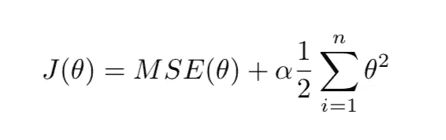

Equation VII: Ridge regression cost function.

超参数 alpha 控制您想要正则化模型的程度。如果α为零，那么岭回归只是线性回归。

**Lasso 回归:**最小绝对收缩和选择算子回归(简称 Lasso 回归)是线性回归的另一个正则化版本:就像岭回归一样，它在成本函数中添加了一个正则化项，但它使用了权重向量的 L1 范数，而不是 L2 范数的一半平方。

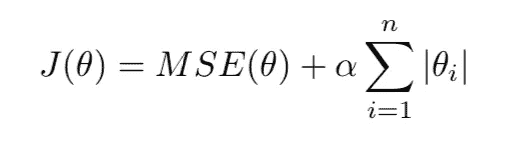

Equation VIII: Lasso Regression cost function.

Lasso 回归的一个重要特征是，它倾向于完全消除最不重要的要素的权重(即，将其设置为零)。换句话说，Lasso 回归自动执行特征选择并输出稀疏模型(即，具有几个非零特征权重)。

**弹性网回归:**这是脊和套索回归之间的中间地带。正则项是岭和套索正则项的简单混合，可以用“r”来控制。当 r=0 时，弹性网等价于岭回归，当 r=1 时，等价于套索回归。

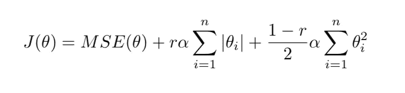

Equation IX: Elastic Net cost function.

至少有一点点的正则化总是更可取的，并且通常应该总是避免简单的线性回归。岭是一个很好的默认值，但如果在特定数据集中只有少数要素有用，则应使用 Lasso。一般而言，弹性网优于套索，因为当要素数量大于实例数量或多个要素高度相关时，套索可能表现不稳定。

在本文中，我讨论了我个人在一次技术数据科学面试中面临的五个问题，我认为这些问题本可以做得更好。我强烈推荐阅读下面的资源，在日常生活中磨练你的基本概念。相信我，我一定一遍又一遍地阅读了这些概念，然而我在面试中却笨手笨脚地发现了它们。

如果你喜欢读这篇文章，请不要忘记投票支持它！

快乐学习！

1.  [用 Scikit-Learn 进行动手机器学习& TensorFlow](https://www.amazon.com/Hands-Machine-Learning-Scikit-Learn-TensorFlow/dp/1491962291)
2.  [统计学习入门](https://www.amazon.com/Introduction-Statistical-Learning-Applications-Statistics/dp/1461471370/ref=sr_1_2?crid=2DFTNCGMY1GKP&keywords=an+introduction+to+statistical+learning+with+applications+in+r&qid=1572461424&s=books&sprefix=An+introduction+to+%2Cstripbooks%2C181&sr=1-2)