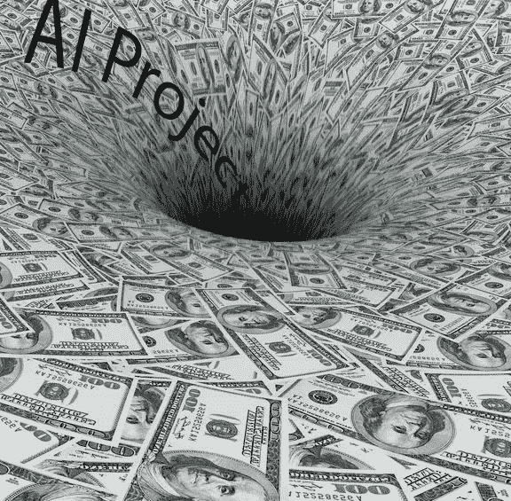

# 关于人工智能和机器学习项目失败原因的五个假设

> 原文：<https://towardsdatascience.com/five-hypotheses-as-to-why-artificial-intelligence-and-machine-learning-projects-fail-7c6b2c456d41?source=collection_archive---------14----------------------->

有大量的[文章](https://www.gartner.com/en/newsroom/press-releases/2018-02-13-gartner-says-nearly-half-of-cios-are-planning-to-deploy-artificial-intelligence)和发表的论文围绕着为什么人工智能/机器学习/自然语言处理项目从未进入“生产”或未能交付所提出的价值(Gartner 预测，到 2022 年，85%的人工智能项目将由于数据、算法或负责管理它们的团队的偏见而交付错误的结果)。以下是一些关于为什么人工智能项目失败的假设，以及一些关于公司对人工智能项目缺乏交付价值的反应(技术和组织)的观察。请注意，这些意见并不反映任何当前或以前的雇主，而是与各行业的数据科学家、工程师、产品经理和架构师对话的综合。

**假设 1:数据科学的初始模型不可扩展，或者过于实验性，不适合内部或外部客户使用。**

项目通常从这里开始，因为公司雇佣了一些用 Python 或 R 构建模型的数据科学家，但很快发现数据科学家和工程师的思维方式不同。从短期来看，这个问题通常通过让机器学习工程师或其他软件工程师获取代码、重写代码并遵循标准开发-运营流程来解决，以便扩展和部署应用程序。考虑到结果的随机性，质量工程也需要与任务相适应。在这个过渡期，业务用户(和/或他们的代理产品经理)可以被排除在流程之外，需求或底层数据可能会发生变化。

在组织上，一些公司采取了下一步措施，聘请工程师加入数据科学小组，以帮助数据科学家了解更多关于生产和部署的扩展。这种方法的目标是减轻切换过程。面临的挑战是，这个研究/工程组织可能会与生产支持工作流的其余部分隔离开来。“数据科学家不戴呼机随叫随到”。

**假设#2:数据科学/ML 模型虽然出色且具有创新性，但不符合业务需求，或者过于脆弱，无法响应支持数据的变化。**

在咨询集团的建议下，一些公司做出决定，为了促进创新，“创新团队”需要与他们周围的“非数字”文化隔离开来。但是，虽然孤立的创新团队可以带来巨大的实验机会，并且这些团队可以学习和开发有趣的解决方案，但当最终的项目需要“推向”市场或内部客户时，通常只有很少的采用。虽然该解决方案可能会满足特定的挑战，但用户的体验通常不是最佳的。如果数据发生变化，缺少一个不太复杂的模型作为后盾也是一个挑战。从好的方面来说，这项研究可以发表在其他数据科学家阅读的学术期刊上，以进一步了解整个行业。

为了应对这种不采用的问题，一些创新/数据科学团队可能会在他们的组织中增加产品营销人员，以在内部“推广”他们的工作，并尝试直接向客户推销他们的概念。

假设#3:人工智能计划由公司内部 IT 组织驱动，并继承了“瀑布”式的挑战。

作为“数字化转型”的一部分，一些公司将 AI 视为整体数据仓库计划的一部分，或作为客户管理或营销应用自动化工作的一部分。人工智能或机器学习对“标记”(适当标记)数据的需求意味着，公司还需要有一个相当成熟的分析和数据捕捉基础设施。虽然将人工智能和机器学习作为整个 it 数据项目的一部分似乎是合理的，但如果没有伴随的实验/原型计划，人工智能项目可能会因此被埋没。具有讽刺意味的是，当数据最终在数据管道中准备就绪时，客户的需求可能已经完全改变了(例如:在公司战略转向流媒体时围绕 CD 发行进行优化)。

**假设 4:公司对交付人工智能/人工智能项目所需的时间没有耐心。**

鉴于许多提议的人工智能/人工智能项目的成功和时间表的不确定性，它们甚至可能在有机会开始之前就夭折了。再加上技术的新颖性以及谷歌、亚马逊和微软的领先优势，结果是非直接面向消费者的企业公司可能会谈论人工智能，但首先从业务流程自动化工具开始，然后等待事情解决(为未来捕捉数据)。

**假设 5:缺乏 AI/ML 项目的“产品”方法是项目失败和风险增加的核心。**

产品经理/所有者在敏捷软件开发中的角色在软件开发中是很明确的。产品经理作为团队的一部分工作，团队包括 UX、工程、质量保证和项目管理。人工智能项目中似乎缺少的就是这种相同的“产品”思维模式。优秀的产品经理知道如何提出或找到最有价值的商业问题。有经验的产品经理是管理产品交付不确定性的专家。经验丰富的分析产品经理知道数据在哪里丢失或被掩埋。因此，今天的问题可能不是“我们需要的数据科学家都去哪里了？”，而是“知道如何提出正确问题的人工智能产品经理都去哪里了？”

**概要:**

从根本上说，AI/ML 项目不会成功，除非精通技术的产品经理采用同样的“敏捷”“精益”产品方法来应对风险、领土之争以及无法解决或回答业务问题的挑战。数据科学家和机器学习工程师需要成为产品开发团队的一部分。就像“设计思维”让 UX 加入软件开发团队一样，“人工智能思维”需要将人工智能研究整合到产品开发中。人工智能产品经理需要业务高管的支持，以指导商业价值评估过程，并平衡技术/数据科学议程。

虽然人工智能云平台的变革仍在继续，工具也在快速变化，但那些加强并培训或雇佣具备必要技术或数据技能的人工智能产品经理，并挑战他们与 UX 设计师、数据科学家、机器学习工程师、软件工程师组成的团队一起找到一个商业问题来回答的公司，在一位理解并能够理性沟通不确定性的项目经理的协调下，将是利用人工智能取得成功的漫长道路。

那些已经标记了数据流的公司，如电子商务和金融/支付领域的公司，已经领先一步，并为其他公司提供了如何扩展的良好模型，但只有通过提出正确的问题，并利用和扩展 ML/NLP/AI 来获得正确的答案，其中一些公司才能在未来几十年中领先一步。