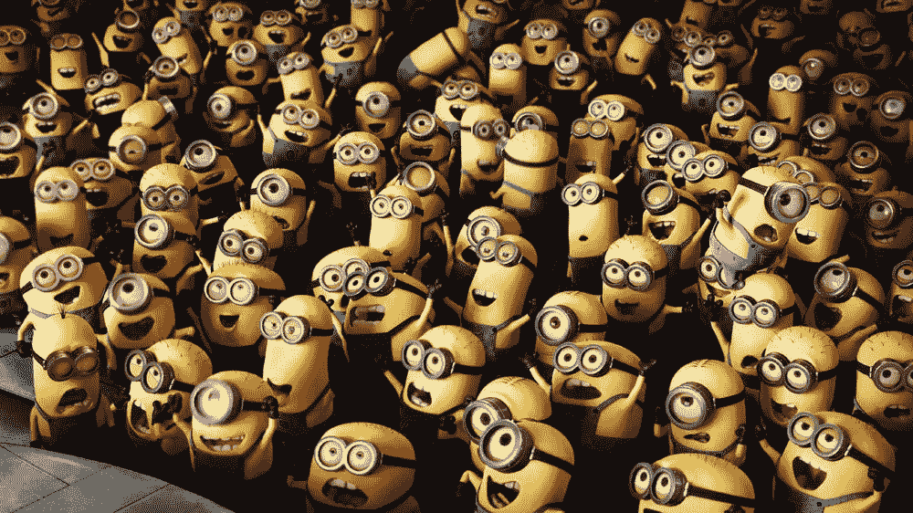

# 为什么不能“让另一位数据科学家来做这件事”的五个理由

> 原文：<https://towardsdatascience.com/five-reasons-why-you-cant-just-get-another-data-scientist-onto-it-2fdb27cf3333?source=collection_archive---------31----------------------->

## 这句话证明了人们不知道数据科学到底是什么

你有没有参加过分析性问题被证明具有挑战性的会议或讨论？比如，你找不到合适的模型，或者你的数据格式有问题，或者领导对时间表不满意？

有时候我也遇到过这种情况。很正常。分析是复杂的，事情并不总是如你所希望和计划的那样发展。

但是，当人们认为这些问题的解决方案是“让我们找一个(另一个)数据科学家来做这件事”时，这让我抓狂。这种思维方式有太多的错误。它暴露了对什么是数据科学的基本误解，并暴露了对实践数据科学所需技能的缺乏重视。以下是为什么不能“让另一位数据科学家来做这件事”的几个原因。

## 1.数据科学家不是一个容易找到的资源

尽管该领域出现了爆炸式增长，而且现在提供了各种教育项目，但优秀的数据科学家并不容易找到。市场竞争激烈，对那些技术最熟练的人需求量很大。如果您足够幸运，在您的组织中有强大的数据科学家，他们的工作可能已经非常繁忙了。

“为了快速解决问题，让另一个数据科学家来做这件事通常意味着引入那些并不真正有资格自称为数据科学家的资源。比如有人几个月前上过一次在线 Python 课程，并且能说出机器学习这个词。那里有很多这样的人，但是让他们参与进来最终会拖延而不是帮助这项工作。如果目的是提供更多能力来帮助现有的数据科学家，可能会适得其反，因为他们将不得不花大量时间与知识基础非常低的人打交道。

## 2.数据科学家不是多面手

数据科学是一个异常宽泛的领域。有时你说你想要一个数据科学家，但实际上你需要的是一个数据工程师。有时候你需要一个 NLP 专家，或者一个会做 GLMs 的人。有时候你需要的更像是前端开发人员来构建应用程序。没有一个数据科学家能把每件事都做好。

“让另一个数据科学家来做这件事”不够规范，可能会导致 HR 让背景和技能与要解决的问题不匹配的临时或永久员工来做这件事。

## 3.数据科学家通常需要领域专业知识

类似于第 2 点，如果数据科学家没有知识领域来支持他们的技术技能，他们很少是有效的。与分析人才和人员或临床试验结果的工具和方法相比，分析金融风险的数据科学家将使用一套完全不同的工具和方法。

强大的数据科学家通常在其特定领域拥有一定水平的经验和专业知识。他们知道面临的典型数据问题，经常发生的特定统计现象。他们可以更流利、更快地处理这些问题。

“让另一个数据科学家去做”可能会给人们带来压力，让他们为了填补所需的能力而指派没有领域专业知识的人。这对工作质量和潜在的解决方案可能是毁灭性的。

## 4.数据科学家需要整合到工具链中

强大的工具链带来了如此多优质、高效的分析。语言、版本控制、敏捷跟踪以及发布和共享规范都是平稳的数据科学操作的一部分。许多数据科学家可能不熟悉正在使用的特定工具链，或者对任何工具链都没有经验。

“让另一个数据科学家去做”可能会使现有的工作流程面临风险或导致延迟，因为新的资源被投入到工作中，而这个人没有使用所用工具的经验。结合上述一些问题，这可能是非常危险的。

## 5.数据科学家并不是唯一需要解决这个问题的人

使用分析解决组织或业务问题需要的不仅仅是数据科学家。它需要来自业务方面的经验丰富的个人的参与，他们可以帮助判断什么应该建模，什么不应该建模，以及什么样的结果最有用。它需要能够帮助数据科学家区分工作中哪些部分是关键的，哪些部分在数据质量差或难以获得时可以放弃的人。

“让另一个数据科学家来做”通常会掩盖一个更深层次的问题，即业务方面没有足够的参与，以及现有的分析专业人员没有收到关于优先级和输出的足够指导。另一个数据科学家不会在这方面提供帮助。

数据科学家并不是万能的灵丹妙药。在一个问题上投入更多往往会使情况变得更糟，而不是更好。所以下次你听到有人说“让我们找一个(另一个)数据科学家来做吧”，不要害怕让他们来做！

最初我是一名纯粹的数学家，后来我成为了一名心理计量学家和数据科学家。我热衷于将所有这些学科的严谨性应用到复杂的人的问题上。我也是一个编码极客和日本 RPG 的超级粉丝。在 [*LinkedIn*](https://www.linkedin.com/in/keith-mcnulty/) *或*[*Twitter*](https://twitter.com/dr_keithmcnulty)*上找我。*

Image from Despicable Me, Illumination Entertainment/Universal Pictures