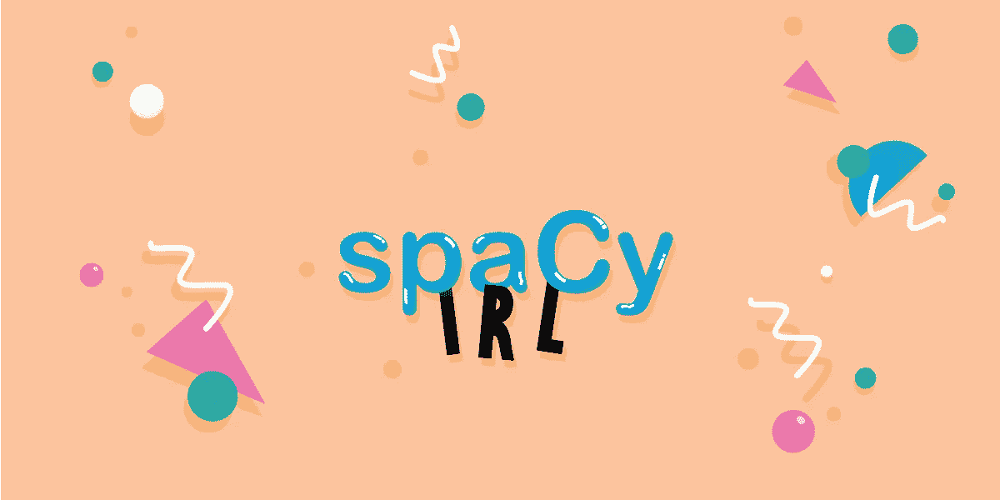

# spaCy-IRL 值得一看的五次演讲

> 原文：<https://towardsdatascience.com/five-talks-from-spacy-irl-worth-watching-e6e505e0e272?source=collection_archive---------28----------------------->

SpaCy-IRL 是一项为期两天的活动，于 2019 年 7 月 5 日至 6 日在柏林举行。它主要关注应用自然语言处理(NLP)。也就是说，用(通常)非基准数据解决新的 NLP 业务问题。在会议期间，讨论了用于解决行业问题的问题、方法和工具。我选择了我认为值得观看的 spaCy-IRL 2019 五大演讲。

约翰·戈德堡、巴伊兰大学和 AI2:自然语言处理中缺失的元素

Yoav 谈到了学术界和工业界之间有趣的差距。一方面，学术界的研究大多集中在需要大量数据和计算能力的深度学习模型上。另一方面，该行业仍然依赖于传统的 NLP 技术。在他的革命性愿景中，应用的 NLP 仍将依赖于人类的书面规则，但它们将在机器学习的帮助下编写，从而产生透明和可调试的模型。他用自己的观点描述了 NLP 中缺失的元素:
1。使用少量带注释的数据，在领域之间转移，并将知识整合到模型中。
2。NLP 构建块的符号表示，允许非专家直接交互。
3。“处理缺失的元素”。我们作为说自然语言的人或作家，在使用自然语言时会省略单词。例子:“她刚满 50 __”。例如，这挑战了我们的依存解析模型。
4。人类和机器的合作，以建立自然语言处理模型。这种合作将包括一个支持它的互动开发过程。

Yoav 还提到了理解深度学习模型正在做什么(“打破黑盒”)以及 NLP 中公平性和可解释性的重要性。

在我的研究中，在 Yoav 的指导下，我专注于第一个缺失的元素。特别是针对带有小注释的数据和域间传输的问题的解决方案。我最近的[工作](https://arxiv.org/pdf/1903.10238.pdf)，发表在 NAACL 2019 上，解决了使用小噪音词典的单词嵌入对齐问题，这对于低资源语言和域转移非常重要。

**二。Sebastian Ruder，DeepMind:开源 NLP 中的迁移学习**

不久前，在 EMNLP 2018 上，我与 Sebastian 会面，讨论他的最后一篇论文之一，他可能不记得我了，但我非常兴奋。这一次，Sebastian 谈到了 NLP 中的迁移学习。在过去的几年里，迁移学习在 NLP 领域取得了巨大的进步，在我看来，这种积极的变化将能够解决许多行业用例特定的问题。在他的演讲中，Sebastian 强调了在 NLP 中使用迁移学习的天然优势，这是由于语言表示、结构相似性、任务交织(如语法和语义)以及带注释的数据很少这一事实。事实上，使用预先训练的语言模型(如:ELMo、BERT)已被证明有助于改善翻译、情感分析、命名实体识别、文本分类、问答等任务。Sebastian 的观点是，如果可用且与您的用例相关，请使用预训练模型，最重要的是，如果您在一种新类型的数据集上训练了一个模型，这可能对其他人分享它有用。他的理由不仅是社区驱动的，也是生态的。生态？！是的，Sebastian 引用了《T2》的这篇论文，训练一个语言模型比制造和使用一辆汽车消耗更多的二氧化碳。他建议使用集线器共享模型。中枢允许我们将机器学习模型作为自包含图(模型和参数)来共享。

“Training a language model uses more carbon dioxide than the manufacturing and lifetime use of a car”

**三世。Rasa 的 Justina Petraitytė:在帮助船舶对话人工智能助理方面的经验教训**

Rasa 通过提出对话式 NLU 的开源模型，使开发人员能够构建对话式人工智能系统。Justina 讨论了他们在开发 Rasa 时面临的挑战及其解决方案。其中有:预训练词向量的局限性；确认范围外的输入；和反馈回路；在我看来，Justina 为这些问题提出的解决方案非常具有启发性，这可以追溯到 Yoav 关于工业依赖于启发性解决方案的观点。对话式人工智能是应用自然语言处理的一个常见例子，所以我觉得听到 Rasa 面临的主要问题很有趣。

**四。麦肯锡·马歇尔，巴林银行:资产管理中的 NLP**

巴林正在他们的财务管理系统中应用 NLP。麦肯齐强调，投资研究不是完全自动化的，而是使用机器学习进行增强。她使用 [prodigy](https://prodi.gy/) 注释工具创建了一个数据集，专门解决他们处理公司名称词义歧义的问题。同样，我们可以看到为了支持当前的 NLP 模型，需要领域专家的介入。此外，她提到了使用二元案例情感分析的问题。

**诉国际 RTI 公司彼得·鲍姆加特纳:应用自然语言处理:来自现场的教训**

彼得谈到了他作为 NLP 专家与客户打交道的工作。首先，在谈到 NLP 行业问题时，他谈到了客户的不同需求。有时，客户不知道 NLP 的能力和解决的问题，有时他们被人工智能炒作所驱使或者误解了这个领域。第二，他提到 ML 项目更难管理，因为有更多的模糊性。为了传达不确定性和报告项目状态，他建议管理实验日志。Peter 还建议建立比喻，以便与非技术同事交谈。最后，Peter 提到了我们的工作交流的重要性，不仅在研究自然语言处理方面，而且在应用自然语言处理方面。他认为这样做的方法是通过博客。彼得说得对，研究人员有他们有组织的平台(主要是论文和会议)来分享他们的工作，但我相信现在工业界有同样多的机会，甚至有更多的人有兴趣听。聚会、讲座、github、kaggle(用于数据集发布)、博客，只是你如何分享你的工作的几个例子。

希望你喜欢这篇文章！