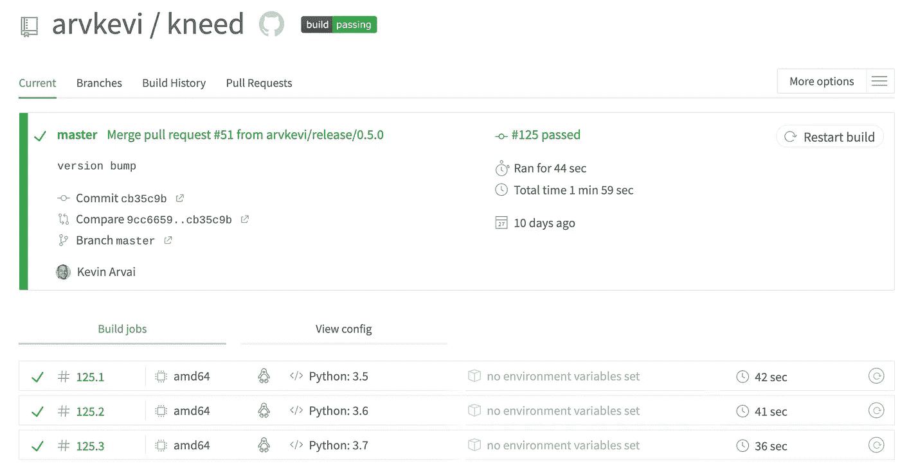

# 为开源软件做贡献的五个技巧

> 原文：<https://towardsdatascience.com/five-tips-for-contributing-to-open-source-software-8fd3d6f5606f?source=collection_archive---------20----------------------->

## 数据科学家的视角

Photo by [Yancy Min](https://unsplash.com/@yancymin?utm_source=medium&utm_medium=referral) on [Unsplash](https://unsplash.com?utm_source=medium&utm_medium=referral)

为开源软件(OSS)做贡献是一件值得的事情，尤其是对新的数据科学家来说。它有助于提高技能，在项目协作时提供宝贵的经验，并给你一个展示代码的机会。然而，许多数据科学家并不认为自己是受过正式训练的软件开发人员。这使得为 OSS 做贡献成为一个可怕的提议。

恐惧的一个来源是，似乎软件开发过程中的每一步，从设计到持续集成，都有一套在数据科学培训中经常被忽略的最佳实践。这让数据科学家感到装备不足，无法参与为软件开发人员量身定制的领域。已经有[文件证明](https://www.freecodecamp.org/news/how-to-get-over-your-fear-of-contributing-to-open-source-6160e4cdf0d3/)甚至一些熟练的软件开发人员在决定为 OSS 做贡献时也会焦虑，嗯，对于一个数据科学家来说，这种焦虑会成倍增加。

我们每天使用的几乎所有流行的数据科学库都是成功的 OSS 项目，有时由社区维护并经常改进。想到 Scikit-learn、PyTorch 和 TensorFlow。看，数据科学家可以写出高质量的代码！最终，数据科学家编写代码的目的是将模型交付生产或部署健壮的数据管道。既然我们正在编写软件，我们应该像其他软件项目一样坚持同样的标准。

在这篇文章中，我想分享一些我在过去几年开发数据科学软件中所学到的东西。我的目的是分享我希望有人在我开始数据科学之旅时与我分享的信息。希望犹豫是否开始的没有经验的数据科学家将使用这些提示，感觉被授权开始编写更好的数据科学代码，并尽早为 OSS 做出贡献。

1.  **找一个有经验的软件开发人员…**

…请注意！这个项目对我的个人发展有着最大的影响。我目前所有的软件开发习惯都是以某种形式将有经验的软件开发人员融入到我的生活中的直接结果。值得注意的是，你不一定要和这些人成为最好的朋友。有经验的开发人员可以是你团队中的技术负责人、同学或当地聚会上的人。此外，有一些真正伟大的开发人员[定期发推特](https://twitter.com/b0rk)，[在论坛上发帖](https://dev.to/)，[写技术博客](https://hackernoon.com/)，并创建播客(我最喜欢的是 [Talk Python](https://talkpython.fm/) )。尽最大努力找出不是数据科学家的人，因为他们可以为你提供在数据科学领域更难找到的观点。

这个提示的关键是**听******跟**这些人搞。首先，问问自己，“他们为什么要实施这样的方法”？如果你不明白，就去查。如果你还是不明白(或者如果你明白了),给他们发一封电子邮件或者回复一条评论，让他们详细阐述他们的观点。很有可能，这些人在他们的决定背后有很好的理由。从软件开发的角度来看，在你的问题的上下文中看到或听到这些原因会让你更好地理解这个主题。我不建议你不断地追逐有经验的开发人员，尊重他们的时间和空间是很重要的。**

**2.**开源社区并不是来抓你的****

**阻止人们为 OSS 做贡献的一个不幸的误解是，如果他们公开他们的代码，将会被嘲笑或奚落。大多数时候，这是不正确的。这和其他类型的社区没什么不同，几个害群之马就能毁了所有人的聚会。我为小型 OSS 项目、流行的 OSS 项目做出了贡献，甚至还维护了一些我自己的项目。在每一个场景中，每一次互动都是最起码的尊重，而且在大多数情况下，人们都很感激。在为 OSS 做了两年多的贡献之后，如果有人对我不尊重，那么在这一点上他们显然是局外人。**

**3.**练习 git 等。****

****

**It’s never been easier to practice git, all the major hosting platforms allow users to create unlimited private repositories.**

**一些人声称“不熟悉 git”或者仅仅是“不熟悉 GitHub”作为他们不为 OSS 做贡献的理由。这就是为什么第三个数字的标题包含“等”。GitHub、Bitbucket 和 GitLab 具有大量支持 git 工作流的功能，但本质上并不被视为“git”*的一部分。*因此，即使对于一个从未使用过 GitHub 的有经验的 git 用户来说，在熟练的道路上仍然有一个轻微的学习曲线。**

**不要在本地编写所有的项目，而是预留一些额外的时间来推进到上面提到的一个平台。将其设为私有，如果你愿意，你仍然可以安全地与朋友共享回购。在重定一个特性分支的基础后，练习发出 pull 请求或直观地检查 git 提交历史。更加熟悉私有存储库中的选项卡、按钮、工具和 git 工作流将会让您在处理公共贡献时更加自信。**

**你很难找到一个成功的数据科学项目不使用某种形式的版本控制来进行软件开发，git 恰好是最受欢迎的。因此，试着在日常项目中使用 git 工作流。然后，当在 OSS 项目上与人合作时，你不会被 git 工作流程的失误所困扰，你会把时间花在代码上。**

**4.**使用** **软件最佳实践****

**Kaggle 的数据科学家 Rachel Tatman 最近[发布了一个视频](https://www.youtube.com/watch?v=Trar7GZOPl8&feature=youtu.be)和一个[内核](https://www.kaggle.com/rtatman/six-steps-to-more-professional-data-science-code)，概述了如何编写更专业的数据科学代码，因此我将建议遵循她的建议，在我们重叠的地方保持简短。当您与合作者互动时，这些都将使您的生活变得更加轻松，再次允许您专注于添加功能，而不是回去清理坏习惯。**

**4a。**使变量名可读****

**其他数据科学家可能知道`i`和`j`是数组`A`的元素，但是数学符号并不能转化为源代码中的信息变量名。我喜欢使用在重读源代码或别人第一次阅读时有意义的变量名。但是我会让 Will Koehrsen 为数据科学家的命名惯例提出建议。**

**4b。**慷慨评论****

**不管他们是否意识到这一点，数据科学家经常实施一种叫做[方法链](https://tomaugspurger.github.io/method-chaining.html)的编码风格。当内存中有一个 DataFrame 对象时，我们通常知道下一步将一列转换成我们想要的格式的确切步骤。方法链接的一个缺点是链接很难调试，尤其是没有注释的时候。写评论的时候想想别人，记住，一个简短的评论可以帮你很大的忙。**

**4c。**编写单元测试****

**你以后会感谢自己，或者无论是谁在审核你的拉取请求，都会感谢你。有时候单元测试对于小型的一次性数据科学项目来说没有意义。但是当你考虑扩展你的代码或者与他人合作时，单元测试变得更加重要。**

**当代码是模块化的时，它更容易测试，也就是说，编写函数的目的是执行一两个操作。下面是一个用 Python 规范化熊猫数据帧的函数的例子。此函数的单元测试断言平均值和标准偏差分别为 0.0 和 1.0。如果这个测试失败了，开发人员就知道“normalize_dataframe”方法出错了，并且知道从哪里开始调试。**

**Test that the normalize_dataframe function is working as expected.**

**4d。**使用持续集成(CI)****

**恭喜你，你写了单元测试并把你的代码推送到 GitHub，但是几天后，有人报告说他们不能让你的代码在他们的机器上运行。CI 将有助于在这些问题成为 GitHub 上的问题之前发现它们。 [Travis](https://travis-ci.org/) 是一个 CI 服务的例子，它直接与 GitHub 免费集成，用于公共回购。CI 服务允许您在容器化的环境中构建和测试代码。我建议为您打算与其他人合作的项目建立一个 CI 服务[之一](https://github.com/marketplace/category/continuous-integration)。**

****

**Travis interface showing a passing build with multiple versions of Python on a Linux kernel.**

**5.**使用调试器****

**对于数据科学项目来说，使用带调试器的代码编辑器(有时称为集成开发环境(IDE ))似乎有些矫枉过正。但是一旦你学会了如何使用编辑器的调试器，它就会成为软件开发的强大工具。调试器允许用户执行代码直到一个*断点*，然后探索变量名称空间，这使得“调试”程序崩溃的原因变得更加容易。在放弃希望和切换回笔记本电脑之前，你应该给自己至少 30 天的时间来试用调试器进行开发。花点时间阅读教程，并询问更有经验的软件开发人员(可能来自技巧 1 ),他们是否可以带你调试下一个 bug。**

**Jupyter 笔记本是许多用户首次开始数据科学项目时的热门选择。笔记本是探索性数据分析和可视化的好工具，但是它们也有缺点，Joel Grus 在这里对其进行了评论。也就是说，这些单元不能乱序运行，它们对于初学者来说很难理解，并且会助长坏习惯。两个流行的 IDE[py charm](https://www.jetbrains.com/help/pycharm/jupyter-notebook-support.html)和 [VS Code](https://code.visualstudio.com/docs/python/jupyter-support-py) 已经认识到笔记本的流行，最近直接在 IDE 中集成了对它们的支持。有希望的是，数据科学家将会为了笔记本支持而来到 ide，但是为了调试器而留下来。**

**奖励:**乐于接受建设性的批评****

**请记住，OSS 是通过正式和非正式的代码评审来维护和改进的。人们会看你的代码，评论它，可能会要求你修改几行。如果你已经走了这么远，这不就是你一直在寻找的吗？有人花时间审查你的代码，并花费足够的精力去尝试和改进它。**

**随着您的软件开发技能的提高，您会遇到其他用户要求您修改代码，但是您可能希望保持原样。用你期望得到的尊重来捍卫你的决定，这和做一个明智的人没什么不同。**

**我希望这些建议对你有用。这些技巧是针对开源的，但也适用于商业数据科学家和开发人员。随着您对其中一些技术的熟练掌握，您应该会注意到，您在 OSS 环境中识别和修复 bug 或实现功能所需的时间减少了。通过现在投入时间成为一名更好的程序员，从长远来看，你将有更多的时间来解决世界上的数据科学问题。**