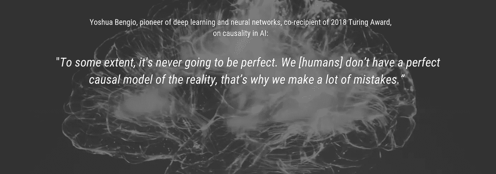
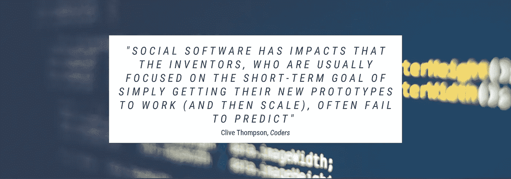
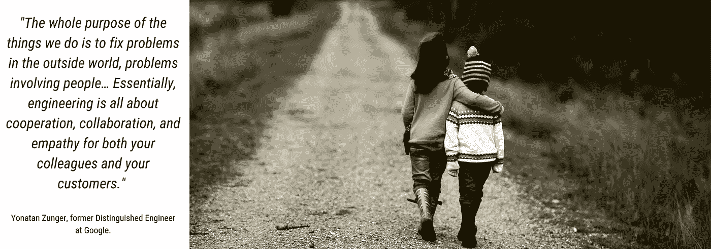
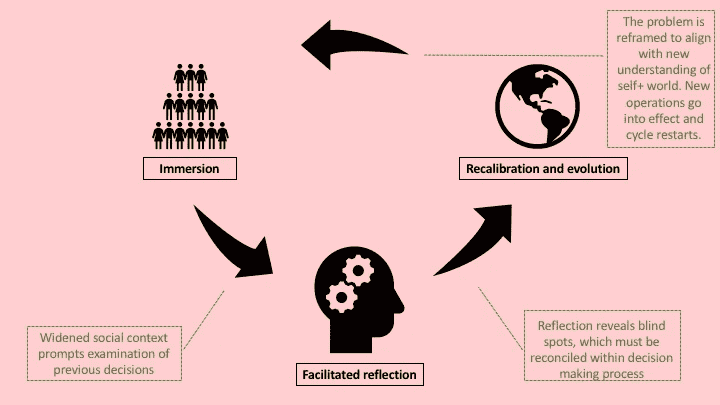

# 在机器后面修理机器

> 原文：<https://towardsdatascience.com/fixing-the-machine-behind-the-machines-dbf741c1c572?source=collection_archive---------19----------------------->

## 为什么我们需要解决人类决策中的偏见以改善技术及其未来治理，以及如何做到这一点

Photo by Javier Allegue Barros on Unsplash

2017 年将人工智能偏见带入了[主流](https://www.engadget.com/2017/12/21/algorithmic-bias-in-2018/)意识，从那时起，公众的关注度只有激增。[关于人工智能中偏见的原因，以及更令人烦恼的根除偏见的困难](https://arxiv.org/pdf/1606.06565.pdf#cite.0@armstrong2012reduced)[已经](https://medium.com/@yonatanzunger/asking-the-right-questions-about-ai-7ed2d9820c48)[说了很多](https://techcrunch.com/2016/12/10/5-unexpected-sources-of-bias-in-artificial-intelligence/)。这些评论大多承认机器偏见是人类偏见的反映；然而，很少有提议的解决方案真正解决了根本原因:人类。

这种缺席并不奇怪。[偏见](http://kirwaninstitute.osu.edu/research/understanding-implicit-bias/)在我们这个物种的整个[历史](https://www.psychologytoday.com/us/blog/the-power-prime/201206/is-our-survival-instinct-failing-us)中一直存在；这将是一个需要解决的大问题。相比之下，从外部关注如何调整一个行为不端的人工智能要诱人得多。

或许是时候转移焦点了。在机器中复制我们的决策过程的好处之一是，我们有机会看到自己的映像，并从中学习。事实证明，我们从追踪人工智能偏见中学到的经验教训可以为解决我们自己不完美的人类决策中的偏见提供一个有用的框架。

为什么现在这种内部操作系统升级特别重要？毕竟，这么长时间以来，我们已经设法克服了偏见的负面影响。

两个因素使得这项工作变得紧迫。首先是一个并不太新的现象，但它正变得越来越明显:技术前所未有的可扩展性意味着设计中的任何错误都会产生相应规模的影响。第二个因素是，我们正处于技术治理的转折点。政府、技术专家和利益相关者——让我们称这个集体为“设计师”——正急切地开始一个新的监管阶段。

正如每次人工智能设计师创建一个系统，他们都冒着在其中建立盲点的风险，这些治理设计师也冒着将自己的盲点投射到他们提出的解决方案中的风险。当这种情况发生时，技术和监管技术的治理系统都有可能以难以控制的规模放大决策中的错误。

如果我们希望设计出解决技术意外后果的方案，并预见未来的问题，我们必须首先检查这些机器背后的机器:我们自己。

## 看到我们自己对人工智能的偏见

Background by Alina Grubnyak on Unsplash

在人工智能中引入偏见的许多方式中，有三种现象与检验我们自己的决策特别相关。(关于人工智能偏见的更多信息，请参见郝凯琳的总结[这里](https://www.technologyreview.com/s/612876/this-is-how-ai-bias-really-happensand-why-its-so-hard-to-fix/?utm_campaign=the_algorithm.unpaid.engagement&utm_source=hs_email&utm_medium=email&utm_content=71709273&_hsenc=p2ANqtz-8y3zICvMBFEGCjzYGusIFbP3JL3EnYJ4pu483rdc1fb6iBxqtuw5f1wihT9YqY9dWxo7mnB1k4Tzd8kcnsgXSa-buAww&_hsmi=71709273)。下面引用了一些段落。)

让我们来看看偏见是如何通过问题框架、处理盲点、狭隘的社会背景而引入的。

> ***诬陷问题。当计算机科学家创建深度学习模型时，他们做的第一件事就是决定他们实际上想要它实现什么。例如，一家信用卡公司可能想要预测客户的信用度，但是“信用度”是一个相当模糊的概念。为了将其转化为可以计算的东西，公司必须决定是否想要，比如说，最大化其利润率或最大化得到偿还的贷款数量。然后，它可以在该目标的背景下定义信用度。该选择可能导致意想不到的后果或有害行为；如果利润最大化是目标，计算机可能会推荐掠夺性贷款。***

…

> ***未知的未知数*** 。偏差的引入在模型构建过程中并不总是显而易见的，因为您可能直到很久以后才意识到您的数据和选择对下游的影响。一旦你这样做了，就很难追溯性地找出偏见的来源，然后找出如何消除它。"
> 
> ***缺乏社会语境*** 。类似地，计算机科学家被教导构建问题的方式通常与思考社会问题的最佳方式不兼容。

毫不奇怪，这些人工智能设计错误听起来与人类决策中的[偏见](https://www.researchgate.net/publication/301662722_Decision-Making_and_Cognitive_Biases)相似。

人类往往看不到更大的图景，我们狭隘的理解导致我们可能不会做出选择，如果我们有更好的数据，或者对我们的环境有更完美的理解。我们在不知道其下游影响的情况下做出选择；事实上，我们在不知道形成我们决定的上游影响的情况下做出选择。

一种思考方式是，我们的决策(D)是几个变量的函数:我们拥有的信息(I ),我们如何解释该信息的价值观+经验(ve ),以及给定情况下的优先级(P ),它赋予我们解释的不同元素以权重，并允许我们选择行动路线。我们有多少次可以说我们真正意识到了所有这些变量？

剧透:[不常](https://www.kornferry.com/institute/understanding-bias-and-brain)。我们[意识到](https://www.psychologytoday.com/us/blog/the-media-psychology-effect/201604/mris-reveal-unconscious-bias-in-the-brain)我们的一小部分决定、情感、行动和行为。此外，当我们做出决定时，我们的无意识情感认知[经常与我们的有意识认知](https://hbr.org/2006/01/decisions-and-desire)沟通，我们[回溯性地运用](https://www.nytimes.com/1984/02/07/science/new-view-of-mind-gives-unconscious-an-expanded-role.html)有意识认知向自己解释我们是如何做出决定的。即使我们认为我们意识到了自己的过程，但我们通常并没有意识到。

[*人工智能偏见的另一个领域与人类认知有明显的对比是**有缺陷的数据**:有可能在数据集上训练人工智能，要么 1)不代表现实；2)反映现有的偏见；或者 3)在准备阶段变得有偏见，当设计者选择哪些属性对 AI 系统重要时。这篇文章的重点是解决社会背景，框定问题和盲点，但更多关于有缺陷的数据偏见如何表现的阅读，请参见[犯罪](https://www.technologyreview.com/s/612957/predictive-policing-algorithms-ai-crime-dirty-data/)和[累犯](https://www.technologyreview.com/s/612775/algorithms-criminal-justice-ai/)用[有缺陷的数据](https://papers.ssrn.com/sol3/papers.cfm?abstract_id=3333423)训练的预测工具中的性别和种族偏见。]

## 技术和治理中的意外后果

Background by Markus Spiske on Unsplash

监管人工智能并不是治理设计师让我们不完美的人类决策发挥作用的唯一空间。

技术方面的一系列治理挑战——尤其是在互联网方面——与日俱增。它包括从[消失](https://fil.forbrukerradet.no/wp-content/uploads/2018/06/2018-06-27-deceived-by-design-final.pdf)数据[隐私](https://www.reuters.com/article/us-europe-privacy-lawyer/austrian-data-privacy-activist-takes-aim-at-forced-consent-idUSKCN1IQ0ZI)的一切；对关注[注意力经济](https://blog.mozilla.org/internetcitizen/2018/07/27/attention-addiction/?utm_source=desktop-snippet&utm_medium=snippet&utm_campaign=blog-addiction-economy&utm_term=11208&utm_content=rel_esr)和推荐算法[播](https://www.theguardian.com/technology/2018/feb/02/how-youtubes-algorithm-distorts-truth)激进化[；在](https://www.buzzfeednews.com/article/ryanhatesthis/the-far-right-is-a-meme)[维护言论自由](https://www.cfr.org/blog/protecting-democracy-online-disinformation-requires-better-algorithms-not-censorship)和[防止有害内容](https://www.wired.com/story/new-zealand-shooting-video-social-media/)之间找到平衡；到[假新闻](http://www.oecd.org/governance/digging-up-facts-about-fake-news-the-computational-propaganda-project.htm)和[侵蚀信息完整性](https://pen.org/wp-content/uploads/2017/11/2017-Faking-News-11.2.pdf)；到[巨魔](https://medium.com/dfrlab/trolltracker-facebook-uncovers-active-influence-operation-74bddfb8dc06)和[机器人](https://www.nytimes.com/2018/07/11/technology/twitter-fake-followers.html)淹没真实的话语和延续在线骚扰(最重要的是，[不成比例地影响妇女和少数民族](https://www.pewinternet.org/2017/07/11/online-harassment-2017/))；即使在我们开始处理直接选举干预之前，也要过滤那些孤立社区和冲击公民言论的泡沫。所有这些挑战都因以下事实而加剧:少数平台主导着在线媒体市场，威胁着内容选择的多样性，并引发其他垄断担忧。

委婉地说，这是我们的设计师需要应对的复杂挑战。为了迎接这一挑战，他们不仅要成为技术娴熟的程序员和法律从业者；他们还必须应对一系列棘手的道德、哲学和社会权衡。在这些不同的演员面前考虑一些棘手的问题。

*私营公司的关键问题:*

**在线平台应该保持一个自由开放的市场，让消费者成为自己消费的最终仲裁者吗？**或者他们应该参与[主动](https://motherboard.vice.com/en_us/article/nexpbx/facebook-bans-white-nationalism-and-white-separatism) [监管](https://pen.org/wp-content/uploads/2017/11/2017-Faking-News-11.2.pdf)[内容](https://www.cnet.com/videos/twitter-is-finally-cracking-down-on-abuse/)的以保护他们的消费者免受其产品有害副作用的影响？如果是后者，公司如何避免无意中滥用审查权？

**用户** [**数据**](https://onezero.medium.com/google-could-learn-a-lot-about-you-from-its-new-gaming-platform-f809a4b7dfe7) **的** [**商品化**](https://www.nytimes.com/2018/12/18/technology/facebook-privacy.html) **是社会可持续的商业模式吗？公司应该在多大程度上优先考虑股东的财务回报，而不是外部性的定价(如保护消费者隐私或选举诚信)？**

*民主政府的关键问题:*

政府应该如何权衡自由开放的互联网促进民主的效果与自由开放的互联网破坏民主的效果？考虑一下:美国、[德国](https://www.dw.com/en/germany-implements-new-internet-hate-speech-crackdown/a-41991590)、英国[、](https://www.bbc.com/news/uk-politics-42791218)、[欧盟委员会](https://ec.europa.eu/commission/news/countering-illegal-hate-speech-online-2019-feb-04_en)、[法国](http://time.com/5304611/france-fake-news-law-macron/)、[马来西亚](https://www.straitstimes.com/asia/se-asia/malaysia-passes-bill-to-curb-fake-news)和[捷克](https://www.theatlantic.com/international/archive/2017/10/fake-news-in-the-czech-republic/543591/)已经在采取措施遏制假新闻和/或仇恨言论。然而，这种立法也可能被专制政府用来镇压民主，俄罗斯的情况很可能就是如此，该国在德国的 NetzDG 法通过后立即复制了该法；人权专家预计，俄罗斯会以关闭假新闻为幌子，用它来压制政府反对者。

在保护公民权利的过程中，政府应该如何确保他们自己的科技行动不会损害公民权利？

*国际治理的关键问题:*

主权原则和针对具体国家的规则是否应该适用于网络环境？即使在已经批准了联合国《公民权利和政治权利国际公约》第 19 条(全球知情权)的国家，寻求正义的公民也会面临同样的执法困难，这已经使国际治理领域变得复杂。

**当政府在国际市场上的要求违反了国内政府的法律时，企业应该如何应对？**例如，[全球网络倡议](https://globalnetworkinitiative.org/)成员和美国公司微软承诺保护用户的隐私权，以回应政府的监控要求；尽管如此，他们仍在人工智能方面与中国合作，这可能有助于中国已经很大的国家监控。微软并不孤单:所有希望在中国开展业务的国际公司都必须遵守其在国内存储数据的要求，允许中国安全部队访问关键的用户数据。

这些例子只是我们的设计师要解决的问题的一小部分。考虑到利害关系，我们不能在答案中加入偏见。我们需要设计师严格地询问他们自己的决策过程:他们正确地设计了问题吗？他们确信他们的信息没有缺陷吗？他们是否意识到自己的上下游盲点？最重要的是，他们是否将这些问题置于适当的社会背景下？

让我们探索一种方法，设计师可以确保他们的答案是“是”

## 沉浸作为解决偏见的一种手段

Photo by Alina Grubnyak on Upsplash

最近，一家科技公司派了一群高层领导去西弗吉尼亚州南部的一个小镇进行为期一周的学习考察。从表面上看，这个地点是一个奇怪的选择:该镇人口约 3000 人，网站数量微不足道，不是一个有意义的用户市场，尤其是对于一家在全球范围内衡量业务的公司而言。

随着来访的高管与当地企业主、政府官员和家庭交谈，他们与企业的联系开始显现。在自动化破坏了工作的主要来源(采矿)后，该地区遭到了破坏，来访的高管们发现自己沉浸在几代人的绝望感中，这种绝望感是由根深蒂固的缺乏机会造成的。*神圣的 sh*t* ，他们中的几个人意识到，*我们即将在我们的自动驾驶上做同样的事情。其他人思考了围绕他们海外数据中心建造的城镇与美国公司城镇的残余部分之间的相似之处，当矿业公司突然搬到其他地方时，这些城镇遭到了破坏。*我们太专注于扩展，*他们意识到，*我们忘记了关注* *对当地的影响。**

这一经历促使人们对公司在世界上的角色和责任进行了严格的审查，最终导致这些高管的决策过程重新调整。

他们了解到的信息并不新鲜。事实上，一些访问者可能之前就已经把这些点联系起来了。然而，人类惊人地不擅长仅根据信息行动；经历和情感是一种更为可靠的方式，可以获得推动决策的理解。**这些高管通过身临其境的体验拓宽了他们的社交范围，意识到盲点，并在这样做的过程中，不仅为他们的同事和最终用户，也为他们的行动所影响的更广泛的生态系统培养了同理心**。

识别我们的社会背景是一种有效的方法，既能打破我们的偏见使之变得棘手的问题，又能预见不可预见的后果。

2017 年，一群可持续发展专家进行了一次类似的浸入式旅行。随着《巴黎协定》的通过，该集团取得了巨大的胜利，但在随后试图兑现该协定的承诺时，却遭遇了强烈的阻力。他们决定扩大自己的社交范围。在一个极度忠于煤炭行业的城镇沉浸了一周之后——游客们曾一度将煤炭行业视为死敌——该组织对挑战的框架开始发生变化。其中一位参观者是一家全球消费品公司的可持续发展主管，他是这样说的:*我职业生涯的重中之重是“消灭煤炭”。我刚刚意识到，要实现我的目标，我的首要任务是为煤矿工人创造就业机会。* *

*他还打算保持其他优先事项，但他的观点的精神仍然存在:他觉得他一直以错误的方式思考问题。

该组织的首要目标是帮助世界实现碳排放承诺，这一目标并没有失去，但现在他们对这个问题的看法不同了。回到我们在人工智能偏见方面的课程:在沉浸之前，团队一直像一个被编程为清洁的机器人一样操作[；不幸的是，如果它的设计师没有考虑到清洁这一直接目标之外的更广泛的环境，这个机器人可能会无意中打碎任何阻挡它的花瓶。同样，如果该组织忽视了其目标周围的大环境，他们的政策可能会产生意想不到的负面影响(即失业矿工)。更糟糕的是，这些副作用可能会在未来造成更大的后果【见:](https://arxiv.org/pdf/1606.06565.pdf#cite.0@armstrong2012reduced)[一个](https://www.theatlantic.com/technology/archive/2017/10/what-facebook-did/542502/)导致 2016 年选举结果的意外副作用的例子】。通过扩展他们的社会背景和重新构建问题，这个团队已经学会了重视和考虑他们所处的大环境。他们避开了一个打碎的花瓶。

在这两种情况下，反思和公开对话对于重新调整决策至关重要。每天，主持人都帮助来访的团队处理他们所经历的事情，梳理出对他们企业当前和未来运营的影响。通过这种高度结构化的过程，小组能够利用他们扩大的社会背景，注意到他们的盲点，并重新检查他们的选择的上游影响和下游影响。

这些沉浸是由[领导人的探索](http://leadersquest.org/)领导的，这是一个专门提供这种内部重新校准的组织【披露:我已经为他们工作了近 5 年】。也就是说，有很多沉浸感导致人们在没有专业指导的情况下重新调整他们的决策。德里克·布莱克(Derek Black)是一名 13 岁的程序员，他设计了互联网上第一个也是最大的白人民族主义网站 Stormfront 的儿童页面。

[德里克](https://www.washingtonpost.com/national/the-white-flight-of-derek-black/2016/10/15/ed5f906a-8f3b-11e6-a6a3-d50061aa9fae_story.html?utm_term=.df88c8a6a6d3)在家接受教育，几乎完全在白人至上主义意识形态的封闭世界中长大。他来自一个著名的白人至上主义者家族:(他的父亲唐·布莱克是风暴前线的创始人和三 k 党大巫师；他的教父大卫·杜克(David Duke)也是三 k 党大巫师)，德里克从小就大量参与运动。许多人认为他会继承父亲和教父的衣钵，成为社区领袖。

然而，这些天来，德里克[在公开否认并离开他的社区后，致力于教育人们他帮助建立的运动的危险性。他将这种转变归功于他在大学开始参加的每周一次的安息日晚餐，由一位正统的犹太同学主持。在这些晚宴上，德里克受到其他客人的新信息的挑战，并与他通常情况之外的人建立了关系。德里克的背景发生了变化，在与其他晚餐客人进行的多次耐心交谈的严格反思的帮助下，他的观点也发生了变化。](https://www.washingtonpost.com/opinions/2018/12/04/how-derek-black-went-golden-boy-white-nationalism-outspoken-critic/?utm_term=.3afa2b02123d)

这些故事反映了我们所有人都曾直观地经历过的一种现象，尽管没有那么戏剧化。更多的时候，扩大我们的社会背景是一种相当日常的体验，一种具有递增效应的体验:我们通过假期旅行，或在地铁通勤阅读材料的页面上，或者，事实上，通过地铁本身，体验扩大的背景。(不过，就我的家乡纽约地铁来说，这可能有点太沉浸了……)。

具有讽刺意味的是，我们在职业阶梯上爬得越高，获得的决策范围和影响力越大，我们拓宽社会背景的机会就越少。有时，这种隔离是物理上的:管理人员的一天被如此管理，以至于他或她直接从家出发，通过私人交通工具往返于办公室，很少遇到他/她所了解和控制的环境之外的世界。这种孤立也可能是智力上的:对高级决策者的时间有如此多的要求，让他们参与上述故事中描述的那种耐心的、非事务性的沉浸是一种反叛行为。更普遍的是，人们期望这些领导人的每一次参与都得到优化，以实现最大效用。

这样的权衡是短视的。最终，我们为根除偏见所做的投资会在我们今后避免的危机中获得回报。

## 接下来呢？

正如我们已经看到的，融入不同的社区是确保我们尽可能拥有最普遍视角的有效方式。当与开放、诚实的反思相结合时，它可以暴露盲点，并导致我们做出决定的方式发生变化。这个过程看起来像这样:

不幸的是，如上所述的沉浸法非常昂贵，而且可复制性有限。好消息是**的运营结构和政策可以复制一些沉浸的价值。**多元化团队、多利益主体治理和透明度是几个这样的结构或政策。

**多样性:**[硅谷](https://www.revealnews.org/article/heres-the-clearest-picture-of-silicon-valleys-diversity-yet/)和[国会山](https://thehill.com/opinion/civil-rights/396106-congress-should-prioritize-diversity-so-government-reflects-americans)的同质性带来了一个重大风险，即盲点将蔓延到科技产品和治理解决方案中。[改变](https://www.mckinsey.com/business-functions/organization/our-insights/why-diversity-matters) [雇佣](https://medium.com/tech-diversity-files/if-you-think-women-in-tech-is-just-a-pipeline-problem-you-haven-t-been-paying-attention-cb7a2073b996)惯例和招聘有助于解决那些[盲点](https://www.nytimes.com/2015/01/04/upshot/the-measuring-sticks-of-racial-bias-.html?abt=0002&abg=0&_r=0)，但这种修补不能解决所有问题。

为了收集更广泛的跨部门观点，公司已经开始尝试从公众或多学科委员会那里征求意见。这是正确的意图，但执行仍然有一些[的缺陷](https://www.vox.com/future-perfect/2019/4/4/18295933/google-cancels-ai-ethics-board)有待解决。

技术专家和立法者[会很好地](https://www.internetsociety.org/wp-content/uploads/2018/01/Feasibility-Study-Final-Report-Oct-2017.pdf)关注 [**多利益主体监管**](https://www.internetsociety.org/resources/doc/2016/internet-governance-why-the-multistakeholder-approach-works/) 的例子，这种方法不仅带来了多样性的好处，还具有独特的灵活性、透明度和包容性。虽然没有单一的多利益主体模式，但这种方法在治理技术和其他领域的成功已经被反复证明。

最后，为决策过程提供**透明度**是一个重要的防故障措施。如果设计师没有充分根除内部偏见，如果正式的团队结构没有提供必要的思想多样性，那么透明度可以让更广泛的受众探究设计师的决策，潜在地捕捉偏见。增加透明度的努力已经开始，包括对“可解释的人工智能”(XAI)的研究，其中人工智能系统的决策过程被从其通常的黑箱中取出(尽管许多技术专家[争论](https://www.forbes.com/sites/cognitiveworld/2018/12/20/geoff-hinton-dismissed-the-need-for-explainable-ai-8-experts-explain-why-hes-wrong/#1fe02860756d) XAI 的[有用性](https://hackernoon.com/explainable-ai-wont-deliver-here-s-why-6738f54216be))。治理和监管也应该采取同样的方法:设计者需要提供透明度，说明考虑了哪些权衡，以及他们如何在二者之间做出选择。

这里有许多其他杠杆可以实现偏差捕捉。关键是找到鼓励多角度、同理心和基于关系的合作的方法。不管我们采用什么方法，最重要的是:在我们要求我们的设计师灵活运用精确的、说教式的编码语言、法律或政策来设计解决方案之前，我们需要他们熟悉人类经验的复杂性、细微差别和多样性。通往流利的道路是通过解决内部偏见。

*如果你有兴趣阅读更多关于人类偏见和人工智能的内容，特别是正在开发的捕捉偏见的工具，请查看詹妮弗·苏基斯的精彩作品* [*这里*](https://medium.com/design-ibm/the-origins-of-bias-and-how-ai-might-be-our-answer-to-ending-it-acc3610d6354) *。她举的* [*达里尔·戴维斯*](https://www.npr.org/2017/08/20/544861933/how-one-man-convinced-200-ku-klux-klan-members-to-give-up-their-robes) *的例子促使我把德里克·布莱克的故事包括进去。*

*感谢斯坦福* [*全球数字政策孵化器*](https://cddrl.fsi.stanford.edu/global-digital-policy-incubator/front-global-digital-policy-incubator) *对多利益主体方法和治理挑战的研究。*