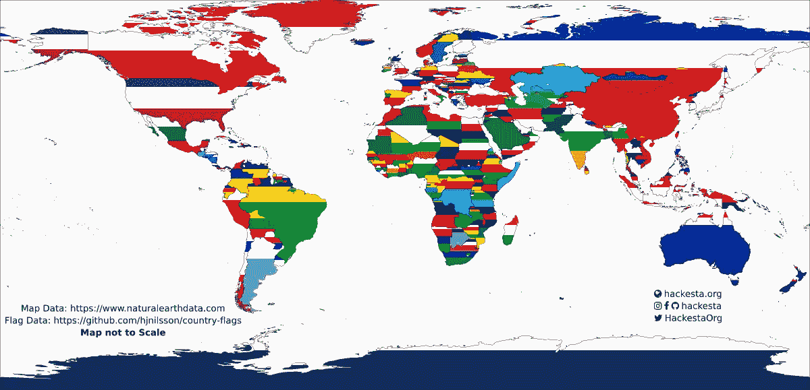

# 旗帜颜色可视化——从地理标志到传单，再到背面

> 原文：<https://towardsdatascience.com/flag-colours-visualisation-from-geopandas-to-leaflet-and-back-28f6400980f2?source=collection_archive---------27----------------------->

## 在不影响质量的情况下，创建一个具有多种颜色的多边形。

我一直对数据可视化很感兴趣，并且我是一个长期潜伏者。2019 年 7 月 1 日，[一个关于各大洲国旗颜色频率的帖子](https://www.reddit.com/r/dataisbeautiful/comments/c7lpmw/frequency_of_flag_colors_by_continent_imaginary/)引起了很多人的兴趣。正是从那篇文章中，我有了做这种观想的想法。

这个想法很简单(执行起来并不简单)，计算每面国旗的颜色比例，并用这些颜色在地图上标出每个国家。我有一个[以前的项目，使用国旗颜色比例来制作原子图标](https://github.com/HackeSta/atom-icons)，所以我知道我应该能够做到这一点。不幸的是，我错了，我花了三次尝试去正确地观想它。

在深入每个尝试的细节之前，这里是我使用的数据来源。

*   地图来源:[https://naturalearthdata.com/downloads/](https://naturalearthdata.com/downloads/)
*   旗帜:[https://github.com/hjnilsson/country-flags](https://github.com/hjnilsson/country-flags)

# 尝试 1 (Python + Geopandas):

在我以前的可视化(简单的 choropleth 地图)中，我一直使用 Geopandas。它可以非常容易地输出高质量的图像。

我做的第一件事是计算地图上每个国家的颜色比例。我修改了下面 [StackOverflow 帖子](https://stackoverflow.com/a/52879133/4698800)中的代码，以满足我的需要。

```
for index,row in map.iterrows(): # map is the GeoPandas variable
        country_code = map.loc[index,'ISO_A2'].lower()
        country_data=[]
        try:
            flag_image = Image.open(FLAGS_DIR+country_code+".png")
        except FileNotFoundError:
            continue
        flag_image = flag_image.convert("RGB")
        pixels = flag_image.getcolors(flag_image.width * flag_image.height)
        sorted_pixels = sorted(pixels, key=lambda t: t[0])
        dominant_pixels = []
        for pixel in pixels:
            if pixel[0]*100/(flag_image.width * flag_image.height) > 5: #Top 5 colours only
                dominant_pixels.append(pixel) for pixel in dominant_pixels:
            percentage = pixel[0]*100/(flag_image.width * flag_image.height)
            color = "#%02x%02x%02x" % pixel[1]  # HEX Conversion
            country_data.append({"color":color,"percentage":percentage})
        data[country_code] = country_data
```

当试图给这些国家上色时，这个尝试出现了问题。Geopandas 不能使用多种颜色填充多边形。有一段时间，我想过妥协，只用最主要的颜色填充。实现这一点也很困难，我找到的最接近的可能解决方案是这个 [Github 问题](https://github.com/geopandas/geopandas/issues/387)。

我无法填充最主要的颜色，所以我放弃了使用 Geopandas。

在上面坐了一会儿后，我想起 LeafletJS 使用 CSS 来设置地图的样式。因此，在将国旗颜色数据保存到 JSON 文件后，我开始了第二次可视化的尝试，现在是用活页 JS。

# 尝试 2:小册子

我对 LeafletJS 寄予厚望，在某种程度上，它是成功的。关于使用 CSS 支持渐变的传单，我几乎是正确的。

传单使 SVG 元素不支持 CSS 渐变，但他们自己的渐变元素。

我很容易就能涂上最主要的颜色，但是要做渐变却很难。

我必须为每个渐变创建元素，并将其链接到每个 SVG 路径。

我使用下面的代码向每个路径添加了国家代码

```
onEachFeature(feature,layer){
                layer.options.className = "country " + feature.properties.ISO_A2.toLowerCase()
            },
```

然后在传单地图的`add\`事件上，添加了以下代码

```
.on("add",function(){
            for(let pathElm of $(".country")){
                classes = Array.from(pathElm.classList);
                country = classes[classes.indexOf("country") + 1];
                flag = flagData[country]
                console.log(flag)
                $("body").append(`<svg viewBox="0 0 10 10" 
                xmlns:xlink="http://www.w3.org/1999/xlink">
                <defs>
                <linearGradient id="${country}" gradientTransform="rotate(90)">
                ${flag.map((entry,index) =>{
                    return `<stop offset="${flag.slice(0,index+1).reduce((a,b)=>{return {percentage: a.percentage + b.percentage}}).percentage}%" stop-color="${entry.color}" />`
                })}
                </linearGradient>
                </defs>
                </svg>`);
                $(pathElm)f.attr('fill',`url(#${country})`);
            }
```

这能够产生我想要的渐变地图，但是在添加属性后，我在[自然地球数据网站](https://www.naturalearthdata.com/downloads/10m-cultural-vectors/10m-admin-0-countries/)上看到了下面的免责声明

> *免责声明*
> 
> *自然地球矢量根据事实上的状态来绘制国家的边界。我们展示了谁实际控制了地面局势。请随意混搭我们的争议地区主题，以符合您特定的政治观点。*

为了避免以后的问题，我决定添加争议地区的地图，并用白色填充。

这需要一点重构，但是我可以用下面的代码轻松地合并这两个地图。

```
L.map('mapid',{
        center: [39.73, -104.99],
        zoom: 5,
        layers: [mapLayer,disLayer]
    });
```

我以为我完成了，但是将地图导出到一个好的图像被证明是不可能的。我尝试了许多插件，但没有一个产生足够好的图像。一个想法出现在我的脑海中，关于从开发者工具中复制 SVG 并使用 Inkscape 产生一个好的图像，但传单为不同的缩放级别呈现不同的路径。当地图完全缩小并变得详细，但只有放大的部分被渲染时，路径不太详细。

这次尝试也失败了，但给了我另一个想法。将 Geopandas 数据帧转换为 SVG。

# 尝试 3: Python + GeoPandas(导出到 SVG)

在使用 LeafletJS 失败后，我带着另一个想法回到了 GeoPandas。将 GeoPandas 导出为 SVG，然后对其应用渐变。我最初的想法是从传单生成的地图添加梯度，但并不需要。

[这篇博文在这次尝试中给了我很大的帮助](http://kuanbutts.com/2018/08/30/geodataframe-to-svg/)

我将博客中的代码添加到我的第一次尝试的代码中，并修改它以满足我的需要。

```
# SOURCE: http://kuanbutts.com/2018/08/30/geodataframe-to-svg/
def process_to_svg_group(row,dis=False):
    orig_svg = row.geometry.svg()
    doc = minidom.parseString(orig_svg)
    paths = doc.getElementsByTagName('path')
    pathssvg = []
    country_code = row['ISO_A2'].lower()
    if row['NAME'] == 'France':
        country_code = 'fr'
    if row['NAME'] == 'Norway':
        country_code = 'no'
    for path in paths:
        path.setAttribute('fill', 'url(#%s)'%(country_code))
        path.setAttribute('stroke-width','0.1')
        path.setAttribute('stroke','#000000')
        path.setAttribute('opacity','1')
        path.setAttribute('transform','scale(10,-10)')
        pathssvg.append(path.toxml())
    return ''.join(pathssvg)

processed_rows = []
def_rows = []

res_symdiff = gpd.overlay(gismap, dismap, how='difference')

for index,row in res_symdiff.iterrows():
    country_data=[]
    dominant_pixels = []
    stops = []    
    country_code = row['ISO_A2'].lower()
    if row['NAME'] == 'France':
        country_code = 'fr'
    if row['NAME'] == 'Norway':
        country_code = 'no' 
    try:
        flag_image = Image.open(FLAGS_DIR+country_code+".png")
    except FileNotFoundError:
        continue

    flag_image = flag_image.convert("RGB")
    # SOURCE: https://stackoverflow.com/a/52879133/4698800
    pixels = flag_image.getcolors(flag_image.width * flag_image.height)
    sorted_pixels = sorted(pixels, key=lambda t: t[0])

    for pixel in sorted_pixels:
        if pixel[0]*100/(flag_image.width * flag_image.height) > 1:
            dominant_pixels.append(pixel)
    print(dominant_pixels)
    sum = 0
    for x in dominant_pixels:
        sum += x[0]
    print(sum)
    for pixel in dominant_pixels:
        percentage = pixel[0]*100/sum
        print(percentage)
        color = "#%02x%02x%02x" % pixel[1]
        perc = 0
        if len(country_data) > 0:
            for x in country_data:
                perc += x['percentage']

        stops.append('<stop offset="%s%%" stop-color="%s" stop-opacity="1"/><stop offset="%s%%" stop-color="%s" stop-opacity="1"/>'%(perc,color,perc+percentage,color))
        country_data.append({"color":color,"percentage":percentage})
    grad = '''<defs>
            <linearGradient x1="0" x2="0" y1="1" y2="0" id="%s">
                %s           
            </linearGradient>
            </defs>
            '''%(country_code,''.join(stops))
    def_rows.append(grad)

    p = process_to_svg_group(row)
    processed_rows.append(p)

props = {
    'version': '1.1',
    'baseProfile': 'full',
    'width': '100%',
    'height': '100%',
    'viewBox': '{}'.format(','.join(map(str, gismap.total_bounds))),
    'xmlns': 'http://www.w3.org/2000/svg',
    'xmlns:ev': 'http://www.w3.org/2001/xml-events',
    'xmlns:xlink': 'http://www.w3.org/1999/xlink'
}
template = '{key:s}="{val:s}"'
attrs = ' '.join([template.format(key=key, val=props[key]) for key in props])

raw_svg_str = textwrap.dedent(r'''
    <?xml version="1.0" encoding="utf-8" ?>
    <svg {attrs:s}>
    <g>{data:s}</g>
    {grads:s}
    </svg>
''').format(attrs=attrs, data=''.join(processed_rows),grads=''.join(def_rows)).strip()
with open('out/map.svg', 'w') as f:
    f.write(raw_svg_str)
```

这能够产生地图



高质量地图
[https://i.imgur.com/2RD4s6k.png](https://i.imgur.com/2RD4s6k.png)

*我用 Inkscape 添加了文本和背景*

## 法国和挪威的奇特案例

在各种网站上分享地图后，许多人询问失踪的法国。我不擅长地理，但我相信我的代码不会漏掉一个国家。所以我做了一些调试和研究，发现我使用的 shapefile 没有存储法国和挪威的 ISOA2 数据。我的代码使用 ISO A2 数据将旗帜文件与地图进行匹配，因此缺少的数据会导致缺少的国家。我硬编码了几个 if 语句来包含国家，上面的代码为此进行了更新。

## 相关材料

*   [地质公园](http://geopandas.org/)
*   [小叶](https://leafletjs.com/)
*   [线性梯度](https://developer.mozilla.org/en-US/docs/Web/SVG/Element/linearGradient)

[Github 库](https://github.com/haideralipunjabi/country-flag-visualisation)

[在我的博客上阅读](https://blog.haideralipunjabi.com/posts/country-flag-visualisation/)
[在 Dev 上阅读](https://dev.to/haideralipunjabi/flag-colours-visualisation-from-geopandas-to-leaflet-and-back-4ohk)

打招呼:[**insta gram**](https://instagram.com/haideralipunjabi)|[|**Github**|](https://github.com/haideralipunjabi)|[|**脸书**](https://facebook.com/haiderali176)|[|**推特**](https://twitter.com/HAliPunjabi) | [**网站**|](https://haideralipunjabi.com/)[|**博客**](https://blog.haideralipunjabi.com/)