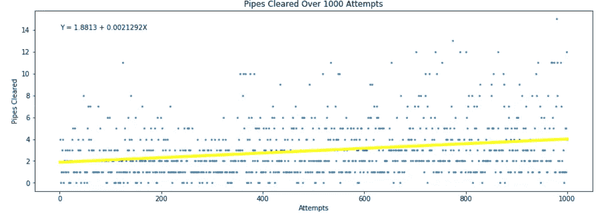
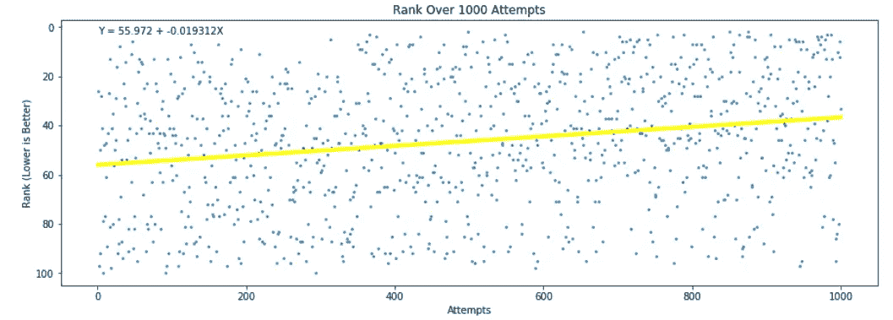
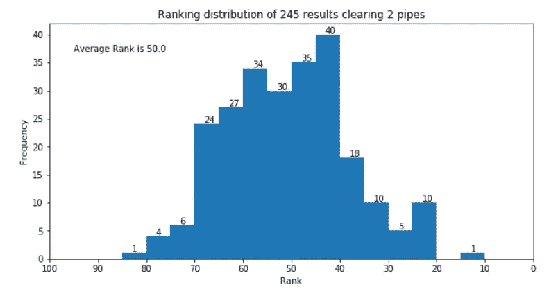
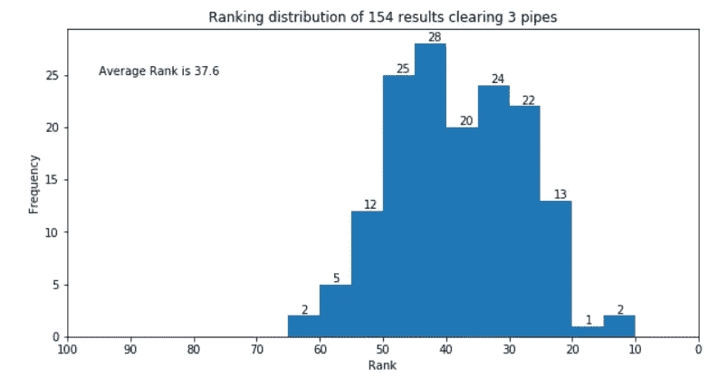
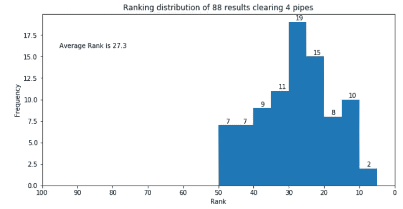
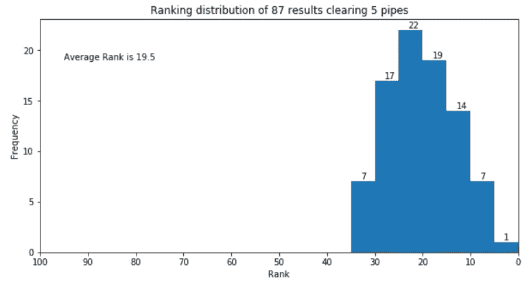
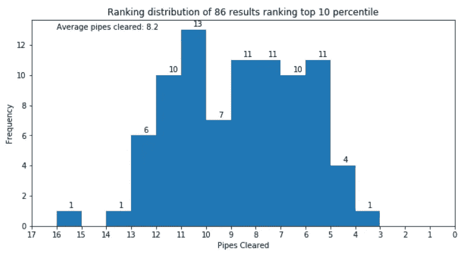

# flappy Royale——通过 1000 轮练习提高成绩

> 原文：<https://towardsdatascience.com/flappy-royale-improving-results-via-1000-rounds-of-practice-8ed0f5a55b53?source=collection_archive---------27----------------------->

## 背景

2013 年 5 月，一款名为 Flappy Bird 的极度病毒式手机游戏发布。这个游戏的前提极其简单——一只鸟拍打着翅膀飞过一个被有缝隙的管道包围的平台。触摸你死亡的任何管道，通过管道之间的缝隙拍打，你的分数增加一分。看似简单，但这个游戏实际上很难——对我来说。

The Original Flappy Bird

我记得我安装了这个游戏，然后在游戏中敲敲打打，却发现自己每次只能清理 1-2 个管道。我会看到其他几十个人清理 15、20、30 根管道，然后想知道我是否对自己的协调能力有极大的挑战。长话短说，经过无数次尝试后，我在同一天结束了愤怒辞职。

快进到 2019 年 7 月。我将在最后一天去中国西安看望我的祖父母，我的飞机将在晚上起飞。我看了一篇文章，提到了一款刚刚发布的新游戏，名为 Flappy Royale。和我 6 年前退出的游戏一样，这次他们加入了流行的皇家扭曲，所以我决定，为什么不再试一次？

Newly Released Flappy Royale

我最初玩 Flappy Bird 时发生的同样的事情在 Flappy Royale 中再次发生。遗憾的是，我每次只能清理 0-2 根管道。唯一的不同是，这一次有 100 名其他的时髦女郎和我一起玩，我也可以看到他们的进步，因为他们的排名很靠前。有了这种知名度后，我现在意识到我实际上并不是最差的 Flappy Bird 玩家，但实际上只是略低于我刚开始玩时的平均水平。现在有了下面的数据证明，我比平均水平略高😁。

## 查看我们的数据

为了基本了解我的性能如何随着时间的推移而提高，以及 Flappy Royale 的总体性能如何，我记录了 1000 次以上的尝试，清除了管道，并在 excel 中对 100 个同行进行了排名，并用 python 创建了一些简单的分析，希望大多数读者都能理解——

**跟踪超过 1000 次尝试后每次尝试清除的管道**

使用来自回归分析的数据，我生成了一条 Y = 1.88 + 0.00213X 的线。这意味着在开始时，我的技能水平是平均 1.88 管道清除我所做的每一次尝试。在 1000 次尝试的过程中，我取得了 0.00213 次额外管道清理的微小进步。这看起来很小，但是经过 1000 次的练习，我现在平均每次尝试清除 4 个管道，这是我开始时的两倍。下图显示了这一过程，每个点代表在 1000 次尝试中每次尝试清理的管道数量。回归线是黄色的，代表图表中的公式。

**追踪每 1000 次尝试的同行排名**

类似于对清除的管道使用回归分析，我对 100 个对等点实现的等级做了同样的事情，数字越小表示等级越好。我最初的平均等级是 56/100，每次尝试下降了 0.02，在 1000 次之后，我现在的平均等级是 37/100。这由线 Y = 55.97 + -0.0193X 表示。我翻转 Y 轴来表示等级值下降作为更好的结果，因此由上升趋势线显示，即使公式显示斜率为负。

Flappy Royale 的其他玩家表现如何？

Flappy Royale incorporated 的一个很棒的功能是一次创建 100 个玩家的回合，并报告你在这 100 个玩家中的表现。通过 1000 轮比赛，我能够收集足够的数据来了解 Flappy Royale 玩家的总体表现。结果是，能够清理 2 个管道使你刚好符合平均水平，清理 3 个管道使你接近前 38%，清理 4 个管道使你接近前 27%。我还幸运地清理了 5 个管道，收集了足够多的数据，这使我在清理管道的 87 次中平均排名前 20%。如果你想一直排在前 10 名，你可能想一次清理至少 8 个管道。下面是通过收集的数据表示这些结果的直方图。

Histogram representing the average rank of someone who is able to clear 2 pipes is right in the middle at 50

Histogram representing the average rank of someone who is able to clear 3 pipes is above average at 38

Histogram representing the average rank of someone who is able to clear 4 pipes is near top quartile

Players able to clear 5 pipes on average should be proud of themselves as they are in the top 20% of all players

If you want to be in the top 10% of all players, you will want to clear around 8 pipes on average

为了查看分析的来源，我在下面附上了我的备份—

Excel 文件-

 [## bry feng/个人-项目

### 此时您不能执行该操作。您已使用另一个标签页或窗口登录。您已在另一个选项卡中注销，或者…

github.com](https://github.com/bryfeng/personal-projects/blob/master/flappy%20data.xlsx) 

分析-