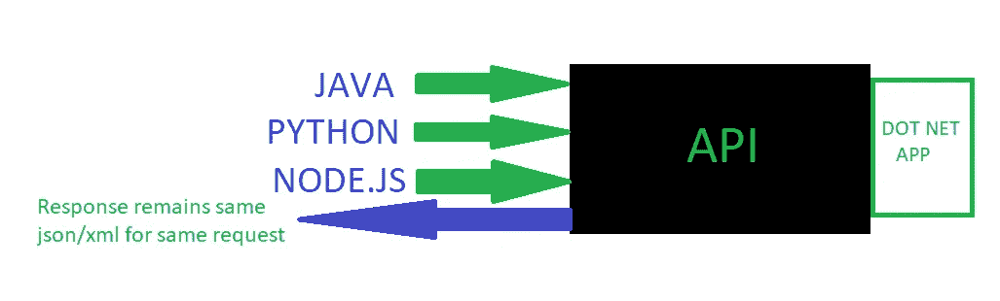
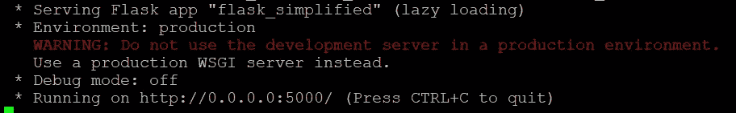

# flask:API 开发的捷径

> 原文：<https://towardsdatascience.com/flask-an-easy-access-door-to-api-development-2147ae694ceb?source=collection_archive---------8----------------------->


Photo by [Chris Ried](https://unsplash.com/photos/ieic5Tq8YMk?utm_source=unsplash&utm_medium=referral&utm_content=creditCopyText) on [Unsplash](https://unsplash.com/search/photos/programming?utm_source=unsplash&utm_medium=referral&utm_content=creditCopyText)

世界经历了巨大的转变；从在过程语言中将一段代码分离为函数到库的开发；从 RPC 调用到面向服务架构(SOA)中的 Web 服务规范，如 SOAP 和 REST。

这为 Web APIss 和微服务铺平了道路，在 Web API 和微服务中，提供特定问题解决方案的代码片段被公开(私下或公开)，代码可以作为黑盒被 API 消费者访问，他们只需要知道所谓的接口，它定义了特定代码片段的输入和输出。

我们使用谷歌、脸书、推特直接登录许多系统，不需要注册每个特定的网站。感谢这些巨头提供公开可用的 Web APIs 进行授权，这使得开发者的生活以及用户的生活都变得非常轻松。

不要被上面这么多的陈述搞得不知所措。我相信在你读完它之前，你会对 API 有很好的理解。

现在，API 到底是什么？

我一直在说这个缩写 API(应用程序接口)。但是到底是什么呢？简而言之，它只是以这样一种方式公开的一小段代码，任何语言的任何应用程序，无论是 Java、Python 还是 Node.js，都可以简单地发送一个请求，以获得某些特定输入的一些输出。它只是底层应用程序和外部世界之间的接口。



Client and Target Application(Exposed as API) are in different languages, still can communicate

如上所示，客户使用不同的语言，但是他们将 API 称为黑盒，因为底层技术是在. Net 中。尽管如此，他们还是能够交流。所有客户端对特定请求的响应保持不变。可能是 json，也可能是 XML。

**现在言归正传，为什么是 python，为什么是 flask？**


Python and Flask combination makes API development very easy

在我的工作中，从事与机器学习相关的任务，我必须为一些特定的任务开发后端 API，其中大部分都与图像上传、下载和 GRPC 调用相关，并且要求在短时间内完成。

来自 JAVA 背景，当我接触 python 的时候，我发现做一门编程语言是如此的容易。没有样板代码，有丰富的库和语法(一开始可能会让你生气，但是你会意识到适当的缩进是如何导致开发出漂亮的代码片段的)。所以，这显然是对 python 的喜爱。最重要的是，当谈到机器学习和深度学习时，python 是杀手。

下一个任务是为 python 选择一个定义良好的框架，用于 API 开发。我有两个选择:Django 和 Flask(还有很多其他的选择，但是这两个是在很多支持下使用的)。我做了一些研究，我选择 flask 的原因是它比 Django 更 pythonic 化。所以，我也有这个问题的答案。现在是执行的时候了。因此，有了 Flask，后端在几天内就准备好了，所有的 API 都是作为 REST 调用开发的

那么，现在说得太多了，让我们把手放到装满蟒蛇的瓶子里。我知道这听起来很可怕。但是蟒蛇是无毒的，所以这是。相信我。

> 注意:期待这篇文章中的大量代码。原因是我不想只显示 hello world 类型的代码。因为很多网站已经这样做了，你不需要再看到一个同样的帖子。
> 
> 在这里，我希望您对 Flask 和 python 有一个良好的体验，这样您就可以在您的应用程序中使用它们，这些应用程序需要一些常见的功能，比如在读取文件和上传文件后发送 json 响应。所以，系上安全带，开始编码吧。

让我们开发两个 Web-API，一个带有 **GET** ，一个带有 **POST** 。

# **获取 API:**

```
**flask_simplified.py**from flask import json
from flask import Response
from flask_cors import CORS
from flask_api import FlaskAPIAPP = FlaskAPI(__name__)
CORS(APP)@APP.route("/getJsonFromFile/<filename>", methods=['GET'])
def get_json_response(filename): labels_dict = {}
    response_dict = {}
    try:
        with open(filename, 'r') as labels:
            labels_dict = json.load(labels) ***response_dict[STATUS] = "true***
        ***response_dict["labels_mapping"] = labels_dict
        js_dump = json.dumps(response_dict)
        resp = Response(js_dump,status=200,
                        mimetype='application/json')*** except FileNotFoundError as err:
        response_dict = {'error': 'file not found in server'}
        js_dump = json.dumps(response_dict)
        resp = Response(js_dump,status=500,
                        mimetype='application/json') except RuntimeError as err:
        response_dict = {'error': 'error occured on server side.    
                          Please try again'}
        js_dump = json.dumps(response_dict)
        resp = Response(js_dump, status=500,
                        mimetype='application/json') return respif __name__ == '__main__':
    APP.run(host='0.0.0.0', port=5000)
-------------------------------------------------------------------
```

上面的代码显示了如何使用 flask-API 创建一个简单的 GET 调用。您可能会觉得这里有很多代码。但是相信我。为了写好代码，你应该开始写好代码，并把它作为一种习惯。因此，它拥有你在编写代码时应该考虑的所有元素，比如适当的缩进(这对 python 来说是必要的)，遵循 PEP8 python 约定并包括异常。

**代码解释:**

```
**APP = FlaskAPI(__name__):**
sends the __name__ to FlaskApi Constructor to instantiate Flask Api object, which will be used accross the application
**CORS(APP):** this might not be required for now but is required in case your client is browser(eg. javascript), then cross origin requests will be allowed by the server else you might get CORS related errors
```

下一部分解释负责服务请求的实际方法:

```
**@APP.route("/getJsonFromFile/<filename>", methods=['GET']):** defines the method type and uri to be hit by client for this method**def get_json_response(filename):** filename parameter should be kept same which transports the path parameter to the method parameter and is used accross this method**labels_dict = {}
response_dict = {}:** these are some local dictionaries created. labels_dict contains the key-value pairs in the labelsFile.json.
response_dict creates the actual json which contains either the labels_dict key or error key to be returned along with STATUS; depending on response.**try:
    with open(filename, 'r') as labels:
        labels_dict = json.load(labels)** Above code opens the file. This json file is loaded as key-value pair in labels_dict***response_dict["*LABELS_MAPPING*"] = labels_dict
    js_dump = json.dumps(response_dict)
    resp = Response(js_dump,status=200,
                        mimetype='application/json')*** *This is the most important part of code, which shows the Flask api returning response for the request. Response is the Flask's inbuilt way to sendback data to client.***Then comes Exceptions, which are self Explanatory****if __name__ == '__main__':
    APP.run(host='0.0.0.0', port=5000)** When we run application as script, the Flask's inbuilt server starts on port 5000 due to APP.run
Here we instruct APP(which we defined already as Flask's instance), to run the server at 0.0.0.0(localhost/127.0.0.1) which is Flask's inbuilt WSGI server
```

如何测试我的第一个烧瓶应用程序？

测试起来真的很简单。只需保存代码并运行文件

```
python3 flask_simplified.py
```

您将看到类似这样的内容(如果脚本中没有错误) :



Flask Server running on 5000 port

如图所示，正在运行的服务器是 python 内置的 Flask server(APP.run 在 localhost:5000 启动服务器)，显然**不应该用于生产**。必须使用 uwsgi 或 gunicorn 或任何其他 wsgi 生产服务器。我将有一篇单独的文章，介绍什么是 WSGI，以及如何在 uwsgi 应用服务器和 nginx 上安装和部署您的应用程序，并将其作为 web 服务器，以使其可以投入生产。

让我们使用下面的 cURL 命令对此进行测试:

```
curl localhost:5000/getJsonFromFile/labelsFile.json
```

其中 labelFile.json 内容可以是文件中的键值对，如下所示:

```
{"ironman":"1",
"deadpool":"2",
"thor":"3",
"captainAmerica":"4",
"angryYoungMan":"5",
"blackPanther":"6",
"Wolverine":"7",
"thanos":"snapItAll"
}"""don't mind; keeping ironman at 1 , fan detected. ;)"""
```

根据您提供的文件名，您应该会看到响应或异常。

```
Response:
{"LABELS_MAPPING": {"Wolverine": "7", "angryYoungMan": "5", "blackPanther": "6", "captainAmerica": "4", "deadpool": "2", "ironman": "1", "thanos": "snapItAll", "thor": "3"}, "STATUS": "true"}
```

# **发布 API:**

对于 post 请求，可以使用 request.form['form_data']从请求中提取 JSON 主体，并且应该提供 yes，methods = "POST "

如果我们用 post 请求来做一些事情，那将会更有趣，这在现实生活中更常用:**上传图片到服务器**

**让我们上传一些图片到服务器(现在你有一些有趣的事情要做了):)**

在这一部分中，我将解释使用 upload 方法的 POST 调用，在这种方法中，文件可以随请求一起发送，并可以保存在服务器中。

```
**UPLOADING FILES:**
@APP.route("/uploadFiles", methods=['POST'])def upload_file():
"""uploads file to the server. This will save files to the
directory where server is running""" response_dict = {}
    error_files = ""
    new_filename = "" try:
        new_filename = request.form['FILE_NAME']
        **recieved_files = request.files.getlist(FILES_RECEIVED_LIST)**
        for each_file in recieved_files:
            each_file_name = each_file.filename
            try:
                **each_file.save(os.path.join(".", new_filename +
                           each_file.filename.replace(" ", "")))**
            except RuntimeError as err:
                print("\nError in saving file: %s :: %s",
                      each_file.filename, err)
                error_files = error_files + "," + each_file.filename response_dict[STATUS] = "true"
        response_dict[ERROR_FILES_LIST] = error_files
        js_dump = json.dumps(response_dict)
        resp = Response(js_dump, status=200,   
                         mimetype='application/json') except RuntimeError as err:
        response_dict = {'error': 'error occured on server side.
                          Please try again'}
        js_dump = json.dumps(response_dict)
        resp = Response(js_dump, status=500,
                        mimetype='application/json')
    return resp
```

**代码解释:**

```
 **new_filename = request.form['FILE_NAME']** FILE_NAME contains the filename in the request.(see  the cURL request below) **recieved_files = request.files.getlist(FILES_RECEIVED_LIST)** FILES_RECEIVED_LIST contains the files in the request. (see  the cURL request below) **for each_file in recieved_files:
            each_file_name = each_file.filename** iterate through all the files recieved to save one by one try:
                **each_file.save(os.path.join(".", new_filename +
                           each_file.filename.replace(" ", "")))** all files are saved to the path given by os.path(. will save in location where server is running ; you could give some absolute or relative path here. I am appending new_filename to each_file.filename where each_file.filename is actual name of file. You could replace the each_file.filename with new_filename) except RuntimeError as err:
                **error_files = error_files + "," + each_file.filename** in case file is not saved, the error_files will contain all the filenames which are not saved which will be sent back to the client in json response**response_dict[ERROR_FILES_LIST] = error_files** contains ERROR_FILES_LIST key in json response which contains all the error files names seperated by ","
           ***Rest of the code is self explanatory***
```

这可以使用以下 cURL 请求来触发:

```
***curl -F "FILES_LIST=@./file1.jpg" -F "FILES_LIST=@./file2.jpg" -F "FILE_NAME=new_file" localhost:5000/uploadFiles***where file1.jpg and file2.jpg are two files to be uploaded and are present in the directory from where cURL request is triggered
```

您将看到文件在运行 Flask 服务器脚本的同一位置生成。

***我的 GitHub 页面上有完整的代码:***

[](https://github.com/tseth92/flask_simplified) [## tseth 92/flask _ 简化版

### 在 GitHub 上创建一个帐户，为 tseth92/flask_simplified 开发做贡献。

github.com](https://github.com/tseth92/flask_simplified) 

**结论**:

在这篇短文中，我试图解释如何使用 Flask 构建 API，使用 GET 请求处理读取 json 文件，使用 POST 请求处理在服务器中上传文件。因此，使用 Flask，在很短的时间内，并且很少花费精力编写一些有纪律的基本代码，您就可以在很短的时间内运行 API，用于在 vision 中短时间上市的应用程序。

**下一步:**

阅读我的另一篇文章[关于归档应用程序(这篇文章的扩展),它展示了 Docker 的来龙去脉，并在这篇文章中归档了 Flask 应用程序。有了 Dockerization 的帮助，您可以轻松地扩展 API 开发，并获得更多乐趣。](https://medium.com/@tusharseth93/is-docker-really-worth-your-time-e86dbdf374d9)

[](https://medium.com/@tusharseth93/is-docker-really-worth-your-time-e86dbdf374d9) [## Docker 真的值得你花时间吗？

### Docker 和 Containers 已经成为一个时髦的词汇。Docker 开源变得如此流行…

medium.com](https://medium.com/@tusharseth93/is-docker-really-worth-your-time-e86dbdf374d9) 

我计划在另一篇关于**的文章中进一步解释如何在一个生产就绪的服务器上构建这个应用程序，比如 uwsgi，并在其上运行 nginx**

感谢阅读！！。对于任何建议，疑问或讨论，在评论区拍摄。

在 medium 和 GitHub 上关注我，获取即将发布的文章；直到那时，快乐的蟒蛇和好运:)