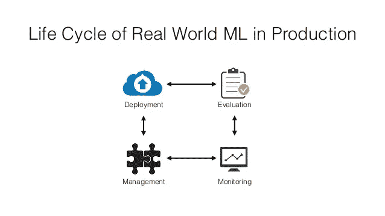
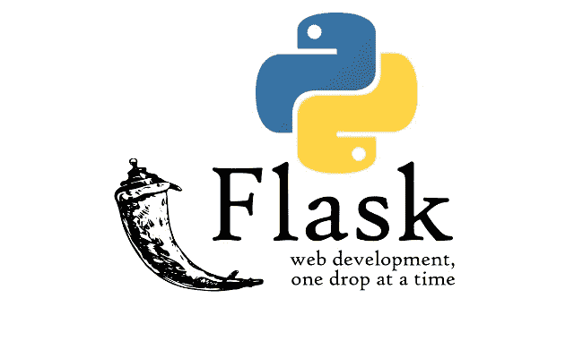

# 用于在线机器学习部署的 Flask 和 Heroku

> 原文：<https://towardsdatascience.com/flask-and-heroku-for-online-machine-learning-deployment-425beb54a274?source=collection_archive---------16----------------------->



(Source = [https://image.slidesharecdn.com/slides-170512093121/95/deploying-machine-learning-models-to-production-8-638.jpg?cb=1507239367](https://image.slidesharecdn.com/slides-170512093121/95/deploying-machine-learning-models-to-production-8-638.jpg?cb=1507239367))

# 介绍

感谢 Pandas、scikit-learn 和 Matplotlib 等库，使用 Python 中的简单机器学习(ML)算法开始探索数据集和进行一些初步预测相对容易。虽然，为了使这些训练好的模型在现实世界中有用，有必要分享它们，并使它们可以在网上访问，以做好预测的准备。只有这样，机器学习才能被用来造福社会。

我最近一直在使用 yei-Cheng 教授的[输血服务中心数据集](https://www.openml.org/d/1464)，我使用随机森林分类器实现了 91.1%的预测准确率。因此，我决定把这个模型放到我的[个人网站](https://pierpaolo28.github.io/)上。为此，我使用了 Heroku 和 Python 库 Flask。

作为进一步的发展，我还决定使用 Android Studio 为我的个人网站创建一个 Android 应用程序，这样我的 ML 模型也可以在 Android 设备上运行。

# 瓶



(Source = [https://kenya-tech.com/wp-content/uploads/2019/01/flask-python.png](https://kenya-tech.com/wp-content/uploads/2019/01/flask-python.png))

Flask 是一个用于为 Python 创建 web 应用的 Web 框架。在开发在线 ML 模型的情况下，这可以通过使用三个 python 文件来完成:

1.  **model.py** =在这个文件中，ML 模型应该被实现和训练。然后应该使用 *Pickle 库*保存训练好的模型，以便在网络上使用时用于给出实时预测。
2.  **app.py** =在这个文件中 Flask 用于处理我们从 request.py 获得的 *POST* 请求，然后返回结果。为此，使用 *Pickle 库*检索训练好的 ML 模型。
3.  **request.py** =用于向服务器请求特性并检索结果。

**app.py** 的一个基本例子可以是:

```
import numpy as np
from flask import Flask, request, jsonify, render_template
import pickleapp = Flask(__name__)# Code to load ML model@app.route('/')
def home():    
     return render_template(*“filename.html”*)@app.route('/ml-model', methods=['POST'])
def run_model():
     # Code to use the trained model to make real time predictions
     return render_template(*“filename.html”, result*)if __name__ == '__main__':
     app.run()
```

如果我们想要添加一些 HTML、CSS 或任何其他类型的内容来改善模型的在线图形，可以通过在我们的 **model.py** 、 **app.py** 和 **request.py** 文件所在的同一个工作目录中创建一个 *templates* 文件夹来实现。这些文件必须包含在*模板*文件夹中，因为当调用 **app.py** 中的*render _ template(" filename . html ")*时，Flask 将默认只在*模板*文件夹中查找文件。

仅使用 Flask，我们就可以使用本地服务器在本地机器上运行我们的模型。如果我们想让我们的模型在网络上可用，我们可以将我们的 Flask 应用程序部署到一个在线平台上，比如 Heroku。

# 赫罗库


(Source = [https://pbs.twimg.com/profile_images/689189555765784576/3wgIDj3j.png](https://pbs.twimg.com/profile_images/689189555765784576/3wgIDj3j.png))

Heroku 是一个云平台，可用于部署网站和其他服务。为了使用 Heroku，有必要在你的机器上安装: [Heroku 账号](https://signup.heroku.com/dc)、 [Heroku CLI 工具](https://devcenter.heroku.com/articles/heroku-cli#download-and-install)和 git。

依次地，有必要:

1.  在我们的 Flask 应用程序所在的目录中创建一个 git 存储库。
2.  登录我们的 Heroku 账户。
3.  创建一个 Heroku 项目。
4.  创建一个 requirements.txt 和 Procfile。
5.  将目录中的所有文件添加到存储库中。
6.  将应用程序推送到 web 上！

前三个步骤可以通过在命令提示符下依次运行以下命令来实现。

```
git init
heroku login
heroku create
```

创建 requirements.txt 文件需要告知 Heroku 运行 Flask 应用程序需要什么库。因此，在 requirements.txt 文件中，我们为每一行写一个所使用的所有库的名称。对于这个应用程序，Procfile 只需要包含一行文本(如下所示)。Procfile 需要让 Heroku 知道我们希望执行什么类型的应用程序。

```
web: gunicorn app:app
```

然后，可以通过在命令行中顺序运行以下命令来执行第五步和第六步。

```
git add .
git commit -m "Committing all the directory files to Heroku"
git push heroku master
heroku open
```

使用 *heroku open* 命令应该可以打开已经部署了 Flask 应用程序的网页。或者，通过在线登录我们的 Heroku 帐户，可以找到部署我们模型的链接。访问 Heroku 网站可能特别有用，尤其是在我们的 Flask 应用程序午餐期间出现任何问题的情况下。

# 结论

这是一个关于如何在线部署你的机器学习模型的简单介绍。如果你想了解更多关于如何使用 Flask 编写 Web 应用程序的信息，这里有一些有用的参考资料[1，2，3]。

我的在线机器学习模型在[这里](https://pierpaolo28.github.io/Projects/flask.html)可以找到，我用来设计它的所有代码都可以在我的 [GitHub 页面](https://github.com/pierpaolo28/Artificial-Intelligence-Projects/tree/master/ML-Deployement)上找到。

# 联系人

如果你想了解我最新的文章和项目[，请在媒体](https://medium.com/@pierpaoloippolito28?source=post_page---------------------------)上关注我，并订阅我的[邮件列表](http://eepurl.com/gwO-Dr?source=post_page---------------------------)。以下是我的一些联系人详细信息:

*   [领英](https://uk.linkedin.com/in/pier-paolo-ippolito-202917146?source=post_page---------------------------)
*   [个人博客](https://pierpaolo28.github.io/blog/?source=post_page---------------------------)
*   [个人网站](https://pierpaolo28.github.io/?source=post_page---------------------------)
*   [中型型材](https://towardsdatascience.com/@pierpaoloippolito28?source=post_page---------------------------)
*   [GitHub](https://github.com/pierpaolo28?source=post_page---------------------------)
*   [卡格尔](https://www.kaggle.com/pierpaolo28?source=post_page---------------------------)

# 文献学

[1]如何使用 Flask 构建 web 应用并部署到云上。萨尔瓦多·维拉隆。访问:[https://www . freecodecamp . org/news/how-to-build-a-web-application-using-flask-and-deploy-it-to-the-cloud-3551 c 985 e 492/](https://www.freecodecamp.org/news/how-to-build-a-web-application-using-flask-and-deploy-it-to-the-cloud-3551c985e492/)。

[2]教程:将机器学习模型部署到 web。剑桥火花，亚历山大罗伯逊。访问:[https://blog . Cambridge spark . com/deploying-a-machine-learning-model-to-the-web-725688 b 851 c 7](https://blog.cambridgespark.com/deploying-a-machine-learning-model-to-the-web-725688b851c7)。

[3]使用 flask 部署一个机器学习模型。[赫曼维亚斯](https://hackernoon.com/@vyashemang?source=user_popover)。访问:[https://hacker noon . com/deploy-a-machine-learning-model-using-flask-da 580 f 84 e 60 c](https://hackernoon.com/deploy-a-machine-learning-model-using-flask-da580f84e60c)。