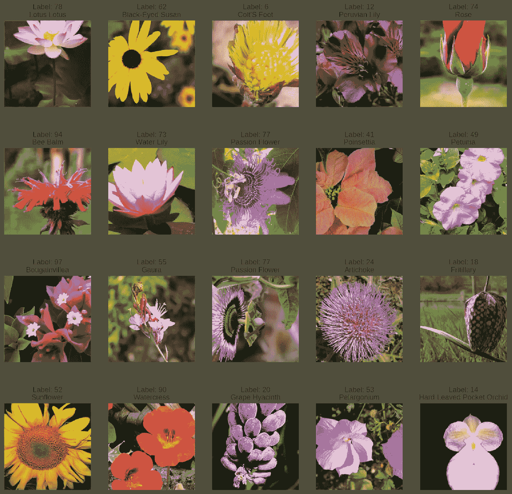
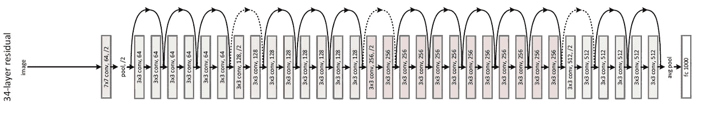
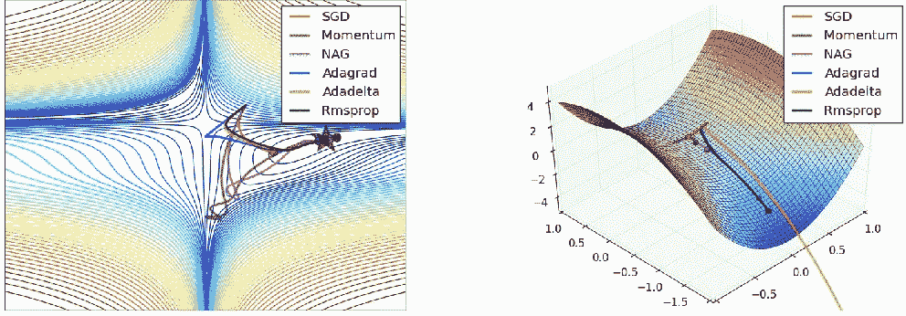
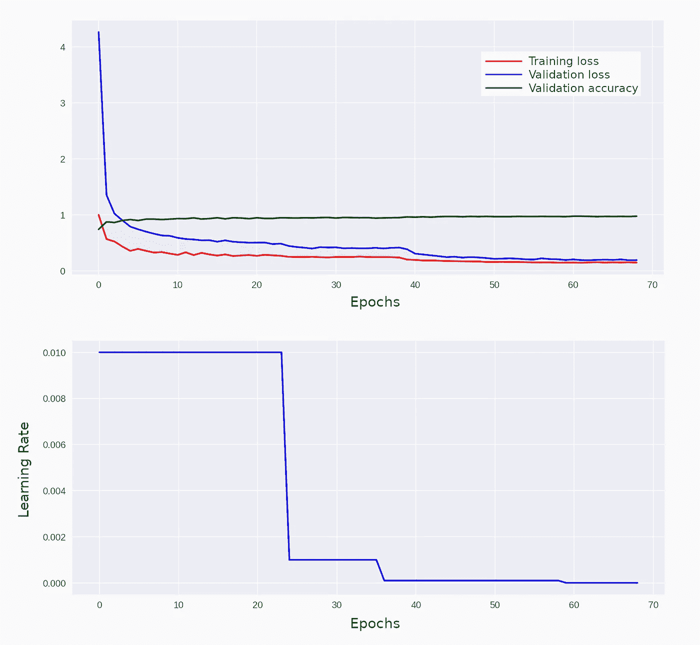
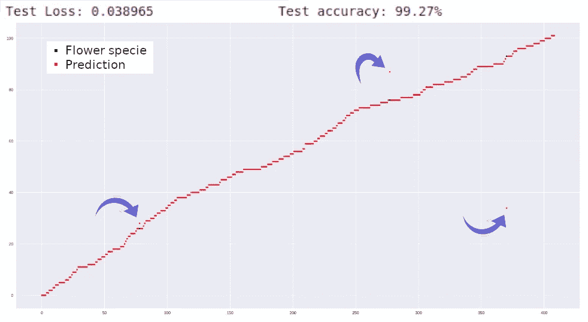
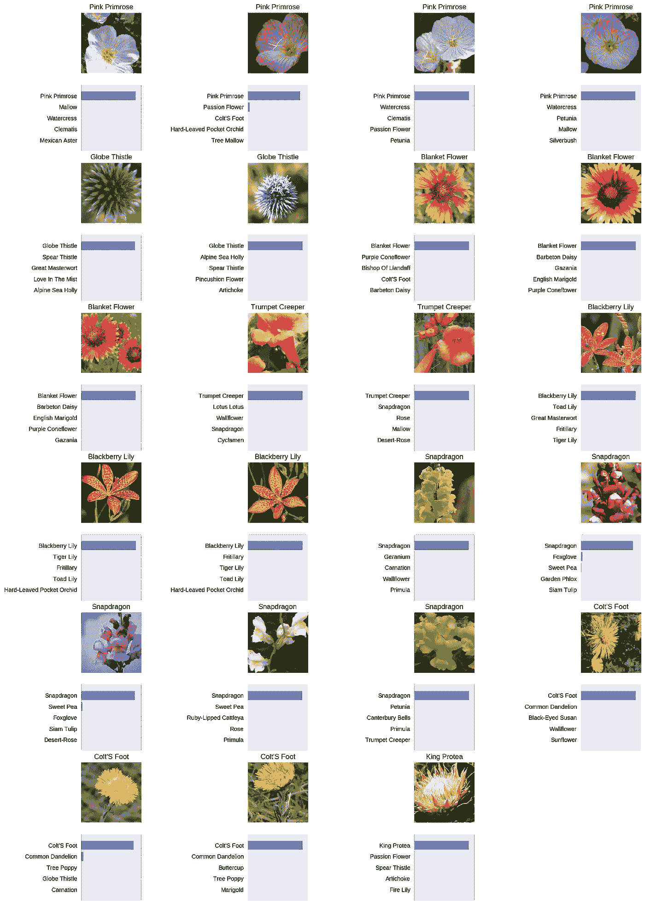

# 花卉种类分类器

> 原文：<https://towardsdatascience.com/flower-species-classifier-c8893030cd90?source=collection_archive---------18----------------------->

## 建立一个图像分类器来识别 102 种不同的花卉

*人工智能深度学习卷积神经网络
Python py torch Numpy Matplotlib Jupyter 笔记本*


Photo by [John-Mark Smith](https://unsplash.com/@mrrrk_smith?utm_source=medium&utm_medium=referral) on [Unsplash](https://unsplash.com?utm_source=medium&utm_medium=referral)

在这篇文章中，我概述了我开发的项目，该项目使我获得了 Udacity 深度学习纳米学位项目的奖学金。


My Badge of Approval

# 背景

我开发这个项目是作为由 *Udacity* 和*脸书*举办的 PyTorch 奖学金挑战评估的最终测试。


See the original announcement in [this link](https://blog.udacity.com/2018/10/introducing-the-pytorch-scholarship-challenge-from-facebook.html)

在这两个月的挑战中，我第一次接触了人工智能开发。除了观看视频和完成课堂上的评估，我还加入了一个私人 Slack 社区。因此，我可以与项目中的同行和教练联系，分享我的进步，获得反馈，提出问题，并帮助其他学者完成挑战。

# 挑战

构建深度学习模型，从图像中识别 102 种花卉。

最终应用程序接收用户提供的图像，并预测成为这些已知物种之一的可能性。

# 发展

## 加载数据

在[此链接](http://www.robots.ox.ac.uk/~vgg/data/flowers/102/index.html)中找到的图像数据集包含了 7370 张在不同角度和光照下拍摄的花朵照片。

下面可以看到几个例子。



## 设置图像子集

我将图像随机分为三组:

```
Training  :  6552 images  /  205 batches
Validation:   409 images  /   18 batches
Testing   :   409 images  /   18 batches
```

## 数据扩充

对于这个项目，我选择对**训练集**使用图像归一化和数据增强。

作为第一步，我在每个图像中随机选择四个变换中的一个，给定被选择的概率:

```
• 16,67% — Horizontal flip
• 16,67% — Vertical flip
• 33,33% — Random rotation, in a range of 360 degrees
• 33,33% — Keep the image untouched
```

在那之后，我在图像中进行了随机裁剪，并将它们的尺寸调整为 224x224 像素。

对于**测试**和**验证集**，我只调整了图像的大小，并对每张图像进行了 224x224 像素的中心裁剪。

## 构建分类器

为了检测图像中的特征，我使用了一个预先训练好的网络，可以在包 [torchvision.models](https://pytorch.org/docs/0.4.0/) 中找到。经过在 ImageNet 数据集上的训练，这些模型可以识别图像中的大量特征。然而，在它们的最后部分附加的分类器将图像分类到除了包含在数据集中的花卉种类之外的类别中。

于是，瞄准最终目标，我选择了 [ResNet-152](https://arxiv.org/abs/1512.03385) 型号。我保留了它预先训练好的卷积层，并替换了它的分类器，建立了一个新的网络来将图像分类到新的类别中。



Representation of a ResNet with 34 layers

我的全新分类器是一个全连接的网络，包含一个 2048 节点的输入层、一个 1000 节点的隐藏层和一个输出层，用于将输入数据分类为 102 个类别。

一旦我建立了我的模型，是时候训练它了！

## 训练网络

在测试了许多优化器之后，我选择了 Adagrad。这是一个非常强大的优化下降训练损失非常快。然而，有必要对这种能力进行一些控制。否则，这种强度可能会转化为爆炸梯度，而不是收敛到最佳解决方案。为此，我引入了一个学习率调度器，我将在下一节详细介绍它。



Comparison of different optimizers

我将网络培训过程分为三个阶段，如下所述。

**培训阶段 1:**

这里的重点是训练分类器。

由于卷积层已经过预先训练，它们能够识别图像中各种各样的特征。所以，我冻结了他们的参数，禁止他们更新。因此，所有的努力都是为了调整分类器的权重。

为了限制 Adagrad 能力，我引入了一个调度器，以便在误差函数达到平稳状态时降低学习速率。学习率从 0.01 开始，在平稳期减少 0.1。一旦学习率低于 0.0001，这个阶段就被中断。

在这个训练阶段，执行了 39 个时期，在验证数据集中提供了 94.62%的准确度。

```
Epoch: 39: lr: 0.00010000 Training Loss: 0.412109
Validation Loss: 0.232272 Validation accuracy: 94.62%
```

**训练第二阶段:**

由于分类器已经知道要做什么，是时候微调卷积层的权重了！

为此，我解冻了所有网络参数，将学习率设置为 0.0001，并对整个模型进行了 20 个时期的训练。

在这个训练阶段结束时，验证准确率为 96.58%。

```
Epoch: 59: lr: 0.00010000 Training Loss: 0.201783
Validation Loss: 0.141651 Validation accuracy: 96.58%
```

**训练第三阶段:**

在这一点上，即使我已经获得了一个很好的结果，我决定推进我的网络的极限！

我将学习率降低到 0.000001，只是对分类器权重进行一些小的调整，并运行其他 10 个时期的训练。

然后，验证准确率达到了令人印象深刻的 97.07%。

```
Epoch: 69: lr: 0.00000100 Training Loss: 0.187415
Validation Loss: 0.142964 Validation accuracy: 97.07%
```



Parameters evolution within the whole training process

# 最终测试

在这一点上，网络在识别训练和验证图像方面足够准确，并以超人的准确性对它们进行分类。

该网络的最终测试是查看一个完全未知的数据集，以正确分类图像。

我想象不出比这更好的结果了！该网络以 99.27%的惊人准确率执行了这项任务，在 409 幅图像中只漏掉了 3 幅！



The network missed only 3 of 409 images

# 结果

作为最终结果，该网络接收一幅图像作为输入，并对该花的五个最可能的物种进行预测。

这个项目的一个实际应用例子是一个手机应用程序，它显示相机拍摄的花的名称。

您可以在下面看到一些输出示例。

请注意，网络不仅预测正确的类别，而且对此非常确定。



这个项目的所有代码都可以在我的 GitHub 配置文件中找到:

[](https://github.com/silviomori/udacity-deeplearning-pytorch-challenge-lab) [## Silvio mori/uda city-深度学习-py torch-挑战-实验室

### PyTorch 挑战实验室的代码存储库

github.com](https://github.com/silviomori/udacity-deeplearning-pytorch-challenge-lab)