# 深度学习中的流动张量和堆积参数

> 原文：<https://towardsdatascience.com/flowing-tensors-and-heaping-parameters-in-deep-learning-1eaa06390406?source=collection_archive---------17----------------------->

*可训练参数计数的公式是作为层参数和输入特征的函数为几个流行层开发的。然后将结果与运行模型时 Keras 报告的结果进行核对……*

深度学习模型是参数快乐的。可以肯定地说，他们从未遇到过他们不喜欢的参数！采用数百万个参数的模型太常见了，有些甚至达到数十亿个。感谢低级库，如 TensorFlow、PyTorch 等……对于繁重的工作，感谢高级库，如 Keras，对于易用性，现在很容易快速构建这样的模型。但是，了解这些参数是如何从基础知识中产生的，对于超越深度学习的黑箱方法非常重要。这就是这篇文章的目的——也许可以帮助某人回答一两个深度学习工程师角色的面试问题！

运行 Keras 的最有用的输出是进入/离开每一层的数据/张量的形状以及该层中可训练参数的计数。对于深度学习的常规实践者来说，这些信息可以快速确认 Keras 正在运行他们为其编程的内容。但对于那些刚接触深度学习的人来说，可能不会立即清楚这些是如何发生的。在这里，我们看看一些流行的层的内部工作，不太深，但足以得出参数的数量作为层参数的函数。我们调和了喀拉斯告诉我们的东西。这里有一个简要的概述。

1.  选择一些常见的层，如密集层、嵌入层、RNN 层(LSTM/GRU)和卷积层(Conv1D/Conv2D)等。由于篇幅原因，我们将在本系列的下一篇文章中讨论卷积层。
2.  对于每一层，开发可训练参数数量的公式，作为层特定细节的函数，如单元数量、过滤器及其大小、填充等…以及输入细节，如特征数量、通道等。我们进一步获得离开层的数据/张量的预期形状
3.  运行 Keras 指南中描述的[视频问答模型](https://keras.io/getting-started/functional-api-guide/)，并确认我们的公式/分析对于可训练参数和输出形状是正确的。

这里显示的片段的完整代码可以照常从 [github](https://github.com/ashokc/Flowing-Tensors-and-Heaping-Parameters-in-Deep-Learning) 下载。

# 1.层次丰富

深度学习模型是一个连接层的网络，每一层都接受一个输入数据张量，并生成一个潜在不同形状的输出数据张量。每一层都使用大量的参数来完成它的工作，增加了模型中参数的总数。数据/张量在网络中从输入端到输出端流动，同时在流动过程中进行形状和内容的转换。在训练阶段，通过比较获得的和预期的输出来估计模型参数，然后反向驱动误差来更新这些参数，以便它们在下一批输入中做得更好。这是坚果壳中的深度学习——只是十亿维空间中的大规模优化练习！

Keras 为实例化各种层并连接它们以构建深度学习模型提供了高级 API。所有的计算都发生在这些层中。流行的层包括“面包和黄油”密集层，“图像快乐”卷积层，“序列尊重”递归层及其许多变体。有一些功能层，如池，不增加新的参数，但改变了传入张量的形状。存在不修改形状但添加新参数的归一化层。像 dropout 这样的层既不会添加新参数，也不会修改形状。你明白了——这是有原因的！此外，我们还可以编写自定义层。出于我们的目的，我们只关注几个流行的层。首先是一些定义和符号。

一个*张量*仅仅是一个多维数字矩阵，具有任意形状，如[n_1，n_2，n_3，…n_m]。一个*向量*是一个数字列表，因此像【n_1】一样有一个维度。显然，矢量是一维张量。然而，我们选择将向量写成[n_1，1],以强调它只是一个具有一列的矩阵，并且看到所有的点和哈达玛乘积都清晰地计算出来。

# 2.致密层

密集层是简单前馈网络的构造块。每个输入都连接到层中的每个单元，并且每个这样的连接都有一个关联的权重。另外每个单元都有一个偏差(如果 *use_bias=True* 在 Keras 中，默认)。下面的等式 1 描述了密集层的作用。基于可选择的激活函数 f，它简单地将输入向量 *x* 转换为输出向量 *y* 。

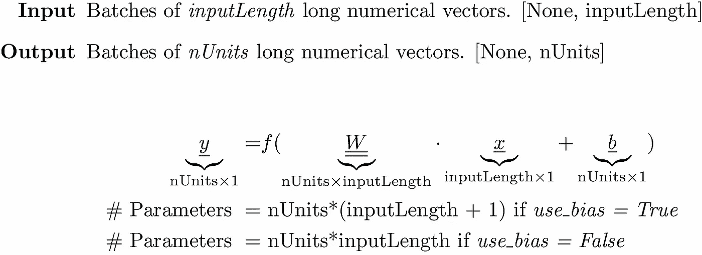

Equation 1\. The weight matrix and the biases are the parameters in a Dense layer

例如，以下模型将具有通过运行模型验证的 *32 * (784 +1) = 25120* 可训练参数。

运行它，我们得到下面的输出和数据流图。

```
Layer (type) Output Shape Param # 
=================================================================
Dense_Layer (Dense) (None, 32) **25120**
=================================================================
Total params: 25,120
Trainable params: 25,120
Non-trainable params: 0
```

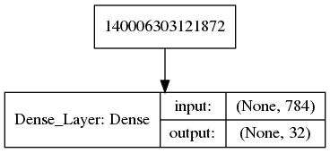

Figure 1\. Flow of a data tensor through a dense layer.

# 3.嵌入层

嵌入层几乎与密集层相同，但讨论起来非常重要，因为它们广泛用于准备文本输入。

> *一个嵌入层是一个密集层，没有偏置参数和身份作为激活函数。事实上，该层所做的只是矩阵乘法，其中矩阵条目是在训练期间学习的*

在文本处理中使用嵌入层来提出单词的数字矢量表示。从 *0* (或 *1* ，如果 *0* 用于填充/屏蔽以允许可变长度的句子)到 *nWords* (或 *nWords+1* ，如果 *0* 用于屏蔽)，组成文本语料库的单词被分配整数索引。输入的句子/文本最多有*个长度为*的单词。每个字是一个 1-hot 编码向量。权重矩阵将长的 1-hot 编码向量转换成短的密集数值向量。换句话说，权重矩阵就是长度为 *nUnits* 的列的单词向量。

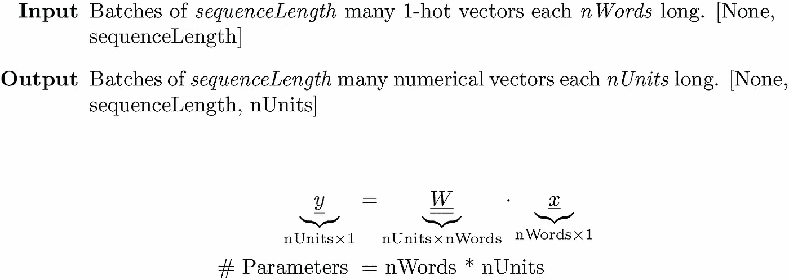

Equation 2\. Embedding layer simply converts a long, sparse vector to a short, dense vector

以下嵌入层的代码片段将把 *1024 * 256 = 262144* 可训练参数添加到与下面的 Keras 报告相匹配的模型中。

运行我们得到的:

```
Layer (type) Output Shape Param # 
=================================================================
Embedding_Layer (Embedding) (None, 25, 256) **262144**
=================================================================
Total params: 262,144
Trainable params: 262,144
Non-trainable params: 0
```

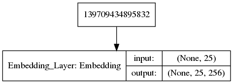

Figure 2\. Each word in a 25 word (each a 1-hot vector) sequence gets converted to a 256 long numerical vector after passing through the Embedding Layer

# 4.循环层

递归图层适用于顺序非常重要的数据。例如，单词的顺序对于句子的意思及其分类是很重要的。并且图像帧的序列对于分类视频中的动作是重要的。

递归层的输入是固定长度的向量序列，每个向量代表该序列中的一个元素。当处理文本时，序列的元素是单词，并且每个单词通过嵌入层或外部提供的例如 FastText 表示为数字向量。还可以设想从视频中提供图像帧序列，其中每一帧首先通过卷积转换成矢量。

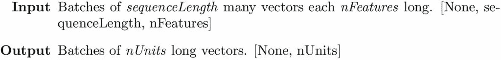

递归层将这个输入向量序列转换成一个输出向量，其大小等于该层中使用的单元数。在其众多变体中，LSTM 和 GRU 是最流行的递归层实现，我们在这里重点讨论它们。

## 4.1 LSTM

我们参考 [Colah 的博客](https://colah.github.io/posts/2015-08-Understanding-LSTMs/)来了解定义发生在 LSTM 层的变换的方程式。下面的图 3 描述了 LSTM 细胞对输入的作用。

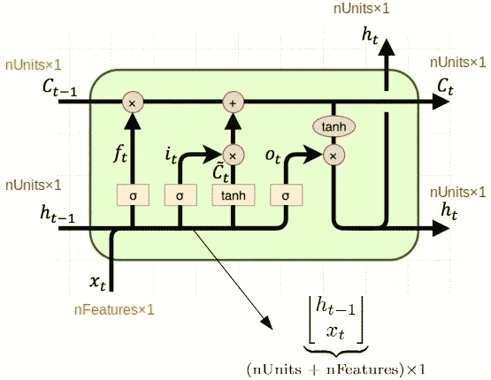

Figure 3\. An LSTM cell uses four dense layers each contributing equal number of parameters to the model.

一个 LSTM 电池包含四个致密层(三个具有*s 形*激活，一个具有 *tanh* 激活),全部采用与 LSTM 电池相同数量的指定单元。如图 3 所示，这些密集层中的每一层都接受相同的输入，该输入是先前隐藏状态 *h_(t-1)* 和当前输入序列 *x_t* 的串联。但是他们都有自己的一套在训练中学习到的权重和偏好。因此每个都将向 LSTM 层贡献相同数量的可训练参数。以下等式描述了 LSTM 单元中输入的变换。

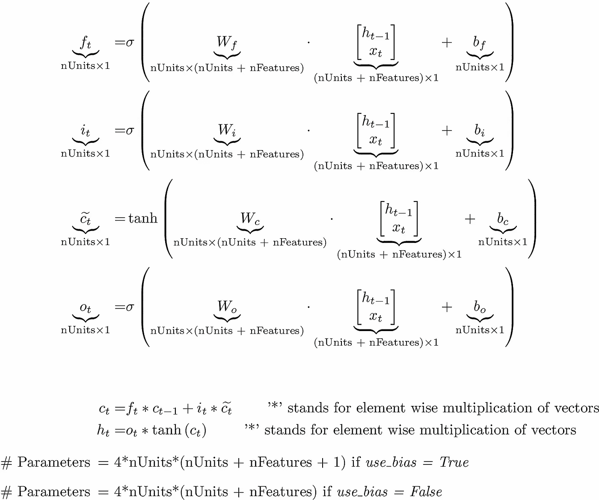

Equation 3\. An LSTM cell has three dense layers with sigmoid activation and one with tanh activation, They all employ the same number of units and take the same input at each timestep.

以下代码片段发送的句子长度最多为 25 个单词，总词汇量为 1000 个单词。嵌入层将每个单词转换成一个 256 长的数字向量，产生一个[None，25，256]的输入到具有 128 个单元的 LSTM 层。我们的公式表明，LSTM 单元将贡献 4 * 128 * (128 + 256 +1) = 197120 个可训练参数。

运行上面的代码，我们看到我们的公式获得的参数 count 与 Keras 获得的相匹配。

```
Layer (type) Output Shape Param # 
=================================================================
Embedding_Layer (Embedding) (None, 25, 256) 256000 
_________________________________________________________________
LSTM_Layer (LSTM) (None, 128) **197120**
=================================================================
Total params: 453,120
Trainable params: 453,120
Non-trainable params: 0
```

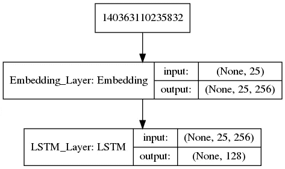

Figure 4\. Flow of word sequences through an Embedding and LSTM layers

## 4.2 GRU

在详细讨论了 LSTM 单元之后，我们可以轻松地讨论 GRU 单元，因为它们的想法是相似的。我们只需要这个图像就可以确定它给模型添加了多少参数。

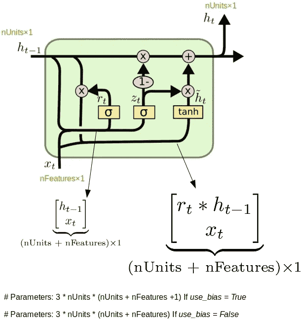

Figure 5\. The GRU cell has two dense layers with sigmoid activation and one with tanh. They all employ the same number of units and take the same-sized input at each timestep.

tanh 密集层与其他两个 sigmoid 密集层具有不同的输入。但是输入的形状和大小是相同的，这导致了上面的公式。如果我们像以前一样运行同样的代码，用 GRU 代替 LSTM，如下所示:

我们应该从下面的 Keras 中得到 3 * 128 * (128 + 256 + 1) = 147840 个与模型摘要相匹配的参数。

```
________________________________________________________________
Layer (type) Output Shape Param # 
=================================================================
Embedding_Layer (Embedding) (None, 25, 256) 256000 
_________________________________________________________________
GRU_Layer (GRU) (None, 128) **147840** 
=================================================================
Total params: 403,840
Trainable params: 403,840
Non-trainable params: 0
```

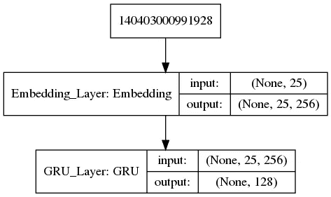

Figure 6\. Flow of word sequences through an Embedding and GRU layers

# 5.摘要

我们开发了 Keras 中密集层、嵌入层、LSTM 层和 GRU 层中使用的参数数量公式。我们已经看到了为什么输入/输出张量形状对这些层的预期作用有意义。这是一个汇总表。

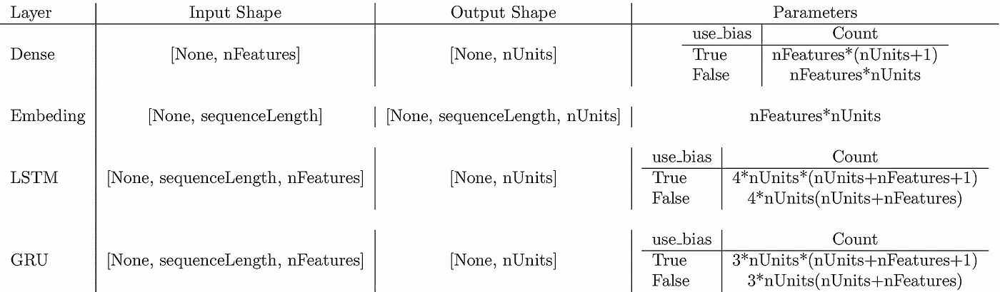

Table 1\. Input/Output shapes and parameter counts for various layers

我们就此结束这篇相当短的帖子。我们将在本系列的下一篇文章中讨论卷积和一个综合的例子。

*原载于 2019 年 6 月 6 日*[*http://xplordat.com*](http://xplordat.com/2019/06/06/flowing-tensors-and-heaping-parameters-in-deep-learning/)*。*