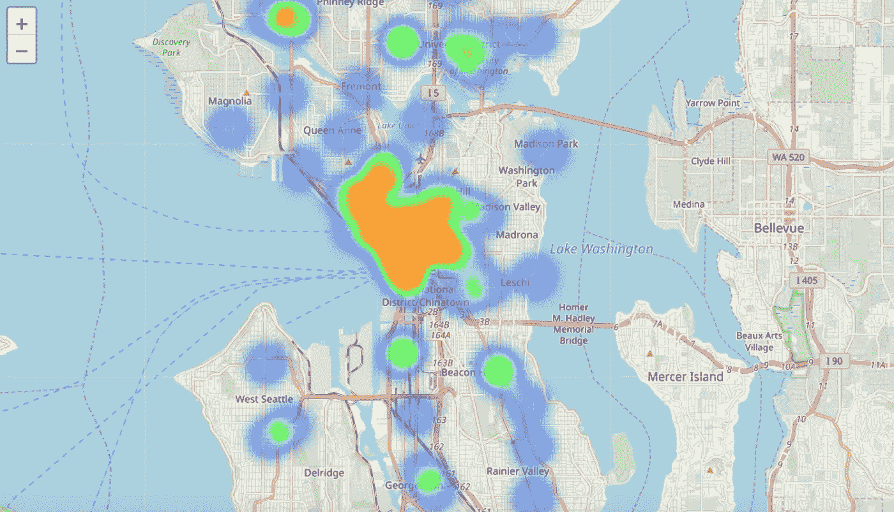

# 又失败了！浅谈叶

> 原文：<https://towardsdatascience.com/foiled-again-a-brief-discussion-on-folium-2258db4c9d7f?source=collection_archive---------31----------------------->

当你想到可视化的时候，有很多很多好的选择:当你蹦蹦跳跳的时候有条形图，当你大脑分散的时候有散点图，当你只想发泄情绪的时候有直方图，当然，还有甜点的饼状图。不过，今天我要说的是一个有用的图书馆，叫做“叶”,它使用起来特别有趣，因为它通过地图将所有信息融入你周围的真实世界。

例如，假设我有一个我附近所有比萨饼店的纬度和经度列表，但是我想更具体地了解这些数字的实际含义。我可以将这些列表输入到 leav 中，轻松地在地图上标出每个点。

不错！现在我清楚地知道在我附近哪里可以找到比萨饼店。但是假设我不只是想知道他们的位置，也许我还想知道每个人的一些信息。通过电脑魔术，这是很容易做到的！leav 使我们能够在每个点放置弹出信息，因此您可以在那里存储相关信息，等待被点击！

我今天想吃五星级披萨吗？大概吧。我今天想花大价钱买五星级披萨吗？大概不会，所以有这个功能让我提前知道就好了。

对你们很多人来说，这是一个非常熟悉的图像。你可以打开谷歌地图，只需打个响指就能看到这样的图像(或者，如果你反应快的话，可以质疑你所有的生活选择:P)。所以现在我给你看一些你在谷歌上看不到的东西。假设我们不再想知道最近的比萨饼店在哪里，假设我们想知道城镇某一地区的星巴克密度，而不是其他地区。

正如你所看到的，星巴克的“热点”在市中心，这是有道理的，因为客流量非常大。当你走得更远时，步行交通变得不那么常见，建筑物之间的距离也更远，所以星巴克的密度会降低。当你有太多的点需要单独查看时，叶子热图很有用，这让你可以看到点之间的关系，而不会因为无数的标记而使图像陷入困境。相当甜蜜！

到目前为止，我们一直使用默认的地图背景，但没有更多！follow 有很多可定制性。也许你已经厌倦了看到道路和城市，也许更少的信息对你的特定图形来说更重要，也许你正在重现拉里·哈里斯设计的经典棋盘游戏:轴心国和盟国，但规模更大。说你想要白纸黑字，为什么不呢？你的愿望就是叶的命令！

或者你已经喝完了所有你能喝的咖啡，吃了超出人类可能的比萨饼，你决定离开这个城市去一座休眠火山顶上寻找孤独。给你更多的力量！叶有一个地形选项，所以你可以通过一个更地理的镜头来看事情。看起来你还有一段路要走。一定要穿有脚踝支撑的鞋子！

当我们的朋友出发去寻找山里的空气、水泡和内心的平静时，我注意到我们地图上的标记开始变得有点乏味。您可能会猜测，leav 提供了可定制的标记，如果您猜到了这一点，那么您就对了！让我们来看看。

有很多不同的颜色和图标可供选择，还有更多可以在网上找到，比如 Font Awesome！

 [## 字体 Awesome 5

### 世界上最受欢迎和最容易使用的图标集刚刚得到了升级。更多图标。更多款式。更多选择。

fontawesome.com](https://fontawesome.com/?from=io) 

叶子不仅仅有标记。也许你想看看每个点周围的大致区域。对于显示半径来说，一个很好的选择是圆形选项，这样您可以感受到哪些地方可能共享一个配送范围或类似的东西。

如您所见，leav 有许多非常好的优势。许多可用的定制:不同的地图风格和标记，不同的图标和颜色，它也很容易使用。我非常喜欢 clear，因为它有助于以一种清晰易懂的方式直观地分解位置信息。想象一下使用散点图或条形图来理解相同的信息，你可以做到，但在我看来这样更好。希望这能给你一些关于如何在你自己的项目中使用 follow 的想法。好了，我快没时间了，完全没有双关语了，所以现在就这样吧！