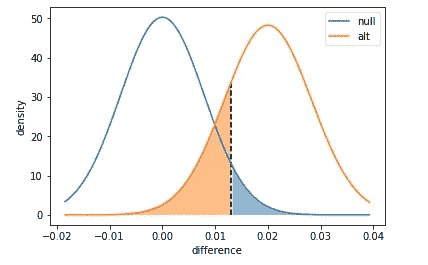
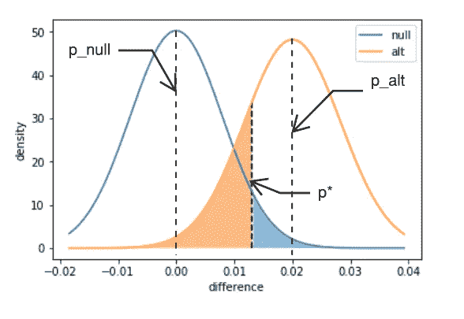
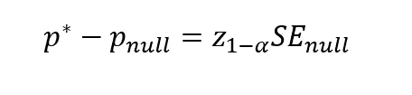
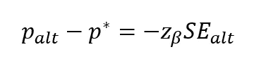
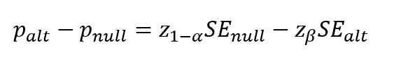
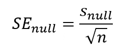
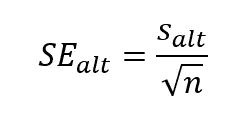
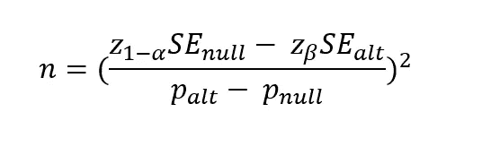

# 跟随和学习:用 Python 实验大小

> 原文：<https://towardsdatascience.com/follow-learn-experiment-size-with-python-7651251e027b?source=collection_archive---------21----------------------->

Photo by [Crissy Jarvis](https://unsplash.com/@crissyjarvis?utm_source=medium&utm_medium=referral) on [Unsplash](https://unsplash.com?utm_source=medium&utm_medium=referral)

你想改变你的网站布局，以获得更多的点击。你决定运行一个实验，让一个控制组看到通常的页面，然后一个实验组看到一个新的布局。

假设你当前的网站点击率(CTR)是 p_null=10%，我们想把这个值提高到 p_alt=12%。我们需要多少访问者来评估我们的结果？为了达到一个可靠的水平，你需要进行多长时间的实验？是 10 天还是 10 年？

实际意义不仅有助于在实验结束时做出决定，也有助于设定实验范围。假设我们假设的[幂](https://en.wikipedia.org/wiki/Power_(statistics)) **𝛽** 为 80%， [p 值](https://en.wikipedia.org/wiki/P-value)为 0.05，分别指[第二类和第一类](https://en.wikipedia.org/wiki/Type_I_and_type_II_errors)误差。

在本帖中，我们将首先使用模拟来探索这个概念，以建立直觉，然后使用分析方法。请随意查看 [jupyter 笔记本](https://github.com/NadimKawwa/Statistics/blob/master/Experiment_Size.ipynb)了解更多信息。

# 模拟方法

在第一种方法中，我们依靠蛮力，通过多种样本大小。每个样本大小都有一个相关的功率水平，通过足够的模拟，我们可以缩小所需的最小样本大小。

## 第一类错误

在零假设下，我们将有一个临界值，对于这个临界值，I 型误差低于我们期望的水平。

*   计算两组在零假设下的比例差异的标准差，其中成功概率为 p_null (10%)。差异分布的方差是各个分布的方差之和。
*   使用 [scipy.stats.norm](https://docs.scipy.org/doc/scipy/reference/generated/scipy.stats.norm.html) 创建一个正常的连续变量，以 0 为中心，并使用上一步中的标准偏差进行缩放。
*   使用 [scipy](https://docs.scipy.org/doc/scipy/reference/generated/scipy.stats.rv_continuous.ppf.html) 上的[百分点函数](https://en.wikipedia.org/wiki/Quantile_function)方法计算导致我们拒绝空值的分布临界值。

## 第二类错误

功效是在替代假设下分布的比例，它超过了我们以前获得的临界值。

*   计算所需可检测差异下的标准偏差差异(此处为 12%)。各个分布会有不同的方差:一个是零(10%)，一个是备选项(12%)。
*   像上一部分一样，创建一个正常的连续变量，以(p_alt-p_null)为中心，并按上一步中的标准偏差进行缩放。
*   使用[概率密度函数](https://en.wikipedia.org/wiki/Probability_density_function)计算 II 型错误的概率。

## Python 脚本

将所有这些放在 python 代码中，我们得到了下面的脚本。

通过迭代，我们发现，对于 80%的幂 **𝛽** ，样本大小约为 2863。下图显示了零假设和测试假设下的分布。

# 分析方法

我们就拿上面的情节来注解一下我们实际看到的。

用于确定统计显著性的临界值 p *落在 p_null 和 p_alt 之间。因此，从 p_null 到 p_alt 的距离可以细分为两部分:

*   从 p_null 到 p*的距离
*   从 p_alt 到 p*的距离

我们可以用单尾测试的 [z 值](https://en.wikipedia.org/wiki/Standard_score)来表示这些距离。

对于从 p_null 到 p*的距离:

对于从 p *到 p_alt 的距离:

将两者相加，我们得到:

[标准误差](https://en.wikipedia.org/wiki/Standard_error) SE 可以表示为:

其中:

*   n =观察次数
*   s_null =两组在零假设下比例差异的标准偏差
*   s_alt =所需可检测差异下的标准偏差差异(此处为 12%)

代入并求解 n，观察值的数量由下式给出:

## Python 脚本

用 python 代码实现上述功能，我们得到了下面的函数。请注意，我们在最后对样本量进行了四舍五入。

我们获得了与模拟方法相同的样本大小 2863！

# 统计模型

或者，我们可以使用免费的 python 包，如 [StatsModel](http://www.statsmodels.org/stable/index.html) ，它假设一个双尾测试，并使用 [Cohen 的 h](https://en.wikipedia.org/wiki/Cohen%27s_h) 作为两个概率之间的距离度量。下面的代码简洁且易于实现。

我们获得了一个比前一种方法更大的样本量:3021。

# 结论

我们可以使用模拟、严格分析和专门的软件包来估计样本大小。网上有多个[样本量计算器](http://www.evanmiller.org/ab-testing/sample-size.html)，我们可以用它们来获得类似的结果。

最后，所有的方法都应该给出我们可能需要多少观测值的一个很好的大概估计。这将会给我们一个实验的范围，我们需要多少时间，是否值得。

记住最终目标:建立一个切实可行的实验。

*本文基于* [*Udacity 数据科学家纳米学位*](https://www.udacity.com/course/data-scientist-nanodegree--nd025) *所需的一个练习。我建议报名参加该课程，以便更深入地理解这里显示的主题。另外，可以随意查看* [*统计意义*](https://medium.com/@nadimkawwa/follow-learn-statistical-significance-with-python-6d31c8d0c744) *上的这篇帖子。*