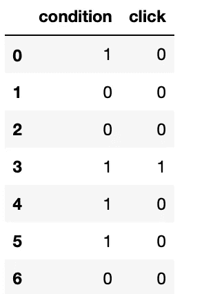
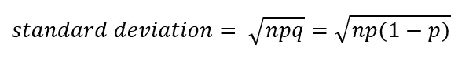
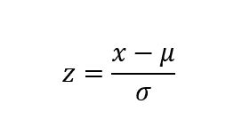
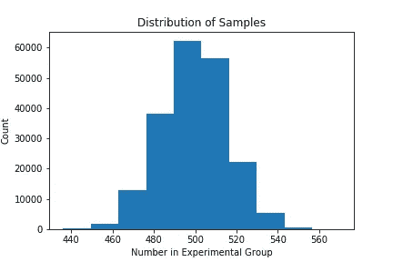
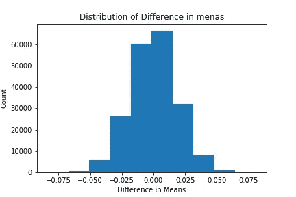
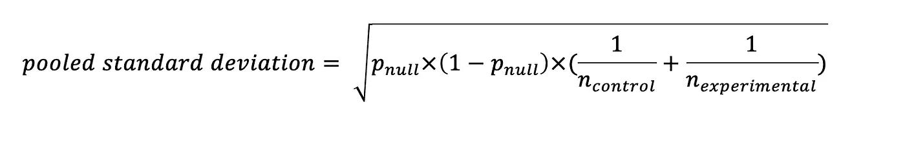

# 跟随和学习:Python 的统计意义

> 原文：<https://towardsdatascience.com/follow-learn-statistical-significance-with-python-6d31c8d0c744?source=collection_archive---------11----------------------->

Photo by [dylan nolte](https://unsplash.com/@dylan_nolte?utm_source=medium&utm_medium=referral) on [Unsplash](https://unsplash.com?utm_source=medium&utm_medium=referral)

如果你使用互联网，你很有可能在不知情的情况下参与了某人的统计实验。它通常是一个微妙的变化，如页面的颜色、按钮的形状或一些额外的文本。

Google Analytics 为其客户提供以测试为中心的服务，以优化网络流量。在这篇文章中，我们想探索如何从玩具数据集中得出统计意义。

建议在进入本帖之前熟悉[实验设计](https://en.wikipedia.org/wiki/Design_of_experiments)、[二项分布](https://en.wikipedia.org/wiki/Binomial_distribution)和 [p 值](https://en.wikipedia.org/wiki/P-value)。请随意浏览[笔记本](https://github.com/NadimKawwa/Statistics/blob/master/Statistical_Significance.ipynb)了解更多信息。

# 数据

假设我们想要增加点击下载按钮的用户数量。看看下面的[数据表](https://github.com/NadimKawwa/Statistics/blob/master/data/statistical_significance_data.csv):

*条件*列取两个值:

*   对照组为 0
*   1 个用于实验组

*点击*列也取两个值:

*   0 表示不下载
*   1 个用于下载

# 不变度量

这里的条件是我们的不变度量，我们希望测试组和对照组在理想情况下是不可区分的。如果这个条件不成立，那么我们就不能把我们的研究建立在可靠的信息上:我们想在两个几乎相同的组中测试一个类似的事件。

## 模拟方法

我们可以通过随机的 50/50 分割来模拟组的分配。这是如何做到的:

*   记录对照组/实验组的参与者人数
*   对该组执行[伯努利试验](https://en.wikipedia.org/wiki/Bernoulli_trial)
*   将结果与原始分布进行比较
*   报告异常值的比例

下面的代码块显示了我们可以模拟 n 次随机抽取并记录异常情况。

该脚本返回 0.613，表明两组之间的差异在统计上不显著。我们关于两组相同的假设是正确的。

## 分析方法

二项式分布的标准差由下式给出:

*   n=样本量
*   p =成功的概率
*   q =故障概率= (1-p)

z 得分是标准偏差的度量，例如，z 得分为 2 表示我们距离平均值有 2 个标准偏差。在我们的例子中，z 分数由下式给出:

*   x =对照组的人数
*   μ=平均值
*   σ =标准偏差

注意，我们需要通过加或减 0.5 对 x 进行[连续性校正](https://en.wikipedia.org/wiki/Continuity_correction)。一旦我们有了 z 值，我们就可以从 [z 得分表](https://www.math.arizona.edu/~rsims/ma464/standardnormaltable.pdf)中得到分布两边曲线下的面积。

多亏了大样本和[中心极限定理，我们才能够完成上述步骤。](https://en.wikipedia.org/wiki/Central_limit_theorem)下面的直方图显示了模拟中样本的分布，有助于我们的主张。

在 python 代码中，我们使用与上一部分相同的变量运行下面的代码块。

成功！我们获得与模拟相同的 p 值！

# 评估指标

现在我们来看一下评估指标，即点击率(CTR)。我们的测试组和对照组之间的点击量差异显著吗？

我们的零假设是，使用单尾检验，两组的 CTR 是相同的。

首先让我们用下面的代码块记录一些统计数据。

## 模拟方法

该方法类似于我们为不变度量所做的方法，但有一些变化:

*   对控制组进行伯努利试验，成功概率为 p_null
*   以 p_null 的成功概率对*实验组*进行伯努利试验
*   记录两次试验平均值的差异

这可以在 Python 中完成，如下所示:

这返回 0.0395 的 p 值<0.05, this means our result is statistically significant and we should reject the null hypothesis. Again the central limit theorem is at work here by looking at the distribution of the differences in means.

## Analytical Approach

We need to evaluate the pooled CTR for the analytical solution. To get there we calculate the pooled standard deviation using the formula below.

In python code the process is:

We obtain the same p value as in the simulation approach and again reject the null hypothesis.

# Conclusion

Through analytical and simulation approaches, we have reached the same conclusions for the invariant and evaluation metrics respectively.

We can now solve similar problems using either approach! How many observations do we need for our experiment is covered in a post on [实验规模](/follow-learn-experiment-size-with-python-7651251e027b)我们使用类似的概念。