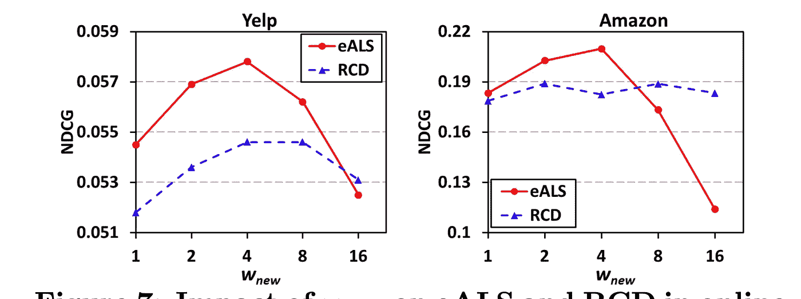

# 思考的食粮——纸星期二

> 原文：<https://towardsdatascience.com/food-for-thought-paper-tuesday-bffb85506bfd?source=collection_archive---------11----------------------->

## 用于快速在线更新的新矩阵分解

每周二，我都会强调我在研究或工作中遇到的一篇有趣的论文。希望我的评论能帮助你在 2 分钟内获得论文中最多汁的部分！

# 基本思想

无数的项目已经证明，自 2006 年 Netflix 奖竞赛以来，矩阵分解(MF)是无与伦比的最强大的推荐生成算法之一。关键思想是将用户-项目交互矩阵分解成两个具有较低等级的子矩阵。

From [amazon aws](https://aws.amazon.com/blogs/machine-learning/build-a-movie-recommender-with-factorization-machines-on-amazon-sagemaker/)

通过分解交互矩阵，MF 以某种方式提取出潜在的特征，这些特征在描述用户和物品方面表现惊人的好。如果您想了解算法本身的更多信息，可以参考以下资源列表:

1.  https://data jobs . com/data-science-repo/Recommender-Systems-[网飞]。pdf
2.  [https://www . cs . CMU . edu/~ mgormley/courses/10601-s17/slides/lecture 25-MF . pdf](https://www.cs.cmu.edu/~mgormley/courses/10601-s17/slides/lecture25-mf.pdf)
3.  [https://developers . Google . com/machine-learning/推荐](https://developers.google.com/machine-learning/recommendation)

传统 MF 在实践中的一个问题是，当矩阵变得巨大时(想象亚马逊必须分解其用户-商品交互矩阵，这将是一个数百万乘数百万的矩阵)，定期更新潜在特征变得不可行(当用户进行新的购买时，我们希望该交易稍微影响潜在向量)。我看到了贺湘南、张汉旺、Kan Min-Yen 和 Tat-Seng Chua 的一篇论文，名为*用于隐式反馈在线推荐的快速矩阵分解。他们提出了一种叫做 eALS 的新方法，这种方法大大加快了在线更新过程。*

下面是链接:[https://arxiv.org/abs/1708.05024](https://arxiv.org/abs/1708.05024)

作者提出了一种通过缓存重复使用的值来加速 ALS 的新方法，以及一种避免每次新更新到来时解决整个问题的新技巧。

from [He et al 2017](https://arxiv.org/abs/1708.05024)

为了使在线模型更有效地响应最新的输入，作者提出了一种权重策略。

from [He et al 2017](https://arxiv.org/abs/1708.05024)

from [He et al 2017](https://arxiv.org/abs/1708.05024)

论文中另一个有趣的提议是他们所谓的面向项目的缺失数据加权，它可以将领域知识整合到算法中。例如，如果一个用户从来没有购买过一个流行的物品，那么这个物品应该比一个未被浏览的稀有物品更像是负面反馈。

from [He et al 2017](https://arxiv.org/abs/1708.05024)

# 结果

作者根据经验证明，置信度参数 c(见上图)确实在一定程度上提高了性能。

from [He et al 2017](https://arxiv.org/abs/1708.05024)

新的相互作用参数 W 的影响(W 越高，意味着新的相互作用的权重越大)

from [He et al 2017](https://arxiv.org/abs/1708.05024)

最令我兴奋的结果是时间复杂度的显著改善。所提出的新方法比普通的交替最小二乘法快 100+倍，交替最小二乘法是一种众所周知的解决矩阵分解的方法(这是有意义的，因为 ALS 每次需要更新潜在向量时都需要解决整个问题，而 e ALS 仅在附加数据上工作，并且以更高的空间复杂度为代价)。

# 一些想法

我在暑期实习期间自己开发了一个推荐系统，在线更新让我很头疼。我很高兴这篇论文让我们离模型更近了一步，模型可以很容易地更新，并包含更多的领域知识。