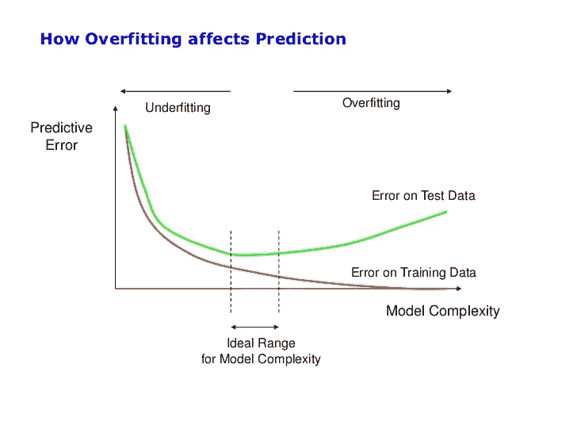
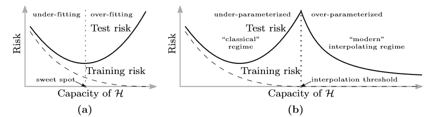
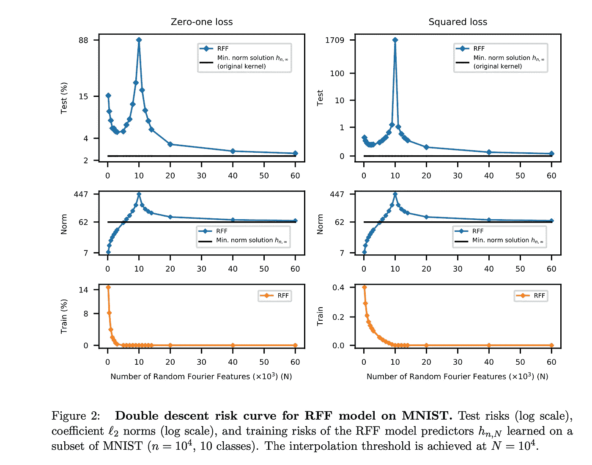
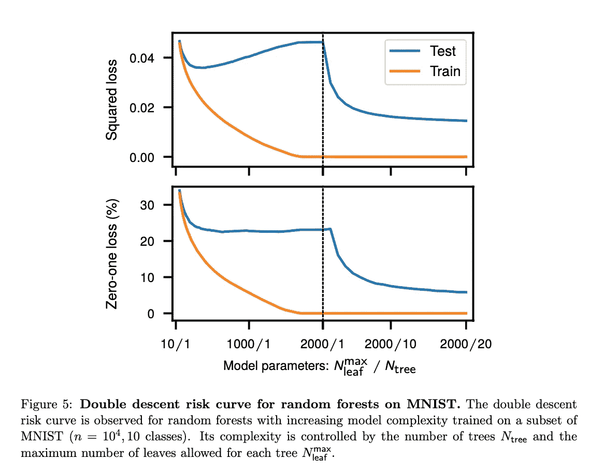
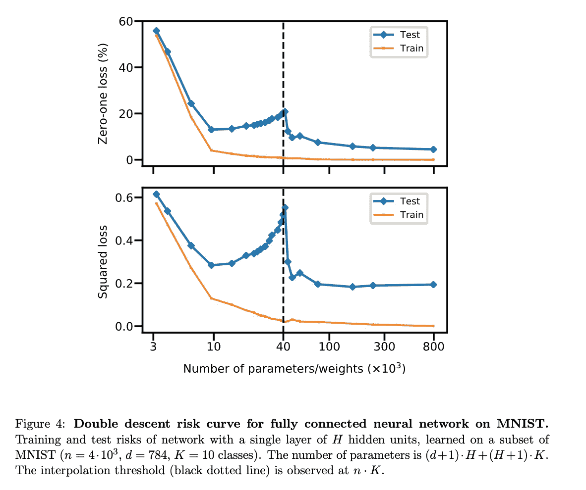

# 思考的食粮——纸星期二

> 原文：<https://towardsdatascience.com/food-for-thought-paper-tuesday-d163f8339d26?source=collection_archive---------31----------------------->

## 调和过度参数化与偏差-方差权衡

每周二，我都会强调我在研究或工作中遇到的一篇有趣的论文。希望我的评论能帮助你在 2 分钟内获得论文中最多汁的部分！

# 基本思想

数据过量可能是任何机器学习课程中最基本的方法之一。这个想法很简单——太适合训练数据(通常有很多参数)的模型在测试集上的表现往往很差。过度拟合通常发生在模型被大量参数化时，如具有太多分裂的决策树或未规范化的回归模型。

Picture from [StackOverflow](https://stats.stackexchange.com/questions/292283/general-question-regarding-over-fitting-vs-complexity-of-models)

在这篇文章中，我想强调一篇相当令人兴奋的论文。Mikhai Belkin，Daniel Hsu，马思远和 Soumik Mandal 在他们 2019 年的论文*中证明了现代机器学习实践和偏差-方差权衡的调和*表明，如果模型足够复杂(他们称之为双下降曲线)，测试误差最终会再次下降。

from the paper: [Belkin et al 2019](https://arxiv.org/abs/1812.11118)

论文网址:【https://arxiv.org/pdf/1812.11118.pdf 

# 结果

研究人员在几个著名的数据集(MNIST，CIFAR10，SVHN)上，在广泛的机器学习模型(神经网络和基于树的模型，RFF)上测试了这一想法，并获得了一致的结果。

from the paper: [Belkin et al 2019](https://arxiv.org/abs/1812.11118)

from the paper: [Belkin et al 2019](https://arxiv.org/abs/1812.11118)

from the paper: [Belkin et al 2019](https://arxiv.org/abs/1812.11118)

# 一些想法

巧合的是，我正在为我的本科论文研究神经网络的过度参数化，我看到了几篇论文从数学上证明了如何更容易优化更大的网络( [Oymak 和 Soltanolkotabi 2019](https://viterbi-web.usc.edu/~soltanol/onehidden.pdf) )。在其他模型中看到类似的现象确实令人兴奋，更重要的是，过度参数化可以改善测试误差。也许这是升级工作站的完美借口，因为拥有一百万棵树的随机森林会给你更好的结果:)