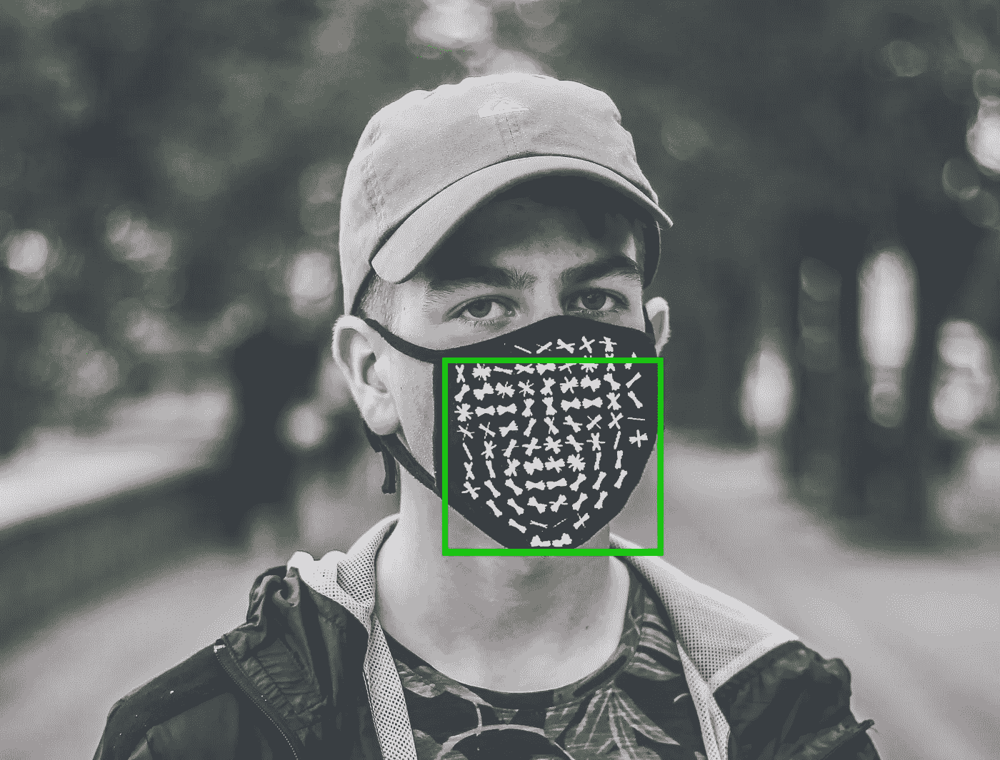
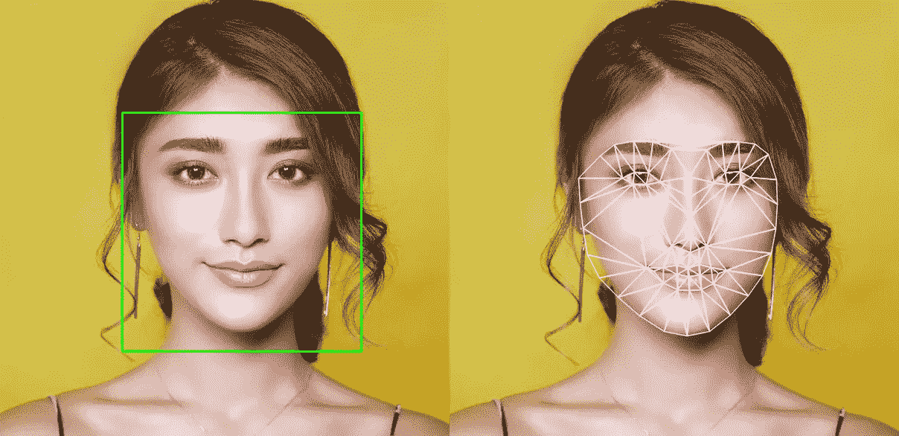
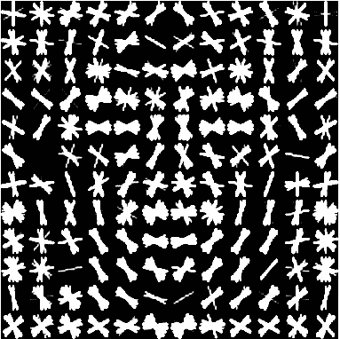
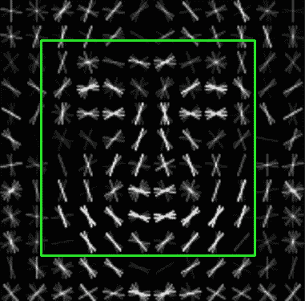
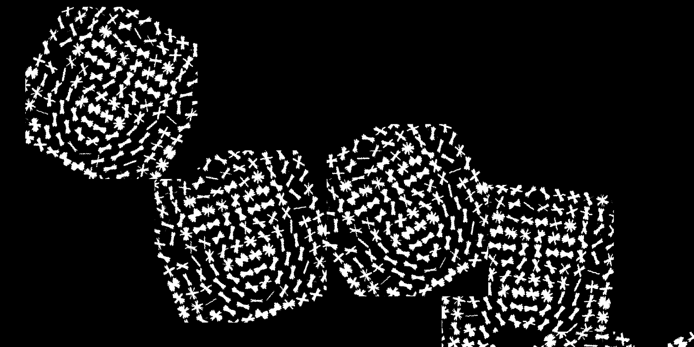
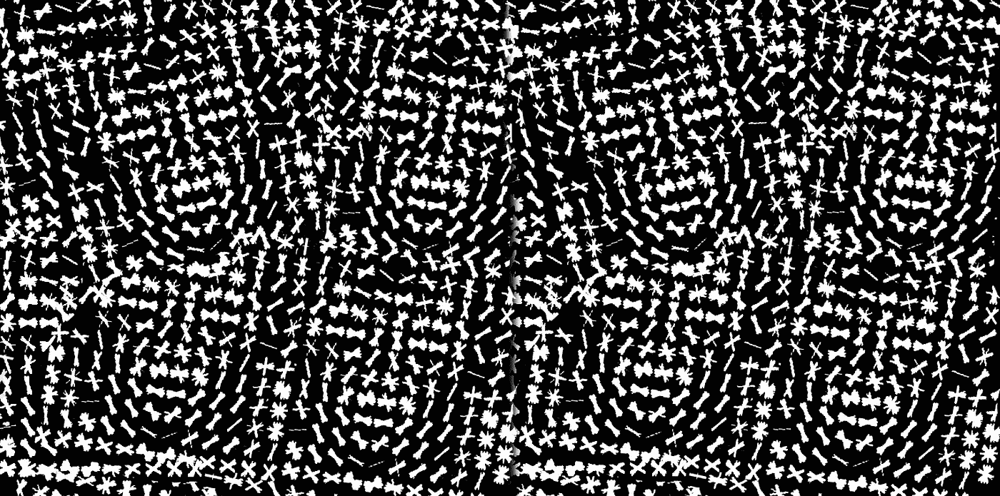
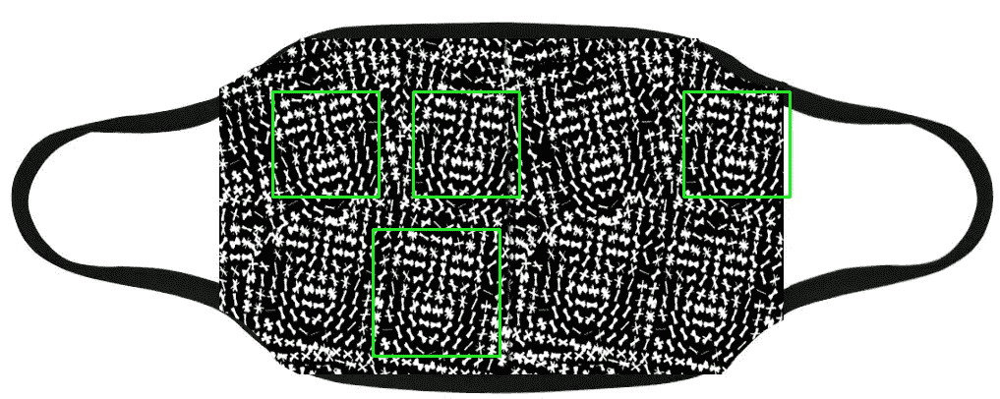

# 用时尚愚弄面部检测

> 原文：<https://towardsdatascience.com/fooling-facial-detection-with-fashion-d668ed919eb?source=collection_archive---------12----------------------->



Photo by [Pavel Anoshin](https://unsplash.com/photos/IxW2erjGO7U?utm_source=unsplash&utm_medium=referral&utm_content=creditCopyText) on [Unsplash](https://unsplash.com/search/photos/mask?utm_source=unsplash&utm_medium=referral&utm_content=creditCopyText)

```
Accompanying GitHub repository: [https://github.com/BruceMacD/Adversarial-Faces](https://github.com/BruceMacD/Adversarial-Faces)
```

面部识别的使用正在增加。随着最近关于面部识别伦理的辩论，我一直在考虑对面部识别的潜在敌对攻击。从 T2 机场到社交媒体，面部识别正被广泛应用。选择不接受面部扫描似乎几乎是不可能的。

对面部检测的理想攻击应该是一件在不知情的人看来不显眼的衣服。受 [Hyperface 项目](https://www.theguardian.com/technology/2017/jan/04/anti-surveillance-clothing-facial-recognition-hyperface)的启发，我决定研究并实现一个可穿戴的对抗实例。在这篇文章中，我将详细介绍创建一个敌对图像来欺骗选定类型的面部检测的过程，以及我如何在一个面具上实现一个实际的例子。

# 面部检测与面部识别



An illustration of facial detection (left) vs. facial recognition (right)

在深入研究这个项目之前，首先需要注意的是面部检测和面部识别之间的区别。面部检测指的是检测图像中何时出现面部的能力。面部识别依靠面部检测来确定图像中是否存在人脸，但它更进一步，试图确定这是谁的脸。

对于这个项目，我选择把重点放在面部检测上。主要是因为它更容易测试。为了正确地测试面部识别，访问面部识别数据库将是理想的。

# 面部检测模型

下一步是选择哪种面部检测模型来建立对抗的例子。目前有许多不同的面部检测模型在使用。Vikas Gupta 在“Learn OpenCV”上有一篇关于面部检测模型及其实现的很好的入门文章，其中有深入的解释。我将在这里简单回顾一下。

[](https://www.learnopencv.com/face-detection-opencv-dlib-and-deep-learning-c-python/) [## 人脸检测- OpenCV、Dlib 和深度学习|学习 OpenCV

### 在本教程中，我们将讨论 OpenCV 和 Dlib 中的各种人脸检测方法，并对这些方法进行比较

www.learnopencv.com](https://www.learnopencv.com/face-detection-opencv-dlib-and-deep-learning-c-python/) 

*   **深度神经网络(DNNs):** DNNs 可以使用输入数据集进行训练，以检测许多不同方向的人脸。基于 DNN 的面部检测的一种流行方法是[单镜头多盒检测器](https://arxiv.org/abs/1512.02325)。dnn 是精确和通用的。
*   **卷积神经网络(CNN):**CNN 是一种深度神经网络[，旨在为图像的不同部分分配重要性](/a-comprehensive-guide-to-convolutional-neural-networks-the-eli5-way-3bd2b1164a53)。它是健壮的，但是在 CPU 上相当慢。
*   **哈尔级联分类器:**哈尔级联使用具有大量标记的阳性和阴性示例图像的数据集来训练。Haar 级联分类器的主要缺点是它们只能正面识别人脸。它们不再被广泛使用，因为神经网络更加通用。
*   **梯度方向直方图(HOG):**HOG 是一种面部检测方法，它将经过处理的输入图像分成具有梯度方向的单元，然后将结果输入到支持向量机中。猪检测是快速和轻量级的，但对一些不寻常的面部角度不起作用。



A modeled example of a face as a histogram of oriented gradients [from dlib](http://blog.dlib.net/2014/02/dlib-186-released-make-your-own-object.html)

很快脱颖而出成为最简单的攻击候选模型的是梯度方向直方图。最值得注意的是，猪的预期输入可以很容易地被可视化并反馈到面部检测模型中。将面部可视化为定向梯度的直方图还具有对于人类观察者来说不是明显的面部的优点。

# **Python 中的梯度方向直方图人脸检测**

```
**Note:** Expanded code samples with the functionality to display results are available on the accompanying [GitHub repository](https://github.com/BruceMacD/Adversarial-Faces).
```

为了测试这些例子，我需要一个简单的基于 HOG 的面部检测实现。幸运的是，dlib 库在其[frontier _ face _ detector](http://dlib.net/face_detector.py.html)中内置了一个猪面部检测器。

```
import dlib
import cv2cv2.imread("path/to/input_img.png")
frontal_face_detector = dlib.get_frontal_face_detector()
upscaling_factor = 1
detected_faces = frontal_face_detector(img, upscaling_factor)
```

用输入图像和放大因子运行正面人脸检测器。放大因子 1 表示输入图像将被放大一次。放大可以创建更大的图像，从而更容易检测人脸。正面人脸检测的结果是一个边界框列表，每个检测到的人脸对应一个边界框。



The result of using the dlib to detect a face in our visualized HOG

通过猪的预期输入的可视化，您可以看到它被检测为一张脸。太好了！我们有了对抗性进攻的基础。

# 使用随机优化创建对抗性设计

现在我知道猪的预期输入的可视化将被检测为正面脸的假阳性，我需要创建一个在看起来不显眼的面具上打印的设计。然而，仍然有许多影响设计的因素，我不知道如何优化。人脸的位置、方向和大小都会影响图像中检测到的人脸数量。我可以简单地尝试不同的设计，直到我找到一个好的，但是让一个学习模型为我做艰苦的工作似乎更有趣，也不那么乏味。

我考虑了几种不同的模型来寻找最佳输入。我研究了强化学习、生成对抗网络和 Q 学习。最终，我决定使用随机优化的模拟退火，因为它最适合我的问题，即找到与 dlib 检测到的大多数人脸相对应的输入。

我使用 PIL(Python 图像库)和 mlrose(用于随机优化的 Python 库)来生成图像并找到最佳状态。用 mlrose 优化需要一个初始状态和一个适应度函数。在我的情况下，找到这个最佳状态是一个非常昂贵的计算，因为生成的状态需要作为图像保存到磁盘，以便找到检测到的人脸数量。

```
# indexes:
# 0 % 4 = pos_x
# 1 % 4 = pos_y
# 2 % 4 = rotation
# 3 % 4 = scale
initial_state = np.array([0, 0, 0, 0, 0, 0, 0, 0, 0, 0, 0, 0, 0, 0, 0, 0, 0, 0, 0, 0, 0, 0, 0, 0])
```

从初始状态开始，mlrose 需要一个 1D 数组(据我所知)。这意味着我不得不使用一个简单的解决方案，给不同的数组位置赋予不同的意义(参见索引解释)。我选择优化 6 个面的输入，因为我总是可以复制设计来增加它的大小。

```
def detected_max(state):
    # converts the 1D state array into images
    get_img_from_state(state)
    return len(detect_faces(cv2.imread(OUTPUT)))
```

我的适应度函数只是由状态到图像的转换组成，然后检测图像中的人脸数量。找到的人脸数量越多，拟合度越好。我还试着根据输入猪脸图像的大小将适应度函数修改得更高。这可能更好，因为在现实生活中，更大的人脸更有可能被检测到。然而，我发现在视觉效果相似的情况下，考虑面部大小会导致计算时间延长。

```
fitness = mlrose.CustomFitness(detected_max)
problem = mlrose.DiscreteOpt(length=24, fitness_fn=fitness,
                             maximize=True, max_val=scale_factor)
schedule = mlrose.ExpDecay()
best_state, max_faces = mlrose.simulated_annealing(problem, schedule=schedule, max_attempts=10, max_iters=1000,
                                          init_state=initial_state, random_state=1)

print('Optimal state found: ', best_state)
print('Max fitness found: ', max_faces)
# save the optimal found
get_img_from_state(best_state)
print("Number of faces in output: ", len(detect_faces(cv2.imread(OUTPUT))))
```

有了适应度和初始状态集，为模拟退火配置 mlrose 就很简单了。我只是分配我们的输入，并让它运行，直到找到一个最佳结果。我运行了几次，找到了一个视觉上有趣的结果。



An interesting output from the simulated annealing

最后，随着这个有趣的输出，我添加了一些收尾工作来模糊它的面部设计。我决定我更有资格用手来做这件事，因为我的意图是愚弄人类。



The final design that obscures the facial structure

# 测试掩模上的设计



Faces detected on a prototype mask covered in the adversarial face design

随着最终设计的完成，我创造了一些模拟面具设计来测试他们是如何被猪面部检测评估的。最初的结果似乎很有希望。上述设计始终返回 4–5 个错误检测的人脸。