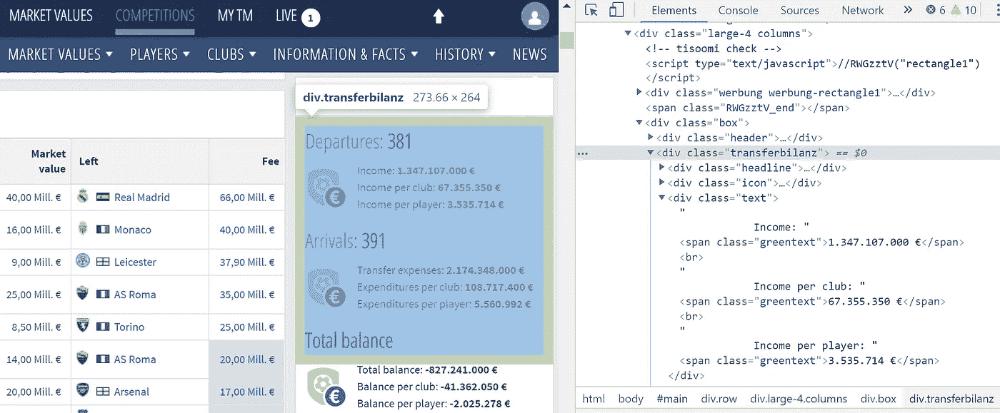
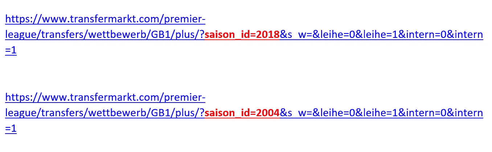
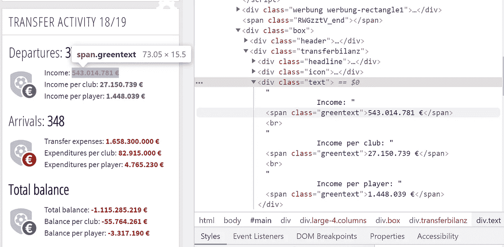
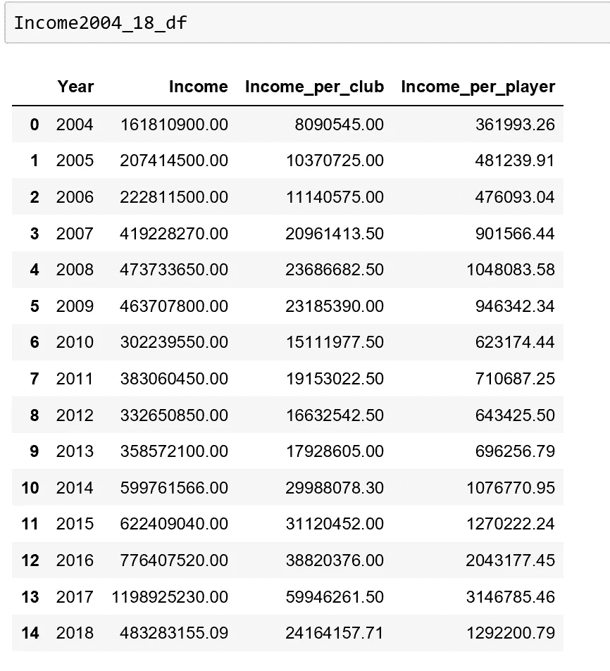
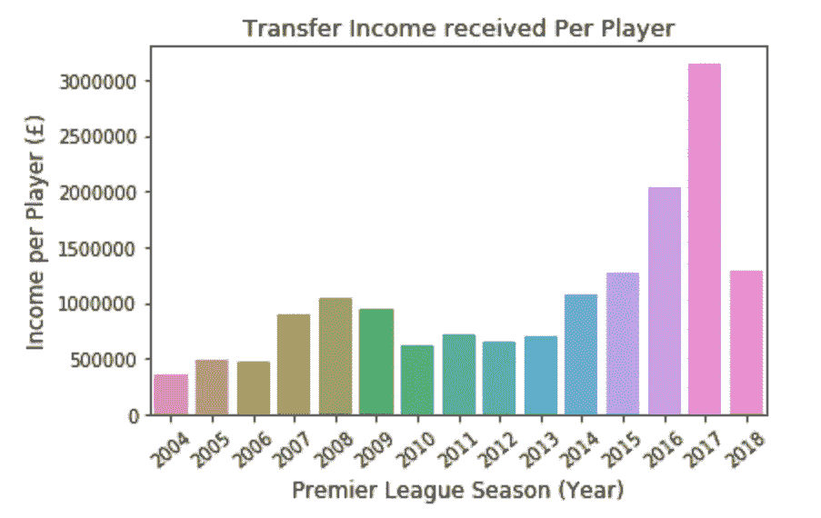

# 足球转会 Python 美丽的汤 15 年分析

> 原文：<https://towardsdatascience.com/football-wages-15-year-analysis-with-pythons-beautiful-soup-f3a7b8882524?source=collection_archive---------10----------------------->

## 一个多页网页抓取教程使用美丽的汤

Image Courtesy of [Nathan Dumlao](https://unsplash.com/@nate_dumlao) via [Unsplash](https://unsplash.com/photos/kME9jbKd--s)

# 介绍

Web 抓取能够自动收集丰富的数据集。如果您可以在 web 浏览器中查看一些数据，您将能够通过程序访问和检索这些数据。如果你可以通过一个程序访问它，这些数据就可以以任何方式存储、清理和使用。

Web scarping 提供了一些优于应用程序编程接口(API)的优势。网络抓取是免费的，没有速率限制，让你接触到所有你想获取的数据，最重要的是，你想从中提取数据的网站可能没有 API。这就是网络抓取进入画面的时候。

本教程将探讨如何编写一个简单的 Web scraper，它可以收集过去 15 年英超联赛中每个球员的平均转会收入数据。

# 入门指南

首先，需要导航至 [transfermarkt](https://www.transfermarkt.com/premier-league/transfers/wettbewerb/GB1/plus/?saison_id=2018&s_w=&leihe=0&leihe=1&intern=0&intern=1) 。下一步是查看这个页面的底层 HTML，在 Chrome 中右键单击并选择“inspect”。

这里特别有用的是，你可以将鼠标悬停在 Elements 标签中的 HTML 标签上，Chrome 会在网页本身的表示上描绘一个透明框。这可以快速帮助我们找到我们正在搜索的内容。

或者，您也可以右键单击网页上的任何元素，然后单击“检查元素”。这将立即在 Elements 选项卡中突出显示相应的 HTML 代码。

在这里，我想提炼一下:收入，每个俱乐部的收入，每个球员的收入。为此，我通过将鼠标悬停在带有“ **transferbilanz** ”类的“div”标签上来找到包装器。

# 美丽的汤库

为了解析来自网页的收入信息，我使用了漂亮的 Soup 库。美丽的汤很容易安装使用画中画。

信息所在页面的 url 放在名为 URL 的变量的引号中。requests.get()方法用于“获取”URL 页面，结果保存在一个响应变量中(*记住安装请求库并将其导入脚本*)。

为了确认连接已经建立，我使用了**。status_code** 属性，并检查服务器是否返回了超文本传输协议(HTTP)状态代码 200。这意味着“成功”，页面已被检索。

包含当前页面的原始 HTML 内容的 response.text 被保存到变量“financial_data”中。现在，我创建一个 soup BeautifulSoup 对象，将原始 HTML 数据 **financial_data** 作为第一个参数传递，将“html.parser”作为第二个参数传递。这个解析器内置在 Python 中，不需要安装，用于解析 HTML 标签。

一旦我知道成功连接到网页，我就可以利用 URL 的结构。

在下面显示的 URL 中，每个足球赛季唯一变化的部分是年份。当我第一次检查连接时，年份是 2018 年(下面用红色和粗体格式突出显示)。为了检索过去 15 个赛季的相同信息，我只需将赛季编号更改为 2004！

我创建了一个简单的 for 循环来遍历从 2004 年到 2018 年的一系列年份，以检索每一年的收入数字。(*记住最后一个数字 2019 被排除在名单之外*

在这个 for 循环中，我需要的三条信息可以在 span 标记中找到，带有如下所示的“greentext”类。

为了检索这些数据，我使用汤**找到了包含所有这些信息的第一个包装器。查找方法**并将结果保存到名为 grouped_data 的变量中。

然后，我对 grouped_data 使用 **find_all 方法**来查找所有带有“greentext”类的 span 标签。由于 find_all 方法返回一个类似列表的对象，我可以索引这个列表来检索我需要的值，即列表中第一个元素的[0]指向该季节的“收入”(参见下面的 github 要点)。

我需要删除数字中的空格、欧元符号和句点，以便将值转换为浮点数，以便稍后进行基于数字的分析。我还将返回的每个值乘以 0.89，因为这是欧元和英镑之间的当前(2019 年 13 月 6 日)汇率，我希望数据框架中的结果以英镑为单位。

对于每一年(我的 for 循环的每一次迭代)，我将数据附加到适当标记的列表中，即 income_per_player_list。

一旦所有迭代完成，我使用 **pd 创建一个数据帧。DataFrame** 方法(*需要将 pandas 模块导入到脚本*中)，并写入 CSV 文件。

然后我读入数据帧；

Income 2004 _ 18 _ df = PD . read _ CSV(' Income _ euro _ to _ pounds . CSV ')

这使我们能够开始得出结论:

(*使用 Python 的 Seaborn 库生成的条形图*)

我们可以看到，除了 2018 年，每个赛季每个球员的转会收入都在稳步攀升。有趣的是，这一变化反映了 2016 年签署的英超电视转播权协议。现在游戏中的钱比以往任何时候都多。这使得支付给球员的转会费更高，足球俱乐部每个赛季每个球员的平均收入也相应增加！

> 天空电视台和英国电信体育公司为 2016-17 赛季三个赛季的英超联赛电视转播权支付了创纪录的 51.36 亿英镑。

# 结论

本示例教程演示了如何执行多页面网络抓取，并将数据转换为适合分析的 Pandas DataFrame。

本质上，我们已经扔掉了我们的网络浏览器，使用 Python 程序在网上冲浪来提取我们需要的信息！