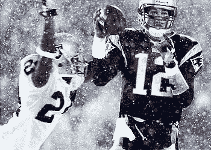
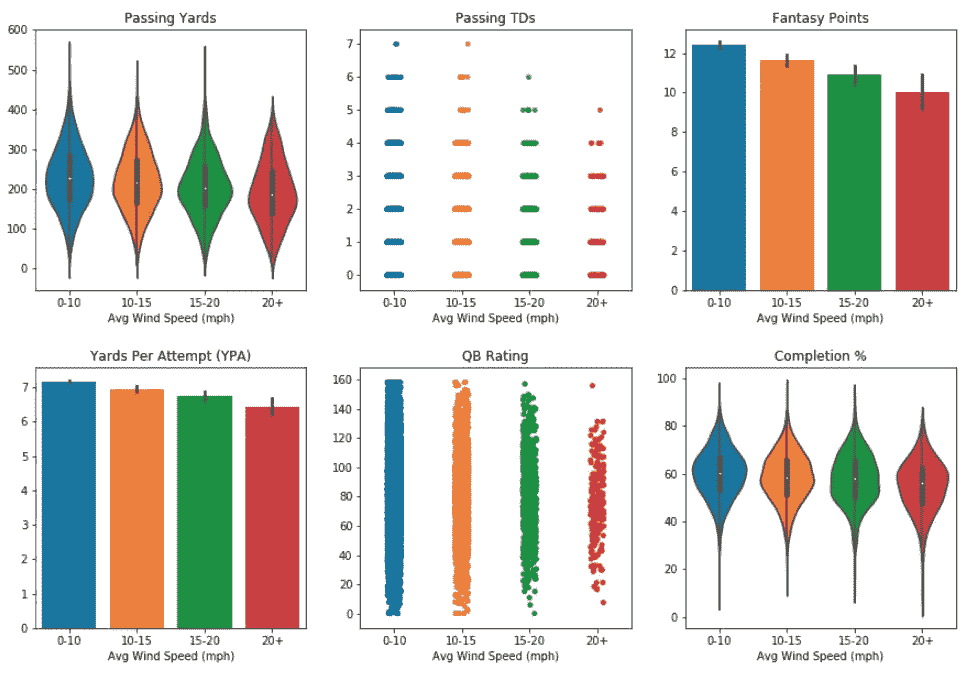
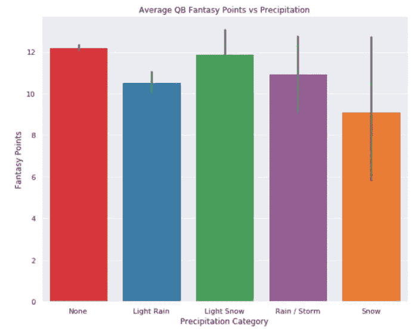
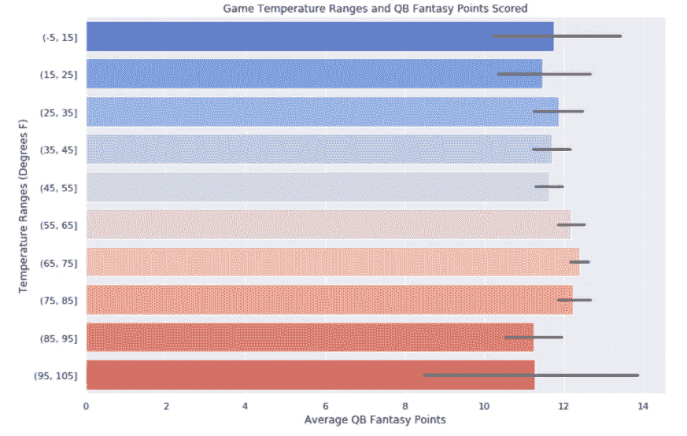
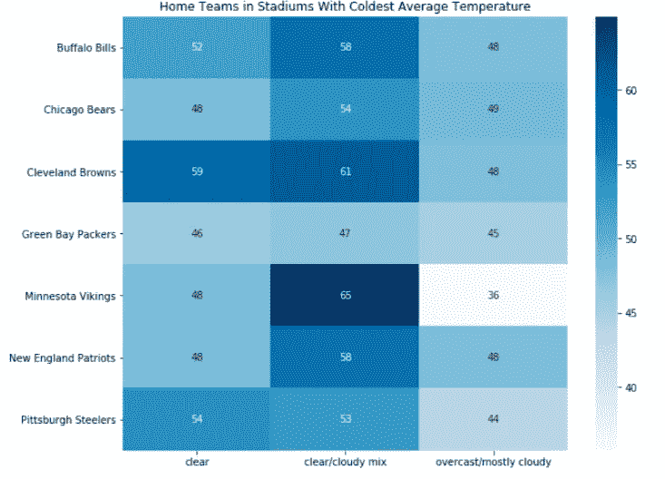
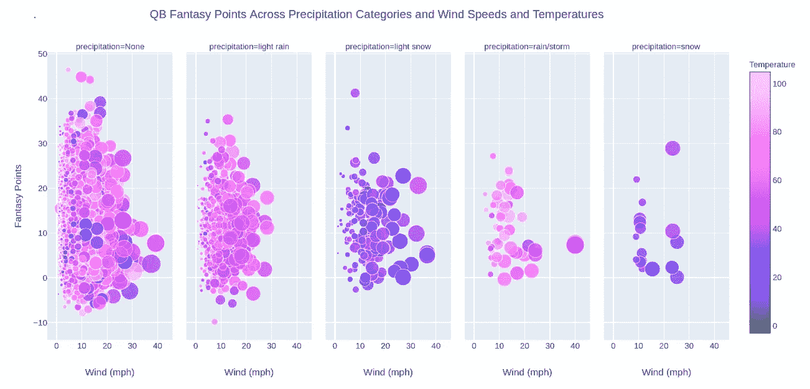
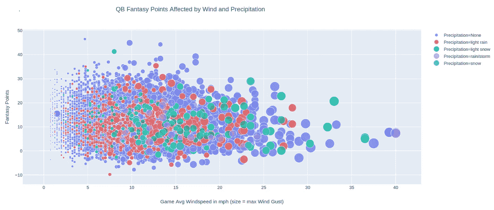
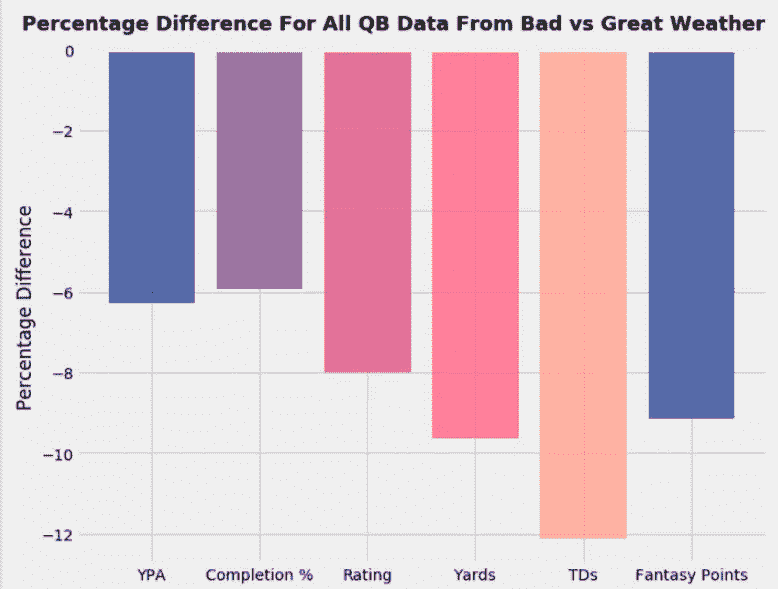
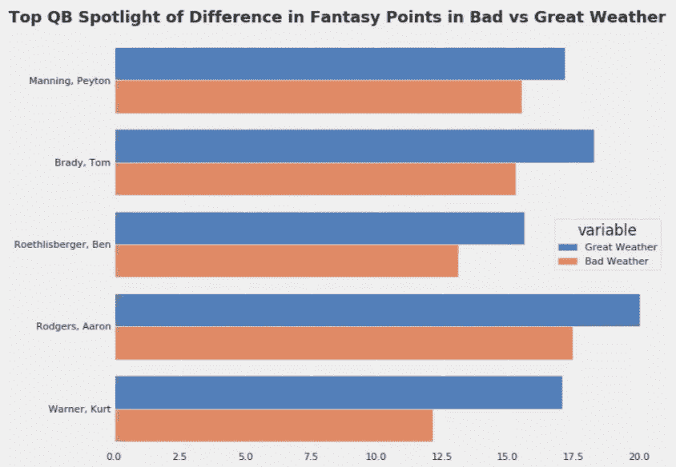
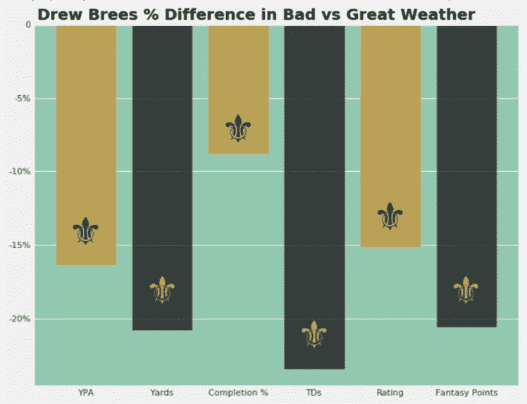

# “足球天气”——探究天气对 NFL QB 表现的影响

> 原文：<https://towardsdatascience.com/football-weather-diving-into-the-effects-of-weather-on-nfl-qb-performance-f0edb420623d?source=collection_archive---------7----------------------->

作为一个 NFL 的狂热粉丝，也许是一个更大的梦幻足球粉丝，我的梦幻足球爱好中一直困扰我的一个挫折来源是我不确定恶劣天气预报会对比赛和比赛中球员的统计产量产生多大影响。我经常发现自己对雨和风的预报反应过度，不管天气如何，坐冷板凳只会错过一场重要的比赛。这仅仅是小样本/坏运气，还是说“坏”天气实际上对一个专业运动员来说不是一个有意义的损害？如果 10 英里每小时的大风和小雨没什么大不了的，那么下雪呢？时速 15 英里的风怎么样？20?温度呢？在开始产生有意义的影响之前，温度需要达到哪个极端？这些是我在这篇博文中试图回答的问题，或者至少是阐明了一些问题。

找到 NFL 比赛的历史天气数据出奇地困难，但幸运的是，通过一些相当简单的 python 代码，我能够从[profootballarchives.com](https://www.profootballarchives.com/weather/weather.html)收集到 1985 年至 2016 年间几乎每场比赛的基本天气信息。我也能够找到一些 NFL 的统计数据，尽管不幸的是这并不完全是按游戏的比分格式。从 [Kaggle NFL 数据集](https://www.kaggle.com/kendallgillies/nflstatistics)，我决定使用 QB 游戏日志数据。经过一点争论，我能够将数据集合并到一个熊猫数据框架中。

在进行了相当多的清理、重命名列、对变量进行分类、宁滨一些连续数据以及转换/重铸数据类型之后，dataframe 已经准备好进行一些分析了。首先，由于四分卫通过空中传球获得报酬，我认为查看不同风速的数据将是一个好的开始。我将数据分为 4 类:0-10 英里，10-15 英里，15-20 英里和 20+英里。让我们来看看风对 QB 性能的几个测量的影响:

随着每个子图的风速类别从左到右增加，QB 性能有一个非常明显的下降趋势。随着游戏平均风速的增加，生产指标(码数、TD 传球数和幻想点数)以及效率指标(每次尝试的码数、QB 评分和完成百分比)都会受到影响。

接下来，我分析了降水的影响，分为 5 类:无(或室内/圆顶)、小雨、小雪、雨/风暴和雪/风暴。

奇怪的是，小雨似乎比暴雨有更深远的负面影响。然而，小雪、雨/风暴和雪的误差线相当大，这表明该数据可能不可靠。我对显著性进行了一些统计测试，得到的 p 值确实证明了这一点，小雪的 p 值为 0.75，暴雨为 0.26，雪为 0.09。这只是意味着结果可能是由于随机变化或混杂变量(如风速/温度——稍后会有更多介绍)造成的。

似乎温度本身并没有太大的影响。虽然似乎有理由假设极热或极冷的温度会对四分卫的表现产生现实世界的影响，特别是极寒，但这些类别的大误差棒再次表明样本量不足以达到统计意义。只是为了好玩，我决定绘制一张在最冷的温度下打最多比赛的 NFL 球队的热图。

好了，我们已经看到了孤立的天气类别如何影响 QB 统计，但是在现实世界中，这些天气类别很少孤立出现。在不同的温度范围内，有风和降水的游戏会有什么影响？使用 plotly express，只需一行代码，我们就可以将所有这些变量可视化:

这里发生了很多事情:每个点或泡泡代表一个 QB 游戏。温度用颜色表示，得分的幻想点数对应于 y 轴上的高度，风速用 x 轴表示。此外，分散点的大小代表该游戏的最大阵风，这就是为什么在平均风速较高的游戏中，较大的气泡大多出现在每个图形的右侧。最后，每个支线剧情代表该游戏的沉淀类别。该图中的两个主要要点是幻想点数和风速/阵风之间的负相关性，跨所有降水类别，以及在有降水的游戏中得分的总体下降趋势和较低的总体幻想点数。

上面的图显示了相同的数据(减去温度)，但将所有的游戏分组在一起，这里气泡的颜色代表降水类别。

现在我们已经看到了一些风、温度和不同类型降水的总体影响的图形表示，我真的想深入分析一下在*好*天气和*坏*天气下玩的游戏中 QB 的表现。要成为好天气，它必须非常原始，没有任何天气因素会影响 QB 的表现。我选取了整体数据的一个子集，其中温度适中(在 60 到 80 度之间)，天空晴朗(或在圆顶中)，没有降水，平均风速低于 5 英里/小时。对于恶劣天气，我选择了有雨/风暴或雪(小雪和小雨除外)、平均风速超过 12 英里/小时或极端极地温度(低于 10 度或高于 95 度)的子集。由此产生的子集每个都包括 2000 多一点的 QB 游戏，这是一个不错的样本量。让我们看看恶劣天气对 QB 性能的影响有多大:

Negative % difference for all categories indicates worse QB stats in bad vs great weather, as expected

这里的主要要点是，在恶劣天气下，生产指标通常会有较大的百分比下降。效率指标虽然也普遍较差，但没有那么明显。这可能是因为在天气不好的比赛中，教练会减少传球次数。也许在未来，我会看一看运行数据，并在恶劣天气下寻找相应的量/冲尝试的增加。

最后，我想看看几个玩家，比较他们在好天气和坏天气游戏中的表现。我从经常在恶劣天气的主场比赛的球队中挑选了 3 名球员，他们是新英格兰爱国者队的汤姆·布拉迪、匹兹堡钢人队的本·罗特利斯伯格和绿湾包装工队的亚伦·罗杰斯。为了代表主场比赛在圆顶/好天气下进行的球队，我选择了印第安纳波利斯小马队的培顿·曼宁和圣路易斯公羊队/亚利桑那红雀队的库尔特·华纳。

不出所料，在《好天气 vs 坏天气》中，所有 5 个 QB 平均都有更多的幻想点数。恶劣的天气适应了 QBs 每个得分之间的伟大天气游戏多 2 至 3 个幻想点。同样不足为奇的是，库尔特·华纳的股价大幅下跌。虽然培顿·曼宁的微小差异乍一看有点令人惊讶，但曼宁以他的准备和一丝不苟的职业道德而闻名，这表现在他的表现一致性上，不管不利天气带来的任何挑战。

最后，作为一名铁杆新奥尔良圣徒队球迷，如果我不看一下德鲁·布里斯的统计数据，那就是我的失职。在梦幻足球世界中，人们相当普遍地声称，德鲁·布里斯在联赛中有一些更激烈的主场分裂，这意味着当他离开梅赛德斯·奔驰超级穹顶的友好“穹顶球场优势”时，他的表现会明显下降。这种定性准确吗？让我们看看这些数字是否支持这一声誉:

Say it ain’t so, Drew!!

唉，我不得不痛苦地承认，专家们是对的..

总之，这里是我从探索 NFL 天气数据中收集到的主要信息，因为它与 QB 的表现有关:

*   风/阵风的影响是影响 QB 性能的最重要的天气变量。从 0 英里/小时到大约 15 英里/小时的平均风速的影响相当轻微，但在这个阈值以上，幻想点的差异大约少 12%。在风速超过 20 英里/小时的游戏中，负面影响更加显著，每场游戏的幻想点数减少约 17%。
*   降水，就其本身而言，基本没有定论。尽管小雨游戏的平均幻想点数最低，但有雨/风暴和雪的游戏的数据在统计上并不显著。
*   温度作为一个孤立的天气变量，对 QB 的表现没有太大的影响。
*   总体来说，QBs 在天气好的时候比天气不好的时候多获得 8-10%的幻想分数。在相对百分比的基础上，在圆顶或天气好的城市打主场比赛的 QB 的一小部分精选样本，在恶劣天气下的表现并不比往往更经常在恶劣天气下比赛的 QB 差多少。

感谢阅读！为了更深入地探究这篇博文背后的数据和分析，这里是我的 [github repo](https://github.com/Nolanole/NFL-Weather-Project) 的链接。