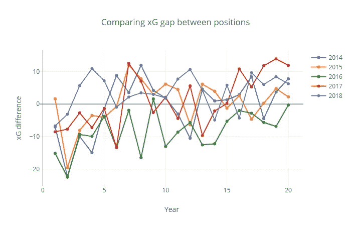
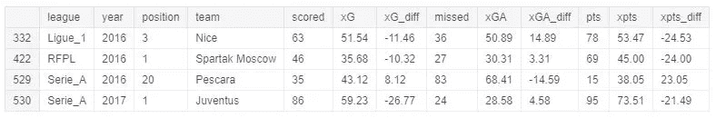

# 足球:为什么赢家赢了，输家输了

> 原文：<https://towardsdatascience.com/football-why-winners-win-and-losers-lose-56665e5be90e?source=collection_archive---------36----------------------->


Photo by [Vienna Reyes](https://unsplash.com/@viennachanges?utm_source=unsplash&utm_medium=referral&utm_content=creditCopyText) on [Unsplash](https://unsplash.com/search/photos/soccer?utm_source=unsplash&utm_medium=referral&utm_content=creditCopyText)

## 探索欧洲足球 5 年

# 介绍

在这本笔记本中，我们将探索现代足球指标(xG、xGA 和 xPTS)及其对体育分析的影响。

*   **预期目标(xG)** —根据几个变量来衡量射门质量，如助攻类型、射门角度和与球门的距离，是否是头球射门以及是否被定义为大概率射门。
*   **预期助攻(xGA)** —衡量给定传球成为进球助攻的可能性。它考虑了几个因素，包括传球类型、传球终点和传球长度。
*   **【xPTS】**—衡量某场比赛给团队带来积分的可能性。

这些指标让我们更深入地观察足球统计数据，了解球员和球队的总体表现，并认识到运气和技巧在其中的作用。声明:它们都很重要。

这个 Kaggle 内核描述了这个笔记本的数据收集过程:[网页抓取足球统计](https://www.kaggle.com/slehkyi/web-scraping-football-statistics-2014-now)

```
import pandas as pd
import numpy as np
import matplotlib.pyplot as plt
import seaborn as sns
import collections
import warnings

from IPython.core.display import display, HTML

*# import plotly* 
import plotly
import plotly.figure_factory as ff
import plotly.graph_objs as go
import plotly.offline as py
from plotly.offline import iplot, init_notebook_mode
import plotly.tools as tls

*# configure things*
warnings.filterwarnings('ignore')

pd.options.display.float_format = '**{:,.2f}**'.format  
pd.options.display.max_columns = 999

py.init_notebook_mode(connected=True)

%load_ext autoreload
%autoreload 2

%matplotlib inline
sns.set()

*# !pip install plotly --upgrade*
```

# 导入数据和可视化 EDA

```
df = pd.read_csv('../input/understat.com.csv')
df = df.rename(index=int, columns={'Unnamed: 0': 'league', 'Unnamed: 1': 'year'}) 
df.head()
```

在下一个可视化中，我们将检查在过去 5 年中每个联盟有多少支球队排名前 4。它可以给我们一些关于不同国家顶尖球队稳定性的信息。

```
f = plt.figure(figsize=(25,12))
ax = f.add_subplot(2,3,1)
plt.xticks(rotation=45)
sns.barplot(x='team', y='pts', hue='year', data=df[(df['league'] == 'Bundesliga') & (df['position'] <= 4)], ax=ax)
ax = f.add_subplot(2,3,2)
plt.xticks(rotation=45)
sns.barplot(x='team', y='pts', hue='year', data=df[(df['league'] == 'EPL') & (df['position'] <= 4)], ax=ax)
ax = f.add_subplot(2,3,3)
plt.xticks(rotation=45)
sns.barplot(x='team', y='pts', hue='year', data=df[(df['league'] == 'La_liga') & (df['position'] <= 4)], ax=ax)
ax = f.add_subplot(2,3,4)
plt.xticks(rotation=45)
sns.barplot(x='team', y='pts', hue='year', data=df[(df['league'] == 'Serie_A') & (df['position'] <= 4)], ax=ax)
ax = f.add_subplot(2,3,5)
plt.xticks(rotation=45)
sns.barplot(x='team', y='pts', hue='year', data=df[(df['league'] == 'Ligue_1') & (df['position'] <= 4)], ax=ax)
ax = f.add_subplot(2,3,6)
plt.xticks(rotation=45)
sns.barplot(x='team', y='pts', hue='year', data=df[(df['league'] == 'RFPL') & (df['position'] <= 4)], ax=ax)
```


正如我们从这些条形图中看到的，有些球队在过去 5 年中只进入过前 4 名，这意味着这并不常见，这意味着如果我们深入挖掘，我们会发现有一种运气因素可能对这些球队有利。这只是一个理论，所以让我们更接近那些离群值。

在过去的 5 个赛季中只有一次进入前 4 名的球队是:

*   来自德甲的沃尔夫斯堡(2014)和沙尔克 04 (2017)
*   来自 EPL 的莱斯特(2015)
*   来自西甲的比利亚雷亚尔(2015)和塞维利亚(2016)
*   来自意甲的拉齐奥(2014)和佛罗伦萨(2014)
*   来自法甲的里尔(2018)和圣艾蒂安(2018)
*   来自 RFPL 的罗斯托夫足球俱乐部(2015)和莫斯科迪纳摩足球俱乐部(2014)

让我们拯救这些队伍。

```
*# Removing unnecessary for our analysis columns* 
df_xg = df[['league', 'year', 'position', 'team', 'scored', 'xG', 'xG_diff', 'missed', 'xGA', 'xGA_diff', 'pts', 'xpts', 'xpts_diff']]

outlier_teams = ['Wolfsburg', 'Schalke 04', 'Leicester', 'Villareal', 'Sevilla', 'Lazio', 'Fiorentina', 'Lille', 'Saint-Etienne', 'FC Rostov', 'Dinamo Moscow']*# Checking if getting the first place requires fenomenal execution*
first_place = df_xg[df_xg['position'] == 1]

*# Get list of leagues*
leagues = df['league'].drop_duplicates()
leagues = leagues.tolist()

*# Get list of years*
years = df['year'].drop_duplicates()
years = years.tolist()
```

# 了解赢家如何获胜

在本节中，我们将尝试找到一些模式，这些模式可以帮助我们理解胜利之汤的一些成分:d .从德甲开始。

# 德甲联赛

```
first_place[first_place['league'] == 'Bundesliga']
```


```
pts = go.Bar(x = years, y = first_place['pts'][first_place['league'] == 'Bundesliga'], name = 'PTS')
xpts = go.Bar(x = years, y = first_place['xpts'][first_place['league'] == 'Bundesliga'], name = 'Expected PTS')

data = [pts, xpts]

layout = go.Layout(
    barmode='group',
    title="Comparing Actual and Expected Points for Winner Team in Bundesliga",
    xaxis={'title': 'Year'},
    yaxis={'title': "Points",
    }
)

fig = go.Figure(data=data, layout=layout)
py.iplot(fig)
```


通过看表格和柱状图我们看到，拜仁每年都获得了比他们应该得到的更多的分数，他们的得分比预期的多，失误比预期的少(除了 2018 年，它没有打破他们赢得赛季的计划，但它给出了一些暗示，拜仁今年打得更差，尽管竞争对手没有利用这一点)。

```
*# and from this table we see that Bayern dominates here totally, even when they do not play well*
df_xg[(df_xg['position'] <= 2) & (df_xg['league'] == 'Bundesliga')].sort_values(by=['year','xpts'], ascending=False)
```


# 西甲联赛

```
first_place[first_place['league'] == 'La_liga']
```


```
pts = go.Bar(x = years, y = first_place['pts'][first_place['league'] == 'La_liga'], name = 'PTS')
xpts = go.Bar(x = years, y = first_place['xpts'][first_place['league'] == 'La_liga'], name = 'Expected PTS')

data = [pts, xpts]

layout = go.Layout(
    barmode='group',
    title="Comparing Actual and Expected Points for Winner Team in La Liga",
    xaxis={'title': 'Year'},
    yaxis={'title': "Points",
    }
)

fig = go.Figure(data=data, layout=layout)
py.iplot(fig)
```


从上面的图表中我们可以看到，在 2014 年和 2015 年，巴塞罗那创造了足够多的赢得冠军的时刻，而不是依靠个人技能或运气，从这些数字中我们可以实际上说球队正在那里比赛。

2016 年，马德里和巴塞罗那之间有很多竞争，最终，马德里在一场特定的比赛中变得更幸运/更有勇气(或者巴塞罗那变得不幸运/没有球)，这是冠军的代价。我确信如果我们深入挖掘那个赛季，我们可以找到那场特殊的比赛。

2017 年和 2018 年，巴塞罗那的成功主要归功于莱昂内尔·梅西的行动，他在正常球员不会这样做的情况下得分或助攻。是什么导致 xPTS 差异如此之大。让我觉得(在这个赛季皇家马德里在转会市场上非常活跃的背景下)结果可能会很糟糕。只是基于数字和看巴萨比赛的主观看法。真希望我是错的。

```
*# comparing with runner-up*
df_xg[(df_xg['position'] <= 2) & (df_xg['league'] == 'La_liga')].sort_values(by=['year','xpts'], ascending=False)
```


# EPL

```
first_place[first_place['league'] == 'EPL']
```


```
pts = go.Bar(x = years, y = first_place['pts'][first_place['league'] == 'EPL'], name = 'PTS')
xpts = go.Bar(x = years, y = first_place['xpts'][first_place['league'] == 'EPL'], name = 'Expected PTS')

data = [pts, xpts]

layout = go.Layout(
    barmode='group',
    title="Comparing Actual and Expected Points for Winner Team in EPL",
    xaxis={'title': 'Year'},
    yaxis={'title': "Points",
    }
)

fig = go.Figure(data=data, layout=layout)
py.iplot(fig)
```


在 EPL，我们看到一个明显的趋势，告诉你:“要想赢，你必须比统计数据更好”。有趣的案例是莱斯特在 2015 年的胜利故事:他们比他们应该得到的多了 12 分，同时阿森纳比预期少了 6 分！这就是我们热爱足球的原因，因为这样莫名其妙的事情发生了。我不是说这完全是运气，但它在这里发挥了作用。

另一件有趣的事是 2018 年的曼城——他们超级稳定！他们只比预期多进了一个球，少失了两个球，多得了 7 分，而利物浦打得很好，运气稍微好一点，但尽管比预期多了 13 分，还是没能赢。

Pep 正在完成制造毁灭机器。曼城根据技术创造和转换他们的时刻，而不是依靠运气——这使得他们在下一个赛季非常危险。

```
*# comparing with runner-ups* df_xg[(df_xg['position'] <= 2) & (df_xg['league'] == 'EPL')].sort_values(by=['year','xpts'], ascending=False)
```


# 法甲联赛

```
first_place[first_place['league'] == 'Ligue_1']
```


```
pts = go.Bar(x = years, y = first_place['pts'][first_place['league'] == 'Ligue_1'], name = 'PTS')
xpts = go.Bar(x = years, y = first_place['xpts'][first_place['league'] == 'Ligue_1'], name = 'Expected PTS')

data = [pts, xpts]

layout = go.Layout(
    barmode='group',
    title="Comparing Actual and Expected Points for Winner Team in Ligue 1",
    xaxis={'title': 'Year'},
    yaxis={'title': "Points",
    }
)

fig = go.Figure(data=data, layout=layout)
py.iplot(fig)
```


在法甲联赛中，我们继续看到这样的趋势:“要想赢，你必须付出 110%的努力，因为 100%是不够的”。在这里，巴黎圣日耳曼占据绝对优势。只有在 2016 年，我们在摩纳哥的比赛中遇到了一个异数，比预期多进了 30 个球！！！而且比预期多考了差不多 17 分！运气？相当不错的一部分。那一年 PSG 不错，但是摩纳哥非同一般。同样，我们不能说这是纯粹的运气或纯粹的技巧，而是两者在正确的时间和地点的完美结合。

```
*# comparing with runner-ups* df_xg[(df_xg['position'] <= 2) & (df_xg['league'] == 'Ligue_1')].sort_values(by=['year','xpts'], ascending=False)
```


# 意甲联赛

```
first_place[first_place['league'] == 'Serie_A']
```


```
pts = go.Bar(x = years, y = first_place['pts'][first_place['league'] == 'Serie_A'], name = 'PTS')
xpts = go.Bar(x = years, y = first_place['xpts'][first_place['league'] == 'Serie_A'], name = 'Expecetd PTS')

data = [pts, xpts]

layout = go.Layout(
    barmode='group',
    title="Comparing Actual and Expected Points for Winner Team in Serie A",
    xaxis={'title': 'Year'},
    yaxis={'title': "Points",
    }
)

fig = go.Figure(data=data, layout=layout)
py.iplot(fig)
```


在意大利甲级联赛中，尤文图斯已经连续 8 年称霸，尽管在冠军联赛中没有取得任何重大成功。我认为，通过检查这张图表和数字，我们可以了解到尤文在国内没有足够强的竞争，并获得了很多“幸运”的分数，这也源于多种因素，我们可以看到那不勒斯两次以 xPTS 超过尤文图斯，但这是现实生活，例如，在 2017 年，尤文疯狂地打进了额外的 26 个进球(或不知从哪里创造的进球)，而那不勒斯比预期多错过了 3 个进球(由于守门员的错误或可能是一些球队在 1 或 2 场特定比赛中的出色表现)。就像皇马成为冠军时西甲联赛的情况一样，我确信我们可以找到那一年的一两场关键比赛。

足球中细节很重要。你看，这里一个错误，那里一个木制品，你就失去了冠军。

```
*# comparing to runner-ups* df_xg[(df_xg['position'] <= 2) & (df_xg['league'] == 'Serie_A')].sort_values(by=['year','xpts'], ascending=False)
```


# RFPL

```
first_place[first_place['league'] == 'RFPL']
```


```
pts = go.Bar(x = years, y = first_place['pts'][first_place['league'] == 'RFPL'], name = 'PTS')
xpts = go.Bar(x = years, y = first_place['xpts'][first_place['league'] == 'RFPL'], name = 'Expected PTS')

data = [pts, xpts]

layout = go.Layout(
    barmode='group',
    title="Comparing Actual and Expected Points for Winner Team in RFPL",
    xaxis={'title': 'Year'},
    yaxis={'title': "Points",
    }
)

fig = go.Figure(data=data, layout=layout)
py.iplot(fig)
```


我不关注俄罗斯超级联赛，所以仅仅通过冷眼看数据，我们就可以看到同样的模式，即从 2015 年到 2017 年，莫斯科中央陆军的得分超过了你应得的分数，这也是一个有趣的情况。在这些年里，这些人很优秀，但他们只转化了一次优势，其他两次——如果你不转化，你会受到惩罚，或者你的主要竞争对手只是转化得更好。

足球是没有公平可言的:d .虽然，我相信随着 VAR 的出现，接下来的几个赛季数字会变得更加稳定。因为那些额外的目标和分数的原因之一是仲裁人的错误。

```
*# comparing to runner-ups* df_xg[(df_xg['position'] <= 2) & (df_xg['league'] == 'RFPL')].sort_values(by=['year','xpts'], ascending=False)
```


# 统计概述

由于有 6 个联盟有不同的球队和统计数据，我决定集中在一个，在开始时，测试不同的方法，然后在其他 5 个上复制最终的分析模型。因为我主要看西甲联赛，所以我会从这场比赛开始，因为我对它了解最多。

```
*# Creating separate DataFrames per each league*
laliga = df_xg[df_xg['league'] == 'La_liga']
laliga.reset_index(inplace=True)
epl = df_xg[df_xg['league'] == 'EPL']
epl.reset_index(inplace=True)
bundesliga = df_xg[df_xg['league'] == 'Bundesliga']
bundesliga.reset_index(inplace=True)
seriea = df_xg[df_xg['league'] == 'Serie_A']
seriea.reset_index(inplace=True)
ligue1 = df_xg[df_xg['league'] == 'Ligue_1']
ligue1.reset_index(inplace=True)
rfpl = df_xg[df_xg['league'] == 'RFPL']
rfpl.reset_index(inplace=True)laliga.describe()
```


```
def print_records_antirecords(df):
  print('Presenting some records and antirecords: **n**')
  for col **in** df.describe().columns:
    if col **not** **in** ['index', 'year', 'position']:
      team_min = df['team'].loc[df[col] == df.describe().loc['min',col]].values[0]
      year_min = df['year'].loc[df[col] == df.describe().loc['min',col]].values[0]
      team_max = df['team'].loc[df[col] == df.describe().loc['max',col]].values[0]
      year_max = df['year'].loc[df[col] == df.describe().loc['max',col]].values[0]
      val_min = df.describe().loc['min',col]
      val_max = df.describe().loc['max',col]
      print('The lowest value of **{0}** had **{1}** in **{2}** and it is equal to **{3:.2f}**'.format(col.upper(), team_min, year_min, val_min))
      print('The highest value of **{0}** had **{1}** in **{2}** and it is equal to **{3:.2f}**'.format(col.upper(), team_max, year_max, val_max))
      print('='*100)

*# replace laliga with any league you want*
print_records_antirecords(laliga)***Presenting some records and antirecords:*** 

***The lowest value of SCORED had Cordoba in 2014 and it is equal to 22.00
The highest value of SCORED had Real Madrid in 2014 and it is equal to 118.00
================================================================
The lowest value of XG had Eibar in 2014 and it is equal to 29.56
The highest value of XG had Barcelona in 2015 and it is equal to 113.60
================================================================
The lowest value of XG_DIFF had Barcelona in 2016 and it is equal to -22.45
The highest value of XG_DIFF had Las Palmas in 2017 and it is equal to 13.88
================================================================
The lowest value of MISSED had Atletico Madrid in 2015 and it is equal to 18.00
The highest value of MISSED had Osasuna in 2016 and it is equal to 94.00
================================================================
The lowest value of XGA had Atletico Madrid in 2015 and it is equal to 27.80
The highest value of XGA had Levante in 2018 and it is equal to 78.86
================================================================
The lowest value of XGA_DIFF had Osasuna in 2016 and it is equal to -29.18
The highest value of XGA_DIFF had Valencia in 2015 and it is equal to 13.69
================================================================
The lowest value of PTS had Cordoba in 2014 and it is equal to 20.00
The highest value of PTS had Barcelona in 2014 and it is equal to 94.00
================================================================
The lowest value of XPTS had Granada in 2016 and it is equal to 26.50
The highest value of XPTS had Barcelona in 2015 and it is equal to 94.38
================================================================
The lowest value of XPTS_DIFF had Atletico Madrid in 2017 and it is equal to -17.40
The highest value of XPTS_DIFF had Deportivo La Coruna in 2017 and it is equal to 20.16***
```

现在让我们在图表上看看这些数字。

```
trace0 = go.Scatter(
    x = laliga['position'][laliga['year'] == 2014], 
    y = laliga['xG_diff'][laliga['year'] == 2014],
    name = '2014',
    mode = 'lines+markers'
)

trace1 = go.Scatter(
    x = laliga['position'][laliga['year'] == 2015], 
    y = laliga['xG_diff'][laliga['year'] == 2015],
    name='2015',
    mode = 'lines+markers'
)

trace2 = go.Scatter(
    x = laliga['position'][laliga['year'] == 2016], 
    y = laliga['xG_diff'][laliga['year'] == 2016],
    name='2016',
    mode = 'lines+markers'
)

trace3 = go.Scatter(
    x = laliga['position'][laliga['year'] == 2017], 
    y = laliga['xG_diff'][laliga['year'] == 2017],
    name='2017',
    mode = 'lines+markers'
)

trace4 = go.Scatter(
    x = laliga['position'][laliga['year'] == 2018], 
    y = laliga['xG_diff'][laliga['year'] == 2018],
    name='2018',
    mode = 'lines+markers'
)

data = [trace0, trace1, trace2, trace3, trace4]

layout = go.Layout(
    title="Comparing xG gap between positions",
    xaxis={'title': 'Year'},
    yaxis={'title': "xG difference",
    }
)

fig = go.Figure(data=data, layout=layout)
py.iplot(fig)
```



```
trace0 = go.Scatter(
    x = laliga['position'][laliga['year'] == 2014], 
    y = laliga['xGA_diff'][laliga['year'] == 2014],
    name = '2014',
    mode = 'lines+markers'
)

trace1 = go.Scatter(
    x = laliga['position'][laliga['year'] == 2015], 
    y = laliga['xGA_diff'][laliga['year'] == 2015],
    name='2015',
    mode = 'lines+markers'
)

trace2 = go.Scatter(
    x = laliga['position'][laliga['year'] == 2016], 
    y = laliga['xGA_diff'][laliga['year'] == 2016],
    name='2016',
    mode = 'lines+markers'
)

trace3 = go.Scatter(
    x = laliga['position'][laliga['year'] == 2017], 
    y = laliga['xGA_diff'][laliga['year'] == 2017],
    name='2017',
    mode = 'lines+markers'
)

trace4 = go.Scatter(
    x = laliga['position'][laliga['year'] == 2018], 
    y = laliga['xGA_diff'][laliga['year'] == 2018],
    name='2018',
    mode = 'lines+markers'
)

data = [trace0, trace1, trace2, trace3, trace4]

layout = go.Layout(
    title="Comparing xGA gap between positions",
    xaxis={'title': 'Year'},
    yaxis={'title': "xGA difference",
    }
)

fig = go.Figure(data=data, layout=layout)
py.iplot(fig)
```


```
trace0 = go.Scatter(
    x = laliga['position'][laliga['year'] == 2014], 
    y = laliga['xpts_diff'][laliga['year'] == 2014],
    name = '2014',
    mode = 'lines+markers'
)

trace1 = go.Scatter(
    x = laliga['position'][laliga['year'] == 2015], 
    y = laliga['xpts_diff'][laliga['year'] == 2015],
    name='2015',
    mode = 'lines+markers'
)

trace2 = go.Scatter(
    x = laliga['position'][laliga['year'] == 2016], 
    y = laliga['xpts_diff'][laliga['year'] == 2016],
    name='2016',
    mode = 'lines+markers'
)

trace3 = go.Scatter(
    x = laliga['position'][laliga['year'] == 2017], 
    y = laliga['xpts_diff'][laliga['year'] == 2017],
    name='2017',
    mode = 'lines+markers'
)

trace4 = go.Scatter(
    x = laliga['position'][laliga['year'] == 2018], 
    y = laliga['xpts_diff'][laliga['year'] == 2018],
    name='2018',
    mode = 'lines+markers'
)

data = [trace0, trace1, trace2, trace3, trace4]

layout = go.Layout(
    title="Comparing xPTS gap between positions",
    xaxis={'title': 'Position'},
    yaxis={'title': "xPTS difference",
    }
)

fig = go.Figure(data=data, layout=layout)
py.iplot(fig)
```


从上面的图表中，我们可以清楚地看到，顶级球队得分更多，失球更少，获得的分数比预期的更多。这就是为什么这些球队都是顶级球队。和与外人完全相反的情况。中游球队的平均水平。完全符合逻辑，没有什么深刻的见解。

```
*# Check mean differences*
def get_diff_means(df):  
  dm = df.groupby('year')[['xG_diff', 'xGA_diff', 'xpts_diff']].mean()

  return dm

means = get_diff_means(laliga)
means
```


```
*# Check median differences*
def get_diff_medians(df):  
  dm = df.groupby('year')[['xG_diff', 'xGA_diff', 'xpts_diff']].median()

  return dm

medians = get_diff_medians(laliga)
medians
```


# 离群点检测

# z 分数

z 得分是数据点相对于平均值的标准偏差数。假设|z-score| > 3 是异常值，我们可以使用它来查找数据集中的异常值。

```
*# Getting outliers for xG using zscore*
from scipy.stats import zscore
*# laliga[(np.abs(zscore(laliga[['xG_diff']])) > 2.0).all(axis=1)]*
df_xg[(np.abs(zscore(df_xg[['xG_diff']])) > 3.0).all(axis=1)]
```


```
*# outliers for xGA*
*# laliga[(np.abs(zscore(laliga[['xGA_diff']])) > 2.0).all(axis=1)]*
df_xg[(np.abs(zscore(df_xg[['xGA_diff']])) > 3.0).all(axis=1)]
```


```
*# Outliers for xPTS*
*# laliga[(np.abs(zscore(laliga[['xpts_diff']])) > 2.0).all(axis=1)]*
df_xg[(np.abs(zscore(df_xg[['xpts_diff']])) > 3.0).all(axis=1)]
```



zscore 总共检测到 12 个异常值。2016 年可怜的奥萨苏纳——近 30 个不该进的球。

正如我们从这个数据中看到的，处于异常空间顶端并不能让你赢得这个赛季。但是如果你错过了你的机会，或者在不该进球的地方进了球，而且进得太多——你应该降级。失败和平庸比胜利要容易得多。

# 四分位数间距(IQR)

IQR —是一组数据的第一个四分位数和第三个四分位数之间的差值。这是描述一组数据分布的一种方式。

一个常用的规则是，如果一个数据点高于第三个四分位数或低于第一个四分位数超过 1.5 个⋅ IQR，则该数据点是异常值。换句话说，低异常值低于 Q1 1.5⋅iqr，高异常值高于 Q3 + 1.5 ⋅ IQR。

我们去看看。

```
*# Trying different method of outliers detection* 
df_xg.describe()
```


```
*# using Interquartile Range Method to identify outliers*
*# xG_diff*
iqr_xG = (df_xg.describe().loc['75%','xG_diff'] - df_xg.describe().loc['25%','xG_diff']) * 1.5
upper_xG = df_xg.describe().loc['75%','xG_diff'] + iqr_xG
lower_xG = df_xg.describe().loc['25%','xG_diff'] - iqr_xG

print('IQR for xG_diff: **{:.2f}**'.format(iqr_xG))
print('Upper border for xG_diff: **{:.2f}**'.format(upper_xG))
print('Lower border for xG_diff: **{:.2f}**'.format(lower_xG))

outliers_xG = df_xg[(df_xg['xG_diff'] > upper_xG) | (df_xg['xG_diff'] < lower_xG)]
print('='*50)

*# xGA_diff*
iqr_xGA = (df_xg.describe().loc['75%','xGA_diff'] - df_xg.describe().loc['25%','xGA_diff']) * 1.5
upper_xGA = df_xg.describe().loc['75%','xGA_diff'] + iqr_xGA
lower_xGA = df_xg.describe().loc['25%','xGA_diff'] - iqr_xGA

print('IQR for xGA_diff: **{:.2f}**'.format(iqr_xGA))
print('Upper border for xGA_diff: **{:.2f}**'.format(upper_xGA))
print('Lower border for xGA_diff: **{:.2f}**'.format(lower_xGA))

outliers_xGA = df_xg[(df_xg['xGA_diff'] > upper_xGA) | (df_xg['xGA_diff'] < lower_xGA)]
print('='*50)

*# xpts_diff*
iqr_xpts = (df_xg.describe().loc['75%','xpts_diff'] - df_xg.describe().loc['25%','xpts_diff']) * 1.5
upper_xpts = df_xg.describe().loc['75%','xpts_diff'] + iqr_xpts
lower_xpts = df_xg.describe().loc['25%','xpts_diff'] - iqr_xpts

print('IQR for xPTS_diff: **{:.2f}**'.format(iqr_xpts))
print('Upper border for xPTS_diff: **{:.2f}**'.format(upper_xpts))
print('Lower border for xPTS_diff: **{:.2f}**'.format(lower_xpts))

outliers_xpts = df_xg[(df_xg['xpts_diff'] > upper_xpts) | (df_xg['xpts_diff'] < lower_xpts)]
print('='*50)

outliers_full = pd.concat([outliers_xG, outliers_xGA, outliers_xpts])
outliers_full = outliers_full.drop_duplicates()***IQR for xG_diff: 13.16
Upper border for xG_diff: 16.65
Lower border for xG_diff: -18.43
==================================================
IQR for xGA_diff: 13.95
Upper border for xGA_diff: 17.15
Lower border for xGA_diff: -20.05
==================================================
IQR for xPTS_diff: 13.93
Upper border for xPTS_diff: 18.73
Lower border for xPTS_diff: -18.41
==================================================****# Adding ratings bottom to up to find looser in each league (different amount of teams in every league so I can't do just n-20)*
max_position = df_xg.groupby('league')['position'].max()
df_xg['position_reverse'] = np.nan
outliers_full['position_reverse'] = np.nan

for i, row **in** df_xg.iterrows():
  df_xg.at[i, 'position_reverse'] = np.abs(row['position'] - max_position[row['league']])+1

for i, row **in** outliers_full.iterrows():
  outliers_full.at[i, 'position_reverse'] = np.abs(row['position'] - max_position[row['league']])+1total_count = df_xg[(df_xg['position'] <= 4) | (df_xg['position_reverse'] <= 3)].count()[0]
outlier_count = outliers_full[(outliers_full['position'] <= 4) | (outliers_full['position_reverse'] <= 3)].count()[0]
outlier_prob = outlier_count / total_count
print('Probability of outlier in top or bottom of the final table: **{:.2%}**'.format(outlier_prob))***Probability of outlier in top or bottom of the final table: 8.10%***
```

因此，我们可以说，很有可能每年在 6 个联赛中的一个联赛中，会有一支球队凭借他们出色的技术和运气获得冠军联赛或欧罗巴联赛的门票，或者有一支球队进入了乙级，因为他们不能转换他们的时刻。

```
*# 1-3 outliers among all leagues in a year*
data = pd.DataFrame(outliers_full.groupby('league')['year'].count()).reset_index()
data = data.rename(index=int, columns={'year': 'outliers'})
sns.barplot(x='league', y='outliers', data=data)
*# no outliers in Bundesliga*
```


我们表现出色和表现不佳的赢家和输家。

```
top_bottom = outliers_full[(outliers_full['position'] <= 4) | (outliers_full['position_reverse'] <= 3)].sort_values(by='league')
top_bottom
```


```
*# Let's get back to our list of teams that suddenly got into top. Was that because of unbeliavable mix of luck and skill?*
ot = [x for x  **in** outlier_teams if x **in** top_bottom['team'].drop_duplicates().tolist()]
ot
*# The answer is absolutely no. They just played well during 1 season. Sometimes that happen.*[]
```

# 结论

足球是一项低分的比赛，一个进球可以改变比赛的整个画面，甚至结束比赛结果。这就是为什么长期分析能让你对形势有更好的了解。

随着 xG 指标(以及由此衍生的其他指标)的引入，我们现在可以真正评估团队的长期表现，并了解顶级团队、中产阶级团队和绝对局外人之间的差异。

xG 为围绕足球的讨论带来了新的论点，这使得足球变得更加有趣。而同时，游戏又不失这种不确定的因素，以及疯狂的事情发生的可能性。其实现在，这些疯狂的事情有了解释的机会。

最终，我们发现，在某个联赛中，发生怪事的几率几乎是 100%。这将是一个多么史诗般的时刻，只是时间的问题。

带互动图表的原创作品可以在这里找到[。](https://www.kaggle.com/slehkyi/football-why-winners-win-and-losers-loose)

*原载于 2019 年 9 月 11 日*[*【http://sergilehkyi.com】*](http://sergilehkyi.com/football-why-winners-win-and-losers-loose/)*。*