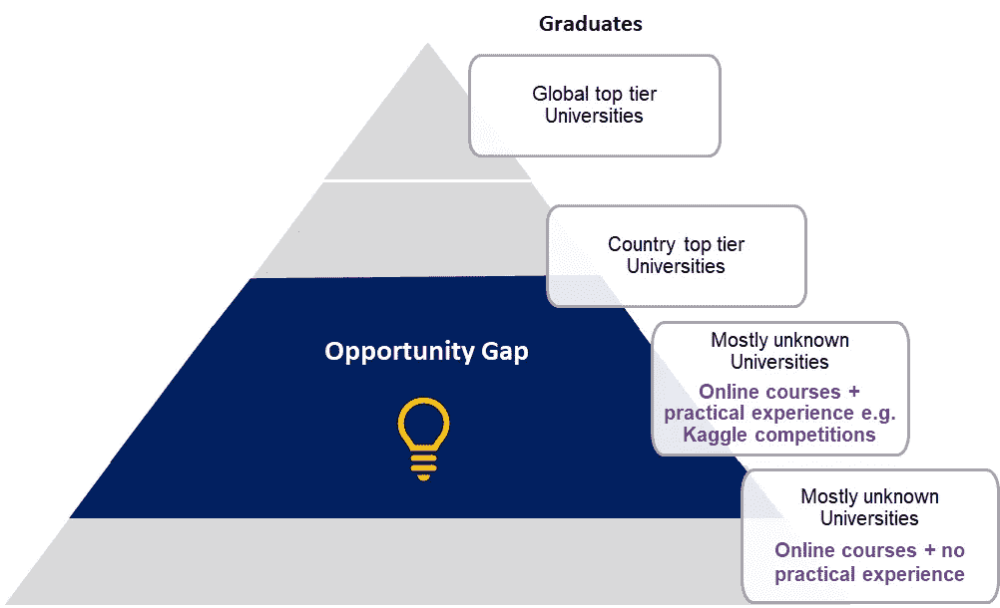
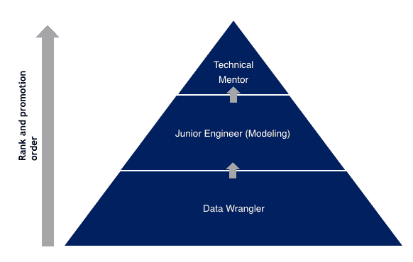
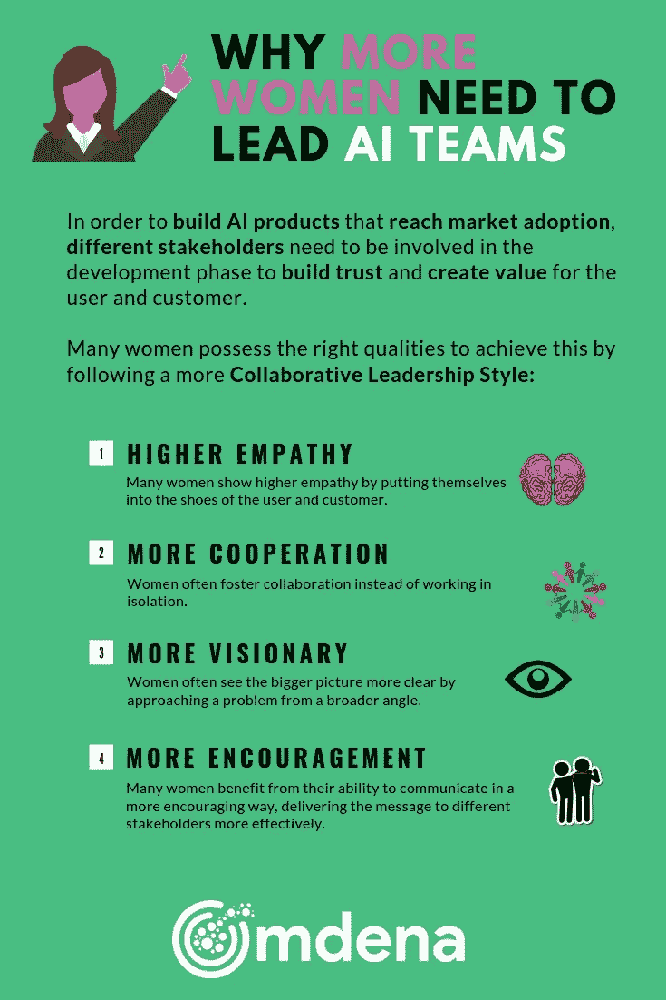

# 为了成功采用人工智能，我们需要更多的女性领导者

> 原文：<https://towardsdatascience.com/for-the-successful-future-of-ai-women-have-to-take-the-lead-180f09be4e50?source=collection_archive---------14----------------------->

Why we need more women in AI

## 为什么女性拥有正确的品质来更成功地领导人工智能项目，并创造一个协作和包容的环境来构建现实世界的人工智能产品。

> “21 世纪最激动人心的突破不会因为技术而出现，而是因为对人类意义的不断扩展的概念”
> 
> 约翰·奈斯比特

# 第一部分:男女之间的差异

# 一个关于女性和男性如何以不同方式工作的故事

在我们深入探讨为什么更多女性应该领导人工智能团队之前，我想分享一个我从卢塞恩应用科学与艺术大学三年级学生 Tania Biland 那里听到的有趣故事。

塔尼亚讲述的故事:

*上学期，为了给瑞士或德国品牌开发安全技术解决方案，我们班分成了三个不同的小组:*

***第一组:*** *仅限女性(我的组)*

***第二组:*** *仅限男性*

***第三组:*** *四女一男*

经过 4 周的工作后，每个团队都要展示他们的作品。

***第 1 组*** *，仅由女性组成，在黑暗中为女性制定了安全解决方案。由于评审团只有男性，我们决定用角色、音乐和视频来讲述一个故事，以便让他们感受女性在日常生活中所经历的事情。我们还强调了这样一个事实，即每个人的生活中都有母亲、姐妹或妻子，他们可能不希望她/他们受苦。最终，我们的解决方案是相当简单的******技术上的*** *:利用灯光提供安全但在情感上与观众* ***相连。*****

*****组 2*** *，大多由男性组成，呈现了一个更具* ***高科技解决方案使用 AI*******GPS*******视频会议*** *。他们以* ***事实和数字*** *为论据，指出自己的* ***竞争优势*** *。*****

*****第 3 组，****4 女 1 男，结局好像还没完。小组中唯一的男性不同意被女性领导，因此他们花太多时间讨论小组动态，而不是工作。***

**这些小组不仅有不同的结果，而且处理问题的方式也不同。我所在的小组(小组 1)决定从定义彼此的工作偏好和风格开始，以便分配一些责任，并尽可能保持层级的扁平化。**

***另一方面，另外两个小组选出了一名组长。事实证明，这些“领导者”更像是独裁者，这导致了严重的冲突，团队花了几个小时讨论和争论，而我们的团队只是在工作和生产。***

# **科学告诉我们性别差异**

**关于性别差异和对行为的影响的科学图景仍在发展，还没有为不同的行为提出一套清晰的科学解释。**

**通过汇总大部分研究，影响行为的主要因素有两个:**

1.  **男女之间潜在的生理差异**
2.  ****社会规范和压力**形成不同的行为**

**在上面的故事中，正如 Tania 所讲述的，女性以一种协作的领导风格([*【adhocracy culture】*](https://whatis.techtarget.com/definition/adhocracy)*)开发了解决方案，*以一种近乎扁平的层级结构根据任务调整领导地位。他们通过让所有利益相关者(在这种情况下，母亲和妻子=用户)参与进来，对他们的问题表示同情，从而得出他们的论点。他们看到了更广阔的前景，也构建了一个实际上已经完成的更简单的解决方案。**

## **通过这个故事，我能够将为什么大多数人工智能项目最终都没有从原型阶段发展到现实应用的原因联系起来。**

# **第二部分:让人工智能成功**

# **为什么不采用 AI 产品？**

**根据我的经验，大多数人工智能和机器学习(ML)解决方案没有从原型阶段走向现实世界有三个主要原因:**

1.  ****信任缺失:**AI 或者 ML 产品最大的困难之一就是信任缺失。数百万美元已经花在原型上，但在现实世界的发射中几乎没有成功。本质上，做生意和为客户提供价值的最基本的价值观之一是信任，当涉及到道德问题和相关的信任问题时，人工智能是争论最激烈的技术。信任来自于在整个开发阶段涉及不同的选项和各方，这在原型阶段是做不到的。**
2.  ****发布的复杂性:**构建一个原型很容易，但在进入现实世界时，需要考虑数十个其他外部实体。除了技术挑战之外，还有其他需要与原型集成的领域(比如营销、设计和销售)。**
3.  **人工智能产品通常不会考虑到所有的利益相关者:我听说过一个故事，在家庭暴力的情况下，Alexa 和 Google Home 被男性用来锁定他们的配偶。他们把音乐开得很大声，或者把他们锁在门外。在一个大多数男性工程师构建这些产品的环境中，可能没有人会考虑这种情况。此外，有许多例子表明人工智能和数据传感器可能带有偏见、性别歧视和种族主义[1]。**

**有趣的是，这三点都与技术挑战无关，所有这些都可以通过创建正确的团队来克服。**

# **如何让 AI 更成功的被采用？**

**为了解决上述挑战并构建更成功的人工智能产品，我们需要专注于一种更加**协作和社区驱动的方法**。**

**这考虑了不同利益攸关方的意见，特别是那些代表性不足的利益攸关方的意见。以下是实现这一目标的步骤:**

## **第一步。让不同的团体参与进来。来自人才金字塔中间的女性**

**在技术领域，大多数公司都专注于雇佣人才金字塔顶端的人，主要由于历史原因，这里的女性较少。例如，大多数计算机科学班的女生不到 10%。然而，许多有才华的女性隐藏在金字塔的中间，通过在线课程自学却缺乏机会和鼓励。**

****

**Talent Pyramid**

**举个例子，我和极客女孩胡萝卜的主席聊过，这是一个在技术领域促进女性的组织。他们正在组织一个人工智能研讨会，有超过 **125 名女性**申请，但她们**只有 25 个席位**，所以自然地，她们不得不留下**100 多名有才华的女性**。**

> **想象一下，如果我们能让其他 100 名女性中的大多数参与进来，而不仅仅是高层。这将给更多女性提供在人工智能等新技术领域工作的机会。**

## **第二步。与不同的利益相关者建立一个自下而上的公共协作团队**

**接下来，我们需要男性和女性以及不同利益相关者之间的更多合作，以便在真实市场中成功推出产品。这可以通过形成包容性的项目社区来实现，这些社区基于共同的价值观、信仰和更大的愿景来构建人工智能产品。**

**为了证明这一点，在过去的六个月里，我们召集了 50 多名男女学生来构建一个 ML 模型。在很短的时间内，成员们开始合作并互相帮助来建立模型。形成了四个小组，其中一个由两个女人领导，两个男人支持(数据标签)。其他组都是男性。在 4 个月的时间里，由两名女性和两名男性组成的小组建立了最精确的模型。从一开始，女性就比男性更愿意合作。然而，更有趣的是，我发现，由于团队中的其他女性，团队中的男性最终也表现得更加合作。这太迷人了！！**

## **第三步。为协作创建正确的组织结构**

**如果我们可以创造不需要授权的组织结构和实践，因为从设计上来说，每个人都是强大的，没有人是无能为力的，那会怎么样？我已经看到，这可以通过连接内在和外在动机(与金钱无关)并创建一个没有竞争力的激励结构来实现。**

**在我的例子中，我建立了一个社区，其中导师位于金字塔的顶端，接着是社区经理，然后是致力于建立模型的工程师，最后是数据标记者。每个团队的成员都在努力向上爬，以达到下一个级别，这创造了一个外在的动机。然而，同一级别人员的货币补偿是相同的。这促进了合作。**

****

> **在这种情况下，领导者的角色不是做老板，而是培养合作领导能力。这样的组织结构将减少控制人的需要，并提供共同学习和成长的机会[2]。**

# **第三部分:连接第一部分和第二部分。**

# **为什么女性应该领导人工智能团队**

**在一开始的故事中，女性小组遵循了一种更加**协作的领导风格**，表现出更多的顾客同理心和协作意愿。**

**考虑到 solar 项目中的有限实验，我们发现使用社区来构建产品的方法也有助于促进社区成员之间的协作和信任。**

**虽然上面提到的品质都不能一概而论，但下图旨在总结许多女性非常适合**协作型领导**的一些原因。**

****

**总之，我认为:**

> **我们应该更全面地思考，尽最大努力创造合适的环境，让我们超越性别、种族和文化背景，专注于我们人类如何合作建设更美好的未来。**

**最后，我要感谢所有帮助我撰写这篇文章的人(包括男性和女性)——他们创造了体验和内容，也提炼了文本。**

## **如果你想获得我们的人工智能挑战的更新，获得专家采访和提高你的人工智能技能的实用技巧，[订阅](http://eepurl.com/gto7Xn)我们的每月简讯。**

**我们也在[脸书](https://web.facebook.com/OmdenaAI/)、 [LinkedIn](https://www.linkedin.com/company/14052175) 和 [Twitter](https://twitter.com/OmdenaAI) 上。**

****