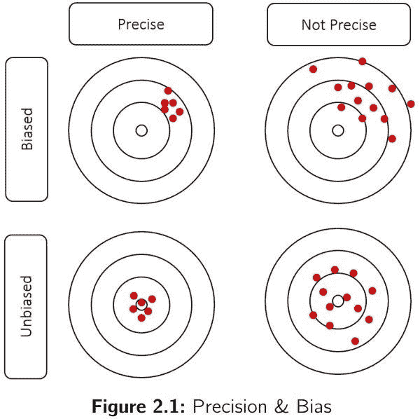
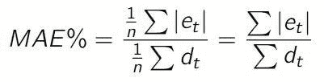

# 预测 KPI:RMSE、梅伊、MAPE 和 Bias

> 原文：<https://towardsdatascience.com/forecast-kpi-rmse-mae-mape-bias-cdc5703d242d?source=collection_archive---------0----------------------->

## 选择正确的预测指标并不简单。让我们回顾一下 RMSE、梅、MAPE 和偏见的利弊。剧透:MAPE 是最差的。不要用。

*本文摘自我的著作* [*供应链预测的数据科学*](https://www.amazon.com/Data-Science-Supply-Chain-Forecasting/dp/3110671107/ref=sr_1_1?dchild=1&keywords=vandeput&qid=1627634223&sr=8-1) *。你可以在这里* *阅读我的其他文章* [*。我也活跃在*](https://nicolas-vandeput.medium.com/)[*LinkedIn*](https://www.linkedin.com/in/vandeputnicolas/)*。*

[Credit](https://www.piqsels.com/en/public-domain-photo-ovxza)

衡量预测的准确性(或误差)并不是一件容易的事情，因为没有放之四海而皆准的指标。只有实验才能告诉你什么样的关键绩效指标(KPI)最适合你。正如你将看到的，每个指标将避免一些陷阱，但会倾向于其他。

我们要做的第一个区分是预测的精确度和它的偏差之间的区别:

*   **偏差**代表历史平均误差。基本上，平均而言，你的预测是过高(即你*超过*需求)还是过低(即你*低于*需求)？这将给出错误的总体方向。
*   **精度**衡量预测值和实际值之间的差距。预测的精度给出了误差大小的概念，但不是它们的总体方向。

当然，正如你在下图中看到的，我们想要的是一个既精确又公正的预测。

# 预测 KPI

# 错误

让我们首先将误差定义为预测减去需求。

请注意，如果根据此定义预测超出需求，误差将为正。如果预测低于需求，那么误差将为负。

# 偏见

偏差定义为平均误差:

其中 *n* 是既有预测又有需求的历史周期数。

由于一个项目上的正误差可以抵消另一个项目上的负误差，预测模型可以实现非常低的偏差，同时又不精确。显然，单凭偏差不足以评估你的预测精度。但是高度偏差的预测已经表明模型中有问题。

# multidimensional assessment of philosophy of education 教育哲学的多维评价

**平均绝对百分比误差(MAPE)** 是衡量预测准确度最常用的 KPI 之一。

MAPE 是个体绝对误差的总和除以需求(每个时期分开)。它是百分比误差的平均值。

MAPE 是一个非常奇怪的预测 KPI。

尽管这是一个不太准确的指标，但它在企业经理中是众所周知的。正如你在公式中看到的，MAPE 将每个误差单独除以需求，所以它是偏斜的:低需求时期的高误差将显著影响 MAPE。因此，优化 MAPE 将导致一个奇怪的预测，很可能会低于需求。避开就好。

# 平均绝对误差

**平均绝对误差(MAE)** 是衡量预测准确性的一个非常好的 KPI。顾名思义，就是绝对误差的均值。

此 KPI 的首要问题之一是它没有根据平均需求进行调整。如果有人告诉你，某个特定项目的 MAE 是 10，你无法知道这是好是坏。如果你的平均需求是 1000，这当然是惊人的。尽管如此，如果平均需求是 1，这是一个非常差的精度。为了解决这个问题，通常将 MAE 除以平均需求得到一个百分比:

**MAPE/梅混淆**——似乎许多从业者使用梅公式，并将其称为 MAPE。这可能会造成很多混乱。当与某人讨论预测误差时，我总是建议你明确地展示你如何计算预测误差，以确保比较苹果和苹果。

# 均方根误差

**均方根误差(RMSE)** 是一个奇怪的 KPI，但是非常有用，我们将在后面讨论。它被定义为平均平方误差的平方根。

就像 MAE 一样，RMSE 也不能满足需求。我们可以这样定义 RMSE%,

实际上，许多算法(尤其是机器学习)都是基于**均方误差(MSE)** ，这与 RMSE 直接相关。

许多算法使用 MSE，因为它比 RMSE 计算更快，更容易操作。但是它没有被缩放到原始误差(因为误差是平方的)，导致我们无法将 KPI 与原始需求缩放相关联。因此，我们不会用它来评估我们的统计预测模型。

**误差加权的问题**

与梅相比，RMSE 对每个错误都一视同仁。它更重视最重要的错误。这意味着一个大的错误就足以得到一个非常糟糕的 RMSE。

让我们用一个虚拟需求时间序列来做一个例子。

假设我们想要比较两个略有不同的预测。唯一的区别是对最新需求观察的预测:预测#1 比它少 7 个单位，而预测#2 只比*少* 6 个单位。

如果我们查看这两个预测的 KPI，我们会发现:

有趣的是，通过将最后一个周期的误差改变一个单位，我们将总 RMSE 降低了 6.9% (2.86 到 2.66)。尽管如此，MAE 只减少了 3.6% (2.33 到 2.25)，所以对 MAE 的影响低了近两倍。显然，RMSE 强调最重要的错误，而梅对每个错误都给予同等的重视。你可以自己尝试一下，减少一个最准确时期的误差，观察对梅和 RMSE 的影响。

剧透:对 RMSE 几乎没有影响。

稍后你会看到，RMSE 还有其他一些非常有趣的特性。

# 你想预测什么？

我们仔细检查了这些 KPI 的定义(bias、MAPE、MAE、RMSE)，但是仍然不清楚使用一个 KPI 代替另一个 KPI 会对我们的模型产生什么影响。有人可能会认为，用 RMSE 代替梅或梅代替 MAPE 不会改变任何事情。但是没有什么是不真实的。

让我们做一个简单的例子来说明这一点。

让我们想象一下，一个产品的周需求量很低，而且相当平稳，但不时会有一个大订单(可能是由于促销或客户批量订购)。这是我们目前观察到的每周需求:

现在让我们设想我们对这种产品提出三种不同的预测。第一个预测 2 件/天，第二个预测 4 件，最后一个预测 6 件。让我们把我们观察到的需求和这些预测画出来。

让我们看看这些预测在历史时期的偏差、MAPE、梅伊和 RMSE 方面的表现:

这意味着，就 MAPE 而言，预测#1 是历史期间最好的，就平均月平均日而言，预测#2 是最好的。预测#3 在 RMSE 和偏差方面是最好的(但在梅和 MAPE 方面是最差的)。现在让我们来揭示这些预测是如何做出的:

*   **预测 1** 只是一个很低的量。
*   **预测 2** 是需求中位数:4。
*   **预测 3** 是平均需求。

# 中位数与平均数—数学优化

在进一步讨论不同的预测 KPI 之前，让我们花一些时间来理解为什么中位数的预测会得到好的 **MAE** 和平均数的预测会得到好的 **RMSE** 。

**前面有一点数学。如果你对这些等式不清楚，这不是问题，不要气馁。跳过它们，直接跳到 RMSE 和梅埃塔勒的结论。**

**RMSE**

让我们从 RMSE 开始:

为了简化下面的代数，让我们使用一个简化版本:均方误差(MSE):

如果您将 MSE 设置为预测模型的目标，它会将其最小化。人们可以通过将一个数学函数的导数设为零来最小化它。让我们试试这个。

**结论**为了优化预测的 MSE，该模型必须以总预测等于总需求为目标。也就是说，优化 MSE 的目的是产生平均正确的*预测*，因此是无偏的。

**梅**

现在让我们为梅做同样的事情。

或者，

和

这意味着

**结论**为了优化 MAE(即将其导数设置为 0)，预测需要比需求高很多倍，因为它比需求低。换句话说，我们正在寻找一个将数据集分成两个相等部分的值。这是中位数的确切定义。

**MAPE**

不幸的是，MAPE 的衍生物不会显示一些优雅和简单的属性。我们可以简单地说，MAPE 提出了一个非常低的预测，因为当需求较低时，它为预测误差分配了较高的权重。

**结论**

正如我们上面看到的，在任何模型中，RMSE 的优化将寻求平均正确。相比之下，MAE 的优化将试图经常超过需求和低于需求，这意味着以需求中值为目标。我们必须明白，一个显著的区别在于梅和 RMSE 的数学根源。**一个瞄准中位数，一个瞄准平均数。**

梅和 RMSE——选择哪一个？

以需求的中间值或平均值为目标更糟糕吗？嗯，答案不是非黑即白的。每种技术都有一些好处和一些风险，我们将在下一页讨论。只有实验才能揭示哪种方法最适合数据集。你甚至可以选择同时使用 RMSE 和梅。

让我们花些时间来讨论选择 RMSE 或 MAE 对偏差、对异常值的敏感性和间歇性需求的影响。

# 偏见

对于许多产品，你会发现中间值与平均需求并不相同。需求很可能会在这里或那里出现一些峰值，这将导致一个偏斜的分布。这些不对称的需求分布在供应链中普遍存在，因为峰值可能是由于定期促销或客户批量订购造成的。这将导致需求中位数低于平均需求，如下所示。

这意味着最小化 MAE 的预测将导致偏差。相比之下，最小化 RMSE 的预测不会导致偏差(因为它的目标是平均值)。这绝对是 MAE 的主要弱点。

**对异常值的敏感度**

正如我们所讨论的，RMSE 更重视最高的错误。这是有代价的:对异常值的敏感性。让我们想象一个需求模式如下的物品。

中位数是 8.5，平均数是 9.5。我们已经观察到，如果我们做出最小化 MAE 的预测，我们将预测中位数(8.5)，并且我们将平均低于需求 1 个单位(偏差= -1)。然后，您可能希望最小化 RMSE，并预测平均值(9.5)来避免这种情况。

然而，现在让我们假设我们有一个新的需求观察值 100。

中位数还是 8.5(没变！)，但是现在平均是 18.1。在这种情况下，您可能不想预测平均值，而可能会恢复到预测中值。

一般来说，中位数比平均数对异常值更稳健。这在供应链环境中相当重要，因为由于编码错误或需求高峰(营销、促销、现货交易)，我们可能会面临许多异常值。

对异常值的鲁棒性总是一件好事吗？号码

**间歇需求**

事实上，不幸的是，中位数对异常值的稳健性会对具有间歇性需求的项目产生非常恼人的影响。

让我们想象一下，我们把一个产品卖给一个客户。这是一种高利润的产品。不幸的是，我们独一无二的客户似乎每三周就下一次订单，没有任何规律可循。客户总是以 100 件为一批订购产品。然后，我们的平均周需求为 33 件，需求中位数为… 0。

我们必须填充该产品的每周预测。假设我们做了第一次预测，目标是平均需求(33 件)。从长期来看，我们将获得 6，667 的总平方误差(RMSE 为 47)和 133 的总绝对误差(平均误差为 44)。

现在，如果我们预测需求中位数(0)，我们会得到 100 的总绝对误差(MAE 为 33)和 10.000 的总平方误差(RMSE 为 58)。

正如我们所看到的，MAE 对于间歇性需求来说是一个不好的 KPI。一旦有超过一半的期间没有需求，最佳预测就是… 0！

# 结论

梅保护离群值，而 RMSE 向我们保证得到一个无偏见的预测。您应该使用哪个指标？不幸的是，没有明确的答案。作为一名供应链数据科学家，您应该进行试验:如果使用 MAE 作为 KPI 会导致高偏差，您可能会想要使用 RMSE。如果数据集包含许多异常值，导致预测不准确，您可能需要使用 MAE。

请注意，您可以选择用一个或多个 KPI(通常是 MAE 和 bias)报告预测误差，并使用另一个 KPI(RMSE？)来优化你的模型。

针对低需求项目使用的最后一个技巧是将需求汇总到更高的时间范围。例如，如果每周的需求很低，您可以测试月度预测甚至季度预测。您总是可以通过简单的划分将预测分解回原始时段。这种技术可以让您将 MAE 用作 KPI，同时平滑需求峰值。

# 关于作者

## 在 LinkedIn 上关注我！

 [## Nicolas vande put——顾问，创始人——供应链| LinkedIn

### 查看 Nicolas Vandeput 在世界上最大的职业社区 LinkedIn 上的个人资料。尼古拉斯有 7 份工作列在…

www.linkedin.com](https://www.linkedin.com/in/vandeputnicolas/) 

icolas Vandeput 是一名供应链数据科学家，擅长需求预测和库存优化。他在 2016 年创立了自己的咨询公司 [SupChains](http://www.supchains.com/) ，并在 2018 年共同创立了 [SKU 科学](https://bit.ly/3ozydFN)——一个快速、简单、实惠的需求预测平台。尼古拉斯对教育充满热情，他既是一个狂热的学习者，也喜欢在大学教学:自 2014 年以来，他一直在比利时布鲁塞尔为硕士学生教授预测和库存优化。自 2020 年以来，他还在法国巴黎的 CentraleSupelec 教授这两个科目。他于 2018 年出版了 [*供应链预测的数据科学*](https://www.amazon.com/Data-Science-Supply-Chain-Forecasting/dp/3110671107)(2021 年第 2 版)和 2020 年出版了 [*库存优化:模型与模拟*](https://www.amazon.com/Inventory-Optimization-Simulations-Nicolas-Vandeput/dp/3110673916) 。

