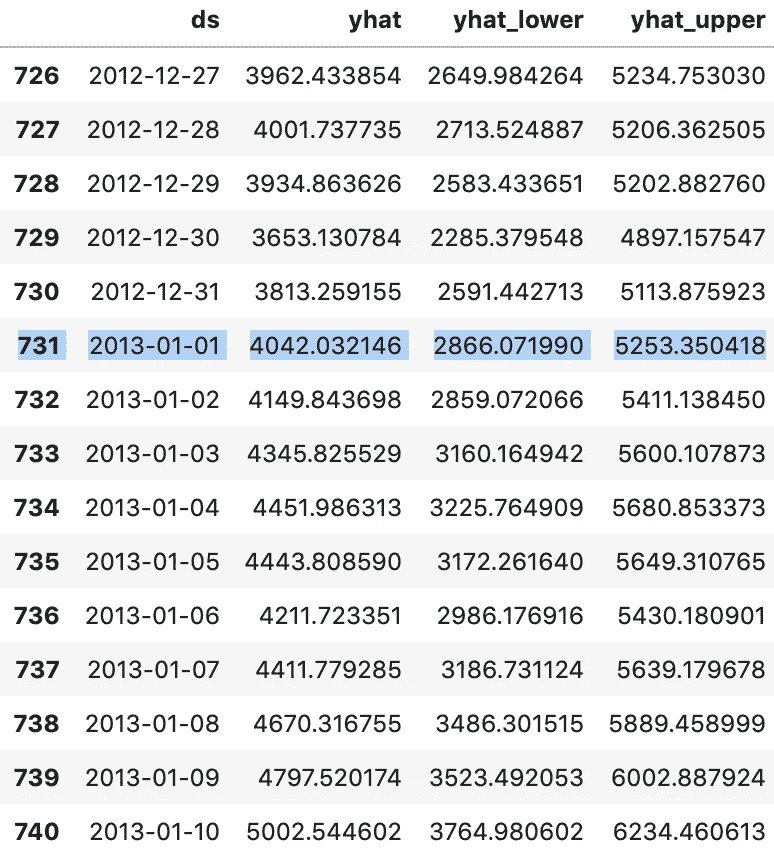
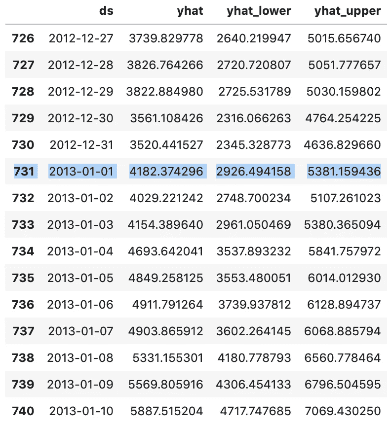
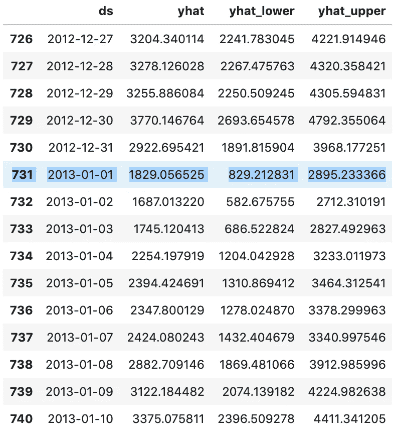

# 先知中使用附加回归器的预测模型调整

> 原文：<https://towardsdatascience.com/forecast-model-tuning-with-additional-regressors-in-prophet-ffcbf1777dda?source=collection_archive---------3----------------------->

## 关于如何在先知模型中添加回归因子以提高预测精度的说明


Use case — bike rental (picture source: Pixabay)

我将把我的实验结果分享给[预言家附加回归器](https://facebook.github.io/prophet/docs/seasonality,_holiday_effects,_and_regressors.html#additional-regressors)。我的目标是检查额外的回归将如何影响先知计算的预测。

使用来自 Kaggle 的数据集— [华盛顿州的自行车共享数据集](https://www.kaggle.com/marklvl/bike-sharing-dataset)。数据附带了每天自行车租金和天气情况的数字。我创建并比较了三个模型:

1.  带有自行车租赁日期和数量的时间序列先知模型
2.  带有附加回归器的模型——天气温度
3.  带有附加回归器 s 的模型——天气温度和状态(下雨、晴天等)。)

我们应该看到回归的效果，并比较这三个模型。

预测是为未来 10 天计算的。数据集中的最后一天是 2012 年 12 月 31 日，这意味着预测从 2013 年 1 月 1 日开始。

**A .无附加回归器的模型**

从 2013 年 1 月 1 日开始的自行车租赁预测值:



Bike rentals forecast for the next ten days

**B .带附加回归器的模型-天气温度**

回归器的值必须在过去和将来都是已知的，这是它如何帮助先知调整预测的。未来值必须是预定义的和已知的(例如，在特定日期发生的特定事件)，或者应该在其他地方预测。就我们的情况而言，我们使用的是天气温度预报，可以从天气频道获得。

回归器的值必须与时间序列数据位于同一数据框中。我复制了一个要定义为索引列的日期列:

```
df = pd.read_csv('weather_day.csv')
df = df[['dteday', 'cnt', 'temp']].dropna()d_df['date_index'] = d_df['dteday']
d_df['date_index'] = pd.to_datetime(d_df['date_index'])
d_df = d_df.set_index('date_index')
```

我们需要构建未来十天的数据框架——从 2013 年 1 月 1 日到 2001 年 10 天创建熊猫数据框架，并使用温度预测(标准化值)初始化每个元素:

```
t = 13
min_t = -8
max_t = 39
n_t = (t - min_t)/(max_t - min_t)
print(n_t)future_range = pd.date_range('2013-01-01', periods=10, freq='D')
future_temp_df = pd.DataFrame({ 'future_date': future_range, 'future_temp' : 0})future_temp_df['future_date'] = pd.to_datetime(future_temp_df['future_date'])
future_temp_df = future_temp_df.set_index('future_date')future_temp_df.at['2013-01-01', 'future_temp'] = 0.319148
future_temp_df.at['2013-01-02', 'future_temp'] = 0.255319
future_temp_df.at['2013-01-03', 'future_temp'] = 0.234042
future_temp_df.at['2013-01-04', 'future_temp'] = 0.319148
future_temp_df.at['2013-01-05', 'future_temp'] = 0.340425
future_temp_df.at['2013-01-06', 'future_temp'] = 0.404255
future_temp_df.at['2013-01-07', 'future_temp'] = 0.361702
future_temp_df.at['2013-01-08', 'future_temp'] = 0.404255
future_temp_df.at['2013-01-09', 'future_temp'] = 0.425531
future_temp_df.at['2013-01-10', 'future_temp'] = 0.446808future_temp_df.tail(10)
```

在下面的代码中，我添加了天气温度的回归器。如果日期属于训练集，则从训练集返回温度，否则从未来预测数据框(上面构建的数据框)返回温度。未来十天的期限已经设定。先知模型是用*拟合*函数构建的，调用预测函数来计算预测:

```
def weather_temp(ds):
    date = (pd.to_datetime(ds)).date()

    if d_df[date:].empty:
        return future_temp_df[date:]['future_temp'].values[0]
    else:
        return (d_df[date:]['temp']).values[0]

    return 0m = Prophet()
m.add_regressor('temp')
m.fit(d_df)future = m.make_future_dataframe(periods=10)
future['temp'] = future['ds'].apply(weather_temp)forecast = m.predict(future)
forecast[['ds', 'yhat', 'yhat_lower', 'yhat_upper']].tail(15)
```

从 2013 年 1 月 1 日开始，自行车租赁的预测值，以及附加的温度回归器。天气预报显示气温良好，预计 1 月份天气温暖，这有助于将自行车租赁数量调整到更高水平(如果天气温度良好，自然会有更多的租赁):



Bike rentals forecast for the next ten days, with temperature regressor

**C .具有两个附加回归因子的模型-天气温度和条件**

数据集包含相当多的描述天气的属性，使用更多的这些属性将有助于计算更准确的自行车租赁预测。我将展示增加一个回归变量如何改变预测。

```
def weather_temp(ds):
    date = (pd.to_datetime(ds)).date()

    if d_df[date:].empty:
        return future_temp_df[date:]['future_temp'].values[0]
    else:
        return (d_df[date:]['temp']).values[0]

    return 0def weather_condition(ds):
    date = (pd.to_datetime(ds)).date()

    if d_df[date:].empty:
        return future_temp_df[date:]['future_weathersit'].values[0]
    else:
        return (d_df[date:]['weathersit']).values[0]

    return 0m = Prophet()
m.add_regressor('temp')
m.add_regressor('weathersit')
m.fit(d_df)future = m.make_future_dataframe(periods=10)
future['temp'] = future['ds'].apply(weather_temp)
future['weathersit'] = future['ds'].apply(weather_condition)forecast = m.predict(future)
forecast[['ds', 'yhat', 'yhat_lower', 'yhat_upper']].tail(15)
```

使用上述代码添加了额外的回归变量—天气条件(数据集中的 check *weathersit* 属性)以及天气温度回归变量。出于测试的目的，我将未来十天的天气条件设置为 4(这意味着天气不好)。即使一月份的天气温度在上升(这对自行车租赁来说是好事)，整体天气还是很糟糕(这应该会减少自行车租赁的数量)。

使用第二个回归变量(指向预期的坏天气)，Prophet 返回较小的预期自行车租赁数量:



Bike rentals forecast for the next ten days, with temperature regressor and weather condition

**总结**:在 Prophet 中，附加回归量功能对于精确预测计算非常重要。它有助于调整预测的构建方式，并使预测过程更加透明。回归量必须是过去已知的变量，并且是已知的(或对未来单独预测的)。

资源:

*   GitHub [回购](https://github.com/abaranovskis-redsamurai/automation-repo/tree/master/forecast)与源代码
*   我以前的一篇关于同一主题的文章— [用烧瓶为先知模型服务—预测未来](/serving-prophet-model-with-flask-predicting-future-1896986da05f)