# 用机器学习预测收入惊喜

> 原文：<https://towardsdatascience.com/forecasting-earning-surprises-with-machine-learning-68b2f2318936?source=collection_archive---------16----------------------->

## 如何预测哪些公司将超过或低于分析师的收益预期

上市公司发布季度收益报告，当结果偏离分析师的估计时，会引起重大的价格波动。这是因为根据有效市场假说，资产价格完全反映了所有可获得的信息，因此会成为共识估计的一个因素。在本文中，我们将了解如何使用机器学习来预测一家公司是否会超出或低于其预期。

# 数据

我们考虑来自汤姆森路透 I/B/E/S 估计数据库的每股收益分析师估计，并从 [Sentieo](http://sentieo.com) 下载。该数据库收集并汇编了分析师对 20 多项指标的估计。对于每家公司，我们给出了估计值的平均值、估计数、低值、高值和实际值，如下所示:

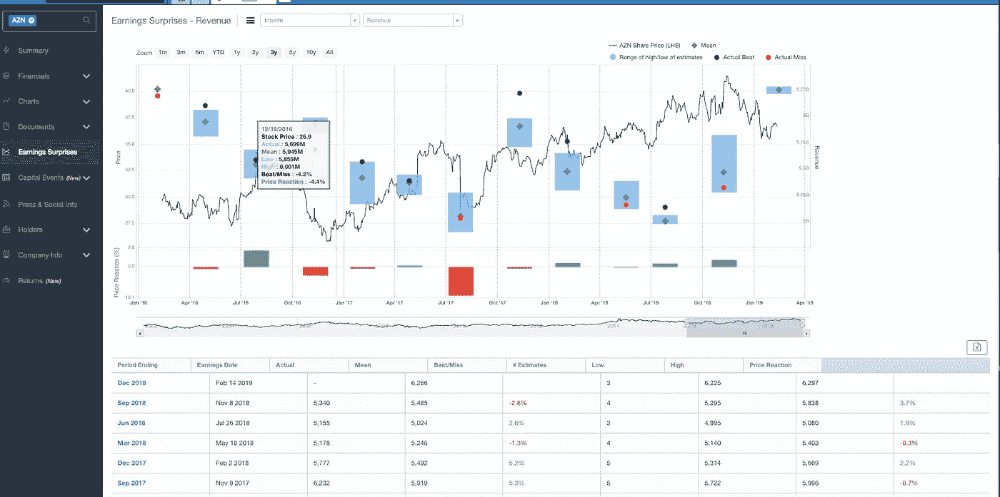

不幸的是，对于这个数据库，我们每个公司只有 70 个数据点，这不足以根据以前公布的结果和他们的 Beat/Miss vs 估计来预测一个公司的收益，但我们可以重新构建问题以增加数据点的数量。

不要问我们自己一个公司是否会超出或错过估计，我们可以问估计值是否会高于或低于实际值。

然后，我们将对这些值进行归一化，以便对它们进行聚合。在这种情况下，我们将为我们的模型考虑的特征是:

*   #估计值
*   低/平均百分比
*   高/平均百分比
*   实际/平均百分比

然后，我们决定按部门汇总估计值，以检验分析师准确预测收益的能力与公司性质相关的假设。在这项研究中，我们将重点关注医疗保健股。

然后，我们对以下 117 家公司进行了 6000 次评估:

AAC '，' ABT '，' ABBV '，' ACHC '，' XLRN '，' ACOR '，' AERI '，' AGIO '，' AIMT '，' AKCA '，' AKBA'
，' AKRX '，' ALXN '，' ALGN '，' AGN '，' ALNY '，' AMRN '，' AMGN'
，' FOLD '，' ARRY '，' ASND '，' AZN '，' ATRC '，' AVNS'
，' BHC '，' BAX '，' BDX '，' BCRX '，' BMRN '，' TECH '，' BEAT '，' BLUE' 【T7 '，' BSX '，' BMY '，'

# **处理数据**

我们将数据上传到 [AuDaS](http://mindfoundry.ai/audas) ，这是一个由 [Mind Foundry](http://mindfoundry.ai) 为分析师打造的数据科学和教育平台。为了提高模型的准确性，我们创建了一个新列来表示实际值是高于(1)还是低于(-1)实际值(相对于 a %)。

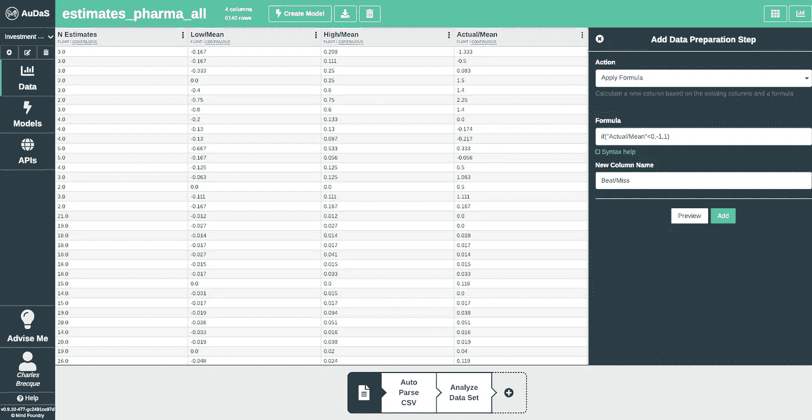

我们还可以通过自动生成的直方图来可视化数据，并查看节拍/缺失如何跨其他特征分布。

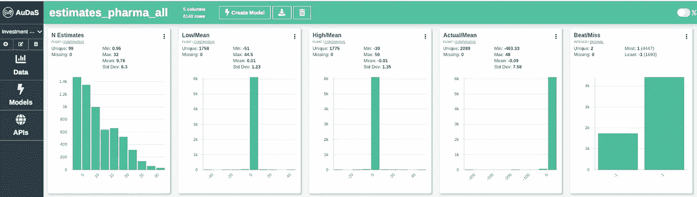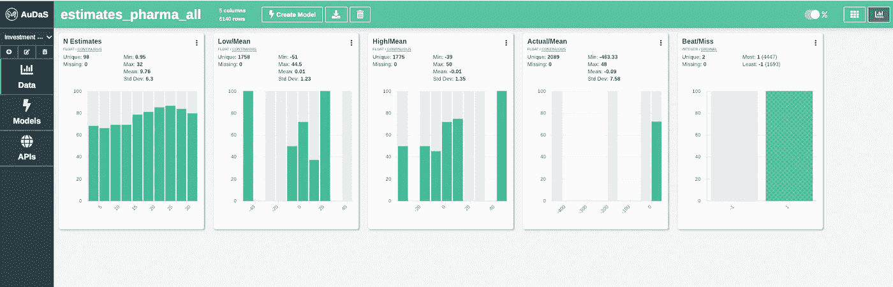

# 构建我们的机器学习模型

由于我们预测节拍/缺失列，因此我们将构建一个分类器，同时排除实际/平均列。我们还将坚持由 AuDaS 自动选择的推荐训练配置，以防止过度拟合(10 倍交叉验证和 10%坚持验证)。

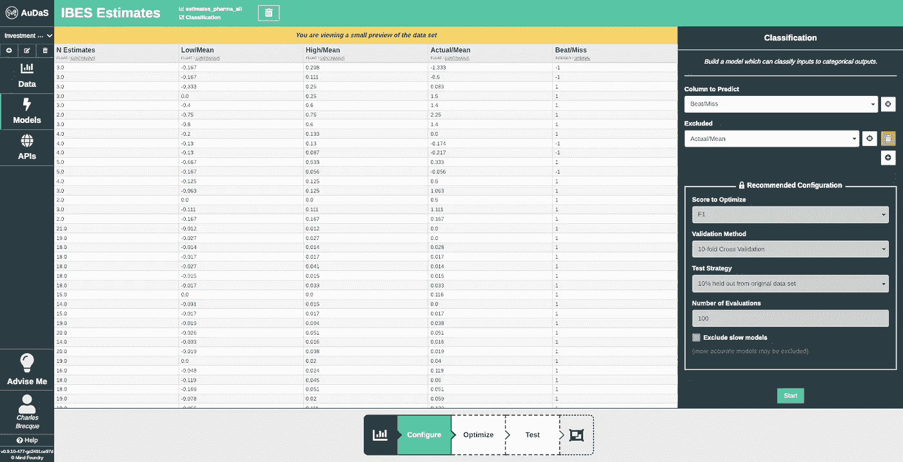

然后，AuDaS 将开始使用 Mind Foundry 的专有优化器 [OPTaaS](https://optaas.mindfoundry.ai) 搜索最佳机器学习模型，该优化器已迅速成为量化基金行业最受欢迎的快速全局优化和超参数调整工具。

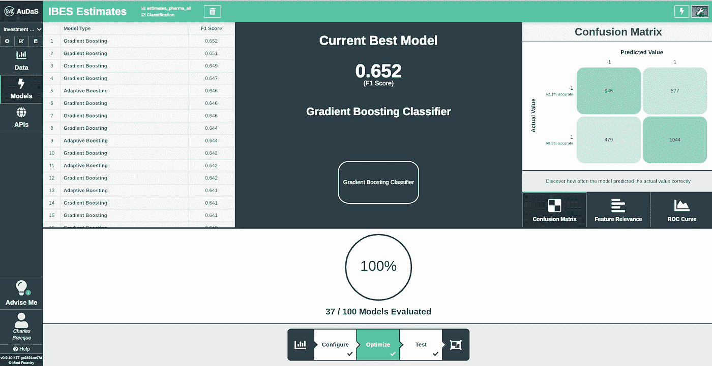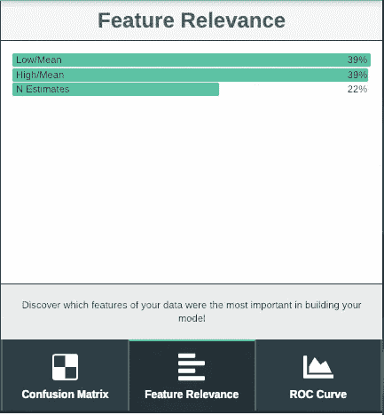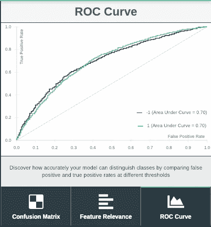

在不到一分钟的时间里，AuDaS 已经尝试了 37 种不同的机器学习模型，找到的最佳解决方案是一个简单的梯度提升分类器。将鼠标悬停在模型上可显示其参数值:

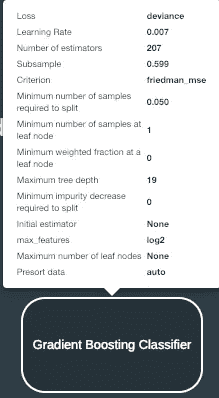

该模型的相对特征相关性表明低/均值、高/均值比率包含最多的信息。

# 测试模型

然后，我们可以在 10%的保留率上测试模型:

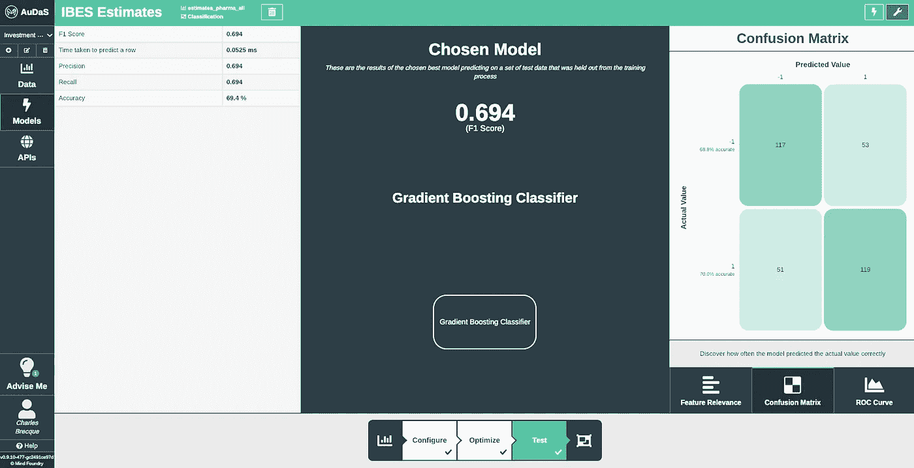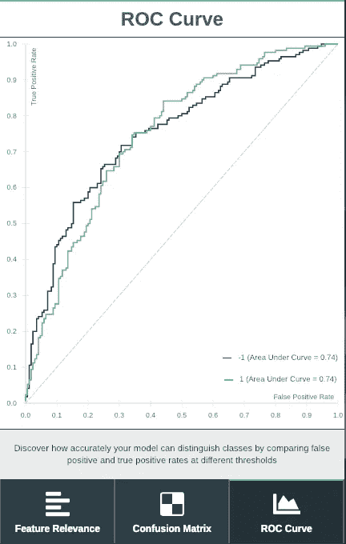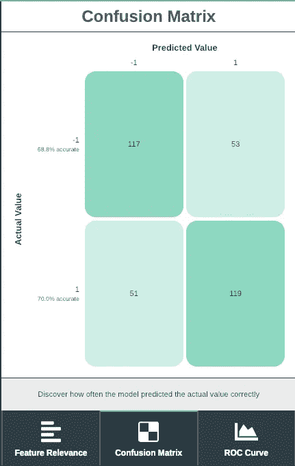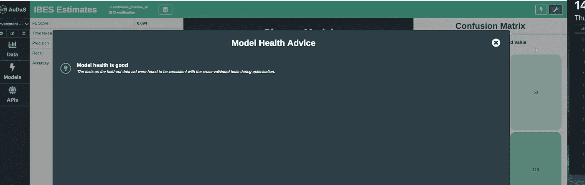

AuDaS 实现了 69.4%的分类准确度，并且最终的模型健康建议是好的。

# 结论和延伸

凭借相对较少的功能，AuDaS 能够建立一个准确的预测模型，支持投资分析师对 IBES 估值的评估。这可以使他们预测重大的价格变动。

这项研究的延伸将是使用 AuDaS 的聚类功能对多个部门的估计值进行分组。这将使我们能够检验这样一个假设，即公司治理等其他因素将比行业更能影响预测的成功/失败比率。

如果您有兴趣了解我们的 Quant 和基本面对冲基金客户如何使用澳元进行风险分析和投资管理，请不要犹豫，通过[电子邮件](http://charles.brecque@mindfoundry.ai)或 [LinkedIn](https://www.linkedin.com/in/charles-brecque-96768397/) 联系我。您还可以阅读以下更多案例研究:

 [## 集群风险管理

### 如何揭开表面下的结构

towardsdatascience.com](/risk-management-with-clustering-fd594e064806)  [## 机器学习的价值投资

### 你最喜欢的持有期不一定是永远…

towardsdatascience.com](/value-investing-with-machine-learning-e41867156108)  [## 用数据科学充实投资分析师

### 基本面投资如何受益于机器学习

towardsdatascience.com](/augmenting-investment-analysts-with-data-science-98297cb1ccb0) 

***注来自《走向数据科学》的编辑:*** *虽然我们允许独立作者根据我们的* [*规则和指导方针*](/questions-96667b06af5) *发表文章，但我们不认可每个作者的贡献。你不应该在没有寻求专业建议的情况下依赖一个作者的作品。详见我们的* [*读者术语*](/readers-terms-b5d780a700a4) *。*

更新:我开了一家科技公司。你可以在这里找到更多的

## 团队和资源

Mind Foundry 是牛津大学的一个分支，由斯蒂芬·罗伯茨和迈克尔·奥斯本教授创立，他们在数据分析领域已经工作了 35 年。Mind Foundry 团队由 30 多名世界级的机器学习研究人员和精英软件工程师组成，其中许多人曾是牛津大学的博士后。此外，Mind Foundry 通过其分拆地位，拥有超过 30 名牛津大学机器学习博士的特权。Mind Foundry 是牛津大学的投资组合公司，其投资者包括[牛津科学创新](https://www.oxfordsciencesinnovation.com)、[牛津技术与创新基金](http://www.oxfordtechnology.com)、[牛津大学创新基金](https://innovation.ox.ac.uk/award-details/university-oxford-isis-fund-uoif/)和 [Parkwalk Advisors](http://parkwalkadvisors.com) 。