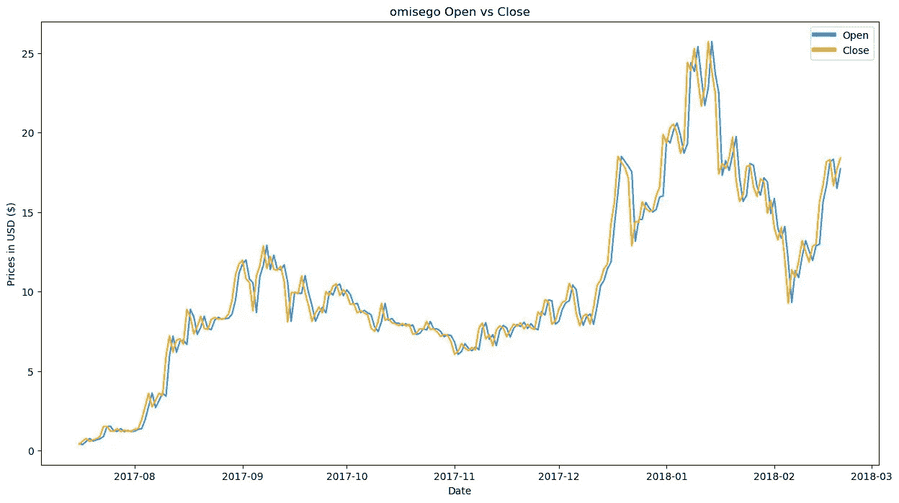
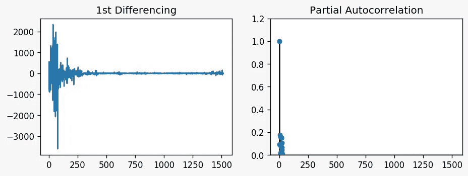
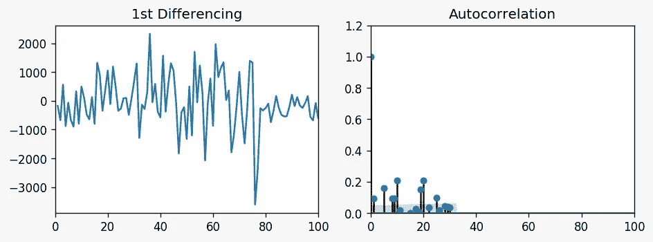
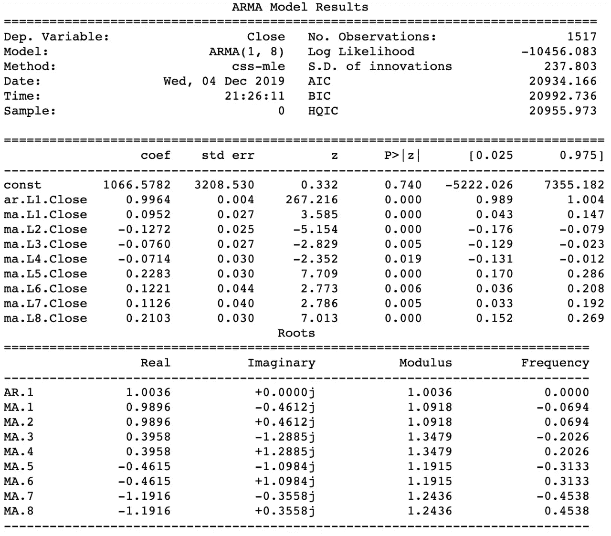
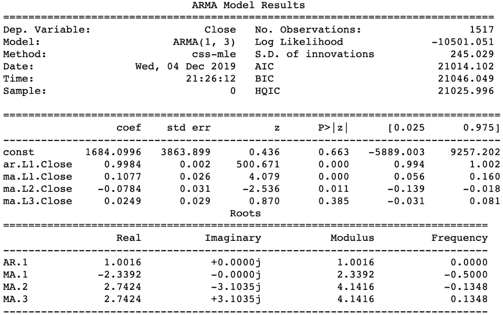
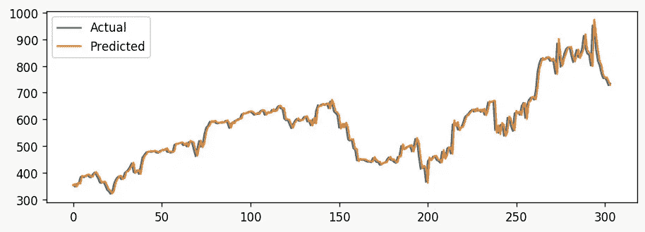

# 利用历史数据预测加密货币的未来价格

> 原文：<https://towardsdatascience.com/forecasting-future-prices-of-cryptocurrency-using-historical-data-83604e72bc68?source=collection_archive---------10----------------------->


加密货币(cryptocurrency)这个词已经席卷了金融界，然而目前还缺乏对数字资产数据的正式和公开的研究。这篇博文旨在建立在这篇 [**文章**](https://medium.com/@hamzaahmad86/exploratory-data-analysis-of-cryptocurrency-historical-data-d8ec719641e7) 中进行的探索性数据分析的基础上。我们将在这里使用可用的数据集[](https://www.kaggle.com/sudalairajkumar/cryptocurrencypricehistory)**来预测不同加密货币的未来价格。**

**在 EDA 之后，预测是下一步，你需要预测价格的未来值。对于有兴趣投资这些加密货币的人来说，这可能具有巨大的商业价值。**

**我们将尝试通过使用 *closing_price* 特性来预测*比特币*的未来价格。**

# **用什么型号？**

**为了进行预测，我们需要一个机器学习模型。大多数人想预测值的时候都会想到多元线性回归。但是对于时间序列数据，这不是一个好主意。不选择时间序列数据回归的主要原因是我们对预测未来感兴趣，这将是线性回归的外推(预测数据范围之外)。我们知道，在线性回归中，任何形式的外推都是不可取的。**

****

**对于时间序列数据，最好使用*自回归综合移动平均*或 **ARIMA** 模型。**

# **ARIMA**

**ARIMA 实际上是一类模型，它基于给定的时间序列的过去值来“解释”给定的时间序列，即其自身的滞后和滞后预测误差，因此该方程可用于预测未来值。任何“非季节性”的时间序列显示模式，不是一个随机的白噪声可以用 ARIMA 模型建模。如下所述，假设检验表明价格不是季节性的，因此我们可以使用 ARIMA 模型。在我们的 EDA 阶段，我们还发现任何加密货币都没有系统模式。**

****

**Non-Seasonal Trend of Omisego’s Prices**

**要创建 ARIMA 模型，我们需要 3 个参数:**

*   ***p*；自回归项的阶**
*   ***问*；移动平均项的阶**
*   ***d*；使时间序列平稳所需的差分次数**

## **确定平稳性**

**我们将需要时间序列数据是平稳的，因为术语*自动回归*在 ARIMA 意味着它是一个[线性回归模型](https://www.machinelearningplus.com/machine-learning/complete-introduction-linear-regression-r/)，使用它自己的滞后作为预测器。如你所知，当预测因子不相关且相互独立时，线性回归模型效果最佳。**

**为了实现平稳性，我们需要执行*差分*:从当前值中减去前一个值。有时，根据系列的复杂程度，可能需要一个以上的差异。在我们这样做之前，我们需要检查我们的数据是否已经是稳定的。为此，我们将使用 [*增强的 Dickey Fuller* 测试](https://www.statsmodels.org/stable/generated/statsmodels.tsa.stattools.adfuller.html)。这是一个**假设检验**，假设零假设为*“自回归模型中存在单位根”*。单位根检验时间序列变量是否是非平稳的，是否有单位根。如果一个数列有一个单位根，它就显示出一个系统的模式。在这种情况下，另一个假设是“*没有单位根存在*”，这意味着时间序列是平稳的。**

```
result = adfuller(df["Close]).dropna())
```

**测试返回一个为 **0.002114** 的 **P 值**。这远低于我们设定的 0.05 的显著性水平，因此我们拒绝零假设，并得出数据是平稳的结论。**

**由于数据是静态的，我们不需要执行任何差分。因此，参数 **d** 的值将为 0。**

## **确定 AR 项的阶数**

****p** 是*自回归* (AR)项的顺序。它是指用作预测值的 Y 的滞后数。我们可以通过查看*偏相关* *函数* (PACF)图来找出所需的 AR 项数。在排除中间滞后的贡献后，部分自相关可以被想象为序列和它的滞后之间的相关性。**

****

**我们可以观察到，PACF 滞后 1 是唯一一个非常显著的值，与其他值相比，它远远高于显著性线。因此，我们可以安全地将 *p* 设置为 1。**

## **确定 MA 术语的顺序**

****q** 是*移动平均线* (MA)项的顺序。它是指应该进入 ARIMA 模型的滞后预测误差的数量。MA 术语在技术上是滞后预测的误差。**

**就像我们看 PACF 图中 AR 项的数量一样，你也可以看 ACF 图中 MA 项的数量。ACF 告诉我们需要多少 MA 项来消除平稳序列中的任何自相关。**

****

**计算显著线以上的滞后数。所以，我们暂定 *q* 为 8。**

## **构建模型**

**既然我们已经有了所有需要的参数，现在我们将构建模型。**

```
model = ARIMA(df["Close"], order=(1,0,8))
model_fit = model.fit(disp=0)
print(model_fit.summary())
```

****

**ARIMA MODEL FOR p=1, d=0, q=8**

**我们可以注意到，MA 项的 P > |z|中的 P 值远小于 0.05。因此，我们可以理想地去掉一些 MA 项并重建模型。由于三项显著高于显著性水平，我们将 q 设为 3。**

```
model = ARIMA(df["Close"], order=(1,0,3))
```

****

**ARIMA Model for revised parameters**

# **评估模型**

**既然模型已经被拟合，我们现在将测试我们的 ARIMA 模型。为此，我们现在将数据集分为两部分:**

*   **训练数据(原始数据集的 80%)**
*   **测试数据(原始数据集的 20%)**

```
X = bit_df["Close"].values
train_size = int(len(X) * 0.80)
predictions = model_fit.predict(train_size,len(X)-1)
test = X[train_size:len(X)]
error = mean_squared_error(test, predictions)
```

**model_fit.predict()获取测试数据的开始和结束索引。然后，通过计算*均方误差*，将结果与测试数据集的目标值进行比较。**

**均方差的值出来是~ **575.24** 。当我们看到数据跨越了 5 年的每日条目时，这个误差并不大。然而，仅仅是均方误差值并不能让我们清楚地知道我们的模型有多精确。因此，我们将可视化测试数据的预测值和实际值的比较。**

****

**Actual closing values VS Predicted closing values**

**查看图表，我们可以看到收盘价的预测值和实际值非常接近。**

**那都是乡亲们！祝你有愉快的一天。**