# 预测:如何检测异常值？

> 原文：<https://towardsdatascience.com/forecasting-how-to-detect-outliers-cb65faafcd97?source=collection_archive---------5----------------------->

## 对于需求计划者来说，异常值可能是一个痛苦。让我们来看看是什么导致了它们，以及标记它们的 3 种技术。

*下面这篇文章摘自我的《供应链预测的数据科学》一书，这里有*[](https://www.amazon.com/Data-Science-Supply-Chain-Forecast/dp/1730969437)**。你可以在这里* *找到我的其他出版物* [*。我也活跃在*](https://medium.com/@nicolas.vandeput)[*LinkedIn*](https://www.linkedin.com/in/vandeputnicolas/)*。**

> *“今天我不想进一步尝试去定义这种材料(……)，也许我永远也不能明白地做到这一点。但我一看就知道了。”
> 波特·斯图尔特*

*1964 年，波特·斯图尔特是美国最高法院法官。他不是在讨论局外人，而是在讨论电影《情人》是否淫秽。*

*当您进行预测时，您会注意到您的数据集会有异常值。尽管当我看到它时我就知道它可能是唯一实用的定义，但这些离群值对供应链构成了真正的威胁。这些高点(或低点)将导致你的预测或安全库存的过度反应，最终导致(最好的情况下)人工修正或(最坏的情况下)死库存、损失和严重的牛鞭效应。实际上，当你查看博客、书籍、文章或预测软件时，异常值检测的问题经常被回避。这是一个遗憾。离群点检测是一件严肃的事情。*

*这些异常值在现代供应链中无时无刻不在出现。它们主要是由于两个主要原因:*

***错误&错误**这些都是明显的离群值。如果您发现了此类错误或编码错误，就需要流程改进来防止这些错误再次发生。
**异常需求**尽管一些需求观察是真实的，但这并不意味着它们不是*异常*并且不应该被清理或平滑。这种非凡的销售在供应链中其实并不罕见。想想促销、营销、奇怪的客户行为或减少库存。通常情况下，您可能不想在预测中考虑去年为处理几乎过时的旧库存而实现的 80%的特殊销售额。*

*如果你能发现异常值并消除它们，你就能做出更好的预测。我见过许多例子，仅仅由于异常值清理，预测误差就减少了百分之几。实际上，数据集越大，自动检测和清理就越重要。让我们看看我们如何能做到这一点。*

*在这篇文章中，我们将讨论三个半想法来找出这些异常值，并把它们放回到一个合理的水平。*

# *想法 1——Winsorization*

*正如我们所说，异常值是异常高或异常低的值。基于这个简单的定义，检测异常值的第一个想法是简单地删除数据集的前 x 个最高点和最低点。让我们看看这将如何在下表中的两个(虚拟)数据集上工作。*

*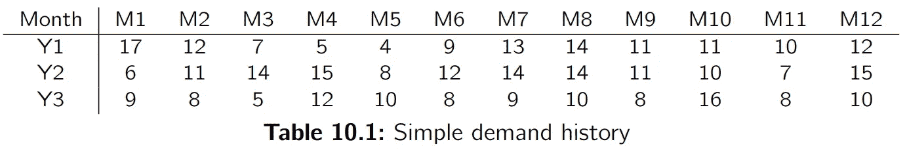**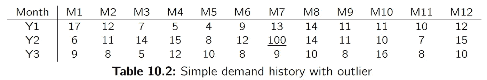*

*第一种方法只是将历史需求的上/下 x%值降低到第 x 个百分点的极限。*

***第 x 百分位**是一个值，低于该值，一个组中的 x%的观察值将下降。例如，一个产品 99%的需求观察值将低于它的第 99 个百分位数。*

*这种简单地将需求缩减到特定百分比的技术被称为 **winsorization** 。这个名字来自 20 世纪上半叶的统计学家查尔斯·p·温索尔。*

*如果我们查看上面两个虚拟数据集的第 1 和第 99 个百分位数，我们会得到以下结果:*

*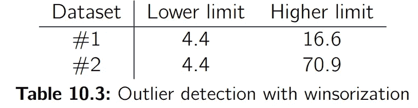*

*在该表中，我们看到在两个数据集中，所有低值都将增加到 4.4。你可以在下图中看到，这剪切了我们数据集的一部分。对于没有异常值的数据集，高值将降至 16.6(见图 10.1)，对于有异常值的数据集，高值将降至 70.9(见图 10.2)。*

*你可能已经注意到，winsorization 没有给我们 4 或 5 这样的整数结果，但是我们得到了 4.4。实际上，由于我们没有一个精确的值可以将数据集削减 99%，所以我们基于两个最接近的值进行线性近似。这就是我们如何得到这些数字而不是整数的。*

*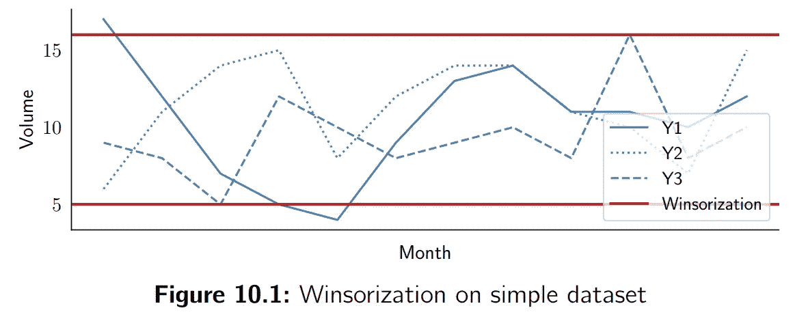**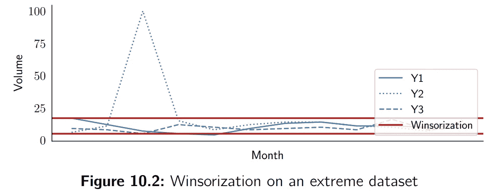*

*那么，我们对这种技术满意吗？不，我们不是。
-我们在没有异常值的数据集上发现了假异常值。
-在有离群值的数据集上，我们没有充分减少离群值(它从 100 降到了 70.9)。*

*当然，可以简单地提议将 winsorization 的上限从 99%降低到 95%，以进一步减少数据集#2 上的离群值。然而，不幸的是，这也会影响数据集#1。这不是一个好的解决办法。也可以提议取消这个下限，这样我们就不会将需求增加到 4.4。但是，如果我们有需求缺失的时期呢？如果有的话，我们不应该也清理一下吗？*

***自己动手**
**Excel** 使用公式=PERCENTILE 可以快速得到 Excel 中某一范围单元格的不同百分位数。INC(范围，极限)。当然，您必须对上限(值大约为 0.95-0.99)使用一次该公式，对下限(值大约为 0.01-0.05)使用一次。多亏了 NumPy，我们可以轻松地用 Python 编写数据集。借助函数 **np.percentile(array，percentile)** ，我们可以计算数组的不同百分位数。*

```
*import numpy as np
higher_limit = np.percentile(array, 99)
lower_limit = np.percentile(array, 1)*
```

*请注意， **percentile** 函数采用表示为 0 到 100 之间的值的百分点，而不是像 Excel 中那样的比率(即 0 到 1 之间的值)。*

*由于函数 **np.clip(array，min，max)** ，我们可以简单地将数组剪切到这些下限和上限:*

```
*array = np.clip(array,a_min=lower_limit,a_max=higher_limit)*
```

# *想法 2 标准偏差*

*正如我们刚刚看到的，winsorization 并不是排除异常值的完美方法，因为它会取出数据集的高值和低值，即使它们并不异常。*

*另一种方法是查看历史平均值周围的需求变化，并排除*异常地*远离该平均值的值。
让我们将需求标准差定义为:*

*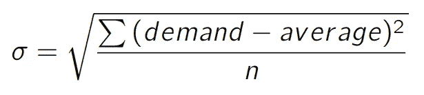*

*其中 *n* 是我们拥有的需求观察的数量。*

*如果我们假设我们的数据正态分布在历史平均值附近，我们可以计算需求在两个阈值之间的概率。这里涉及的精确数学超出了本文的范围，不幸的是，通常情况下，正态性假设并没有得到严格的尊重。这两个阈值将以需求平均值(μ)为中心，在两个方向上的分布为 *x* 乘以标准差(σ)。需求越混乱(即σ越重要)，阈值就越宽。*

*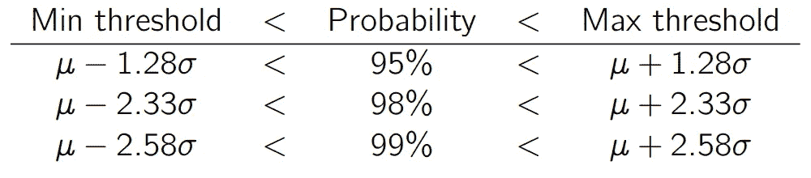**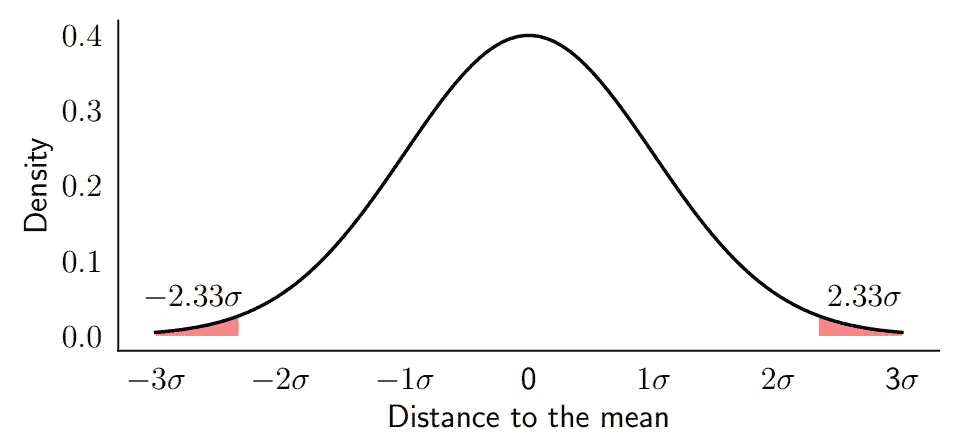*

*例如，我们有 98%的概率处于**范围**:需求平均值+/- 2.33 倍标准差(如上图所示)。因此，如果我们想要移除高值和低值的前 1%,我们会将需求限制在μ +/-2.33 σ。*

*请注意，这意味着我们有 99%的概率比μ + 2.33 σ低**。并且有 99%的概率比μ-2.33σ高 T25。***

***如果我们将此应用于我们的示例数据集(参见前两个表)，我们将得到这些限制:***

***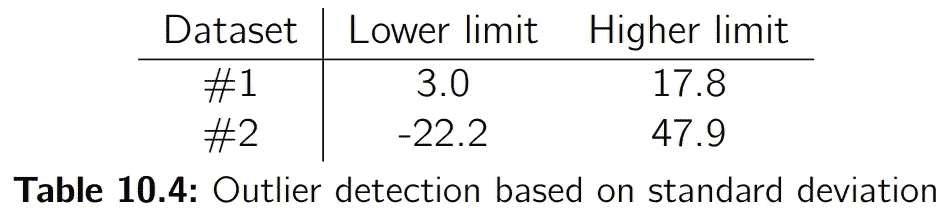***

***让我们看看这些新的*普通*限制与 winsorization 限制相比表现如何。***

***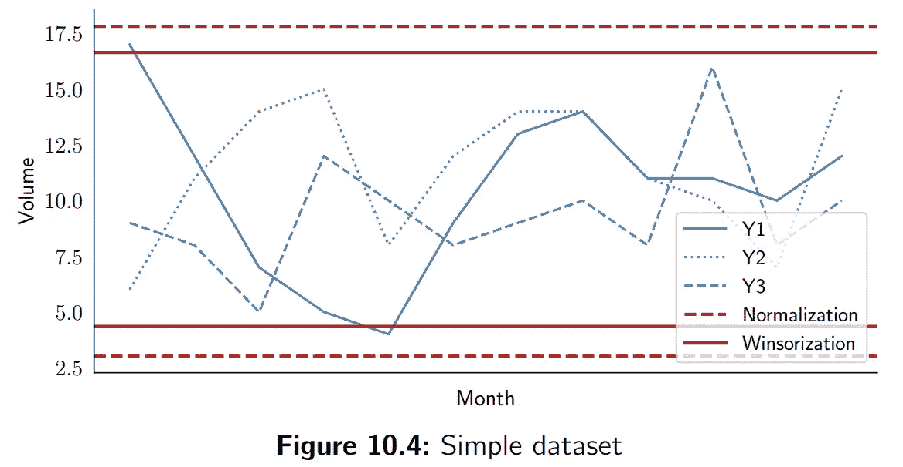******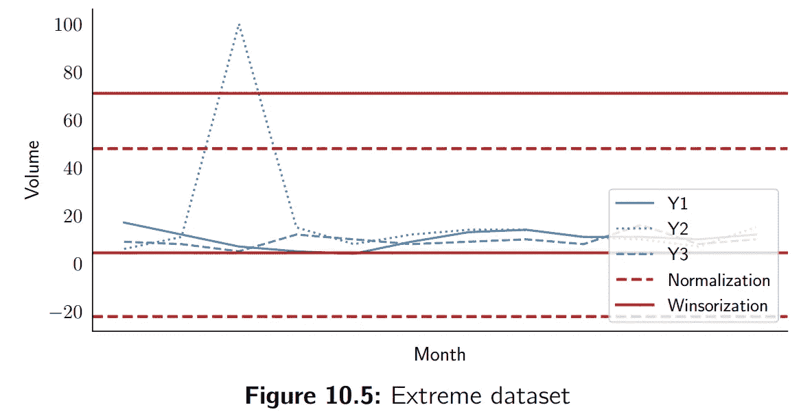***

***这已经比我们用 winsorization 得到的结果好太多了:
——在没有离群值的数据集上(见图 10.4)，我们不改变任何需求观察(完美！—正如我们所愿)。
-在有异常值的数据集上，我们不改变低需求点，只改变实际的异常值(见图 10.5)。***

***尽管如此，即使我们将离群值减少到比 winsorization (70.9)更易管理的数量(47.9)，这可能还不够。***

***那么，我们现在幸福吗？
还不完全是。***

***你可能还记得，我们假设误差在历史平均值左右。这对于需求平淡的产品来说没什么问题，但是当你有一个有趋势或季节性的产品时，实际的限制就会出现。例如，在下面的季节表中，最高点(或最低点)不再是您想要移除的异常值。***

***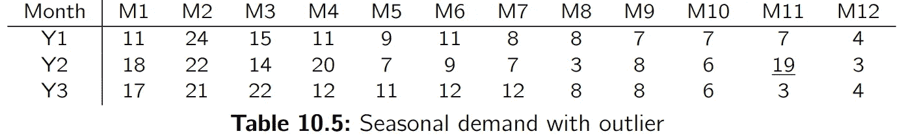***

***在下图中，您可以看到 winsorization 和 normalization 如何影响季节性需求。***

***这根本没有意义:这两种技术都将季节峰值标记为异常值，并且它们跳过了真正的异常值，即 Y2 M11。***

***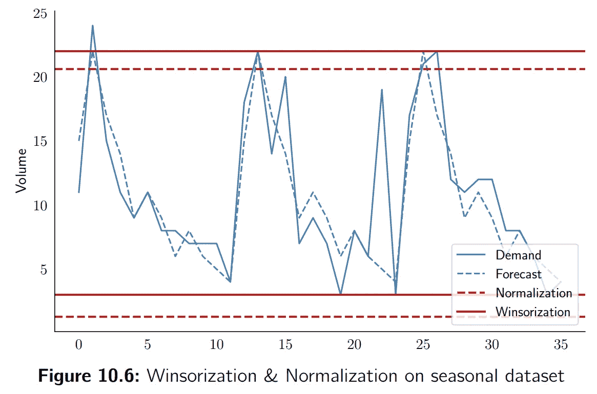***

***我们将用下一项技术来解决这个问题。***

*****自己动手**
**Excel** 借助公式 **=STDEV，你可以计算一系列单元格的标准差。p(范围)**。和往常一样，你可以通过 **=AVERAGE(range)** 来计算平均值。一旦你有了这两个，你就可以通过 **=NORM 来计算上限和下限。INV(百分位数、平均值、标准偏差)**。通常，您会希望上百分位在 0.99 左右，下百分位在 0.01 左右。
**Python** 你可以通过 **np.std(array)** 计算一个类似数组的(例如，一个列表，一个数据帧等)的标准差。)或直接通过**方法获取数据帧。std()** 。因此，如果您有一个**数据帧 df，**您可以简单地键入:***

```
***m = df.mean()
s = df.std()***
```

***然后我们将再次使用 SciPy 库来计算正态概率。然后我们将使用**。在我们的数据帧上剪辑**方法来限制它。***

```
***from scipy.stats import norm
#Print the probabilities of each demand observation
print(norm.cdf(df.values, m, s).round(2))limit_high = norm.ppf(0.99,m,s)
limit_low = norm.ppf(0.01,m,s)
df = df.clip(lower=limit_low, upper=limit_high)***
```

# ***想法 3 误差标准偏差***

***我们必须标记异常值的第二个想法是将每个观察值与需求的平均值进行比较。我们看到，如果我们有一个趋势或季节性，这是没有意义的，因为观察值和历史平均值之间的差异是不相关的。***

***好了，让我们回到离群值的定义:*离群值是你没有预料到的值，*就像《巨蟒之灾》里的西班牙宗教裁判所显示的那样。也就是说离群值是一个远离你的预测(即你的预测)的值。因此，为了发现异常值，我们将分析预测误差，并查看哪些时段*异常*错误。为此，我们将使用之前使用的标准差方法。***

***让我们拿回上面做的季节性例子。我们将历史需求与我们对它的简单(但季节性的)预测进行比较。***

***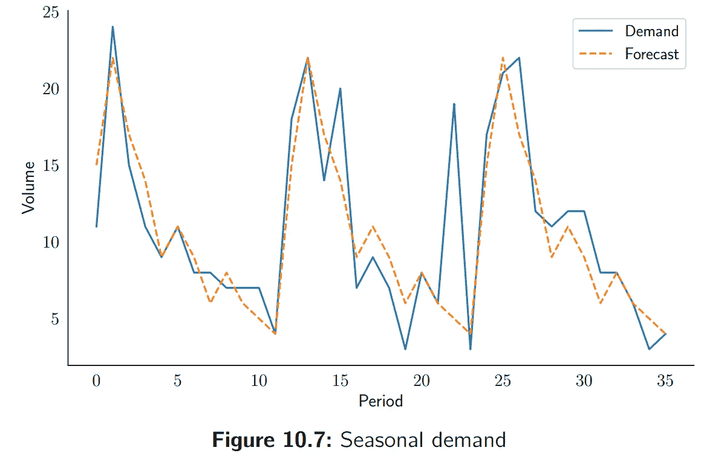******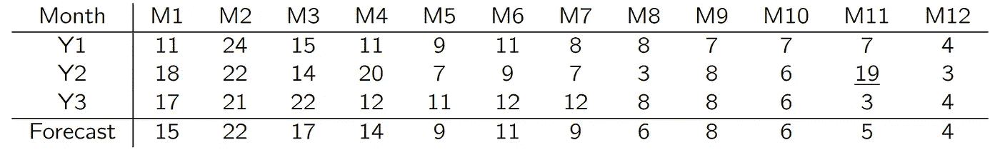***

***如果我们计算这种预测的误差(它只是历史需求的平均值)，我们将获得 0.4 的平均误差和 3.2 的标准偏差(这当然受到 Y2 M11 误差的严重影响)。如果我们在这个平均值附近取 99%的置信区间，我们会将预测误差缩小到-0.4+/-2.33 x 3.2 =-8.7。您可以在下图中看到预测的这些限制是如何完美地符合季节性需求的。***

***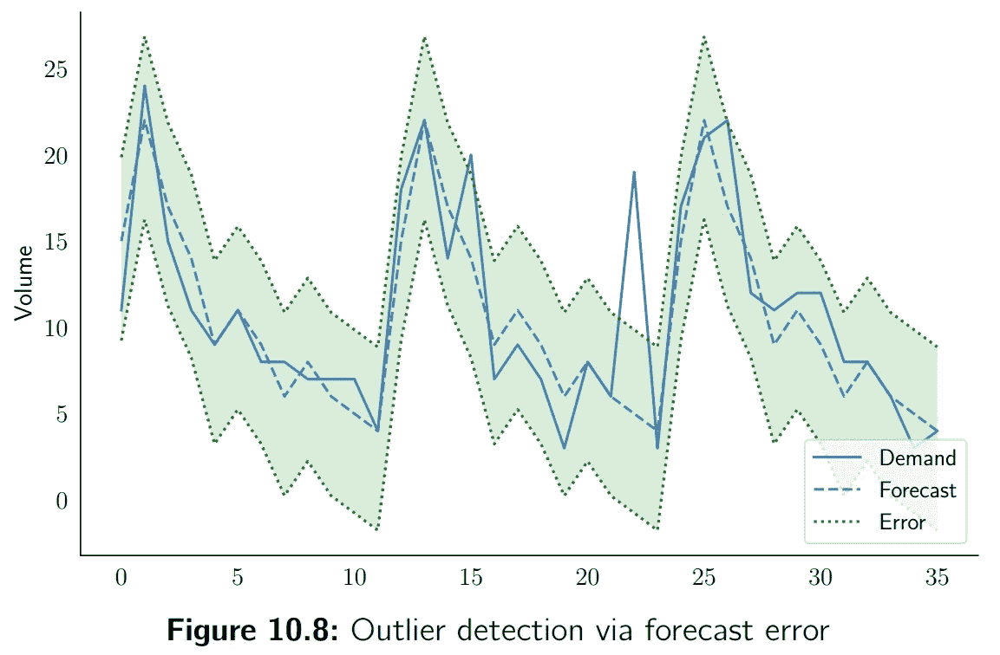***

***我们现在可以纠正 Y2 M11 的异常值。该期间的需求为 19，但预测为 5。可接受的最大*值为 5 + 7 = 12。这意味着我们可以用这个新值(12)替换 Y2 M11 (19)的异常值。****

*****结论**如上图所示，标准化和 winsorization 无法为季节性需求带来任何有意义的结果。***

***这个方法的微调，*你应该取多少个标准差作为极限？*当然，这是留给你去试验的……***

*****自己动手**
**Python** 如果您有一个 **pandas DataFrame** ，其中一列为预测，另一列为需求(我们的指数平滑模型的典型输出)，我们可以使用以下代码:***

```
***df[“Error”] = df[“Forecast”] — df[“Demand”]
m = df[“Error”].mean()
s = df[“Error”].std()
from scipy.stats import normlimit_high = norm.ppf(0.99,m,s)+df[“Forecast”]
limit_low = norm.ppf(0.01,m,s)+df[“Forecast”]
df[“Updated”] = df[“Demand”].clip(lower=limit_low,upper=limit_high)
print(df)***
```

# ***多走一步！***

***如果你回想一下我们分析预测误差并设定可接受误差阈值的想法，我们实际上还有一个小问题。我们计算的阈值基于数据集，包括离群值。这种异常值驱使误差向上变化，使得可接受的阈值被偏置和高估。为了纠正这一点，可以不将异常值缩小到基于原始需求数据集**计算的阈值，而是缩小到基于没有该特定异常值的数据集**计算的限制。食谱如下:***

1.  ***根据历史需求填充第一个预测。***
2.  ***计算误差、误差均值和误差标准差***
3.  ***计算可接受的下限和上限阈值(基于误差平均值和标准偏差)。***
4.  ***如前所述，识别异常值。***
5.  ***重新计算误差平均值和标准偏差，但排除异常值。***
6.  ***基于这些新值更新可接受的下限和上限阈值。***
7.  ***基于新的阈值更新异常值。***

***如果我们回到上面的季节性例子，我们最初的预测误差平均值为 0.4，标准偏差为 3.22。如果我们去掉点 Y2 M11，我们得到的误差平均值为-0.1，标准偏差为 2.3。这意味着现在预测的阈值是-5.3，5.2。然后，我们在 Y2 M11 中的异常值将被更新为 10(而不是我们之前技术中的 12)。***

***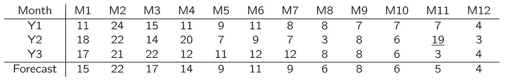***

*****自己动手**
我们将从之前的想法中收回代码，并添加一个新步骤来更新误差均值和标准偏差值。***

```
***df[“Error”] = df[“Forecast”] — df[“Demand”]
m = df[“Error”].mean()
s = df[“Error”].std()from scipy.stats import norm
prob = norm.cdf(df[“Error”], m, s)
outliers = (prob > 0.99) | (prob < 0.01)m2 = df[“Error”][~outliers].mean()
s2 = df[“Error”][~outliers].std()limit_high = norm.ppf(0.99,m2,s2)+df[“Forecast”]
limit_low = norm.ppf(0.01,m2,s2)+df[“Forecast”]
df[“Updated”] = df[“Demand”].clip(lower=limit_low,upper=limit_high)
print(df)***
```

# ***关于作者***

***[](https://www.linkedin.com/in/vandeputnicolas/) [## Nicolas vande put——顾问，创始人——供应链| LinkedIn

### 查看 Nicolas Vandeput 在世界上最大的职业社区 LinkedIn 上的个人资料。尼古拉斯有 7 份工作列在…

www.linkedin.com](https://www.linkedin.com/in/vandeputnicolas/) 

N icolas Vandeput 是一名供应链数据科学家，擅长需求预测和库存优化。他在 2016 年创立了他的咨询公司 [SupChains](http://www.supchains.com/) ，并在 2018 年共同创立了 [SKU 科学](https://bit.ly/3ozydFN)——一个快速、简单、实惠的需求预测平台。尼古拉斯对教育充满热情，他既是一个狂热的学习者，也喜欢在大学教学:自 2014 年以来，他一直在比利时布鲁塞尔为硕士学生教授预测和库存优化。自 2020 年以来，他还在法国巴黎的 CentraleSupelec 教授这两个科目。2018 年出版了 [*【供应链预测的数据科学】*](https://www.amazon.com/Data-Science-Supply-Chain-Forecasting/dp/3110671107)(2021 年第 2 版)，2020 年出版了 [*库存优化:模型与模拟*](https://www.amazon.com/Inventory-Optimization-Simulations-Nicolas-Vandeput/dp/3110673916) 。

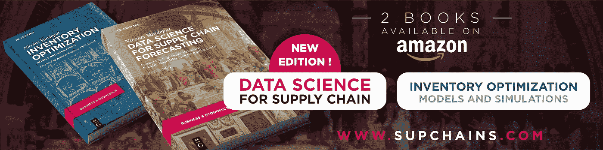***