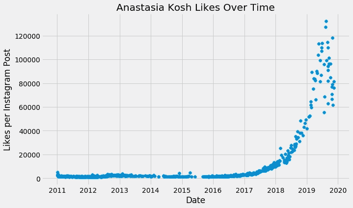
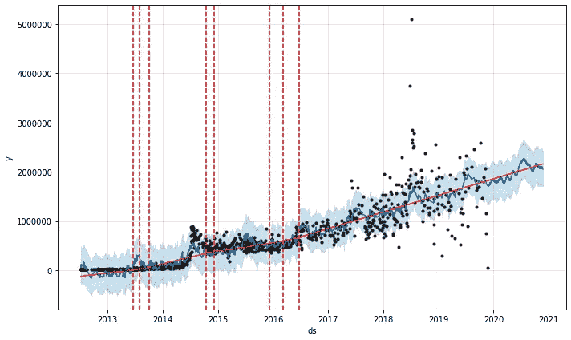

# 用 Python 预测脸书预言家

> 原文：<https://towardsdatascience.com/forecasting-in-python-with-facebook-prophet-29810eb57e66?source=collection_archive---------2----------------------->

## 如何使用领域知识调整和优化 Prophet，以便更好地控制您的预测。


我写了一本关于脸书先知的书，已经由 Packt 出版社出版了！这本书在[亚马逊](https://amzn.to/373oIcf)上有售。

这本书涵盖了使用 Prophet 的每个细节，从安装到模型评估和调整。十几个数据集已经可用，并用于演示 Prophet 功能，从简单到高级，代码完全可用。如果你喜欢这篇中帖，请考虑在这里订购:【https://amzn.to/373oIcf】T4！在超过 250 页的篇幅中，它涵盖的内容远远超过了媒体所能教授的内容！

非常感谢你支持我的书！

> 被困在付费墙后面？点击[此处](/forecasting-in-python-with-facebook-prophet-29810eb57e66?source=friends_link&sk=47194056e7c5185c71d599df762b5257)阅读完整故事，并附上好友链接！

我是 Greg Rafferty，湾区的数据科学家。这个项目的代码可以在我的 [GitHub](https://github.com/raffg/prophet_forecasting) 上找到。

在这篇文章中，我将解释如何使用脸书的先知进行预测，并演示一些通过使用领域知识来处理趋势不一致的高级技术。网上有很多 Prophet 教程，但是没有一个深入到调整 Prophet 模型，或者整合分析师知识来帮助模型导航数据。我打算在这篇文章中做到这两点。


[https://www.instagram.com/p/BaKEnIPFUq-/](https://www.instagram.com/p/BaKEnIPFUq-/)

在之前一个关于 Tableau 中[预测的故事中，我使用了一个 ARIMA 算法的修改版来预测美国商业航班的乘客数量。ARIMA 方法在处理静态数据和预测短期框架时表现不错，但脸书的工程师已经为 ARIMA 无法处理的情况开发了一个工具。Prophet 的后端是 STAN，一种概率编码语言。这使得 Prophet 拥有贝叶斯统计提供的许多优势，包括季节性、包含领域知识和置信区间，以添加数据驱动的风险估计。](/forecasting-with-python-and-tableau-dd37a218a1e5)

我将从三个数据来源来说明如何使用 Prophet，以及它的一些优点。如果你想跟着做，你首先需要安装 Prophet[脸书的文档提供了简单的说明](https://facebook.github.io/prophet/docs/installation.html#python)。我在本文中使用的笔记本[提供了构建所讨论模型的完整代码。](https://github.com/raffg/prophet_forecasting/blob/master/prophet.ipynb)

# 飞机乘客

让我们从简单的开始。同样的航空乘客数据来自我的[上一篇文章](/forecasting-with-python-and-tableau-dd37a218a1e5)。Prophet 要求时间序列数据至少有两列:`ds`是时间戳，`y`是值。加载数据后，我们需要将其格式化为:

```
passengers = pd.read_csv('data/AirPassengers.csv')df = pd.DataFrame()
df['ds'] = pd.to_datetime(passengers['Month'])
df['y'] = passengers['#Passengers']
```

只需几行代码，Prophet 就可以制作一个和我之前制作的 ARIMA 模型一样复杂的预测模型。在这里，我打电话给 Prophet 做一个 6 年的预测(频率是每月，周期是 12 个月/年乘以 6 年):

```
prophet = Prophet()
prophet.fit(df)
future = prophet.make_future_dataframe(periods=12 * 6, freq='M')
forecast = prophet.predict(future)
fig = prophet.plot(forecast)
a = add_changepoints_to_plot(fig.gca(), prophet, forecast)
```


Number of passengers (in the thousands) on commercial airlines in the US

Prophet 将原始数据作为黑点，蓝线是预测模型。浅蓝色区域是置信区间。使用`add_changepoints_to_plot`功能添加红线；垂直的虚线是预测趋势变化的变化点，红色实线是去除所有季节性因素后的趋势。我将在本文中使用这种绘图格式。

这个简单的例子结束后，让我们继续讨论更复杂的数据。

# Divvy 自行车共享

Divvy 是芝加哥的一家自行车共享服务公司。我以前做过一个项目，在那里我分析了他们的数据，并把它与从地下天气搜集的天气信息联系起来。我知道这个数据表现出很强的季节性，所以我认为这将是一个伟大的先知的能力展示。

Divvy 数据是基于每次乘坐的级别，因此为了对 Prophet 的数据进行格式化，我聚合到了每日级别，并为每天的“事件”列的模式(即天气条件:`'not_clear', 'rain or snow', ‘clear', ‘cloudy', ‘tstorms', ‘unknown'`)、乘坐次数和平均温度创建了列。

格式化后，让我们看看每天的乘车次数:


因此，这些数据显然有季节性，而且趋势似乎是随着时间的推移而增加。有了这个数据集，我想演示如何添加额外的回归量，在这个例子中是天气和温度。让我们来看看温度:


它看起来很像之前的图表，但没有增加的趋势。这种相似性是有道理的，因为当天气晴朗温暖时，骑自行车的人会骑得更频繁，所以这两个图应该一前一后地上升和下降。

为了通过添加另一个回归量来创建预测，该额外的回归量必须具有预测期的数据。出于这个原因，我将 Divvy 数据缩短为一年，这样我就可以用天气信息来预测那一年。您可以看到，我还添加了美国的先知默认假期:

```
prophet = Prophet()
prophet.add_country_holidays(country_name='US')
prophet.fit(df[d['date'] < pd.to_datetime('2017-01-01')])
future = prophet.make_future_dataframe(periods=365, freq='d')
forecast = prophet.predict(future)
fig = prophet.plot(forecast)
a = add_changepoints_to_plot(fig.gca(), prophet, forecast)
plt.show()
fig2 = prophet.plot_components(forecast)
plt.show()
```

上述代码块创建了趋势图，如前面的**航空乘客**部分所述:


Divvy trend plot

和组件图:


Divvy component plot

组件图由 3 部分组成:趋势、假日和季节性。事实上，这三个部分的总和构成了模型的整体。如果你减去所有其他成分，趋势就是数据显示的。假日图显示了模型中包含的所有假日的影响。在 Prophet 中实现的假日可以被认为是不自然的事件，当趋势偏离基线，但一旦事件结束又会返回。正如我们将在下面探讨的，额外的回归变量就像假日一样，它们导致趋势偏离基线，只是趋势在事件发生后会保持变化。在这种情况下，假期都会导致乘客减少，如果我们意识到很多乘客都是通勤者，这也是有道理的。每周季节性因素显示，乘客量在一周内相当稳定，但在周末会急剧下降。这是支持大多数乘客都是通勤者这一理论的证据。我要注意的最后一点是，每年的季节性曲线是相当波动的。这些图是用傅立叶变换创建的，本质上是叠加的正弦波。显然，这种情况下的默认有太多的自由度。为了平滑曲线，我接下来将创建一个 Prophet 模型，关闭年度季节性，并添加一个额外的回归变量来解释它，但自由度更少。我还将继续在此模型中添加这些天气回归因素:

```
prophet = Prophet(growth='linear',
                  yearly_seasonality=False,
                  weekly_seasonality=True,
                  daily_seasonality=False,
                  holidays=None,
                  seasonality_mode='multiplicative',
                  seasonality_prior_scale=10,
                  holidays_prior_scale=10,
                  changepoint_prior_scale=.05,
                  mcmc_samples=0
                 ).add_seasonality(name='yearly',
                                    period=365.25,
                                    fourier_order=3,
                                    prior_scale=10,
                                    mode='additive')prophet.add_country_holidays(country_name='US')
prophet.add_regressor('temp')
prophet.add_regressor('cloudy')
prophet.add_regressor('not clear')
prophet.add_regressor('rain or snow')
prophet.fit(df[df['ds'] < pd.to_datetime('2017')])
future = prophet.make_future_dataframe(periods=365, freq='D')
future['temp'] = df['temp']
future['cloudy'] = df['cloudy']
future['not clear'] = df['not clear']
future['rain or snow'] = df['rain or snow']
forecast = prophet.predict(future)
fig = prophet.plot(forecast)
a = add_changepoints_to_plot(fig.gca(), prophet, forecast)
plt.show()
fig2 = prophet.plot_components(forecast)
plt.show()
```

趋势图看起来非常相似，所以我只分享组件图:


Divvy component plot with smooth annual seasonality and weather regressors

去年的趋势是向上的，而不是向下的！这是因为去年的数据显示平均气温较低，这使得乘客人数比预期的要少。我们还看到年度曲线变得平滑，还有一个额外的图:`extra_regressors_multiplicative`图。这显示了天气的影响。我们所看到的是意料之中的:乘客量在夏季增加，冬季减少，这种变化很大程度上是由天气造成的。我想再看一样东西，只是为了演示一下。我再次运行了上述模型，但这次只包括了`rain or snow`的回归变量。这是组件图:


Divvy component plot of just the effect of rain or snow

这表明，下雨或下雪时，每天的乘车次数会比其他时候少 1400 次。很酷，对吧！？

最后，我想按小时聚合这个数据集，以创建另一个分量图，即每日季节性。这个图看起来是这样的:


Divvy component plot for daily seasonality

正如 T2·里维斯指出的，凌晨 4 点是最不适合醒来的时间。显然，芝加哥的自行车骑手同意这一点。不过，当地在上午 8 点过后出现了一个高峰:早上的通勤者；下午 6 点左右是全球高峰:傍晚时分。我还看到午夜过后有一个小高峰:我喜欢认为这是人们从酒吧回家的路。Divvy 数据到此为止！让我们继续看 Instagram。

# 照片墙

脸书开发了 Prophet 来分析自己的数据。因此，在合适的数据集上测试 Prophet 似乎是公平的。我在 Instagram 上搜索了几个展现出我想探究的有趣趋势的账户，然后我从服务中搜集了三个账户的所有数据: [@natgeo](https://www.instagram.com/natgeo/) 、 [@kosh_dp](https://www.instagram.com/kosh_dp/) 和 [@jamesrodriguez10](https://www.instagram.com/jamesrodriguez10/) 。

## 国家地理


[https://www.instagram.com/p/B5G_U_IgVKv/](https://www.instagram.com/p/B5G_U_IgVKv/)

2017 年，我正在进行一个[项目](https://public.tableau.com/profile/greg4084#!/vizhome/NationalGeographiconInstagram/Storyboard)，在那里我注意到国家地理 [Instagram 账户](https://www.instagram.com/natgeo/)中的一个[异常](https://github.com/raffg/natgeo_instagram_anomaly)。对于 2016 年 8 月这一个月，每张照片的点赞数突然莫名其妙地急剧增加，但随后一个月过去就又回到了基线。我想把这个峰值建模为这个月的一次营销活动，以增加喜欢，然后看看我是否可以预测未来营销活动的效果。

以下是 Natgeo 每个帖子的点赞数。这种趋势明显在增加，而且随着时间的推移，差异也在增加。有许多异常值具有极高的喜欢度，但在 2016 年 8 月出现了一个高峰，在那个月发布的所有照片的喜欢度都远远高于周围的帖子:


我不想猜测为什么会这样，但是为了这个模型，让我们假设 Natgeo 的营销部门进行了一些为期一个月的活动，旨在增加喜欢。首先，让我们建立一个忽略这一事实的模型，这样我们就有了一个可以比较的基线:


Natgeo likes per photo over time

预言家似乎被那道钉弄糊涂了。它正试图将其添加到年度季节性成分中，从每年八月的峰值*中的蓝色实线*可以看出这一点。先知希望这是一个重复发生的事件。为了告诉 Prophet 2016 年发生了一些其他年份不会重复的特殊事情，让我们为这个月创造一个节日:

```
promo = pd.DataFrame({'holiday': "Promo event",
                      'ds' : pd.to_datetime(['2016-08-01']),
                      'lower_window': 0,
                      'upper_window': 31})
future_promo = pd.DataFrame({'holiday': "Promo event",
                      'ds' : pd.to_datetime(['2020-08-01']),
                      'lower_window': 0,
                      'upper_window': 31})promos_hypothetical = pd.concat([promo, future_promo])
```

`promo`数据帧仅包含 2016 年 8 月的活动，而`promos_hypothetical`数据帧包含 Natgeo 假设考虑在 2020 年 8 月推出的额外宣传片。当添加假日时，Prophet 允许有一个较低的窗口和一个较高的窗口，基本上是假日事件包含的天数，例如，如果您想将黑色星期五与感恩节一起包含，或者将平安夜与圣诞节一起包含。我在“假期”后添加了 31 天，将整个月都包含在事件中。下面是代码和新的趋势图。注意，我只是在调用先知对象时发送`holidays=promo`:

```
prophet = Prophet(holidays=promo)
prophet.add_country_holidays(country_name='US')
prophet.fit(df)
future = prophet.make_future_dataframe(periods=365, freq='D')
forecast = prophet.predict(future)
fig = prophet.plot(forecast)
a = add_changepoints_to_plot(fig.gca(), prophet, forecast)
plt.show()
fig2 = prophet.plot_components(forecast)
plt.show()
```


Natgeo likes per photo over time, with a marketing campaign in August 2016

太棒了。现在 Prophet 并没有增加每年 8 月份的愚蠢涨幅，而是在 2016 年出现了不错的涨幅。现在让我们再次运行这个模型，但是使用那个`promos_hypothetical`数据框架，来估计如果 Natgeo 在 2020 年运行一个相同的活动会发生什么:


Natgeo likes per photo over time with a hypothetical marketing campaign upcoming in 2020

这演示了在添加非自然事件时如何预测行为。例如，计划的商品销售可以是今年的模型。现在让我们转到下一个账户。

## 阿纳斯塔西娅·科什


[https://www.instagram.com/p/BfZG2QCgL37/](https://www.instagram.com/p/BfZG2QCgL37/)

Anastasia Kosh 是一名俄罗斯摄影师，她在自己的 Instagram 上发布古怪的自拍照，并为 YouTube 制作音乐视频。几年前我住在莫斯科时，我们是同一条街上的邻居；当时她在 Instagram 上有大约 1 万名粉丝，但在 2017 年，她的 YouTube 账户在俄罗斯迅速走红，她已经成为莫斯科青少年中的名人。她的 Instagram 账户呈指数级增长，很快接近 100 万粉丝。这种指数式增长对 Prophet 来说似乎是一个很好的挑战。

这是我们要建模的数据:



这是乐观增长的经典曲棍球棒形状，除了在这种情况下它是真实的！用线性增长对其建模，就像我们对上述其他数据建模一样，会导致不切实际的预测:


Anastasia Kosh likes per photo over time, with linear growth

这条曲线会一直延伸到无穷大。显然，一张照片在 Instagram 上获得的赞数是有上限的。理论上，这将等于服务上的唯一帐户的数量。但实际上，并不是每个客户都会看到或喜欢这张照片。这就是分析师的一点领域知识派上用场的地方。我决定用逻辑增长来建模，这需要先知被告知一个上限(先知称之为`cap`)和一个下限:

```
cap = 200000
floor = 0
df['cap'] = cap
df['floor'] = floor
```

通过我自己对 Instagram 的了解和一点点试错，我决定了 20 万个赞的上限和 0 个赞的下限。值得注意的是，Prophet 确实允许这些值被定义为时间的函数，所以它们不必是常数。在这种情况下，常量值正是我所需要的:

```
prophet = Prophet(growth='logistic',
                  changepoint_range=0.95,
                  yearly_seasonality=False,
                  weekly_seasonality=False,
                  daily_seasonality=False,
                  seasonality_prior_scale=10,
                  changepoint_prior_scale=.01)
prophet.add_country_holidays(country_name='RU')
prophet.fit(df)
future = prophet.make_future_dataframe(periods=1460, freq='D')
future['cap'] = cap
future['floor'] = floor
forecast = prophet.predict(future)
fig = prophet.plot(forecast)
a = add_changepoints_to_plot(fig.gca(), prophet, forecast)
plt.show()
fig2 = prophet.plot_components(forecast)
plt.show()
```

我将增长定义为逻辑增长，关闭所有季节性(在我的图中似乎没有太多季节性)，并调整了一些调整参数。我还添加了俄罗斯的默认假日，因为大多数 Anastasia 的追随者都在那里。当在`df`上调用`.fit`方法时，Prophet 看到了`cap`和`floor`列，并知道将它们包含在模型中。非常重要的是，当您创建预测数据框架时，您要将这些列添加到其中(这就是上面代码块中的`future`数据框架)。我们将在下一节再次讨论这个问题。但是现在我们的趋势图看起来真实多了！


Anastasia Kosh likes per photo over time, with logistic growth

最后，让我们看看我们的最后一个例子。

## 哈梅斯·罗德里格斯


[https://www.instagram.com/p/BySl8I7HOWa/](https://www.instagram.com/p/BySl8I7HOWa/)

[哈梅斯·罗德里格斯](https://www.instagram.com/jamesrodriguez10/)是一名哥伦比亚足球运动员，在 2014 年和 2018 年世界杯上都有出色表现。他的 Instagram 账号从一开始就有稳定的增长；但是在研究之前的分析时，我注意到在两届世界杯期间，他的账户出现了突然而持久的粉丝激增。与国家地理杂志(National Geographic)账户中可以被建模为假期的峰值相反，罗德里格斯的增长在两场比赛后没有回到基线，而是重新定义了一个新的基线。这是完全不同的行为，需要不同的建模方法来捕捉它。

这是整个帐户生命周期中哈梅斯·罗德里格斯的每张照片的喜欢数:


仅用我们在本教程中使用的技术很难清晰地建模。他在 2014 年夏天的第一届世界杯期间经历了趋势基线的上升，然后在 2018 年夏天的第二届世界杯期间经历了峰值，并可能改变了基线。用默认模型来模拟这种行为并不十分有效:



James Rodríguez likes per photo over time

不是*可怕的*车型；它只是没有很好地模拟这两场世界杯比赛的行为。如果我们像上面对 Anastasia Kosh 的数据所做的那样，将这些比赛建模为假期，我们确实会看到模型的改进:

```
wc_2014 = pd.DataFrame({'holiday': "World Cup 2014",
                      'ds' : pd.to_datetime(['2014-06-12']),
                      'lower_window': 0,
                      'upper_window': 40})
wc_2018 = pd.DataFrame({'holiday': "World Cup 2018",
                      'ds' : pd.to_datetime(['2018-06-14']),
                      'lower_window': 0,
                      'upper_window': 40})world_cup = pd.concat([wc_2014, wc_2018])prophet = Prophet(yearly_seasonality=False,
                  weekly_seasonality=False,
                  daily_seasonality=False,
                  holidays=world_cup,
                  changepoint_prior_scale=.1)
prophet.fit(df)
future = prophet.make_future_dataframe(periods=365, freq='D')
forecast = prophet.predict(future)
fig = prophet.plot(forecast)
a = add_changepoints_to_plot(fig.gca(), prophet, forecast)
plt.show()
fig2 = prophet.plot_components(forecast)
plt.show()
```


James Rodríguez likes per photo over time, with holidays added for the World Cups

我仍然不喜欢模型适应变化趋势线的速度太慢，尤其是在 2014 年世界杯前后。这只是一个过于平稳的过渡。不过，通过添加额外的回归变量，我们可以迫使 Prophet 考虑一个突然的变化。

在这种情况下，我为每场锦标赛定义了两个时间段，赛中和赛后。以这种方式建模假设在锦标赛之前，将会有一个特定的趋势线，在锦标赛期间，该趋势线将会有一个线性变化，在锦标赛之后，将会有另一个变化。我将这些周期定义为 0 或 1，开或关，并让 Prophet 根据数据训练自己来学习幅度:

```
df['during_world_cup_2014'] = 0
df.loc[(df['ds'] >= pd.to_datetime('2014-05-02')) & (df['ds'] <= pd.to_datetime('2014-08-25')), 'during_world_cup_2014'] = 1
df['after_world_cup_2014'] = 0
df.loc[(df['ds'] >= pd.to_datetime('2014-08-25')), 'after_world_cup_2014'] = 1df['during_world_cup_2018'] = 0
df.loc[(df['ds'] >= pd.to_datetime('2018-06-04')) & (df['ds'] <= pd.to_datetime('2018-07-03')), 'during_world_cup_2018'] = 1
df['after_world_cup_2018'] = 0
df.loc[(df['ds'] >= pd.to_datetime('2018-07-03')), 'after_world_cup_2018'] = 1
```

请注意，我正在更新`future`数据帧，以包含以下这些“假日”事件:

```
prophet = Prophet(yearly_seasonality=False,
                  weekly_seasonality=False,
                  daily_seasonality=False,
                  holidays=world_cup,
                  changepoint_prior_scale=.1)prophet.add_regressor('during_world_cup_2014', mode='additive')
prophet.add_regressor('after_world_cup_2014', mode='additive')
prophet.add_regressor('during_world_cup_2018', mode='additive')
prophet.add_regressor('after_world_cup_2018', mode='additive')prophet.fit(df)
future = prophet.make_future_dataframe(periods=365)future['during_world_cup_2014'] = 0
future.loc[(future['ds'] >= pd.to_datetime('2014-05-02')) & (future['ds'] <= pd.to_datetime('2014-08-25')), 'during_world_cup_2014'] = 1
future['after_world_cup_2014'] = 0
future.loc[(future['ds'] >= pd.to_datetime('2014-08-25')), 'after_world_cup_2014'] = 1future['during_world_cup_2018'] = 0
future.loc[(future['ds'] >= pd.to_datetime('2018-06-04')) & (future['ds'] <= pd.to_datetime('2018-07-03')), 'during_world_cup_2018'] = 1
future['after_world_cup_2018'] = 0
future.loc[(future['ds'] >= pd.to_datetime('2018-07-03')), 'after_world_cup_2018'] = 1forecast = prophet.predict(future)
fig = prophet.plot(forecast)
a = add_changepoints_to_plot(fig.gca(), prophet, forecast)
plt.show()
fig2 = prophet.plot_components(forecast)
plt.show()
```


James Rodríguez likes per photo over time, with additional regressors

在这里，蓝线是我们应该关注的。红线显示的只是趋势，减去了额外的回归因素和假期的影响。看看蓝色趋势线在世界杯期间是如何急剧跳跃的。这正是我们的领域知识告诉我们会发生的行为！在罗德里格斯打入他在世界杯上的第一个进球后，突然有成千上万的新粉丝来到了他的账户上。让我们看一下分量图，看看这些额外的回归量有什么具体的影响:


James Rodríguez component plot for the World Cup regressors

这告诉我们，在 2013 年和 2014 年初，世界杯对罗德里格斯每张照片的点赞没有影响。在 2014 年世界杯期间，他的平均每张照片点赞数大幅上升，并在比赛结束后继续上升(这可以解释为他在赛事期间获得了如此多的活跃粉丝)。2018 年世界杯期间也发生了类似的事件，但没有那么引人注目，大概是因为此时已经没有多少足球迷发现他的账户并关注他了。

感谢你一直关注这篇文章！我希望你现在明白如何使用假期，线性与逻辑增长率，以及额外的回归变量来丰富你的预言家预测。脸书用 Prophet 构建了一个非常有价值的工具，将曾经非常困难的概率预测变成了一组简单的参数，并且有很大的调整余地。祝你预测好运！