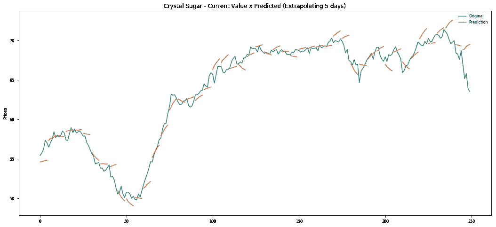

# 预测未来许多天的价格

> 原文：<https://towardsdatascience.com/forecasting-prices-for-5-days-ahead-2460406c4ea2?source=collection_archive---------10----------------------->

## 在这篇文章中，我将提出一些想法来预测未来 5 天冰糖的价格。


**Forecasted values (orange) against real values (green)**

在公司内部，有几个风险因素需要考虑和管理。例如，价格变化时，经理必须决定卖出的最佳时机；产品需求预测改善库存管理。评估的另一个重要因素是对经常性费用的预测，因为表达性价值会影响公司的营运资本。

通常是对价格、需求、费用等的预测。考虑到经理的领域知识以及影响决策的特定主题的基本信息。

使用预测模型时，数据在训练集和测试集之间分离，系数在训练数据中生成，并且通常在测试集中逐步测试。因此，只预测一个时间段，然后用真实值更新，依此类推，直到测试集结束。

在这篇文章中，将会创建一个 [ARIMA](https://en.wikipedia.org/wiki/Autoregressive_integrated_moving_average) 模型，在这个模型中，从训练集中获得的系数将以稍微不同的方式进行测试。将对连续 5 天进行预测，并用实际数据更新该系列(连续 5 天)，同样，将为 5 个周期创建新的预测，直到测试数据结束。

这种方法对于那些希望创建具有多个提前期的预测模型的人来说很有意思，因为它可以很容易地用于将预测的外推与真实数据进行比较，从而验证模型的主要特征是什么以及哪些方面可以改进。

该模型的主要目的是预测 Esalq 通知的 50 公斤冰糖未来 5 天的每日价格，数据可在此处下载[](https://www.cepea.esalq.usp.br/br/indicador/acucar.aspx)****(请从巴西网站下载数据，英文版没有巴西雷亚尔(BRL)、**的价格，所有代码的 Jupyter 笔记本可在我的 [**GitHub**](https://github.com/leandrovrabelo/tsmodels/blob/master/notebooks/english/Creating%20a%20Price%20Forecast%20for%205%20days%20Ahead.ipynb) 中找到)。**

**从现在开始，我们将使用从我的帖子中摘录的以下步骤: [**创建时间序列预测的基本原则**](/basic-principles-to-create-a-time-series-forecast-6ae002d177a4?source=friends_link&sk=15a1d49ec9542c21f90eebe660b1455c) **。**(如果您还不熟悉创建这些预测的基础，我强烈建议您阅读一下):**

*   **将系列分为训练集和测试集，**
*   **将系列转换成静态的，**
*   **搜索相关的滞后，**
*   **创建模型，**
*   **在训练集上绘制比较图，**
*   **评估模型和测试集中的错误，**
*   **对模型提出可能的改进建议。**

# **创建培训和测试集**

**我们有大约 16 年的价格历史，我将保留最后 **250 个工作日**(大约 1 年)来测试模型。在预测值和当前值之间将有 50 个 5 天的比较。请注意，所有以前的数据都将用于训练模型:**

****

# **平稳性检验和验证相关滞后**

**为了创建时间序列预测，序列必须是平稳的。所以，它必须具备以下相对恒定的条件:均值、方差和自相关。**

**下面我将使用函数来绘制序列，它的分布，[自相关](https://en.wikipedia.org/wiki/Autocorrelation)，偏自相关。此外， [Dickey Fuller](https://en.wikipedia.org/wiki/Dickey%E2%80%93Fuller_test) 统计测试将用于检查平稳性:**

```
#creating a function to plot the graph and show the test result:
def check_stationarity(y, lags_plots=48, figsize=(22,8)):
 “Use Series as parameter”

 y = pd.Series(y)
 fig = plt.figure()ax1 = plt.subplot2grid((3, 3), (0, 0), colspan=2)
 ax2 = plt.subplot2grid((3, 3), (1, 0))
 ax3 = plt.subplot2grid((3, 3), (1, 1))
 ax4 = plt.subplot2grid((3, 3), (2, 0), colspan=2)y.plot(ax=ax1, figsize=figsize, color=’teal’)
 ax1.set_title(‘Crystal Sugar Price’)
 plot_acf(y, lags=lags_plots, zero=False, ax=ax2, color=’teal’);
 plot_pacf(y, lags=lags_plots, zero=False, ax=ax3, method=’ols’, color=’teal’);
 sns.distplot(y, bins=int(sqrt(len(y))), ax=ax4, color=’teal’)
 ax4.set_title(‘Price Distribution’)plt.tight_layout()

 print(‘Dickey-Fuller test results:’)
 adfinput = adfuller(y)
 adftest = pd.Series(adfinput[0:4], index=[‘Statistical Test’,’P-Value’,’Used Lags’,’Observations Number’])
 adftest = round(adftest,4)

 for key, value in adfinput[4].items():
 adftest[“Critical Values (%s)”%key] = value.round(4)

 print(adftest)
```

**为了验证训练数据上的值是否是平稳的，我们将使用 5%的 **P 值**作为基础，如果该测试的 P 值小于 5%,我们可以认为序列是平稳的:**

****

**当我们分析图形时，注意到价格有轻微的上升趋势，分布图显示数据不符合高斯正态分布，并且**自相关**的特征显示所有滞后都有显著的相关性(这是具有某种趋势的系列的标志)，最终统计值显示 P 值为 8.7%。**

**因此，这一系列不符合被认为是稳定的标准。**

**我将做第一个改变，以消除趋势，只关注每天的变化:**

****

**Dickey Fuller 测试在 P 值**上返回零，这意味着该序列变得稳定。除此之外，在价格图中，趋势已经消失，价格相对稳定。****

**在自相关图中，值逐渐减小，与没有第一差异的图不同。**

**部分自相关下降得更突然，表明前三个值对当前值有更大的影响。显然，在预测中没有显著的季节相关性需要考虑。**

**沿着这些思路，我们可以考虑差分序列中具有前 3 个滞后的自回归模型，因此我们将对该模型使用以下术语: **ARIMA (3，1，0)****

# **创建模型**

**最初，将基于训练数据创建模型，因此将生成 3 个自相关滞后的系数，并将用于测试测试集中连续 5 天的外推。**

**有几种方法可以推断未来，主要的有:**

*   **为要预测的每个特定日期创建一个模型，然后在最终模型中添加所有内容，**
*   **递归，预测第一天并以此值为基础预测第二天。**

**我们将使用本例中的最后一个模型，在这种情况下，我们将预测未来 5 天，与真实数据进行比较，将后者添加到模型中，以便进行新的外推，然后我们将计算模型的误差，并分析预测的相关事实。**

# **训练模型**

```
# Training the model
model = ARIMA(train, order=(3,1,0)).fit()
train_pred = model.predict()
```

**现在模型已经定型，让我们比较下图中的实际数据和预测数据:**

****

**在训练集中，模型设法捕捉市场的主要时刻。唯一一次预测不能捕捉到变化的时候是当有更大的变化时。分析误差，RMSE 为 BRL 4.967/袋。**

# **获取系数**

**训练模型后，我们可以获得差值的乘法系数以及模型的常数，这些值将作为外推未来 5 天预测的基础。**

```
# Taking the constant and the coefficients of the lags to use in the test base:
const, l1, l2, l3 = model.paramsprint(f'Constant value {round(const, 4)}')
print(f'Cofficients of Lag 1: {round(l1,4)}, Lag 2: {round(l2,4)} and Lag 3: {round(l3,4)}')**Constant value 0.0063
Cofficients of Lag 1: 0.2332, Lag 2: 0.2297 and Lag 3: 0.2309**
```

**下一步是使用这些乘法系数来测试测试集中的外推。为了更好地可视化，我们使用了一个函数将每个五天的预测与真实数据进行了比较。虽然我们可以在下面的图表中看到，这种预测的主要特点是它遵循正在协商的最新趋势。仍然有改进的余地，因为模型本身不能预测趋势的可能变化。**

****

**在我们的测试集上分析 RMSE:**

```
¬test_error = sqrt(mean_squared_error(test['Crystal'], test['Crystal Pred']))
print(f'The RMSE on the test set was BRL {round(test_error,4)}/bag')**The RMSE on the test set was BRL 1.1522/bag**
```

**下一部分将详细分析错误:**

# **分析错误**

**将分别分析每一步的平均误差。通常，由于不确定性，误差(在本例中为 RMSE)会随着外推周期而增加:**

****

****The RMSE for each step is:
[0.48524694 0.69167404 0.81373202 1.00020173 1.12683735]****

**正如预测的那样，在每一步，RMSE 都会增加，这是由于未来的不确定性，而且从第二步开始的预测是基于预测值而不是真实值。**

**以下是一些有助于提高模型准确性的想法:**

*   **创建各种模型的合奏(LSTM，Garch，MLP，TBATS，CNN 等)。)并制定一个平均价格，**
*   **有些模型可能对某些特定步骤有更好的预测，您可以使用每个步骤中误差最小的模型，这样可以得到每个步骤都有不同模型且误差较小的最终模型。**
*   **分析不同的误差指标，如平均误差、偏差等。为了验证每种度量的具体特征，**
*   **测试可能的季节性滞后以预测周期性运动，**
*   **每周对数据重新取样，**
*   **添加相关的外部数据，**
*   **将数据标准化，**
*   **对数变换或使用 Box-Cox 变换。**

**用简单的模型，甚至人工智能技术来预测未来几个时期，无疑是一种极其重要的工具。**

**面对竞争日益激烈的市场，创建一个具有良好准确性的模型对公司来说可能是一项优势，因为它可以捕捉可能的市场运动，这对管理员的决策可能是必不可少的。**

**像这样的模型可以用作创造现金流、管理生产和库存以及识别市场机会的重要工具。**

**我希望你喜欢这篇文章！如果您有任何问题或需要更多信息，请随时联系我。下面是在 [LinkedIn](https://www.linkedin.com/in/leandro-rabelo-08722824/) 上与我联系的链接。**

**来源:**

**[](https://machinelearningmastery.com/multi-step-time-series-forecasting-with-machine-learning-models-for-household-electricity-consumption/) [## 基于机器学习的用电量多步时间序列预测

### 鉴于智能电表的兴起和太阳能等发电技术的广泛采用…

machinelearningmastery.com](https://machinelearningmastery.com/multi-step-time-series-forecasting-with-machine-learning-models-for-household-electricity-consumption/) [](https://machinelearningmastery.com/multi-step-time-series-forecasting/) [## 多步时间序列预测的 4 种策略

### 时间序列预测通常在只需要一步预测的情况下进行讨论。当你需要的时候…

machinelearningmastery.com](https://machinelearningmastery.com/multi-step-time-series-forecasting/)**