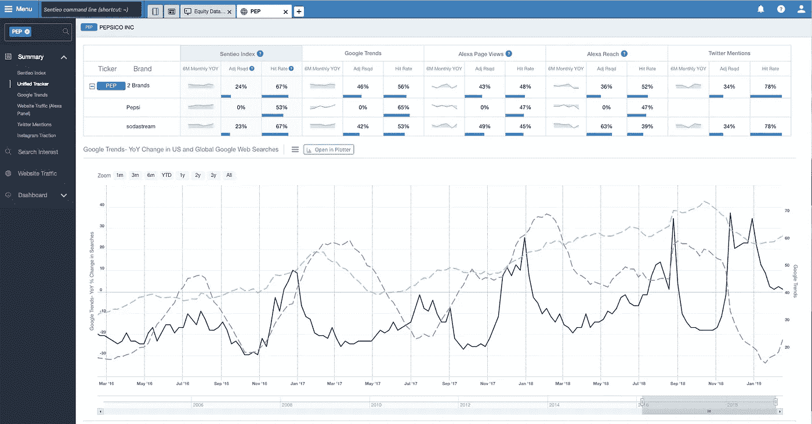
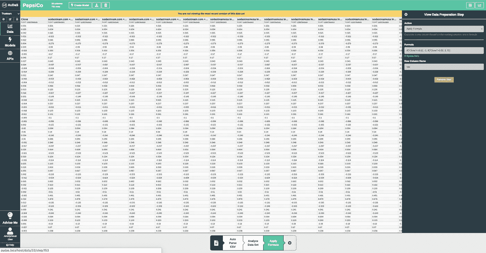
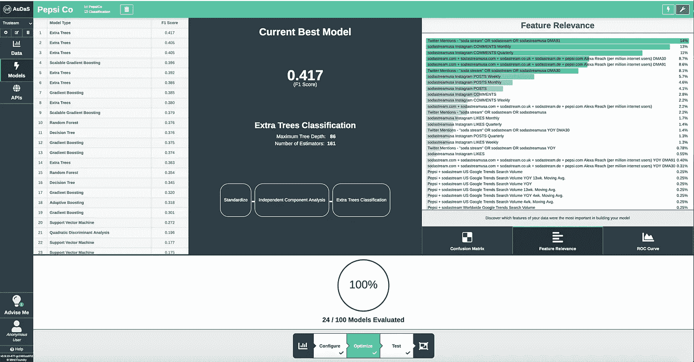

# 利用社交媒体预测股价波动

> 原文：<https://towardsdatascience.com/forecasting-stock-price-swings-with-social-media-a32d742507be?source=collection_archive---------22----------------------->

## Instagram 评论比你想象的更重要

如今，消费者比以往任何时候都更能够通过社交媒体联系和表达他们对自己喜爱品牌的看法。因此，一个品牌的声誉可以根据他们的在线战略来建立或破坏。杜嘉班纳的[没落](https://www.thedrum.com/news/2018/12/05/dolce-gabbanas-branding-all-time-low-china-after-racist-ad-scandal)和在 instagram 上设计好看的衣服(比如大 logos)就是这种新趋势的例子。这篇短文的目的是看看我们能否用社交媒体数据预测价格波动。

# 数据

我们将考虑来自 Instagram、Google trends、Twitter 和从 [Sentieo](http://sentieo.com) 下载的网站流量的[百事可乐](https://www.pepsico.com)的社交媒体指标数据。

总的来说，我们有 36 个输入指标来跟踪百事和 Sodastream 在这些社交网络上的赞数、评论数和访问量。我们将关注每周的变化，以了解它们如何影响百事公司的股价。

# 处理数据

将数据上传到 AuDaS 数据科学平台后，我们将每周价格变动分为 3 类:

*   **-1** :价格变动< -2%
*   **0** :价格在-2%和 2%之间波动
*   **1** :价格变动> 2%

这允许我们将问题框架为分类任务，这对于主要对股票的大幅价格波动感兴趣的长期投资者更有帮助。该分析可以很容易地应用于更长的时间范围(月、年)和更多的篮子，取决于数据的可用性。

# 构建模型

我们的目标变量是价格变动的分栏，我们的输入是 36 个社交媒体指标。然后，AuDaS 自动开始搜索最佳的机器学习模型，并向用户提供模型的特征相关性和得分度量。

经过几次迭代后，我们的 3 类预测问题的 F1 值达到了 0.417，比随机值(0.33)要好。

这表明社交媒体数据确实具有一定的预测能力，特别是百事公司 Twitter 提及率的每周变化，以及随后的 instagram 评论和网站触及率。

# 解释和扩展

这项研究中的数据衡量了百事公司的社交媒体和在线流量，但没有提供消费者与该品牌互动的情绪。包含情感可以帮助模型预测消费者是在赞美品牌还是在发泄他们的不满。

另一项分析可以关注百事公司与其追随者之间的具体交流，即他们如何回答客户的问题和要求，回答的速度有多快？

另一个扩展可以是观察百事可乐的流量与可口可乐和/或联合利华的流量相比如何，以及相对表现如何影响它们的价格波动。

这种机器学习模型可能不包含足够的 alpha 来制定系统策略，因为社交媒体情绪已经被广泛使用，信号衰减非常快，但它可以支持基本面投资者的分析。量化社交媒体对他们高信念投资的影响可以让他们了解一些分析师不容易衡量的额外驱动因素。这也可以帮助他们理解他们的投资在潜在的网络反弹面前是多么的脆弱。最后，instagram 帖子和 twitter 转发通常是购买量的代理，可以用于预测销售的基本模型中。

如果你有兴趣了解我们的 Quant 和基本面对冲基金客户如何使用澳元进行风险分析和投资管理，请不要犹豫，通过[电子邮件](http://charles.brecque@mindfoundry.ai)或 [LinkedIn](https://www.linkedin.com/in/charles-brecque-96768397/) 联系我。您还可以阅读以下更多案例研究:

 [## 集群风险管理

### 如何揭开表面下的结构

towardsdatascience.com](/risk-management-with-clustering-fd594e064806)  [## 用机器学习预测收入惊喜

### 如何预测哪些公司将超过或低于分析师的收益预期

towardsdatascience.com](/forecasting-earning-surprises-with-machine-learning-68b2f2318936)  [## 机器学习的价值投资

### 你最喜欢的持有期不一定是永远…

towardsdatascience.com](/value-investing-with-machine-learning-e41867156108) 

***来自《走向数据科学》编辑的提示:*** *虽然我们允许独立作者根据我们的* [*规则和指导方针*](/questions-96667b06af5) *发表文章，但我们并不认可每个作者的贡献。你不应该在没有寻求专业建议的情况下依赖一个作者的作品。详见我们的* [*读者术语*](/readers-terms-b5d780a700a4) *。*

**更新**:我开了一家科技[公司](http://www.legislate.tech/)。你可以在这里找到更多

## 团队和资源

[Mind Foundry](http://www.mindfoundry.ai) 是牛津大学的分支机构，由斯蒂芬·罗伯茨(Stephen Roberts)和迈克尔·奥斯本(Michael Osborne)教授创立，他们在数据分析领域已经工作了 35 年。Mind Foundry 团队由 30 多名世界级的机器学习研究人员和精英软件工程师组成，其中许多人曾是牛津大学的博士后。此外，Mind Foundry 通过其分拆地位，拥有超过 30 名牛津大学机器学习博士的特权。Mind Foundry 是牛津大学的投资组合公司，其投资者包括[牛津科学创新](https://www.oxfordsciencesinnovation.com)、[牛津技术与创新基金、](http://www.oxfordtechnology.com)、[牛津大学创新基金](https://innovation.ox.ac.uk/award-details/university-oxford-isis-fund-uoif/)和 [Parkwalk Advisors](http://parkwalkadvisors.com) 。