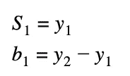
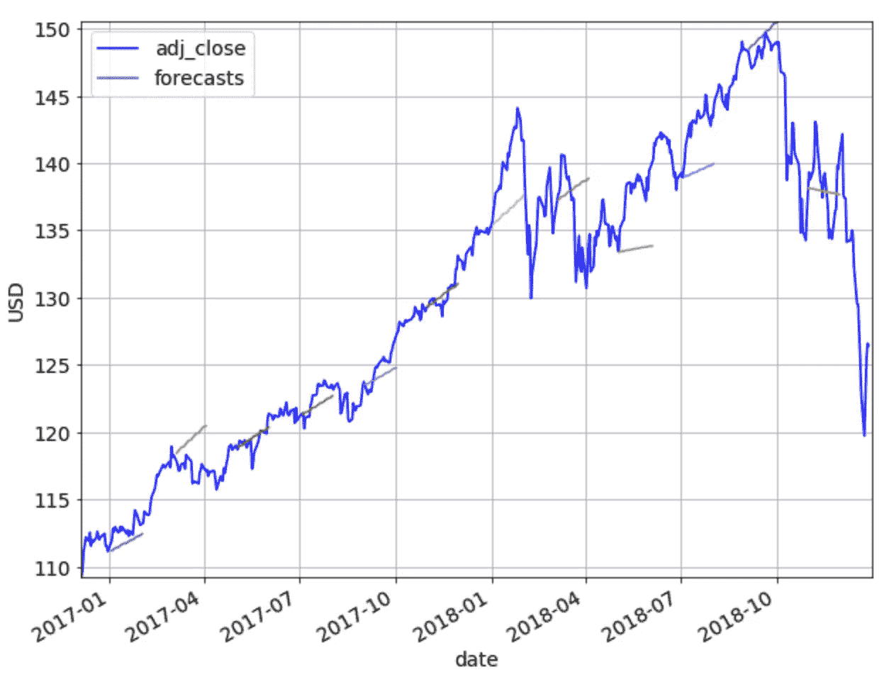
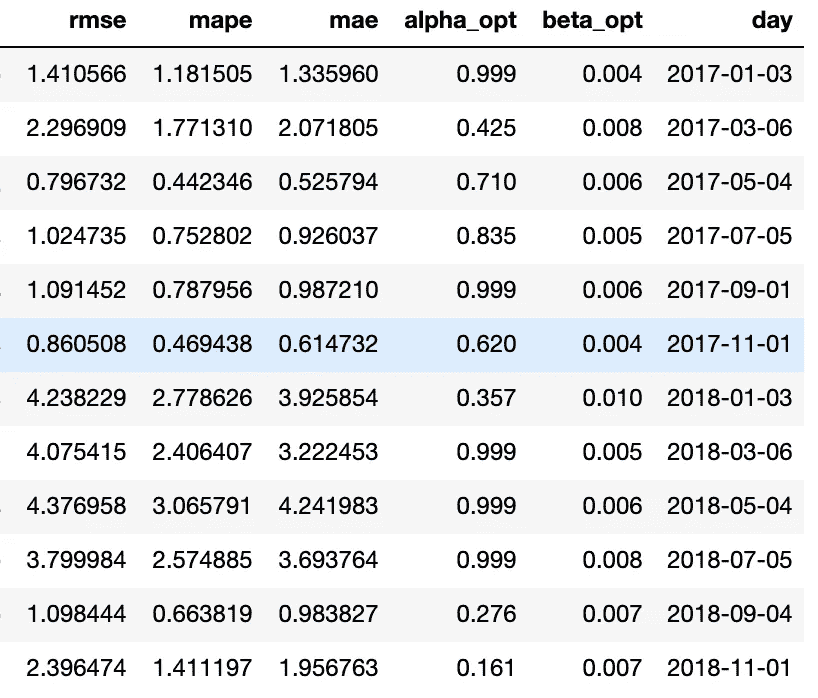
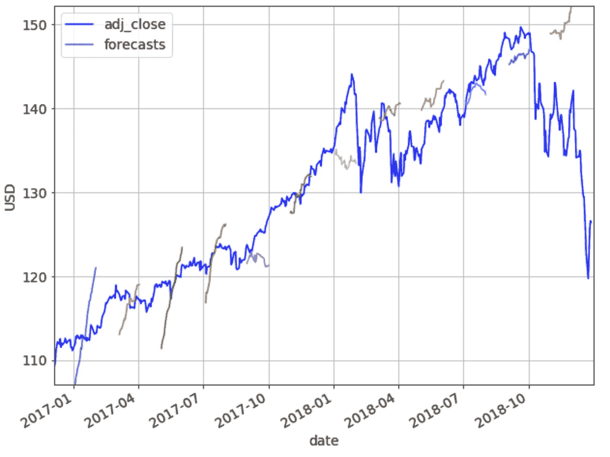
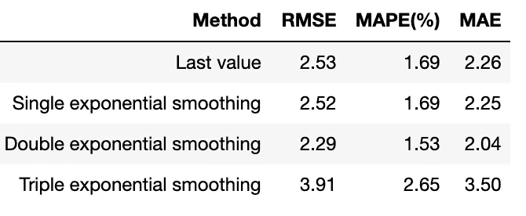

# 用指数平滑法预测股票价格

> 原文：<https://towardsdatascience.com/forecasting-stock-prices-using-exponential-smoothing-b37dfe54e8e9?source=collection_archive---------8----------------------->

Photo by [Marc Schulte](https://unsplash.com/@marc_schulte?utm_source=unsplash&utm_medium=referral&utm_content=creditCopyText) on [Unsplash](https://unsplash.com/s/photos/crystal-ball?utm_source=unsplash&utm_medium=referral&utm_content=creditCopyText)

指数平滑法是一种预测方法，它计算过去观察值的加权平均值作为预测值。随着观测数据的老化，权重呈指数衰减。因此，观测值越新，其在预测中的权重就越高。指数平滑法系列对时间序列的三个方面进行建模:趋势水平、趋势斜率和季节性成分。这三个方面产生了三种类型的指数平滑:单指数平滑、双指数平滑和三指数平滑(也称为霍尔特-温特斯法)。

在本文中，我们将尝试使用指数平滑法来预测股票价格。我们将首先使用单指数平滑，然后是双指数平滑，最后是三指数平滑(也称为霍尔特-温特斯法)。我们对指数平滑的实现遵循这里的方程式和这里的方程式(322 页)。

# 问题陈述

我们的目标是使用前 *N* 天的数据来预测 Vanguard Total Stock Market ETF(VTI)的每日调整收盘价。在这个实验中，我们将使用 VTI 从 2013 年 1 月 2 日到 2018 年 12 月 28 日的 6 年历史价格，可以从[雅虎财经](https://finance.yahoo.com/quote/VTI/)轻松下载。下载后，数据集如下所示:

Downloaded dataset for VTI.

总之，我们有 1509 天的数据可以处理。请注意，周六和周日不包括在上面的数据集中。整个数据集中调整后的收盘价如下图所示:

Adjusted closing prices from 2013–01–02 to 2018–12–28.

要有效地评估指数平滑的性能，仅在一个日期运行一次预测是不够的。相反，我们将在该数据集中的不同日期执行各种预测，并对结果进行平均。对于所有预测，我们将比较指数平滑法和终值法。

为了评估我们方法的有效性，我们将使用均方根误差(RMSE)、平均绝对百分比误差(MAPE)和平均绝对误差(MAE)指标。对于所有指标，值越低，预测越好。与我们的[上一篇文章](/forecasting-stock-prices-using-prophet-652b31fb564e#09eb)类似，我们将使用最后一个值方法对我们的结果进行基准测试。

# 培训和验证

为了进行预测，我们需要训练和验证数据。我们将使用 3 年的数据作为训练集，这对应于 756 天，因为一年中大约有 252 个交易日(252*3 = 756)。我们将使用未来 1 年的数据进行验证，这相当于 252 天。换句话说，对于我们做出的每个预测，我们需要 756+252 = 1，008 天的数据来进行模型训练和验证。将使用训练集来训练模型，并且将使用验证集来调整模型超参数(在这种情况下为⍺、β、𝛾，见下文)。

为了调整超参数，我们将使用移动窗口验证方法。移动窗口验证方法在我们的[上一篇文章](/forecasting-stock-prices-using-prophet-652b31fb564e#9995)中有详细描述。下面举例说明了 756 天的训练规模、40 天的验证规模和 40 天的预测范围的情况。

Moving window validation example.

在下文中，我们将使用指数平滑法对数据集中的若干天进行预测，每个预测期为 21 天(注意，一个月中大约有 21 个交易日，不包括周末)。我们将使用预测之前的 1008 天作为训练和验证集，如上所述，采用 756:252 的比例。

# 单指数平滑

指数平滑的基本方程如下所示。

这里:

*   *S* 表示平滑后的值
*   *y* 表示时间序列
*   *t* 表示时间序列 *y* 的时间段，取值从 1 到 *n*
*   α表示平滑常数，α值越小，曲线越平滑

要初始化，请设置

注意这里没有 *S₁* 。要执行预测，请计算

指数平滑方程非常简单，我们可以自己实现。单一指数平滑的代码如下所示。

使用移动窗口验证方法对数据集应用单指数平滑的结果如下所示。我们将⍺从 0.01 变化到 0.99，步长为 0.01，并选择⍺的最佳值，该值在我们的验证集上给出最低的 RMSE。正如人们可能观察到的那样，单一指数平滑法只能投射出一条水平直线，不能很好地捕捉趋势。

Forecasts on multiple days using single exponential smoothing.

另一种可视化预测的方法是绘制每个预测的实际值。如下图所示。如果我们有完美的准确性，每个预测应该位于对角线 y=x 线上。

Comparing the forecasts using single exponential smoothing with their actual values.

下面显示了每个预测的 RMSE、MAPE 和 MAE，以及使用各自的验证集调整的相应最佳α。

RMSE, MAPE, and MAE of each forecast made with single exponential smoothing.

上述预测给出的平均 RMSE 为 2.52，平均 MAPE 为 1.69%，平均平均月平均误差为 2.25。

你可以查看 jupyter 笔记本上的单指数平滑[这里](https://github.com/NGYB/Stocks/blob/master/StockPricePrediction_fh21/StockPricePrediction_v3_SExpSmoothing.ipynb)。

# 双指数平滑

考虑到单指数平滑不能很好地捕捉趋势，双指数平滑引入了第二个方程来模拟趋势。

这里:

*   *S* 表示平滑后的值
*   *y* 表示时间序列
*   *t* 表示时间序列 *y* 的时间段，取值从 1 到 *n*
*   α表示平滑值的平滑常数
*   *b* 表示趋势斜率的估计值
*   β表示趋势斜率的平滑常数

第一个等式通过将前一个时间段的趋势添加到最后一个平滑值来调整趋势。第二个平滑方程更新趋势。这个等式类似于单指数平滑的基本形式，但是这里应用于趋势的更新。

要初始化，请设置

要执行预测，请计算

这里:

*   *S* 表示平滑后的值
*   *t* 表示时间序列 *y* 的时间段，取值从 1 到 *n*
*   表示趋势斜率的估计值
*   代表预测
*   H 表示预测范围

双指数平滑的代码如下所示。

使用移动窗口验证方法对数据集应用双指数平滑的结果如下所示。我们以 0.01 的步长从 0.01 到 0.99 改变**⍺和β，并选择在我们的验证集上给出最低 RMSE 的⍺，β的最佳值。**

Forecasts on multiple days using double exponential smoothing.

预测值与实际值的对比图如下所示。

Comparing the forecasts using double exponential smoothing with their actual values.

下面显示了每个预测的 RMSE、MAPE 和 MAE，以及使用各自的验证集调整的相应最佳α和β。

RMSE, MAPE, and MAE of each forecast made with double exponential smoothing.

上述预测给出的平均 RMSE 为 2.31，平均 MAPE 为 1.54%，平均平均月平均误差为 2.06。到目前为止，正如我们所料，双指数平滑比单指数平滑效果更好。

然而，仔细观察β的最佳值会发现，我们最初的β下限设置得太低了。接下来，我们尝试了一种“微调”方法来调整超参数——我们首先像以前一样以 0.01 的步长将**⍺和**β从 0.01 变到 0.99。找到⍺和β的初始最佳值后，我们接着在初始最佳值+/- 0.01 的范围内改变它们的值，步长为 0.001。下图显示了经过微调的最佳α和β。

RMSE, MAPE, and MAE of each forecast made with double exponential smoothing, with hyperparameter finetuning.

通过微调，上述预测给出了稍好的平均 RMSE 为 2.29，平均 MAPE 为 1.53%，平均平均误差为 2.04。

你可以在 jupyter 笔记本上查看双指数平滑[这里](https://github.com/NGYB/Stocks/blob/master/StockPricePrediction_fh21/StockPricePrediction_v4_DExpSmoothing.ipynb)(没有微调)和[这里](https://github.com/NGYB/Stocks/blob/master/StockPricePrediction_fh21/StockPricePrediction_v4a_DExpSmoothing_finetune.ipynb)(有微调)。

# 三重指数平滑

三重指数平滑法，也称为霍尔特-温特斯法，引入了第三个方程来考虑季节性。

这里:

*   *S* 表示平滑后的值
*   *y* 表示时间序列
*   *t* 表示时间序列 *y* 的时间段，取值从 1 到 *n*
*   α表示平滑值的平滑常数
*   *b* 表示趋势斜率的估计值
*   β表示趋势斜率的平滑常数
*   *L* 表示周期
*   I 表示季节性成分的估计值
*   𝛾表示季节性成分的平滑常数

我们选择将周期设定为每年，是因为出现了[圣诞老人集会](https://en.wikipedia.org/wiki/Santa_Claus_rally)、[一月效应](https://en.wikipedia.org/wiki/January_effect)和[五月卖出](https://en.wikipedia.org/wiki/Sell_in_May)效应等现象。由于一年大约有 252 个交易日，我们设 *L* = 252。

要初始化平滑值，请设置

要初始化趋势斜率，请设置

要初始化季节性组件，请设置

这里:

*   *P* 表示我们列车组的周期数(因为我们的列车长度为 3 年， *P* =3)

上面的等式首先计算每个周期中所有值的平均值，用 *Aᵢ* 表示。接下来，我们计算每个 *y* 分量与其对应的 *Aᵢ* 的差值，并取平均值。参见[此处](https://www.itl.nist.gov/div898/handbook/pmc/section4/pmc435.htm)的示例。

三重指数平滑的代码如下所示。

使用移动窗口验证方法对数据集应用三重指数平滑的结果如下所示。我们以 0.01 的步长从 0.01 到 0.99 改变**⍺和β，以 0.1 的步长从 0.1 到 0.9 改变𝛾。然后，我们选择⍺、β和𝛾的最佳值，这些值在我们的验证集上给出了最低的 RMSE。**

Forecasts on multiple days using triple exponential smoothing.

预测值与实际值的对比图如下所示。

Comparing the forecasts using triple exponential smoothing with their actual values.

上述预测给出的平均 RMSE 为 3.91，平均 MAPE 为 2.65%，平均平均月平均降水量为 3.50。

下面显示了每个预测的 RMSE、MAPE 和 MAE，以及使用各自的验证集调整的相应最佳α、β和𝛾's。

RMSE, MAPE, and MAE of each forecast made with triple exponential smoothing.

上述预测给出的平均 RMSE 为 3.91，平均 MAPE 为 2.65%，平均平均月平均降水量为 3.50。

你可以在 jupyter 笔记本上查看三重指数平滑[这里](https://github.com/NGYB/Stocks/blob/master/StockPricePrediction_fh21/StockPricePrediction_v5_TExpSmoothing.ipynb)。

# 调查的结果

让我们将我们的发现汇总在下表中。

Comparing the different methods.

可以观察到，三重指数平滑的性能最差，这可能是因为年度季节性假设在我们的数据集中不成立。另一方面，双指数平滑法的性能最好，优于最后一个值法。

在我们的下一篇文章中，我们将探索应用于股票价格预测的其他预测技术。敬请期待！