# 使用 Prophet 预测股票价格

> 原文：<https://towardsdatascience.com/forecasting-stock-prices-using-prophet-652b31fb564e?source=collection_archive---------10----------------------->


预测是一门硬科学，需要大量的专业知识。出于这些原因，脸书开源了 Prophet T1，它允许任何拥有 Python 编程技能的人轻松实现对时间序列的预测。你可以在脸书的[博客](https://research.fb.com/prophet-forecasting-at-scale/)或[报纸](https://peerj.com/preprints/3190.pdf)上读到更多关于先知的内容。

在本文中，我们将尝试使用 Prophet 来预测股票价格。Prophet 使用一个可分解的时间序列模型，它有三个主要的模型组件:增长、季节性和假期。它们通过以下等式组合在一起

```
*y(t) = g(t) + s(t) + h(t) + e(t),*
```

其中 *g(t)* 表示模拟非周期性变化的增长函数， *s(t)* 表示由于每周或每年的季节性引起的周期性变化， *h(t)* 表示节假日的影响， *e(t)* 表示误差项。这种可分解的时间序列在预测中非常常见，在本文的后面，我们将看到如何调整上述方程的每个组成部分。

***来自《走向数据科学》编辑的提示:*** *虽然我们允许独立作者根据我们的* [*规则和指导方针*](/questions-96667b06af5) *发表文章，但我们并不认可每个作者的贡献。你不应该在没有寻求专业建议的情况下依赖一个作者的作品。详见我们的* [*读者术语*](/readers-terms-b5d780a700a4) *。*

# 问题陈述

我们的目标是使用前 *N* 天的数据来预测 Vanguard Total Stock Market ETF(VTI)的每日调整收盘价。在这个实验中，我们将使用 VTI 从 2013 年 1 月 2 日到 2018 年 12 月 28 日的 6 年历史价格，可以从[雅虎财经](https://finance.yahoo.com/quote/VTI/)轻松下载。下载后，数据集如下所示:

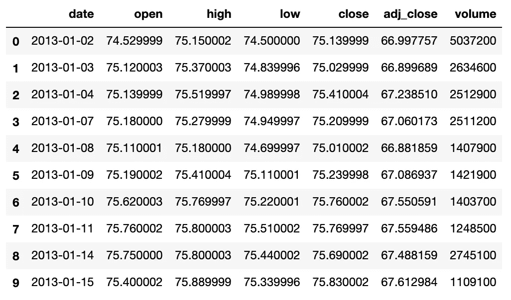

Downloaded dataset for VTI.

总之，我们有 1509 天的数据可以处理。请注意，周六和周日不包括在上面的数据集中。整个数据集中调整后的收盘价如下图所示:

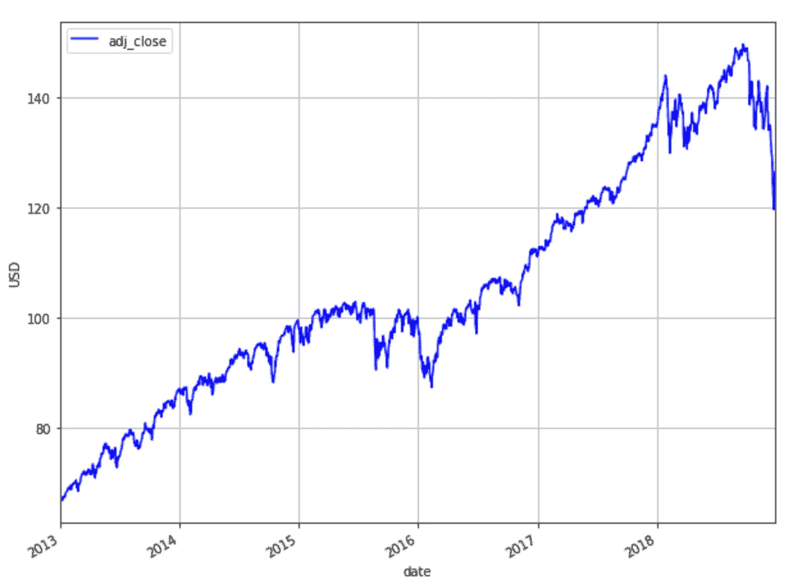

Adjusted closing prices from 2013–01–02 to 2018–12–28.

要有效地评估 Prophet 的性能，仅在一个日期运行一次预测是不够的。相反，我们将在该数据集中的不同日期执行各种预测，并对结果进行平均。对于所有的预测，我们将比较先知法和终值法。

为了评估我们方法的有效性，我们将使用均方根误差(RMSE)、平均绝对百分比误差(MAPE)和平均绝对误差(MAE)指标。对于所有指标，值越低，预测越好。

# 培训和验证

为了进行预测，我们需要训练和验证数据。我们将使用 3 年的数据作为训练集，这对应于 756 天，因为一年中大约有 252 个交易日(252*3 = 756)。我们将使用未来 1 年的数据进行验证，这相当于 252 天。换句话说，对于我们做出的每个预测，我们需要 756+252 = 1，008 天的数据来进行模型训练和验证。将使用训练集来训练模型，并且将使用验证集来调整模型超参数。

为了调整超参数，我们将使用移动窗口验证方法。最好用一个例子来解释。假设我们总共有 896 天的数据，我们希望在第 857 天执行预测，预测范围= 40 天。作为一种启发，对于预测范围 *H* ，我们通常每 *H* /2 个周期进行一次预测。对于 756 天的训练集，我们将能够进行 4 次验证(见下图)。来自这 4 个验证的误差度量将被平均，并且模型超参数将基于给出最低平均误差度量的组合来选择。有了这些最佳超参数，我们将在第 857 天进行预测并报告结果。

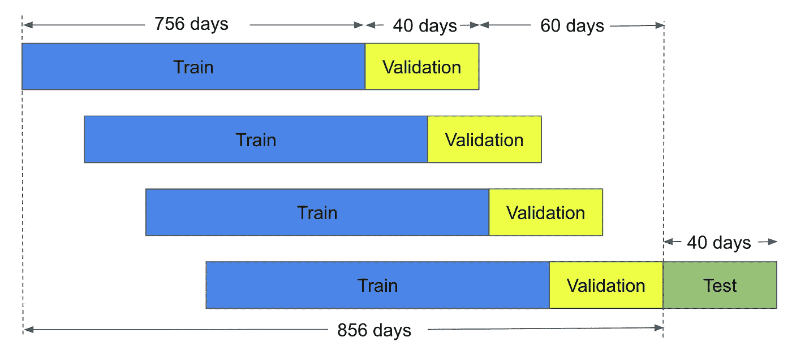

Moving window validation example.

在下文中，我们将首先对数据集的第 1009 天进行预测，预测跨度为 21 天(注意，一个月中大约有 21 个交易日，不包括周末)。对于 Prophet，我们将使用前 1008 天作为训练和验证集，如上所述，以 756:252 进行划分。我们将在下一节中首先解释最后一个值方法。

# 最后一个值

在最后一个值方法中，我们简单地将预测值设置为最后一个观察值。在我们的上下文中，这意味着我们将当前调整后的收盘价设置为前一天的调整后的收盘价。这是最具成本效益的预测模型，通常用作比较更复杂模型的基准。这里没有要优化的超参数。我们对数据集第 1009 天的预测显示如下，预测时间跨度为 21 天。

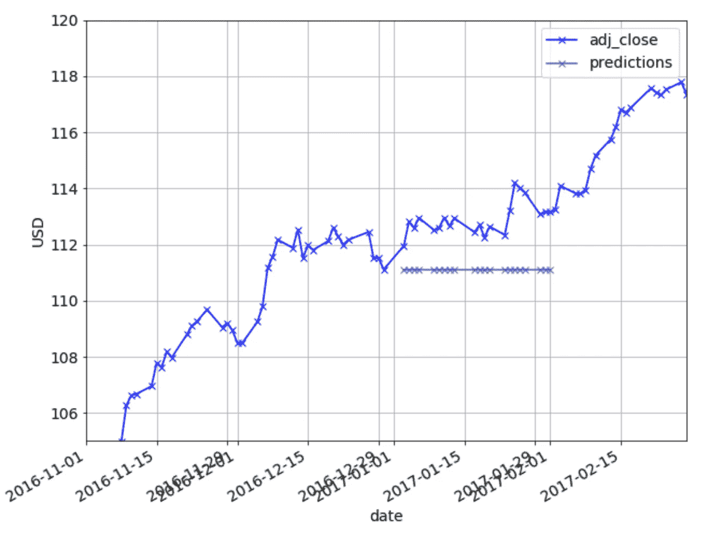

Predictions on test set using Last Value method.

上述预测给出的 RMSE 为 1.89，MAPE 为 1.59%，平均相对误差为 1.80。

# 无超参数调谐的 Prophet

要使用 Prophet 运行预测，请使用下面的代码。

请注意，您需要从未来的数据框架中删除周末。不这样做将会给你不好的预测结果。更多信息请见[这里](https://github.com/facebook/prophet/issues/323)或者[这里](https://facebook.github.io/prophet/docs/non-daily_data.html)。另一件要注意的事情是，当我们创建未来数据帧时，我们为大于 H 的时间段创建它。这是因为如果我们为 H 的时间段创建未来数据帧，随后在我们从数据帧中移除周末之后，我们可能在数据帧中以少于 H 天结束。

为了快速可视化，您可以使用 Prophet 绘制预测图，如下所示:

```
m.plot(forecast)
```

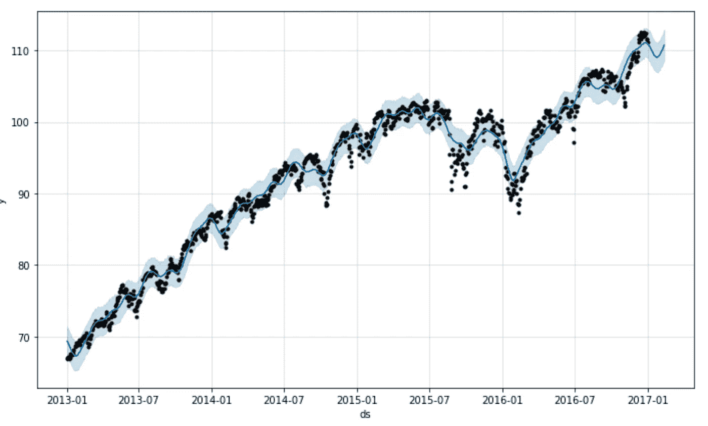

Predictions plotted using Prophet.

先知可视化很好，但为了更详细的外观，我仍将使用 Matplotlib:

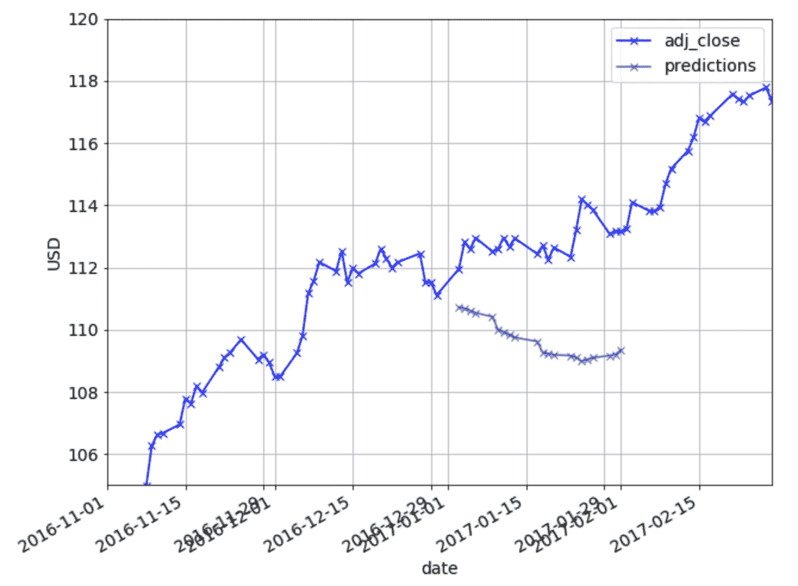

Predictions on test set using Prophet.

上述预测给出的 RMSE 为 3.40，MAPE 为 2.87%，平均相对误差为 3.25。在这一点上，最后一个值法更胜一筹。下面我们将调整超参数，并观察预测是否有所改善。

# 具有超参数调谐的 Prophet 变点

时间序列的轨迹通常会发生突变。默认情况下，Prophet 采用自动变点检测。然而，可以通过使用参数 *changepoint_prior_scale* 来调整该变点检测的强度。增加 *changepoint_prior_scale* 将使趋势更加灵活，并导致过度拟合。减少 *changepoint_prior_scale* 将会降低趋势的灵活性，导致拟合不足。默认情况下，该参数设置为 0.05。

可以在 Prophet 中设置变点先验比例，如下所示:

```
m = Prophet(changepoint_prior_scale=changepoint_prior_scale)
```

我们使用训练集和验证集进行预测，下面显示了结果:

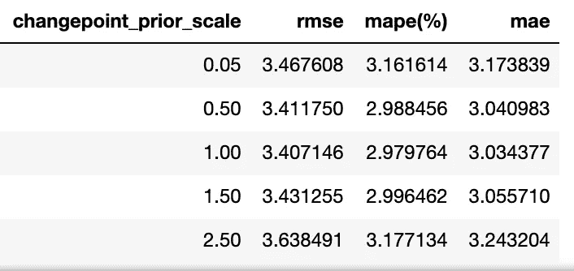

Tuning changepoint_prior_scale using RMSE, MAPE and MAE.

上述过程总共花费了 8 分钟。从上面可以看出，changepoint_prior_scale 的最佳值是 1。接下来，我们使用这个值并在测试集上运行我们的预测。结果如下所示。

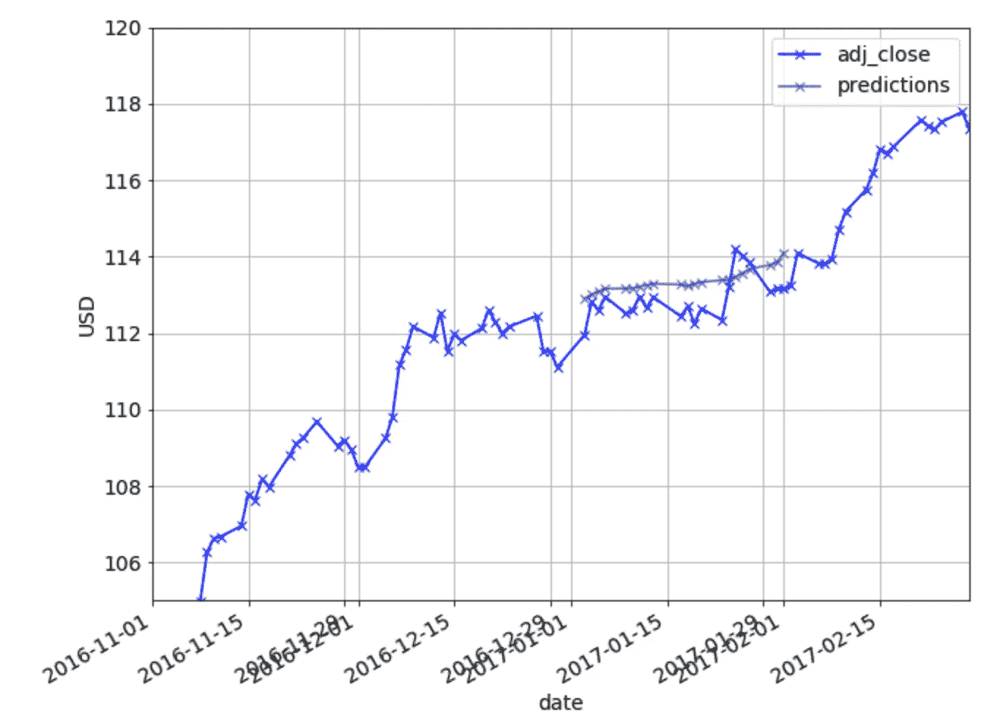

Predictions on test set after tuning changepoint_prior_scale.

上面的预测给出的 RMSE 为 0.64，MAPE 为 0.52%，平均相对误差为 0.58。

# 具有超参数调整的 Prophet 每月季节性

可以在 Prophet 中设置每月季节性，如下所示:

```
m = Prophet()
m.add_seasonality(name='monthly', period=21, fourier_order=fourier_order)
```

上面的傅立叶级数是指用于估计季节性的部分和的项数。关于傅立叶阶的更多细节，请参考 Prophet 文档[此处](https://facebook.github.io/prophet/docs/seasonality,_holiday_effects,_and_regressors.html)。

我们使用训练集和验证集进行预测，下面显示了结果:

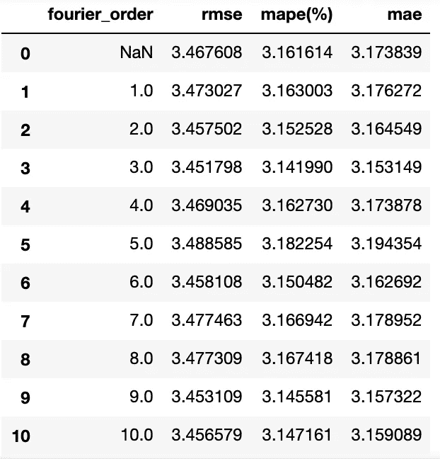

Tuning fourier order of monthly seasonality using RMSE, MAPE, and MAE.

上述过程总共花费了 17 分钟。从上面，我们观察到傅立叶级数的最佳值是 3。接下来，我们使用这个值并在测试集上运行我们的预测。结果如下所示。


Predictions on test set after tuning fourier_order.

上面的预测给出的 RMSE 为 3.52，MAPE 为 2.98%，平均相对误差为 3.37。

# 具有超参数调谐的预言家—假日

Prophet 在进行预测时能够将节假日考虑在内。首先，我们需要构建一个假日数据框架，如下图所示，它可以很容易地从 csv 文件构建。

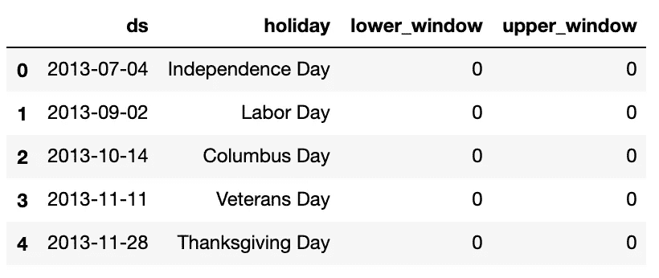

Holidays of the United States from 2013 to 2018 (only first 5 rows are shown).

列 lower_window 和 upper_window 将假日延长到日期前后的[lower_window，upper_window]天。更多信息，请参见[此处](https://facebook.github.io/prophet/docs/seasonality,_holiday_effects,_and_regressors.html)。

假日可以在 prophet 中设置(假日是上面显示的数据框):

```
m = Prophet(holidays=holidays)
```

我们使用训练集和验证集进行预测，下面显示了结果:

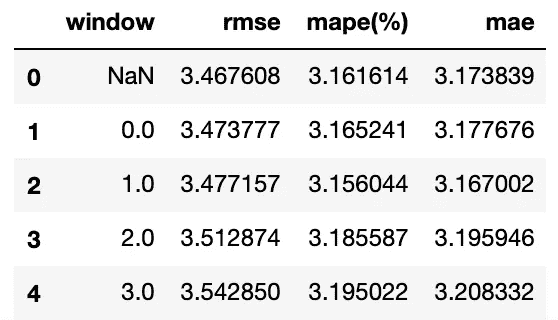

Tuning window size for holidays using RMSE, MAPE, and MAE.

上述过程总共花费了 9 分钟。从上面，我们观察到窗口大小的最佳值是 None ie。不考虑假期会给出更好的预测。接下来，我们使用这个值并在测试集上运行我们的预测。结果如下所示。

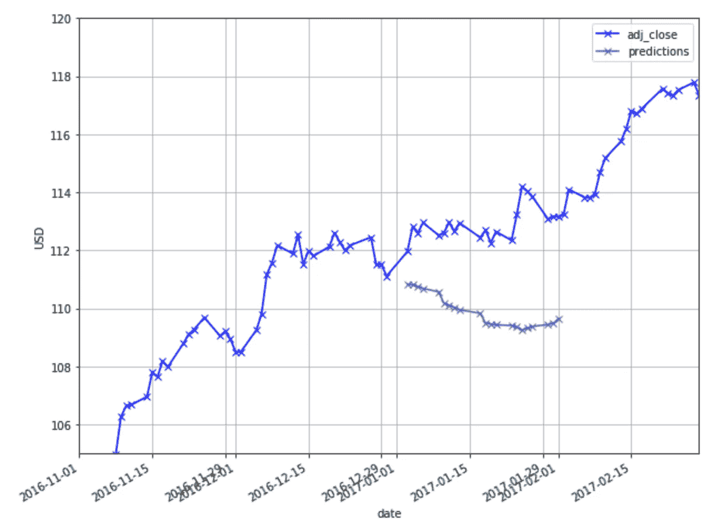

Predictions on test set after tuning window_size.

上述预测给出的 RMSE 为 3.40，MAPE 为 2.87%，平均相对误差为 3.25。

# 先知与超参数调整-变点，每月季节性和假期

这里，我们调整变点、傅立叶级数和窗口大小，以观察性能是否可以进一步提高。我们使用训练集和验证集进行预测，下面显示了结果:

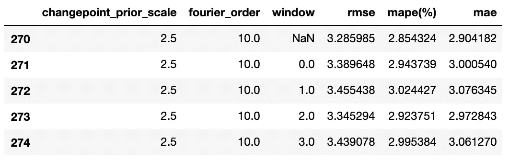

Tuning changepoint_prior_scale, fourier_order for monthly seasonality, and window size for holidays using RMSE, MAPE, and MAE. Only 5 rows of the entire dataframe are shown.

以网格搜索方式测试上述每个超参数总共需要 8 分钟* 17 分钟* 9 分钟= 20 小时。我们在我们的机器上用 Python 在 8 个内核上实现了一个并行化的实现，将这个过程减少到了 2 个小时。您可以查看 Jupyter 笔记本来了解这一实现(本文末尾提供了链接)。

从上面，我们观察到 changepoint_prior_scale、fourier_order 和 window 的最佳值分别为 2.5、10，并且不使用节假日。接下来，我们使用这些值并在测试集上运行我们的预测。结果如下所示。

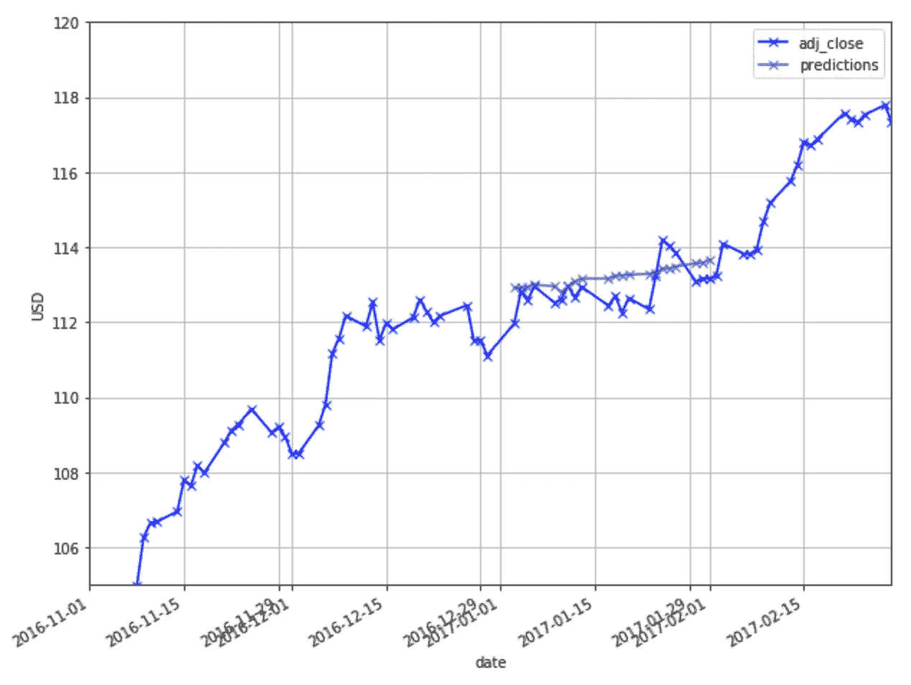

Predictions for test set after tuning changepoint_prior_scale, fourier_order. and window_size.

上面的预测给出的 RMSE 为 0.55，MAPE 为 0.41%，平均相对误差为 0.47。

在这一点上，巩固我们从上面得到的结果是有好处的:

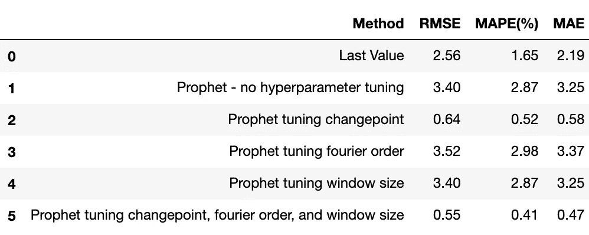

Performance evaluation of our various methods, based on forecast made for the 1009th day.

通过一起调整变点、傅立叶阶和窗口大小，我们能够使用 Prophet 在第 1009 天的预测中实现卓越的性能。接下来，我们来看看 Prophet 在其他日子是如何工作的。

# 多日预测

观察了上面超参数调整的效果后，我们将在这里扩展我们的方法来运行多天的预测。我们将从数据集的第 1009 天开始进行预测，每 42 天重复一次预测。因为我们的数据集中有 1509 天，所以我们将总共进行 12 次预测。对于每个预测，我们将坚持 21 天的预测范围。此外，对于第 *t* 天的每个预测，我们使用之前的 1008 天作为训练和验证集，如上所述训练和调整超参数。在优化超参数之后，我们将在 *t* 日运行预测。

如果没有我们的并行实施，要进行 12 次预测，需要 12 * 20 小时= 10 天。对于我们上面的并行实现，需要 12 * 2 小时= 24 小时。

结果如下所示。

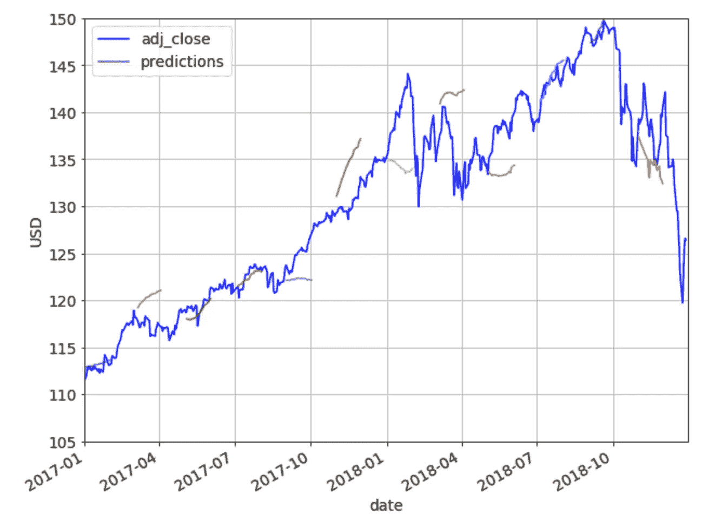

Predictions on multiple days using Prophet.

从上面我们观察到，并不是所有的预测都是好的。在某些日子里，预测的方向和水平与实际值非常匹配，而在某些日子里，预测的方向和水平完全偏离。让我们将上面的结果与下面显示的最后一个值方法进行比较。

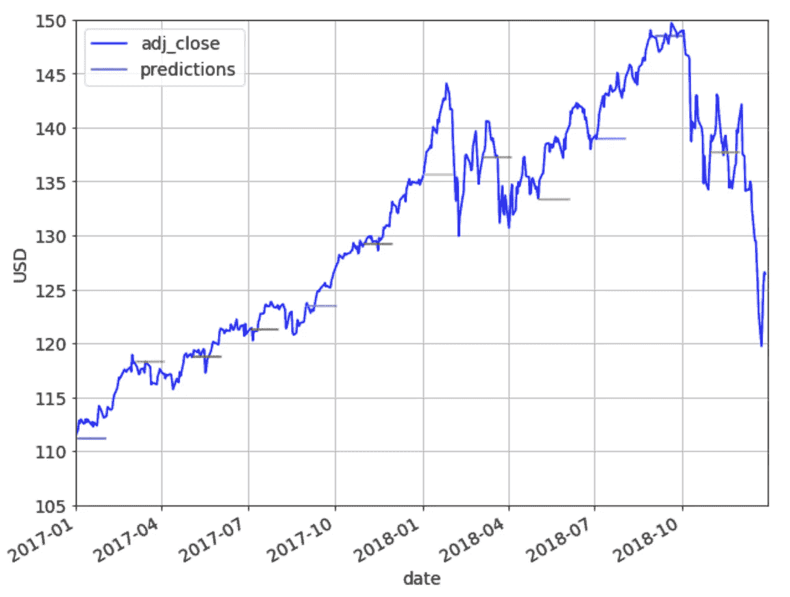

Predictions on multiple days using Last Value method.

Prophet 得出的平均 RMSE(11 次预测的平均值)为 3.16，平均 MAPE 为 2.15%，平均平均误差为 2.86。虽然这看起来不太坏，但最后一个值方法实际上返回了更好的结果——平均 RMSE 为 2.53，平均 MAPE 为 1.69%，平均平均平均误差为 2.26。

你可以在这里找到我的笔记本。你可以随意使用它，如果你设法找到超参数，以至于预言家可以**持续**击败最后一个值方法，请在下面的评论中分享！