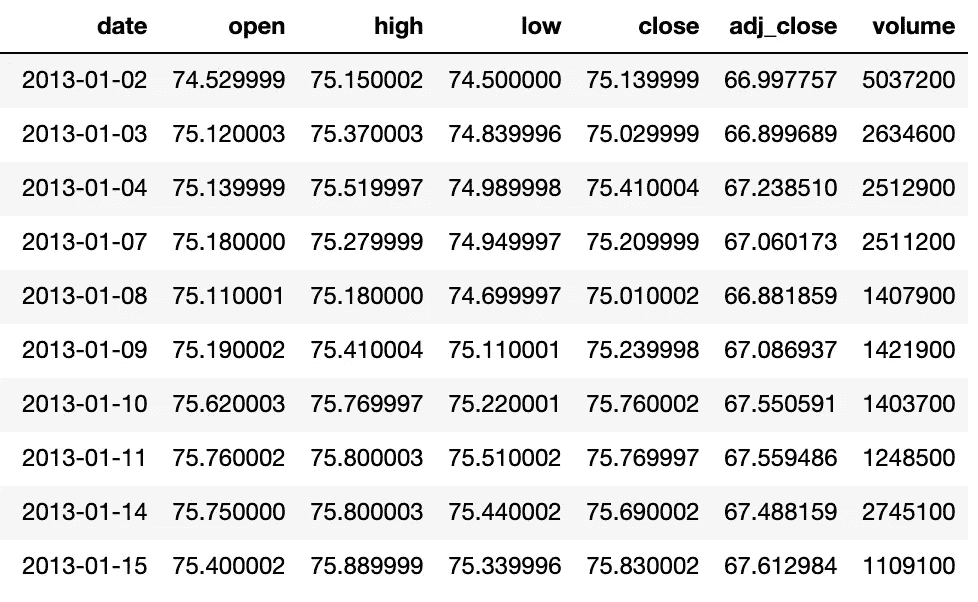
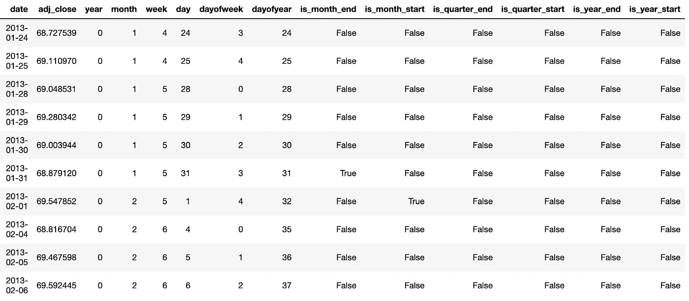
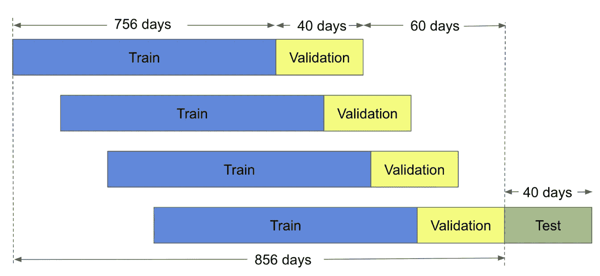
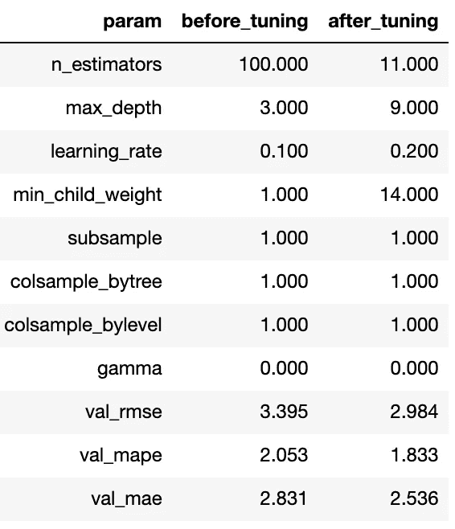
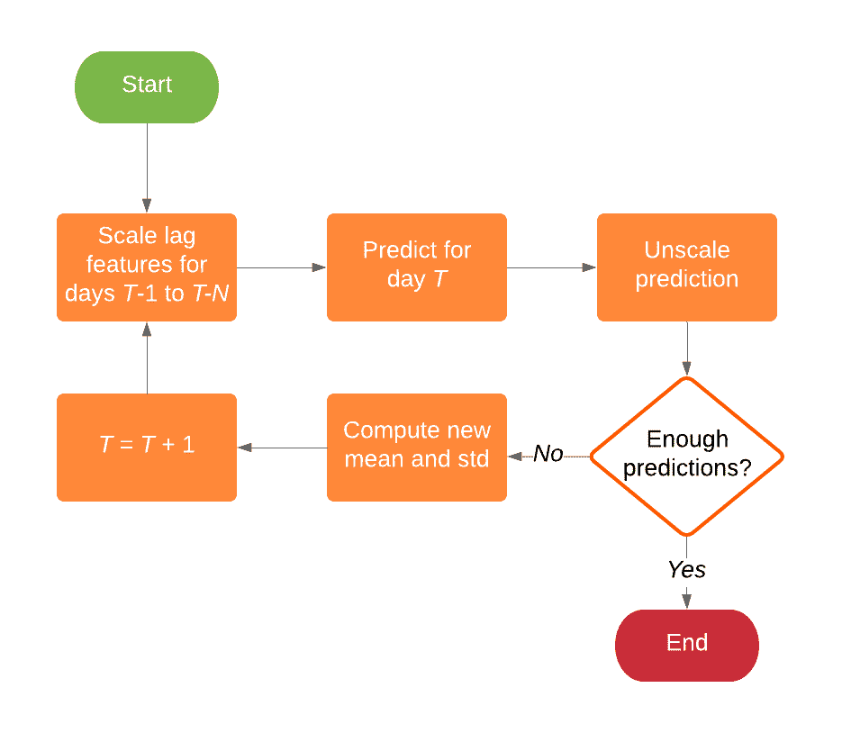
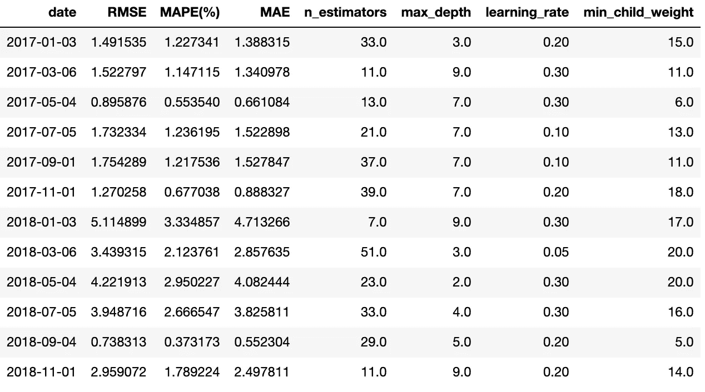
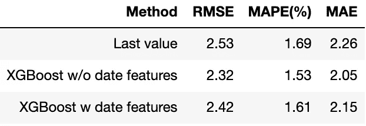

# 使用 XGBoost 预测股票价格(第 1/5 部分)

> 原文：<https://towardsdatascience.com/forecasting-stock-prices-using-xgboost-a-detailed-walk-through-7817c1ff536a?source=collection_archive---------2----------------------->

## 一步一步的演练

Photo by [Jamie Street](https://unsplash.com/@jamie452?utm_source=medium&utm_medium=referral) on [Unsplash](https://unsplash.com?utm_source=medium&utm_medium=referral)

野外有许多机器学习技术，但极限梯度提升(XGBoost)是最受欢迎的技术之一。梯度推进是以迭代的方式将弱学习者转换为强学习者的过程。XGBoost 这个名字指的是推动提升树算法的计算资源极限的工程目标。自 2014 年推出以来，XGBoost 已被证明是一种非常强大的机器学习技术，通常是许多机器学习竞赛中的首选算法。

在本文中，我们将尝试使用 XGBoost 来预测股票价格。我们已经在[的前一篇文章](/machine-learning-techniques-applied-to-stock-price-prediction-6c1994da8001?source=friends_link&sk=fe1f1ab52fec793c433028fc63c7a965)中对 XGBoost 进行了试验，但是在本文中，我们将更详细地研究 XGBoost 应用于股票价格预测问题的性能。下面我们列出了这篇文章和上一篇文章的主要区别:

*   在上一篇文章中，我们只预测了 **1 天**，但在这里我们预测了下一个 **21 天**(注意一个月大约有 21 个交易日，不包括周末)。为此，我们使用了一种被称为**递归预测**的技术。
*   在前一篇文章中，我们使用了一个简单的训练-验证-测试分割，但是这里我们使用了**移动窗口验证方法**来执行超参数调整。
*   在上一篇文章中，用作滞后特征的前几天的天数(表示为 *N* )被视为要优化的超参数。但是这里我们设置 *N* =14，让模型自己推断哪个滞后期对预测更重要。
*   在上一篇文章中，我们只使用了前 *N* 天的价格作为特征，但在这里我们做了更多的**特征工程**并引入了更多的特征。

在本文的其余部分，我们将通过机器学习项目的标准步骤，重点关注我们的股票价格预测问题:

[问题陈述](#b0ef)
[探索性数据分析](#76fa)
[训练、验证、测试拆分](#78f6)
[特征工程](#d2d8)
[特征缩放](#c34b)
[超参数调优](#724b)
[应用模型](#1dc3)
[调查结果](#e96c)

值得注意的是，这里没有提到机器学习项目的其他步骤，如数据清理(这里不是问题)、缺失值插补(这里没有缺失值)和特征选择(嗯，我们这里没有很多特征)。这些话题也很重要，但在我们的问题中并不是一个问题，你会在下面看到。

# 问题陈述

在开始任何工作之前，明确定义问题陈述是非常重要的。在这里，我们旨在使用前 *N* 天的数据来预测 Vanguard Total Stock Market ETF(VTI)的每日调整收盘价。在这个实验中，我们将使用 VTI 从 2013 年 1 月 2 日到 2018 年 12 月 28 日的 6 年历史价格，可以从[雅虎财经](https://finance.yahoo.com/quote/VTI/)轻松下载。下载后，数据集如下所示:

Downloaded dataset for VTI.

总之，我们有 1509 天的数据可以处理。请注意，周六和周日不包括在上面的数据集中。整个数据集中调整后的收盘价如下图所示:

为了有效地评估 XGBoost 的性能，在一个日期运行一次预测是不够的。相反，我们将在该数据集中的不同日期执行各种预测，并对结果进行平均。

为了评估我们方法的有效性，我们将使用均方根误差(RMSE)、平均绝对百分比误差(MAPE)和平均绝对误差(MAE)指标。对于所有指标，值越低，预测越好。与我们的[上一篇文章](/forecasting-stock-prices-using-prophet-652b31fb564e)类似，我们将使用最后一个值方法来测试我们的结果。

# 探索性数据分析

EDA 是机器学习项目的一个重要组成部分，可以帮助您获得对数据集的良好“感觉”。如果你参加机器学习竞赛(或计划参加)，广泛的**EDA 可能会帮助你生成更好的功能，甚至发现“信息泄漏”，这可以帮助你爬上排行榜。正如我们将在下面看到的，EDA 过程包括创建可视化来帮助您更好地理解数据集。**

下图显示了每个月的平均调整收盘价。我们可以推断，根据我们的数据集，平均而言，较晚的月份比较早的月份具有更高的值。

Average adjusted closing price by month.

下图显示了该月每天的平均调整收盘价。平均而言，有一个向上倾斜的趋势，该月的后几天的价格高于前几天。

Average adjusted closing price by day of month.

下图显示了一周内每天的平均调整收盘价。平均而言，周四和周五的调整后收盘价高于一周中的其他日子。

Average adjusted closing price by day of week.

下面的热图显示了前几天调整后的收盘价与当天收盘价的相关性。很明显，调整后的收盘价越接近当天，它们的相关性就越高。因此，应在预测中使用与前 10 天的调整后收盘价相关的特征。

Correlation heatmap for the lag features.

基于上面的 EDA，我们推断与日期相关的特性可能对模型有帮助。此外，前 10 天的调整收盘价与目标变量高度相关。这些是我们将在下面的特征工程中使用的重要信息。

# 特征工程

特征工程是一个创造性的过程，是任何机器学习项目中最重要的部分之一。为了强调特征工程的重要性，吴恩达有一句很好的名言值得分享(来自[维基百科](https://en.wikipedia.org/wiki/Feature_engineering)):

> 想出特性是困难的，耗时的，需要专业知识。“应用机器学习”基本上是特征工程。
> 
> — [吴恩达](https://en.wikipedia.org/wiki/Andrew_Ng)，*通过大脑模拟的机器学习和人工智能*

在这个项目中，我们将生成以下特性:

*最近 N=10 天
年
月
周
日月
日周
日年
是 _ 月 _ 日
是 _ 月 _ 日
是 _ 季 _ 日
是 _ 季 _ 日
是 _ 年 _ 日
是 _ 年 _ 日*

使用 fastai 包可以很容易地生成与日期相关的特性:

使用上面的代码后，数据帧如下所示。列 *adj_close* 将成为目标列。为简洁起见，省略了与最近 *N* 天的调整后收盘价相关的特征。

Dataframe containing the target column and date features.

下面的热图显示了功能与目标列的相关性。特征*年份*与调整后的收盘价高度相关。这并不奇怪，因为在我们的数据集中，有一个向上倾斜的趋势，即年份越大，调整后的收盘价越高。其他特征没有表现出与目标变量的高度相关性。从下面我们还发现特征*是 _year_start* 全是 nan。这是因为一年的第一天从来都不是交易日，所以我们从模型中删除了这个特性。

Correlation heatmap for date features.

下面是一个条形图，显示了前 10 个最重要功能的重要性分数。这是针对 2017 年 1 月 3 日的预测获得的，其他日期的预测可能具有不同的功能重要性排名。不出所料，调整后的前一日收盘价是最重要的特征。

Top 10 most important features for the forecast of 2017–01–03.

# 培训、验证和测试

为了进行预测，我们需要训练和验证数据。我们将使用 3 年的数据作为训练集，这对应于 756 天，因为一年中大约有 252 个交易日(252*3 = 756)。我们将使用未来 1 年的数据进行验证，这相当于 252 天。换句话说，对于我们做出的每个预测，我们需要 756+252 = 1，008 天的数据来进行模型训练和验证。将使用训练集来训练模型，并且将使用验证集来调整模型超参数。

为了调整超参数，我们将使用移动窗口验证方法。移动窗口验证方法在我们以前的一篇文章中有详细描述:

 [## 使用 Prophet 预测股票价格

### 预测是一门硬科学，需要大量的专业知识。由于这些原因，脸书开源先知…

towardsdatascience.com](/forecasting-stock-prices-using-prophet-652b31fb564e) 

下面举例说明了 756 天的训练规模、40 天的验证规模和 40 天的预测范围的情况。

Moving window validation example.

在时间序列预测中，训练、验证、测试分割必须按时间顺序进行，这一点非常重要。不这样做将导致模型中的**【信息泄漏】**，这被定义为根据提供关于测试集的信息的数据来训练模型的场景。例如，如果我们有今天的开盘价，并试图预测昨天的收盘价，我们可以立即将我们的预测设置为等于今天的开盘价，我们应该会得到相当好的结果。最终的结果是，我们的模型将给出比现实生活中可以预期的更好的性能。因此，在建立机器学习模型时，我们需要非常小心信息泄露。

在接下来的内容中，我们将使用 XGBoost 对测试集中的几天进行预测，即:

*2017–01–03
2017–03–06
2017–05–04
2017–07–05
2017–09–01
2017–11–01
2018–01–03
2018–03–06
2018–05–04
2018*

对于上述 12 个预测中的每一个，我们将使用 21 天的预测范围。我们将使用预测日期之前的 1008 天作为训练和验证集，如上所述，分割比例为 756:252。

# 特征缩放

特征缩放在这里很重要，因为如果你看上面的调整后收盘价图，按时间顺序分割训练集和测试集几乎总是导致测试集的调整后收盘价比训练集的值高。这意味着，在不调整调整后的收盘价的情况下训练的模型将仅输出训练集中价格范围附近的预测。这在我们之前的文章中也有解释:

 [## 机器学习技术在股票价格预测中的应用

### 机器学习有很多应用，其中之一就是预测时间序列。最有趣的(或者…

towardsdatascience.com](/machine-learning-techniques-applied-to-stock-price-prediction-6c1994da8001) 

我们已经试验了各种技术，在本文中，我们将使用从上面找到的具有最佳性能的方法。对于每个样本的调整后收盘价的每个特征组(滞后特征),我们将调整它们，使其均值为 0，方差为 1。例如，如果我们在第 *T* 天进行预测，我们将采用最后 *N* 天(第 *T* - *N* 到 *T* -1 天)的调整后收盘价，并将它们换算成平均值为 0，方差为 1。对滞后特性的训练集、验证集和测试集进行同样的操作。日期要素不进行缩放。然后，我们使用这些缩放的滞后特征和日期特征来进行预测。预测值也将被缩放，我们使用它们相应的平均值和方差对它们进行逆变换。

# 超参数调谐

我们对验证集执行超参数调整。对于 XGBoost，有几个超参数可以调整，包括 *n_estimators* 、 *max_depth* 、 *learning_rate* 、 *min_child_weight* 、*子样本*、 *gamma* 、 *colsample_bytree* 和 *colsample_bylevel* 。关于每个超参数的定义，见[这里的](https://xgboost.readthedocs.io/en/latest/python/python_api.html#module-xgboost.sklearn)。

为了查看超参数调整的有效性，我们可以查看 2018 年 11 月 1 日预测的验证集上的预测。下面显示了未进行超参数调整的预测，其中我们仅使用软件包中的默认值:

Predictions on the validation set without hyperparameter tuning.

下面显示了超参数调整后相同验证集的预测。你可以看到 1 月 18 日的疯狂预测现在稳定多了。

Predictions on the validation set with hyperparameter tuning.

下面显示了调整前后的超参数:

XGBoost hyperparameters before and after tuning.

显然，调整后的超参数与默认值相差很大。同样，在调整了 RMSE 之后，MAPE 和 MAE 的验证如预期的那样下降了。例如，RMSE 从 3.395 跌至 2.984。

# 应用模型

如上所述，执行了 EDA、特征工程、特征缩放和超参数调整之后，我们现在准备在测试集上执行我们的预测。在这种情况下，我们有一个 21 天的预测范围，这意味着我们需要为每个预测生成 21 个预测。我们不能一次生成所有 21 个预测，因为在生成第 *T* 天的预测后，我们需要将该预测反馈到我们的模型中，以生成第 *T* +1 天的预测，依此类推，直到我们得到所有 21 个预测。这被称为**递归预测**。因此，我们实现了如下流程图所示的逻辑:

Flowchart for recursive forecasting.

对于预测范围内的每一天，我们需要预测、重新调整预测、计算最后 *N* 个值的新平均值和标准偏差、调整最后 *N* 天的调整后收盘价，并再次预测。

# 调查的结果

下面显示了每个预测的 RMSE、MAPE 和 MAE，以及使用各自的验证集调整的相应(选定)最佳超参数。

RMSE, MAPE, and MAE of each forecast made with XGBoost.

使用移动窗口验证方法在我们的测试集上应用 XGBoost 的结果如下所示。

Forecasts on the test sets using XGBoost.

另一种可视化预测的方法是绘制每个预测的实际值。如下图所示。如果我们有完美的准确性，每个预测应该位于对角线 y=x 线上。

最后，以下是我们的模型相对于最后一个值方法的基准测试结果:

Final results.

与最后一个值方法相比，使用带有或不带有日期特性的 XGBoost 可以获得更好的性能。有趣的是，省略日期特征给出的 RMSE 比包含日期特征的略低(2.32 比 2.42)。正如我们之前发现的，日期特性与目标变量的相关性很低，可能对模型没有太大帮助。

你可以在 Jupyter 笔记本上查看不带日期功能的 XGBoost[这里](https://github.com/NGYB/Stocks/blob/master/StockPricePrediction_fh21/StockPricePrediction_v6c_xgboost.ipynb)，带日期功能的 XGBoost[这里](https://github.com/NGYB/Stocks/blob/master/StockPricePrediction_fh21/StockPricePrediction_v6d_xgboost.ipynb)。

我们希望你喜欢上面的文章，在那里我们通过真实的数据集而不是简单的教科书例子来工作和思考。递归预测机制的复杂性花费了我们比预期更长的时间，但是很有趣。本文的另一个重要观点是表明在构建机器学习模型时需要做出许多决定，这使得它不仅是一门科学，也是一门艺术。请在下面留下您的评论，并在这里查看第 2 部分！