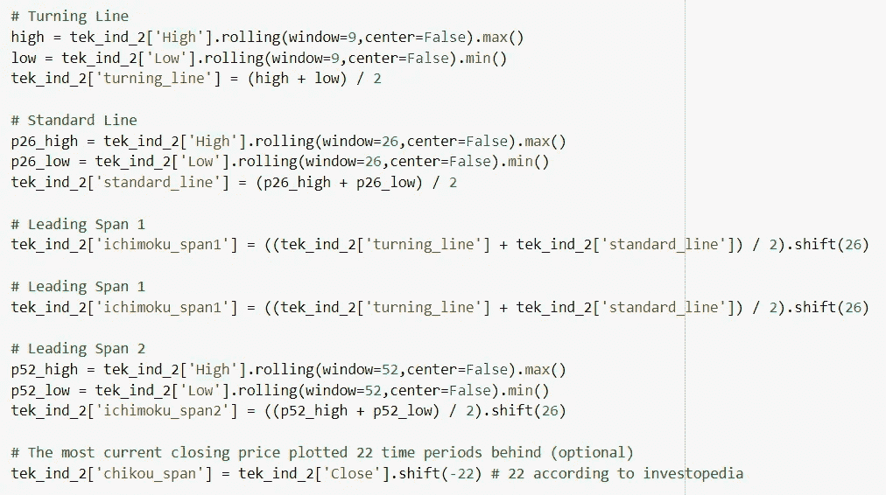
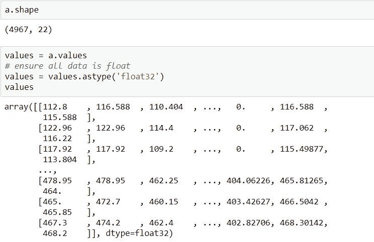

# 时间序列预测的技术指标和 GRU/LSTM

> 原文：<https://towardsdatascience.com/forecasting-with-technical-indicators-and-gru-lstm-rnn-multivariate-time-series-a3244dcbc38b?source=collection_archive---------5----------------------->

## ***【门控循环单元】【GRU】******【长短期记忆】【LSTM】***

## 多元时间序列预测模型

Image by author

技术指标有很多，主要被股票交易者使用。大多数指标都有用户定义的变量，允许交易者调整关键输入，如回望期，它告诉我们将使用多少历史数据来进行计算，以满足他们的需求。我们将使用一些指标在现有数据集中创建特征。应用这些特征，我们将会看到我们是否能预测一只特定股票的未来价格。

我在这里曾经用***【GRU】***和***【LSTM】***的门控循环单元来比较它们的表现。LSTM 在基于序列的长期依赖任务上已经建立良好，GRU 是机器学习领域的一个补充。它是***【RNN】***递归神经网络的即兴版本。我发现这篇 [**文章**](https://arxiv.org/pdf/1412.3555v1.pdf) 挺有意思的，想多了解一下这两种网络架构。虽然它们在 NLP(自然语言文本处理)领域很受欢迎，但在这里，我已经在数字金融市场数据上试验了它们的性能。

GRU 和 LSTM 之间有一些相似之处和不同之处。

## 相似之处:

*   两个网络都具有从 t 到 t + 1 的附加分量；新内容被添加到现有内容的顶部。
*   两者都解决了渐变消失和爆炸的问题
*   GRU 的更新门和 LSTM 的遗忘门取现有状态和新计算的状态之间的线性和

## 差异:

*   GRU 有两个门，重置和更新门，相比之下，LSTM 有三个门，输入，忘记和输出。GRU 没有输出门，GRU 的更新门做 LSTM 的输入和遗忘门的工作。
*   考虑到更少的参数和需要更少的数据来概括，GRU 在计算上更有效。
*   LSTM 有一个内部存储状态单元，而 GRU 没有单独的存储单元
*   GRU 没有任何机制来控制其状态或内存内容暴露的程度，而是每次都暴露整个状态或内存内容。LSTM 可以控制想要暴露多少内存内容。

你可以访问这篇[文章](https://medium.com/datadriveninvestor/multivariate-time-series-using-gated-recurrent-unit-gru-1039099e545a)来获得更多关于 GRU 和 LSTM 网络架构的理论观点。我将在这里用一个简单的例子解释特征创建和应用 RNN。

我创建了 2 个数据副本(tek_ind_1 & tek_ind_2)来添加不同技术指标组的列。

## tek_ind_1 数据帧:

## tek_ind_2 数据帧:

随机振荡器的计算(%K 和%D)

## CCI =(典型价格 ma) / (0.015 *平均偏差):

*   典型价格=(高+低+收盘)/ 3
*   p =周期数(通常为 20)
*   ma =移动平均值
*   移动平均=典型价格/ p
*   平均偏差=(典型价格-毫安)/ p

## 市云的计算:

*   转折线=(最高价+最低价)/ 2，过去 9 天
*   标准线=(最高价+最低价)/ 2，过去 26 天
*   领先跨度 1 =(标准线+转折线)/ 2，提前 26 天绘制
*   领先跨度 2 =(最高价+最低价)/ 2，过去 52 天，在今天之前 26 天绘制
*   云=跨度 1 和跨度 2 之间的阴影区域

## 傅立叶变换:

对于已知具有季节性或每日模式的数据，我们希望使用傅立叶分析进行预测。这就像是外推和去噪的结合。我们希望重复多个时期的观察数据。并且还想通过找到观测数据中的主导频率分量来找到模式。我们将计算信号的傅立叶变换和频谱密度。

*   第一步是使用 fft()函数计算信号的 FFT
*   一旦获得 FFT，我们需要取其绝对值的平方，以便获得功率谱密度(PSD)

如果我们与 10、50、200 日均线图进行比较，我们可以看到傅立叶变换通过去噪更好地平滑了数据。

## RNN 的数据准备:

我们看到数据点从-100 到 756.77 不等；我们需要对 RNN 网络的数据进行扩展和标准化。这将在我们分割训练/测试数据集后完成。

现在，让我们定义一个函数来创建时间序列数据集。我已经指定了回看间隔(60 个时间步)和预测列。RNN 的作品基于时间步骤。如果我们制作 60 个时间步长，这意味着，为了制作未来预测，我们的 RNN 将观察之前的 60 个时间步长，每次预测输出时，它将检查之前的 60 个时间步长。因此，我们需要相应地创建数据结构。

上面是转换数据集的前 4 行。我们可以看到 22 个输入变量(输入序列)和 1 个输出变量(收盘价)。如果我们检查数据的新形状，我们可以看到 60 个时间步长的差异。

这里，我们将数据集分为训练集和测试集。然后将训练集和测试集分成输入变量和输出变量。最后，输入被整形为 LSTMs 所期望的 3D 格式，即*【样本、时间步长、特征】。*我们将对 90%的数据进行模型拟合，然后对剩余的数据进行评估。

# 训练/测试分割:

值序列对于时间序列数据至关重要。因此，我们使用如下的系统方法将训练和测试中的数据分开。此外，需要标准化来拟合用于神经网络架构学习的数据。

## 为 LSTM 塑造数据:

在这里，我采取了 60 天的回顾期，模型将通过过去 60 个时间步骤来预测未来价格。

## 塑造训练数据:

## LSTM 模式:

我们现在创建的 LSTM 模型有三个 LSTM 层和一个密集层。我定义了 LSTM，第一个隐层有 75 个神经元，第二和第三层有 30 个神经元；输出层中的 1 个神经元用于预测价格。输入形状将是具有 22 个特征的 60 个时间步长。

该模型是用平均绝对误差(MAE)损失函数和有效的随机梯度下降的 Adam 版本编译的。

## 准备测试数据:

一旦模型适合训练数据，我们希望看到模型在样本外数据上的技巧。与我们在训练集中所做的一样，我们将准备测试集，并且我们需要从训练数据中提取回望值。回看是用作预测下一个时间段*(本例中为 60)的输入变量的先前时间步数。*

该模型拟合了 20 个训练时期，批次大小为 32。

## GRU:

GRU 网络是使用与 LSTM 相同的参数和配置创建的。

这里，LSTM 和 GRU 有相同的架构，但是 LSTM 的参数数量是 49，771，而 GRU 的 GRU 是 37，741。

正如我们已经讨论过的差异，GRU 有两个门，而 LSTM 有三个门。GRU 的参数较少，计算效率比 LSTM 高。

## **诊断图:**

LSTM 和 GRU 模型的训练历史被用于诊断模型的行为。为了方便起见，我创建了一个单独的情节。

我们可以看到，在这两种情况下，训练损失都大大低于验证损失，表明模型可能对训练数据拟合不足。可以通过增加可以试验的时期来提高性能。

## LSTM 预测:

这给了我们按比例缩小的预测值；我们反转标度，需要将这些值调整到正常标度。让我们找出数据的缩放级别。

这里，第一个值是开盘价；为了达到正常比例，我们将该值除以 1，如下所示。

## 评估模型:

现在，我们可以预测整个测试数据集，将预测与测试数据集相结合，并反转缩放比例。根据原始比例的预测值和实际值，我们可以计算模型的误差分数(均方根误差-RMSE)。RMSE 给出的误差单位与变量本身的单位相同。

可以通过取观察值和预测值的平均值并将它们彼此相除来计算精度。

我们可以在 GRU 模型上做类似的练习。

此外，可以通过添加更多的时间变量来提高模型的性能，例如添加周(星期几，星期号)、月(月号)和年列、时滞等。以及调整超参数和时期。

# 结论:

GRU 和 LSTM 的关键区别在于，GRU 有两个门(*复位*和*更新*门)，而 LSTM 有三个门(即*输入*、*输出*和*忘记*门)。GRU 网络更简单，因此更容易修改，例如在网络有额外输入的情况下增加新的门。一般来说代码更少。但是，如果序列很大或者准确性非常关键，我会推荐 LSTM

***我这里可以连接*******。****