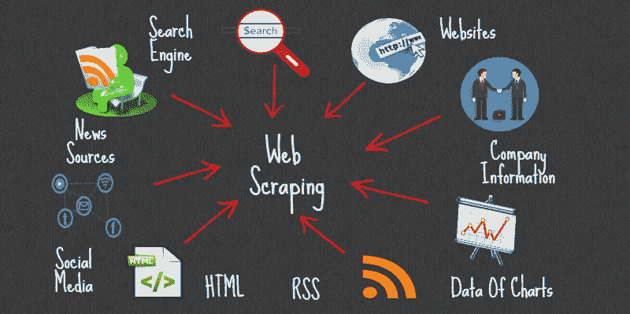
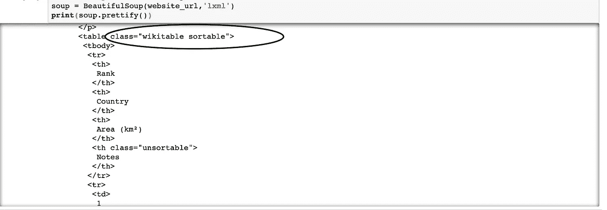

# 忘记 API 用漂亮的汤做 Python 抓取，从 web 导入数据文件:第 2 部分

> 原文：<https://towardsdatascience.com/forget-apis-do-python-scraping-using-beautiful-soup-import-data-file-from-the-web-part-2-27af5d666246?source=collection_archive---------5----------------------->

不是每个网站都有 API，但 Beautiful Soup 将永远与您在一起，从任何网站收集任何类型的数据。



Souce: gurutechnolabs.com

如今，数据在每个行业都扮演着至关重要的角色。这些数据大部分来自互联网。大多数公司在一项技术上投资数百万美元来获得用户，却没有从投资产品回报中获利。互联网是如此之大，它包含了比你的书呆子教授更多的信息。
从网络中提取信息的重要性变得越来越明显。大多数时候，当我们在你的 facebook、twitter、LinkedIn 上添加任何信息并在 Yelp 上提供反馈时，这些信息都被视为数据。

这种来自互联网的数据有很多不同的来源，例如评论、Yelp 上的餐厅反馈、Twitter 讨论、Reddit 用户讨论和股票价格等。你可以收集所有这些数据，组织并分析它们。这就是我们在本教程中要讨论的内容。
从互联网上提取或导入数据有多种方式。您可以使用 API 从任何主要网站检索信息。这就是如今每个人从互联网上导入数据的方式——所有主要网站，如 Twitter、Twitch、Instagram、脸书，都提供 API 来访问他们的网站数据集。所有这些数据都以结构化的形式存在。但是大部分网站都没有提供 API。我认为他们不希望我们使用他们的用户数据，或者他们因为缺乏知识而不提供这些数据。因此，在这个主题中，我们将从 web 导入数据，而不使用任何 API。但是在我们处理之前，请看看我们这个系列的[部分 1](/something-you-dont-know-about-data-file-if-you-just-a-starter-in-data-science-import-data-file-e2e007a154c4) ，因为一切都像点一样连接在一起。

[](/something-you-dont-know-about-data-file-if-you-just-a-starter-in-data-science-import-data-file-e2e007a154c4) [## 一些你不知道的数据文件如果你只是一个数据科学的初学者，导入数据文件…

### 如果你是数据科学领域的新手，那么你必须努力学习数据科学概念。现在…

towardsdatascience.com](/something-you-dont-know-about-data-file-if-you-just-a-starter-in-data-science-import-data-file-e2e007a154c4) 

# 什么是美丽的汤


Don’t write that awful page ( Source: crummy.com)

Beautiful Soup 是从特定网站或互联网上删除数据的最佳图书馆。这也是最舒适的工作。它从 **HTML** 中解析并提取结构化数据。Beautiful Soup 自动将传入文本转换为 Unicode，将传出版本转换为 UTF-8。除了文档没有定义编码和 Beautiful Soup 抓不到编码之外，你不需要记住编码。那就不得不提原始编码了。

> **规则:**要运行您的程序，请使用 Jupyter python 环境运行您的程序。而不是一次运行整个程序。我们只是采取预防措施，所以你的程序不会破坏网站。请检查网站的条款和条件，然后再开始从那里提取数据。请务必阅读关于合法使用数据的声明。

# 基础-熟悉 HTML

HTML 代码在从网站提取数据的过程中起着重要的作用。所以，在我们处理之前，让我们跳到 HTML 标签的基础。如果你对 HTML 标签有一点点的了解，你就可以前进到下一个层次。

```
<!DOCTYPE html>  
<html>  
    <head>
    </head>
    <body>
        <h1> Learning about Data</h1>
        <p> Beautiful Soup</p>
    <body>
</html>
```

这是 HTML 网页的基本语法。每个 **<标签>** 都服务于网页内部的一个区块:
1。**！DOCTYPE html >** : HTML 文档必须以类型声明开头。
2。HTML 文档包含在 **< html >** 和 **< /html >** 之间。
3。HTML 文档的元和脚本声明在 **<头>** 和**</头>** 之间。
4。HTML 文档的可见部分在 **<正文>** 和**</正文>** 标签之间。
5。标题用 **< h1 >** 到 **< h6 >** 标签定义。6。用 **< p >** 标签定义段落。

其他有用的标签包括用于超链接的 **< a >** ，用于表格的 **< table >** ，用于表格行的 **< tr >** ，以及用于表格列的< td > 。

**让我们检查一下你的 HTML 页面**

[](https://en.wikipedia.org/wiki/List_of_Asian_countries_by_area) [## 亚洲国家地区列表-维基百科

### 需要额外的引用来验证。通过增加对可靠来源的引用来改进这篇文章。无来源…

en.wikipedia.org](https://en.wikipedia.org/wiki/List_of_Asian_countries_by_area) 

让我们用一个[维基百科页面](https://en.wikipedia.org/wiki/List_of_Asian_countries_by_area)来做报废。如果你有谷歌 chrome 浏览器，那么进入页面，首先右击它，打开浏览器检查器检查网页。


Inspect Wikipedia Page

从结果中你可以看到这个表在 wiki 表中是可排序的，如果你仔细查看，你可以在那里找到你所有的表信息，太棒了！！！。看看你能用漂亮的汤做什么会更令人惊奇。


Wikitable Sortanble

# 让我们开始你的 DIY 项目吧

现在我们知道了我们的数据及其位置。因此，我们将开始废弃我们的数据。

在我们处理之前，您需要安装或导入一些库。

```
#Import Libraries
*from* ***bs4*** *import* ***BeautifulSoup*** *import* ***requests***
```

如果你在安装中遇到任何麻烦，你可以在每一行前面使用 **sudo** 。

**请求**
它本来是人类用来交流的语言。这意味着您不必手动将查询字符串连接到 URL，或者对您的帖子数据进行格式编码。请求将使您能够利用 Python 发送 HTTP/1.1 请求。在其中，您可以通过简单的 Python 库组合内容，如标题、表单数据、多部分文件和参数。它还使您能够以同样的方式获得 Python 的响应数据。

**BS4—Beautiful Soup**
Beautiful Soup 是一个 Python 库，用于从 HTML 和 XML 文件中提取数据。它与您最喜欢的解析器一起工作，产生操作、检查和转换解析树的自然方式。它通常会节省程序员几个小时或几天的工作。

```
*# Specify with which URL/web page we are going to be scraping*
url = requests.get(‘[https://en.wikipedia.org/wiki/List_of_Asian_countries_by_area](https://en.wikipedia.org/wiki/List_of_Asian_countries_by_area)[’).text](https://en.wikipedia.org/wiki/Premier_League).text)
```

我们首先研究给定网页的源代码，并使用 BeautifulSoup 函数构建一个 BeautifulSoup (soup)对象。现在，我们需要使用漂亮的 Soap 函数，它将帮助我们解析并应用从维基百科页面获取的 HTML:

```
*# import the BeautifulSoup library so we can parse HTML and XML documents***from** bs4 **import** BeautifulSoup
```

然后，我们将使用 Beautiful Soup 来解析我们在“URL”变量中收集的 HTML 数据，并分配一个不同的变量来以名为“Soup”的 Beautiful Soup 格式存储数据

```
*#Parse the HTML from our URL into the BeautifulSoup parse tree format*soup **=** BeautifulSoup(url, "lxml")
```

要了解我们的 web 页面中底层 HTML 的结构，请使用 Beautiful Soup 的 prettify 函数并检查它。

```
*#To look at the HTML underlying to the web* 
print(soup.prettify())
```

这是我们从**pretify()**函数中得到的结果:

```
<!DOCTYPE html>
<html class="client-nojs" dir="ltr" lang="en">
 <head>
  <meta charset="utf-8"/>
  <title>
   List of Asian countries by area - Wikipedia
  </title>
  <script>
```


如果您访问此[**链接**](https://en.wikipedia.org/wiki/List_of_Asian_countries_by_area) 并查看我们的亚洲国家维基百科页面，我们可以看到关于国家地区的更多信息。维基百科表格已经设置好了，这使得我们的工作更加容易。

让我们在我们美化的 HTML 中寻找它:



就这样，以一个 HTML **< table >** 标签开始，标签的类标识符为“wikitable sortable”我们将记住这个类以备将来使用。如果你在你的程序中往下走，你会看到表格是如何组成的，你会看到开始和结束的行都有**<>**和 **< /tr >** 标签。

第一行标题具有第 **<个>** 标签，而下面每个俱乐部的数据行具有 **< td >** 标签。使用 **< td >** 标签，我们将告诉 Python 保护我们的数据。

在我们继续之前，让我们设计一些漂亮的 Soup 函数来演示它如何从 **HTML** 网站获取数据并传递给我们。如果我们做标题函数，Beautiful Soup 将返回标题的 HTML 标签和其中的内容。

```
*#To get the title of the page*
soup.title()
```

我们可以利用这些信息开始准备对 HTML 的攻击。
我们知道数据保存在一个 **HTML** 表中，所以首先，我们让 Beautiful Soup off 检索页面中所有出现的 **< table >** 标签，并将它们添加到一个名为 all_tables 的数组中。

```
*# use the 'find_all' function to bring back all instances of the 'table' tag in the HTML and store in 'all_tables' variable*all_tables**=**soup.find_all("table")all_tables
```

在 table class '**wiki table sortable**下，我们有以国家名称为标题的链接。

```
# *use the 'find_all' function to bring back all instances of the 'table' tag in the HTML and store in 'all_tables' variable*My_table = soup.find('table',{'class':'wikitable sortable'})
My_table
```

在 table class '**wiki table sortable**下，我们有以国家名称作为标题的连接。现在，我们要提取 **< a >** 内的所有链接，我们使用 **find_all()** 。

```
links = My_table.findAll('a')
links
```

从 URL 中，我们必须提取标题，即国家的名称。为此，我们必须创建一个国家列表，以便我们可以从链接中提取国家的名称，并将其添加到国家列表中。

```
Countries = []
**for** link **in** links:
    Countries.append(link.get('title'))

print(Countries)
```

现在，我们必须将列表国家转换成熊猫数据框架，以便在 python 中工作。

```
**import** **pandas** **as** **pd**
df = pd.DataFrame()
df['Country'] = Countries

df
```

如果你对大量废弃数据感兴趣，你应该考虑使用 **Scrapy** ，一个强大的 python 抓取框架，并尝试将你的代码与一些公共 API 集成。
数据检索的性能明显高于抓取网页。例如，看看**脸书图形 API** ，它可以帮助你获得脸书网页上没有显示的隐藏数据。当你的信息变得太大时，考虑使用数据库后端，比如 MySQL T21。

这就是我们美丽的汤教程的结尾。自信地说，它让你开始为下一个项目检查一些刮掉的东西。我们已经引入了获取 **URL** 和 **HTML** 数据的请求，解析 **HTML** 和 **Pandas** 的 Beautiful Soup 将数据转换成数据帧以便正确显示。


你可以在这里找到这本[教程笔记本](https://github.com/sahildhankhad/Web-Scrapping)。如果你有问题，请随时提问。在下一个教程中，我们将讨论 API。欢迎随时在 [LinkedIn](http://www.linkedin.com/in/sahil-dhankhad-303350135) 上联系我。

参考文献:1。[http://www . Greg reda . com/2013/03/03/we B- scraping-101-with-python/](http://www.gregreda.com/2013/03/03/web-scraping-101-with-python/)。

[2。http://www . analyticsvidhya . com/blog/2015/10/初学者-指南-web-刮-美-汤-python/](http://www.analyticsvidhya.com/blog/2015/10/beginner-guide-web-scraping-beautiful-soup-python/) 。

3.[https://github . com/stewync/we B- Scraping-Wiki-tables-using-beautiful soup-and-Python/blob/master/Scraping % 2b Wiki % 2b table % 2b busing % 2b Python % 2b band % 2b eautiful soup . ipynb](https://github.com/stewync/Web-Scraping-Wiki-tables-using-BeautifulSoup-and-Python/blob/master/Scraping%2BWiki%2Btable%2Busing%2BPython%2Band%2BBeautifulSoup.ipynb)

4.[https://en . Wikipedia . org/wiki/List _ of _ Asian _ countries _ by _ area](https://en.wikipedia.org/wiki/List_of_Asian_countries_by_area)

5.【https://www.crummy.com/software/BeautifulSoup/ 