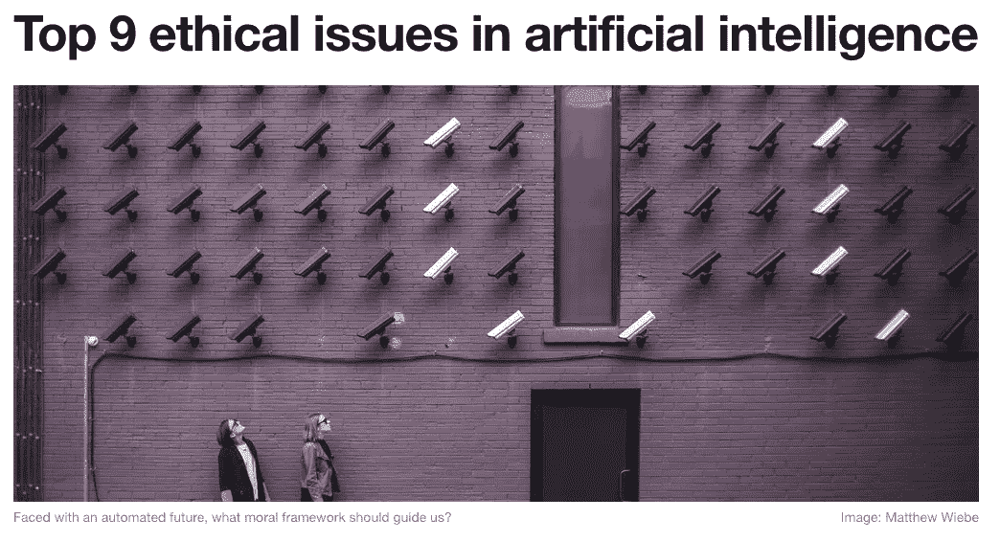

# 别管机器人了！这是人工智能将如何得到你

> 原文：<https://towardsdatascience.com/forget-the-robots-heres-how-ai-will-get-you-b674c28d6a34?source=collection_archive---------3----------------------->

## 人工智能比传统软件更危险的真正原因

Here’s the audio version of the article, read for you by the author.

人工智能伦理是这些天的热门话题，所以你会看到各种各样的言论。抱怨的范围从*“机器人抢了我的工作”*到*“你的计算机系统就像* [*一样有偏见*](http://bit.ly/quaesita_biasdef) *就像你一样(你这个混蛋)。”*

> 为什么我们不讨论是什么让 ML/AI 独特地比其他技术更危险？

与人工智能伦理相关的话题是至关重要的、及时的和必要的。我们继续讨论吧！我只是希望我们不要使用人工智能伦理这个术语，只要它…甚至与人工智能无关。

## 当人工智能伦理讨论没有抓住要点时

不是挑世界经济论坛的毛病(非常爱你，伙计们)，但我发现这篇 WEF 关于人工智能 9 大伦理问题的文章是一个快速练习的方便素材。

> 许多人工智能伦理话题并不是专门针对人工智能的。它们一般都是关于技术的，并不新鲜。

取他们的章节标题，用“技术”替换{“人工智能”、“机器人”、“机器”、“智能系统”、“人工”}，看看我们是否打破了什么。

You can find the full article [here](http://bit.ly/wef10ai).

他们的“9 大问题”有多少是 ***特定*** 给 AI 的？

1.  乔布斯去世后会发生什么？
2.  我们如何分配技术创造的财富？
3.  技术如何影响我们的行为和互动？
4.  我们怎样才能防范错误？
5.  *我们如何消除技术* [*偏差*](http://bit.ly/quaesita_biasdef) *？*
6.  我们如何保护技术免受敌人攻击？
7.  我们如何防范意外的后果？
8.  我们如何控制复杂的技术？
9.  *我们如何定义技术的人道待遇？*

道德问题 1-8 通常与技术相关，当然也与大规模的传统软件相关。利用人工智能让公众对它们感兴趣让我想起了地质学家用宠物岩石作为教具。这一切都很有趣，直到地质课变成了宠物岩石心理学(第 9 期)。

Paint a face on something and before long you’re having conversations with it. That’s a malfunction with how our species is wired. Just because something about it reminds you of you doesn’t mean it’s got a brain.

> 利用人工智能让人们思考技术中的伦理问题，让我想起了地质学家用宠物岩石作为教具。这一切都很有趣，直到地质课变成了宠物岩石心理学。

如果你想延续对人们的不公平待遇，推出无效的解决方案，扰乱劳动力市场，改变人们相互之间的互动方式，发布落入坏人手中的具有意想不到的后果的东西，并创建一个你无法摆脱的复杂系统，你可以在没有 ML/AI 的情况下完成这一切。(请不要。)你也可以就所有这些事情对我们的世界意味着什么进行富有成效的讨论，而不必求助于[大数据](http://bit.ly/quaesita_datasci)或[神经网络](http://bit.ly/quaesita_emperor)。

> 奇点可以等待(它的星云奖)。

那么，有没有针对 [ML/AI](http://bit.ly/quaesita_emperor) 的问题呢？当然啦！难道是*奇点*？我们不要操之过急。奇点可以等待(等待它的[星云奖](http://bit.ly/nebawiki))。有一个更紧迫的候选人可以归结为今天的人工智能实际上是什么

This is just another pet rock. The mimicry is slightly better, sure, but it’s still a lifeless object with a face painted on it.

## 人工智能对抗机器人

AI 有什么了不起的？它让你[自动化不可言喻的](http://bit.ly/quaesita_sbucks)！您可以使用数据中的模式，而不必思考解决方案。你知道这有多强大吗？这意味着即使你不能给出指令，你也可以自动完成你的任务。你还想要什么？做人？替代人类？奇点？*停止。人工智能与此无关。将它作为镀铬人形机器人进行营销利用了公众的无知…并转移了你对真正危险的注意力。*

> 机器人只是另一种宠物石。去吧，在你的吸尘器上贴上眼睛贴纸，我知道你想。

如果我们用我们的精神能量担心错误的事情，我们会错过我们真正应该担心的部分。你不应该让诗人骗你。

Neural networks [aren’t brains](https://twitter.com/quaesita/status/998974698607271936).

今天使用人工智能这个术语的方式并不是为了开发具有人格的替代类人实体。(更好的说法是 HLI。)这是一套用不同方式编写软件的[工具，让你用例子(](http://bit.ly/quaesita_sbucks)[数据](http://bit.ly/quaesita_hist))而不是明确的指令来编程。

> "人工智能是一套用例子(数据)而不是显式指令编程的工具."

寻找人工智能的希望？AI 的危险怎么样？他们都在最后一句话里。仔细看…

## 注意力分散的程度

假设您想要自动化一项需要 10，000 个步骤的任务。在传统编程中，一个*人*必须为这些小指令中的每一条流汗。

> 在传统的编程中，解决方案的每一部分都是由人手手工制作的。

把它想象成需要人手排列的 10K 乐高积木。由于开发人员幸运地没有耐心，他们会打包一些部分，这样就不需要重复。你可以下载一些其他人已经组装好的包，而不是使用 10，000 个零散的部分，然后你就可以在更高的抽象层次上工作了——你只需要将 50 个预先构建的 200 个小积木组装在一起。如果你信任包装这些乐高积木的人的工作，那么你就不需要考虑每个积木的细节。你可以把屋顶部分和房子部分连接起来，而不是考虑瓦片和砖块的水平。谁会有时间做这些呢？(也许，当你完成后，你会把你的 10K 作品打包，这样制作 100K 史诗的人就可以即时复制它，这样也可以节省时间。向 [GitHub](https://github.com/kozyrkov/deep-learning-tutorial) 致敬！)

但事情是这样的:即使 *you* 不需要自己做所有的事情(谢天谢地)，这 10，000 个步骤中的每一条指令都被人类的大脑折磨过……而*这就是*与 [ML/AI](http://bit.ly/quaesita_simplest) 一起消失的部分。

> 机器学习将你从高度抽象带到新的分心水平。

在 [ML/AI 工程](http://bit.ly/quaesita_roles)中有很多愤怒和不满，但大部分都是关于旋转和争论[不友好的工具](http://bit.ly/quaesita_ux)。您可能会在项目中编写 10K 代码行，但大多数代码都是为了哄骗那些笨拙的工具接受您的指令。随着工具变得越来越好，你最终会发现 ML/AI 中只有*两条*真正的指令:

1.  [优化这个目标](http://bit.ly/quaesita_first) …
2.  … [在此数据集](http://bit.ly/quaesita_hist)上。

仅此而已。现在你可以用两行人类思维来自动化你的任务，而不是一万行。这很美，也很可怕！

## AI 真正自动化的是谁的工作？

有些任务不是很重要，我们不需要太多思考就可以完成，这真是太棒了。您可以更快地完成工作！即使你不知道怎么做，你也能把事情做好！这就是那些没有被科幻蒙蔽双眼的人对 ML/AI 的狂热的来源——而这种狂热是真实的。

ML/AI 让人类跳过手工制作这 10，000 个显式的解决步骤，而是通过开发人员给出的例子中的模式来自动产生这 10，000 行(或类似的内容)的解决方案。

> 最根本的区别在于内在的体贴程度。

如果你从未思考过 ML/AI 实际上自动化了谁的工作，请准备好大吃一惊:

> 开发人员自动化/加速其他人的工作。
> 
> ML/AI 自动化/加速了开发者的工作。

不要编写*“做这个，然后这个，然后这个，然后……”*你可以说，*“努力在这些* [*数据*](http://bit.ly/quaesita_hist) *上取得好成绩。”*换句话说，*“这是我喜欢的，让我知道你的一只打字机上的猴子什么时候到了。”*

(别担心，要让算法在数据集上运行，还有很多争论要做，所以软件工程师不会过时。然而，随着它们从通过指令告诉计算机做什么转变为通过数据告诉它做什么，它们的工作方式将会改变。)

## 允许粗心大意

该是笑点的时候了！这里有一个最直接的特定于 ML/AI 的问题:**粗心导致**。

> 当我们人类同胞的福祉受到威胁时，轻率是一种危险。人工智能是一个轻率的推动者。

重要的是，不管是谁负责这个项目，他真的会把 5000 条指令的思想放进每一条 2 ML/AI 线吗？*真的*，真的？

What else did you forget to think through?

## 哪些例子？

ML/AI 是关于[用例子](http://bit.ly/quaesita_sbucks)来表达自己，所以你有一个不幸的选择，将你的系统指向一个[数据集](http://bit.ly/quaesita_hist)，而从来没有验证过里面的东西是相关的、[无偏见的](http://bit.ly/quaesita_biasdef)，高质量的例子。现在是关于人工智能偏见从何而来的海明威演讲…

> 人工智能偏见:不恰当的例子，从来没有审查。

## 哪些目标？

你也有足够的时间轻率地选择一个目标，这个目标听起来不错，但结果却是个糟糕的主意。*“尽可能多地捕捉垃圾邮件”*一位领导者可能会对人类开发人员说，期待一个可靠而明智的过滤器。对一个[人工智能算法](http://bit.ly/quaesita_emperor)说同样的话，你很快就会开始奇怪为什么没有新邮件进来。(回答:将*所有的*标记为垃圾邮件会在你的*陈述的*目标上得到满分)。

> 任何一个傻瓜都能说出一个轻率的目标。不幸的是，一个学习系统会让他们这样做。

所有这一切都因一种奇怪的神秘主义而加剧，这种神秘主义依附于词语*、*、*、【数学】、*——我怀疑当人们选择他们的目标和例子时，它会诱使人们甚至*更少地*思考他们在做什么。唉，这里除了你自己没有大脑，数学是夹在你的主观性三明治中间的一层小小的客观性。

> 数学是夹在你的主观性三明治中间的一层薄薄的客观性。

哦亲爱的。随着工具变得越来越好，进入的门槛会变得很低，以至于你会在去洗手间的路上被绊倒……这对小型个人项目来说非常好。但当涉及到具有影响他人力量的项目时，ML/AI 要求负责人付出更多努力，而不是更少。这需要高超的领导能力。我们准备好迎接挑战了吗？

“Give me a place to stand and with a lever I will move the whole world.” -Archimedes

## 技术，伟大的杠杆

技术改善了我们的世界，拓展了我们的视野，让我们活得更长，让我们的物种能够养活自己，尽管我们毫无节制地想要繁衍成几十亿。它也能使人吃惊、不稳定和重新分配。规模越大，破坏性就越大。这是一个扩展人类潜能的杠杆，但每当你用技术放大自己的时候，要小心了！更容易踩在身边的人身上。

It’s always more appropriate to think of your tools — including AI — as extending you, rather than being autonomous. When they enlarge you, be sure you’ve got the skills to avoid stepping on those around you.

> 当我们用技术放大自己的时候，就更容易把周围的人踩在脚下。

尽管许多与人工智能伦理相关的问题并不是人工智能特有的，但人工智能可能会在一些痛处引起额外的炎症。这就是为什么这些讨论重新焕发活力是有意义的。

## 疏忽的配方被放大了

如果你问我是否害怕人工智能，我听到你问我的是我是否害怕人类的疏忽。这是这个问题对我来说唯一有意义的方式，因为我不相信机器人童话或者和宠物石头说话。

> 让开，创造人工生命的伦理。你好，不顾规模的伦理学。

以我们开始的 9 个主题为例，注入更多、更多、更大的规模和速度。当你在这个等式中加入一个轻率的促成因素时，你就得到了一个迅速放大疏忽的配方。

> 人工智能的可怕之处不在于机器人。是人民。

权力越大，责任越大，但在一个由大规模数据驱动的社会中，人们是否急于打造负责任领导所需的新肌肉？难怪我们担心被踩。

## 我害怕 AI 吗？

号码

我对人类的人工智能未来持乐观态度，但我也尽我所能不让它听天由命。我相信，人工智能时代负责任的领导技能是可以教授的，人们可以明智地建立安全有效的系统，推动进步，让周围的人生活得更好。这就是为什么我(和其他像我一样的人)选择站出来和[分享](http://bit.ly/quaesita_di)我们通过经验或在以前孤立的学术学科中搜罗来之不易的知识。

> [人工智能是我们如何超越低垂的果实](http://bit.ly/quaesita_sbucks)来解决人类最具挑战性的问题。

当我们把我们的声音集合在一起，培养一批精于[决策智能](http://bit.ly/quaesita_di)的新一代领导者时，我们希望帮助新一代人更周到地构建人工智能，并释放技术的最佳一面。同样的一面，带我们去星星，让我们免于疾病，消除无知，节约资源，把我们和世界另一端的爱人联系起来。

如果我们允许的话，科技会变得很美好…我相信我们会的。

# 感谢阅读！人工智能课程怎么样？

如果你在这里玩得开心，并且你正在寻找一个为初学者和专家设计的有趣的应用人工智能课程，这里有一个我为你制作的娱乐课程:

Enjoy the entire course playlist here: [bit.ly/machinefriend](http://bit.ly/machinefriend)

# 喜欢作者？与凯西·科兹尔科夫联系

让我们做朋友吧！你可以在 [Twitter](https://twitter.com/quaesita) 、 [YouTube](https://www.youtube.com/channel/UCbOX--VOebPe-MMRkatFRxw) 、 [Substack](http://decision.substack.com) 和 [LinkedIn](https://www.linkedin.com/in/kozyrkov/) 上找到我。有兴趣让我在你的活动上发言吗？使用[表格](http://bit.ly/makecassietalk)联系。