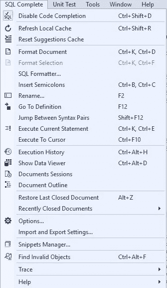
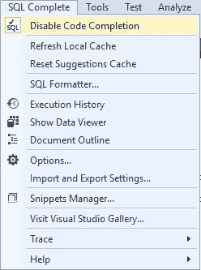
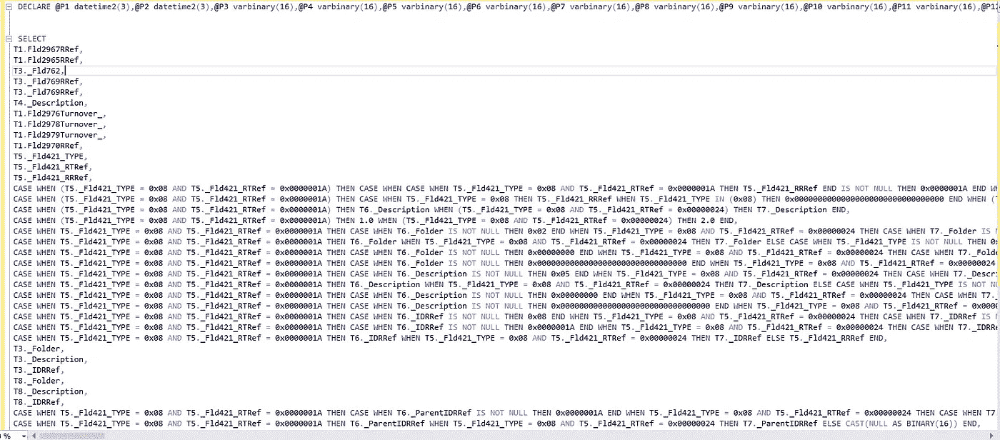
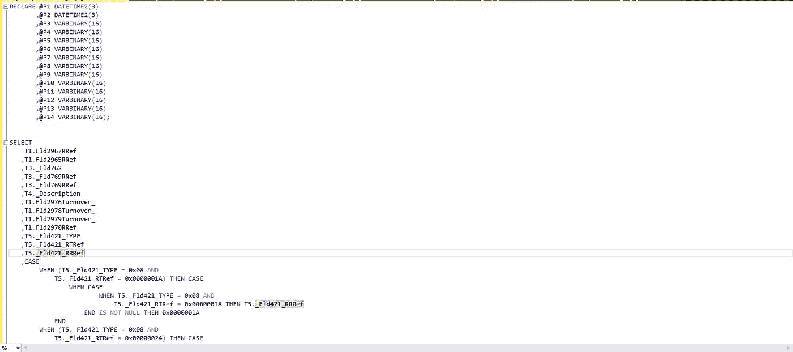
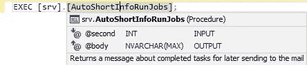
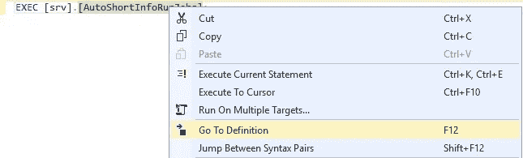
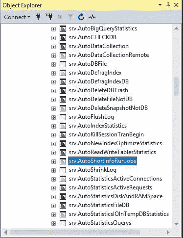

# MS SQL Server 的 SQL Complete 中的格式化功能

> 原文：<https://towardsdatascience.com/formatting-capabilities-in-sql-complete-for-ms-sql-server-57bcc3fdfb26?source=collection_archive---------33----------------------->

## 回到时间优化的问题。MS SQL Server 中快速脚本理解和定义对象的另一种方式

MS SQL Server 开发人员和 DBMS 管理员都知道，在编码过程中，文本格式化需要花费大量时间。还有，格式化往往很肤浅，甚至完全没有。事情变得更加复杂，因为每个人都有不同的格式，没有统一的风格。所有这些都会导致这样的情况，一个专家会花很多时间去理解另一个专家写的代码。

从我自己的经验来看，建立一套格式规则通常需要几年的时间。在整个公司范围内，甚至是公司的某个部分，开发和应用这种标准的主要问题在于，一个人很难学会用不同的方式编写代码。在代码审查过程中也会感觉到很多阻力，因为维护代码的专家并不总是同意格式规则。在实践中，如果没有特殊的工具，手工维护这些标准是非常困难的。

当你有专门的*代码格式化软件*时，你可以通过它设置自己的格式化标准，或者直接使用默认的格式化标准。这样，从现在开始，所有代码都将被自动格式化。因此，您不需要在脚本格式化和格式审查上花费时间。

**通常，标准化流程有以下生命周期:**

1.  公司中使用 SQL 的人数增长到 4 人以上(这个值不一定在所有情况下都相同，但通常 4 是一个很好的里程碑)
2.  SQL 代码的数量增加了，专家们现在不得不交换知识，有时在他们的任务中互相替换。通常，在这一点上，已经有许多数据库和至少几个项目。来自不同项目和/或数据库的人们相互分享他们对这些项目和数据库的知识。
3.  有必要建立统一的格式样式。指定一个团队来开发格式规则，并在投票中展示它们，或者提出一个现成的解决方案。
4.  投票后，相应地更改标准，然后重复步骤 3-4，直到标准被必要数量的人接受(在大多数情况下，最好是几乎每个人都接受标准，而不只是大多数人，这将有助于尽可能地遵守标准)
5.  决定如何维护标准，包括在代码审查级别。

初始标准通常取自所选工具中的默认标准，这样，步骤 3-4 将不会循环，步骤 5 将同时求解。

在一些公司，第三步没有实现，所以专家们决定如何自己写代码。这使得开发过程、代码维护和引入变更变得非常复杂。

你可以把一个公司发展代码标准化的过程分为 ***三个阶段*** :

**1。**没有标准，每个人都按照自己的想法写代码

**2。**有一个标准，但是是手工维护的

**3。有一个标准并自动维护**

根据我的观察，我们可以看到开发和维护速度在三个主要阶段之间的增长，如下所示:

此表估计了开发、维护和案例转移所花费的平均时间。

您可以使用特殊的工具来自动维护标准——这些工具可以是自定义编写的，也可以是从可用的第三方解决方案中选择的。

数据库专家迟早会意识到，如果希望所有开发人员更好地理解代码，格式标准化是至关重要的。你可以找到付费和免费的解决方案。

在本文中，我们将研究这些工具中的一个——用于 MS SQL Server 的 [SQL Complete](https://www.devart.com/dbforge/sql/sqlcomplete/?utm_source=towardsdatascience.com&utm_medium=referral&utm_campaign=articlesqlcomplete) 。目前，这个工具集成了 SSMS 和 Visual Studio。它还内置于[db forge Studio for SQL Server](https://www.devart.com/dbforge/sql/studio/?utm_source=towardsdatascience.com&utm_medium=referral&utm_campaign=articlesqlcomplete)中。

## SSMS 的 *SQL Complete* 菜单如下所示:

Fig.1 SQL Complete in SSMS

该工具的主要功能是:

1.  **禁用/启用代码完成** —关闭/打开工具
2.  **格式化文档** —开始整个文档的格式化过程
3.  **格式选择** —开始代码选定区域的格式化过程
4.  **转到定义** —转到对象浏览器中的指定对象(存储过程、视图、表、函数等)。)
5.  **执行历史** —打开包含在 SSMS 执行的命令历史的日志
6.  **恢复最后关闭的文档** —打开先前关闭的 SQL 文档选项卡
7.  **最近关闭的文档** —显示最近关闭的文档列表
8.  **选项** —工具设置，包括格式规则
9.  **导入导出设置** —导入导出刀具设置

类似的功能也被集成到 SSMS 下拉菜单中。除此之外，SQL 文档上下文菜单中还添加了以下选项:

1.  **活动格式配置文件** —允许您选择必要的格式配置文件
2.  **将对象脚本化为 CREATE/ALTER** —允许您生成光标所在的 DDL 对象。
3.  **将表格脚本化为 CRUD** —允许您基于脚本生成程序。
4.  **重命名** —允许您重命名文档中的名字对象、变量和脚本对象。
5.  **将 EXEC 转换为脚本** —允许您将程序代码转换为可执行脚本，主要用于调试等。

## Visual Studio 中的 SQL Complete 菜单如下所示:

Fig.2 SQL Complete in Visual Studio

该工具的类似功能已经在前面讨论过了。

Visual Studio 的下拉菜单中集成了相同的功能。

现在，让我们看看[代码格式化](https://www.devart.com/dbforge/sql/sqlcomplete/sql-code-formatter.html)在这个例子中是如何工作的:

**1)** 打开脚本文件，点击“格式化文档”:

Fig.3 Script before formatting

**2)** 这是我们得到的格式化脚本结果:

Fig.4 Script after formatting

现在，让我们看看“转到定义”命令:

Fig.5 Calling the stored procedure

正如前面的屏幕截图所示，当我们指向这个过程时，我们获得了存储过程的签名及其扩展属性的描述。

当鼠标光标被设置在程序上时，我们需要按 F12 或从下拉菜单中选择“转到定义”:

Fig.6 Calling “Go To Definition”

将在对象资源管理器中选择必要的存储过程:

Fig.7 Selection of the necessary stored procedure in the object explorer

对于其他对象类型，如表、视图、函数等，F12 以同样的方式工作。

此外，SQL Complete 工具还提供了一些有用的功能，如:

1.  代码完成
2.  通过最佳搜索树实现的工具提示
3.  搜索无效对象(即引用其他不存在对象的对象)等。

## 然后

这样，通过具备格式化代码、将代码转化为统一风格和对象导航的能力，您可以显著减少理解脚本和定义对象所花费的时间，这将极大地影响新功能、新软件的开发以及该功能和软件的维护的质量和时间。