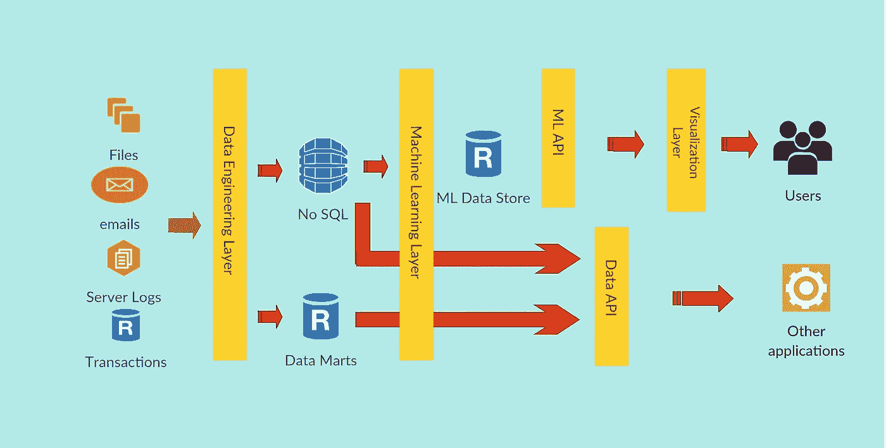

# 组建机器学习/AI 团队？

> 原文：<https://towardsdatascience.com/forming-a-machine-learning-ai-team-22d0ad70c47d?source=collection_archive---------22----------------------->

## 不要忘记你需要的其他关键技能

企业被围绕机器学习和人工智能创造的炒作所淹没，但我相信没有人想错过这趟巴士，并努力团结起来，建立自己的数据科学能力。但在他们创建机器学习/人工智能团队的热情中，领导层必须小心不要忘记其他也需要的关键辅助和补充技能。我想通过这篇博客来谈谈这些技能，这样决策者就可以为全面的数据科学战略做准备。

Photo by [Josh Calabrese](https://unsplash.com/@joshcala?utm_source=unsplash&utm_medium=referral&utm_content=creditCopyText) on [Unsplash](https://unsplash.com/search/photos/team?utm_source=unsplash&utm_medium=referral&utm_content=creditCopyText)

我记得当我还是个孩子在学校的时候，我对宇航员很着迷，每当有人问我长大后想成为什么，我会说我想成为一名宇航员。不仅如此，出于某种原因，我天真地以为 NASA 的每个人都是宇航员。但随着我的成长，我意识到宇航员只是一个成功的太空机构所需的全部技能中的一项。这包括像机械工程师、计算机工程师、地质学家、物理学家、化学工程师等专业人员。在企业中组建成功的数据科学团队也是如此。

这是企业级数据科学系统的高级架构。尽管这可能因企业而异，但这应该让人们对该体系结构工作所需的各种技能有所了解。让我们更详细地研究一下这种架构。

**Data Science System Architecture***

**该架构纯粹是说明性的&实际实施可能因多种因素而异*

## 1.数据工程层

数据工程(DE)层是成功的数据科学团队的基础层，没有它，任何数据科学战略都不完整。数据工程团队的核心职责如下

1.  *识别相关数据*

随着数据量、种类和速度的激增，数据源大量涌现，企业需要准备好处理任何形式和任何数据量的任何类型的数据。通常，企业的不同数据源可以大致分为内部数据源和外部数据源(基于数据源)。内部数据包括交易系统、显示客户参与度指标(会话、平均会话持续时间等)的数字分析数据、客户反馈和支持指标等。、CRM 等。外部数据包括社交媒体数据、消费者调查信息、行业基准报告等。

DE 团队需要确定所有与解决企业的战术和战略需求相关的数据，并制定适当的策略来解决这些问题。

*2。摄取数据*

一旦确定，来自所有这些来源的数据需要被吸收到企业数据湖或某种数据存储中。接收必须确保定期且一致地刷新数据。

*3。建立数据平台*

摄取的数据需要以一种支持商业智能(BI)需求以及机器学习(ML)和 AI 需求以及组织的其他数据需求的形式持久化。通常情况下，大多数企业都会创建一个数据集市/数据仓库，用于存储有关企业运营的历史信息和其他类型的数据存储，如非 SQL 数据存储，以满足高性能下游应用程序的数据需求。创建这些数据结构是 ML & AI 团队成功的关键，因为他们从这些系统中获取数据。

*4。维护数据生态系统*

一旦创建了数据结构，就需要对它们进行全面的维护，以确保数据在生态系统中以定期和一致的方式得到刷新

***所需技能*** *—数据仓库、NoSQL、ETL 管道构建、大数据生态系统技能— Hadoop、Spark、Hive 等、云— AWS/Azure 数据服务*

## 2.机器学习层

机器学习(ML)层是所有与构建 ML 能力相关的活动所在。您需要在这一层计划的一些活动包括以下内容。

*a)模型构建&验证* —利用数据工程层创建的数据，开始构建预测模型，以对客户对电子邮件活动的回复、客户购买产品的倾向、客户流失、预测模型、推荐引擎等事件进行建模。

b)模型部署——一旦模型构建完成并得到验证，就应该将其部署到生产环境中，以获得业务收益。模型可以部署为 I)批处理模式或 ii)实时模式。在批处理模式下，模型用于以预定的时间间隔(通常在营业时间之后)对数据进行评分，或者计划以预设的频率运行(每小时或 2 小时)。这通常是一个更容易处理的设计。相反，在实时模式下，模型被期望以近乎实时的方式几乎即时地评分并返回结果。要实现这样的设计，需要一种机制来接收模型推理请求，然后将模型结果返回给发出请求的应用程序。

为了实现这样的应用程序，通常需要使用服务器端脚本语言(如 node.js 或 flask)来构建 ML API 层。但是，如果生产环境是在 AWS 等云上管理的，那么管理起来就比在本地管理要简单得多。

***所需技能*** *—机器学习、深度学习*

## **3。API 层**

a)ML API——正如上一节中简要讨论的那样，为了使模型能够实时使用，或者为另一个应用程序提供它，在架构中提供一个 API 层是很重要的。这一层将包含所有的 API 函数，这些函数将接受对模型进行评分的请求，并将结果对象返回给调用应用程序

b)数据 API——将上述概念扩展到由数据工程层创建的数据存储，需要创建数据 API 层来处理不同消费应用程序从数据存储中提取数据的请求。为此目的描述一个单独的数据 API 层将是一个很好的设计选择

***所需技能*** *— API 开发、Web 开发— Node.js(或任何类似的脚本语言)、云技能— AWS、Azure*

## **4。可视化图层**

最后，为了将模型交付给业务用户，最好将其作为具有直观 UI 的 web 应用程序，而不是以用户需要从命令行界面使用的原始形式传递它。如果你没有理解后面的部分，不要担心，因为执行起来就像向别人解释一样枯燥，而且一点也不直观。

如今，将模型作为 web 应用程序部署在云上已经变得越来越容易，因为有一些现有的框架可以自动处理这种设计的许多技术方面，ML 工程师只需要专注于构建一个优秀的模型，而将其余的工作留给这些框架。

***所需技能****—全栈 web 开发*